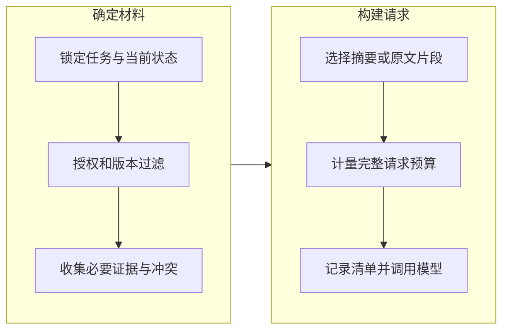

核验多份资料时，模型每一步需要看到的内容都在变化：先确认版本与范围，再保留冲突证据，最后带着当前处理状态形成更新建议。上下文组装负责把这些信息放进一次请求，并说明哪些材料被选入、排除或压缩。

如果需要先区分提示词、上下文与运行系统的职责，可以从 [Prompt、Context 与 Harness 总览](/writing/prompt-context-harness-engineering/)进入；本文进一步展开每一步输入的装配机制。

## 上下文是装配结果，不是资料仓库

假设本次核验需要三项事实：原始资料的版本、用户要求核验的范围、上一轮尚未解决的冲突。检索器返回了十篇相似文章，却没有这三项，相关性得分再高也无法支撑正确行动。

已有[记忆检索篇](/writing/agent-memory-retrieval/)解释了授权、有效时间与排序的区别。本篇进一步把检索结果放进整个请求：上下文还包括指令、当前任务、工具定义、未完成操作和近期反馈。

| 内容 | 主要来源 | 装配要求 |
| --- | --- | --- |
| 任务目标与禁止事项 | 可信任务契约 | 保持可见，不让检索正文覆盖 |
| 当前操作和待验收项 | 持久运行状态 | 携带操作编号与状态版本 |
| 事实与引用 | 经授权的数据源 | 保留来源、版本和必要限定条件 |
| 历史经验 | 记忆系统 | 标明适用范围、时效和不确定性 |
| 方法与工具说明 | 经允许的 Skill、工具注册表 | 按任务相关性加载 |

这些逻辑分区可以映射到不同模型的消息格式。不要把逻辑上的“可信”简单等同于某个字符串标签；真正的权限约束仍在执行层。

## 先保住必要信息，再优化 Token

本文建议按下面的顺序装配。它是一种工程方案，不是所有框架共同实现的算法。

*图 1｜上下文装配先满足硬条件，再处理排序与预算。必要信息无法容纳时应改变方案，而非静默遗漏。*

计量对象是实际序列化后的请求，包含消息包装、工具 Schema 与模型特定的输入。还要为输出预留空间；部分模型的推理预算有额外规则，应按 Provider 文档处理。字符数可以做教学估计，不能替代真实 Token 计量。

遇到预算不足，可以减少候选数量、读取更精确的片段、分步核验，或选择经过评测的更大窗口模型。不要优先删除来源和否定条件，因为“旧版不适用”往往比一段背景说明更重要。

## 压缩与缓存不能改变证据责任

Anthropic 将压缩、结构化笔记等作为长任务上下文管理方法，同时指出过度压缩可能丢失后续才显得重要的细节。因此，压缩策略需要在复杂轨迹上检验，而不是只比较摘要长度。[上下文工程原文](https://www.anthropic.com/engineering/effective-context-engineering-for-ai-agents)

在资料核验案例里，摘要可以写“两个来源对发布日期存在冲突”，但应保留各自的来源编号和版本，允许回查。它不应未经验证就把冲突融合成一个确定日期。会话事实与当前视图的分离，可继续参考 [DeepSeek 上下文投影](/writing/deepseek-harness-state/)。

缓存则是性能机制。稳定指令与工具描述可能帮助前缀复用，但资料更新、身份变化和授权撤销不能为了命中率被延后处理。检索缓存、结果缓存和 Provider 前缀缓存是不同对象；每一种都需要单独定义键、可见范围和失效条件。

## 装配清单让失败可重现

每次请求记录一个可检索的装配清单：任务版本、来源版本、选入和排除的资料编号、截断或压缩方式、策略版本与预算计量结果。正文可以放在受控存储中，不必复制到所有 Trace。

这个清单能区分三类失败：必要资料没有被召回，召回后被装配器排除，资料已进入请求但后续判断错误。第三类也不能直接证明模型内部为什么出错，只能说明调查应往后推进。

本篇的练习是为同一任务准备三组输入：正确资料被大量相似内容淹没、最新资料与旧摘要冲突、曾经可见的资料被撤权。先检查进入模型的清单，再检查任务结果。配套[设计工作簿](/labs/harness-operations-workbook.md)提供记录格式。
