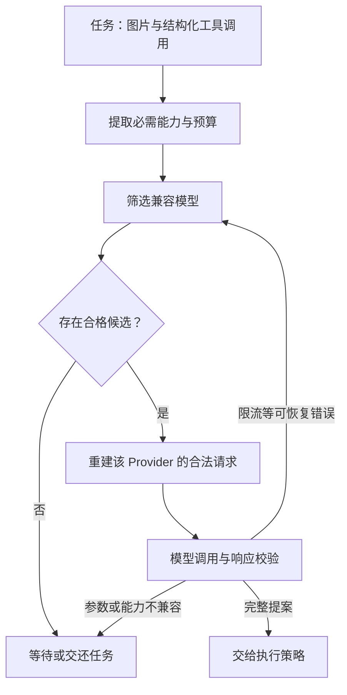

主模型限流后，网关切换到备用模型，接口重新返回了 200。但备用模型不能处理原请求中的图片，也没有维持相同的结构化工具参数。请求恢复可用，任务却可能失去可完成性。

统一模型接口降低了集成成本，模型的能力和协议差异仍然存在。路由的目标，是在原任务约束内寻找可替代的执行路径。

## 建立任务需要的能力矩阵

先从任务倒推要求，再填写候选模型。以下是待核验的字段，不是任何具体厂商的能力结论：

| 维度 | 核对内容 | 不满足时 |
| --- | --- | --- |
| 输入 | 文本、图片、文档格式及大小 | 拒绝路由或采用已验证的预处理 |
| 上下文 | 实际输入、输出预留与窗口规则 | 缩小任务或选择合格模型 |
| 工具协议 | 调用编号、参数结构、并行与结果回传 | 通过适配器契约测试 |
| 输出 | Schema 约束、拒答与截断语义 | 按结果类型处理，不能强行解析 |
| 数据范围 | 允许的提供方、部署区域和用途 | 从候选集中硬过滤 |
| 任务质量 | 目标切片上的验收表现 | 限定试用或不进入候选 |

候选路由应先通过能力和数据范围过滤，再比较价格、延迟与当前负载。不能为了恢复可用性，把原本只允许在某个环境处理的数据送到另一个环境。

*图 1｜备用模型必须满足当前任务的输入和工具能力。切换有独立预算，HTTP 成功不代表任务可继续。*

## 适配器需要保留必要差异

运行时可以采用统一的内部消息对象，但适配器必须显式处理工具调用和结果的配对、流式片段的合并、用量字段、结束原因及错误类型。无法映射的能力应暴露为不支持，不能默默删除字段。

特别是流式工具参数，在接收过程中可能只是半段 JSON。除非协议与工具契约明确支持增量执行，否则应等到完整调用被确认并通过校验后才派发。模型流中断也不应把另一模型的输出直接拼到原来的半个调用后面。

跨 Provider 续跑需要从持久状态重建合法请求，而不是原样转发另一个 Provider 的所有专有内容。已有 [Pi Provider 分层](/writing/pi-architecture-deep-dive/)提供了理解接口差异的案例。

## 重试、降级、熔断解决不同问题

**重试**再次请求同一路径，适合契约允许的暂时故障。**降级或故障转移**切换到另一条合格路径。**熔断或冷却**暂时减少对持续失败目标的请求，避免故障进一步放大。

LiteLLM 提供重试、回退、超时与冷却等机制，并区分上下文窗口等错误的处理路径。实际参数和行为需要按部署版本验证，尤其不要把示例配置直接当成任务策略。[LiteLLM 可靠性文档](https://docs.litellm.ai/docs/proxy/reliability)

| 故障 | 任务层应做的判断 |
| --- | --- |
| 限流 | 等待多久，是否还有合格备用路径 |
| 上下文超限 | 是否能保留必要证据，不能只截掉尾部 |
| 认证失败 | 检查配置或权限，不应无限重试 |
| 策略拒绝 | 按任务边界处理，不能把换模型当成绕过方式 |
| 流式响应中断 | 丢弃未完成候选，恢复合法决策边界 |
| 工具写入超时 | 进入操作对账，不能靠换模型消除不确定性 |

明确由哪一层负责重试，并把尝试计入总预算。网关、SDK 和 Agent 各自独立重试，会让实际请求数远超产品设定。

## 模型请求成功，不代表后续动作可以重做

模型通常只生成候选动作，真正的副作用发生在工具执行层。但某些服务包含内置工具或托管动作，不能笼统假设所有模型调用都没有外部影响。

对已经派发的操作，必须沿[稳定操作键与对账契约](/writing/harness-engineering-recovery/)恢复。重新询问模型“要不要再创建工单”，可能生成新操作键，反而绕过原来的去重机制。

因此，模型路由与业务恢复应该共享任务状态，但各自承担不同责任：一个选择合格推理路径，一个确认外部世界发生了什么。

## 成本按任务结果结算

下面是虚构的算术例子，不代表模型实测或报价：

| 方案 | 同一组任务数 | 验收成功数 | 全部推理费用 | 每个成功任务的推理费用 |
| --- | --- | --- | --- | --- |
| A | 20 | 17 | 10 元 | 约 0.59 元 |
| B | 20 | 18 | 14 元 | 约 0.78 元 |

B 多完成一个任务，但推理费用也更高。这不足以直接选 A 或 B：还需要失败代价、人工复核和时延。费用分子应包含失败、重试、备用模型和必要评委消耗；成功数为零时，该比值不可计算，不应显示成零成本。

已有[产品价值成本篇](/writing/ai-capability-product-metrics/)给出更完整的口径。这里补充一项路由要求：记录原请求路径、实际服务路径、切换原因及各次用量，才能解释成本变化来自价格、失败还是策略。

## 本篇交付物：带硬条件的降级表

在[工作簿](/labs/harness-operations-workbook.md)中列出每种任务的允许模型集合和禁止切换条件。测试限流、超窗、流式中断、备用模型不支持工具，以及数据范围不匹配五个反例。

先用固定响应验证路由与适配契约，再用真实任务比较质量。模拟请求通过不能证明备用模型具有足够能力；两种证据都需要保留。
