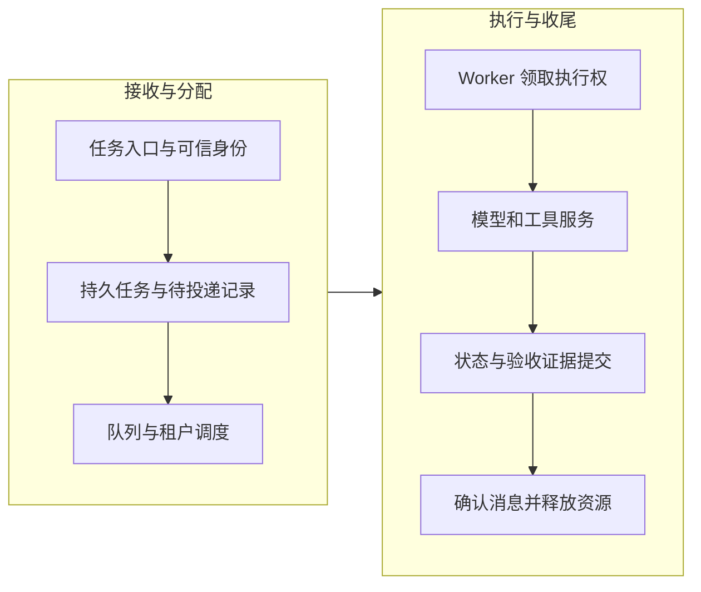

单 Worker 实验中，同一时刻只有一个执行者。把它扩成两个进程后，新的问题出现了：旧 Worker 暂停太久，调度器把任务交给新 Worker；旧进程恢复，又继续写入。

能恢复任务与能判断谁有权继续，是两项不同能力。本篇把它们接进生产任务的生命周期。

## 队列负责交付工作，不保存全部业务真相

一个常见的逻辑划分是：API 接受任务并形成持久记录，队列通知有工作可领取，Worker 读取任务契约并执行，状态服务保存进度与终态。

*图 1｜队列推动任务，持久状态定义任务事实。入口投递与完成确认都需要处理崩溃窗口。*

如果“保存任务”和“入队”分别发生，需避免前者成功、后者失败导致任务永远无人处理。可以采用事务性 Outbox 或具备相应保证的任务平台。消息只携带必要标识，Worker 按当前授权读取内容，有助于减少敏感正文在队列中的复制。

## 消息不可见，不等于不会重复

消费者领取消息后，队列可能暂时不再把它交给其他消费者。但超时、确认丢失或服务交付语义仍可能导致重复处理。

Amazon SQS 文档明确说明了可见性超时与消息重新出现的关系，也提醒不能把它理解为绝对的单次交付保证。这是学习队列恢复语义的一个具体参照。[SQS 可见性超时文档](https://docs.aws.amazon.com/AWSSimpleQueueService/latest/SQSDeveloperGuide/sqs-visibility-timeout.html)

因此，稳定 Operation ID 和服务端幂等仍需保留。消息确认应安排在必要的结果和恢复线索持久化之后；否则，Worker 崩溃时可能既丢掉消息，也没有可恢复结果。

## 租约处理活性，隔离令牌约束旧执行者

租约表示一段有限时间内的执行资格。Worker 定期续租，超期后其他执行者可以接管。但旧进程不一定知道自己已经失去资格。

一种处理方式是使用单调增长的 fencing token：每次新领取得到更高代次，接收写入的资源保存已接受的代次并拒绝旧代次。关键在于**受保护资源必须参与校验**，不是 Worker 自己检查一次就足够。

Hazelcast 的 FencedLock 文档通过长暂停后的旧持有者说明这一机制。它提供的是防止陈旧执行者继续影响资源的思路，而非所有第三方 API 都自带的能力。[FencedLock 文档](https://docs.hazelcast.com/hazelcast/5.5/data-structures/fencedlock)

fencing 与幂等也不能互换：前者判断执行者代次，后者判断是否重复同一次业务意图。如果下游不支持 fencing，应在受控写入服务中维护这条边界，或采用更保守的单写入与对账方案。

## 等待不必一直占用昂贵执行资源

等待审批、用户补充或较长的外部任务时，可以保存状态并释放 Worker。恢复事件到达后，再创建或分配执行环境。任务状态、模型会话和沙箱生命周期不必完全绑定。

这需要明确哪些资源可以重建：代码目录可以从版本与制品恢复，未持久化的内存变量不能；短期凭证恢复时需要重新获取，旧审批也要按当前策略检查。已有[持久任务架构篇](/writing/pi-durable-harness-governance/)可作为进一步阅读。

优雅关闭时先停止领取新任务，再在期限内保存或完成当前工作。超时仍有写入在途，就记录未知状态并转交恢复，而不是直接标记所有任务失败。

## 背压与多租户配额保护可交付性

当任务进入速度超过处理速度，队列会增长。单纯增加 Worker 可能让模型限流更严重；瓶颈如果是下游配额，扩容反而放大重试。

需要组合考虑入场限制、租户并发额度、模型请求配额、任务优先级和截止时间。交互任务与大批量任务可以分池，但应防止低优先级任务永久饥饿。资源不足时给出排队状态或明确拒绝，比无界接单更容易维护承诺。

多租户隔离覆盖任务存储、资料检索、缓存、沙箱、制品和日志。队列名称包含租户编号不是完整授权；每次资源访问仍要校验可信身份与作用域。

## 本篇交付物：四个生命周期反例

| 反例 | 需要观察的证据 |
| --- | --- |
| 外部写入成功，消息确认失败 | 重复领取后没有重复资源 |
| 旧 Worker 暂停，新 Worker 接管 | 旧代次写入被拒绝或受控阻断 |
| 单个租户提交大量任务 | 其他租户仍满足约定服务目标 |
| Worker 在等待审批时重启 | 状态可恢复，权限重新检查 |

配套[工作簿](/labs/harness-operations-workbook.md)要求为每个反例写出执行权、操作键和验收证据。上一组[本地实验](/writing/harness-foundations-lab/)没有实现多 Worker，因此只能提供副作用恢复的基础，不能当成这些生产性质已经被证明。
