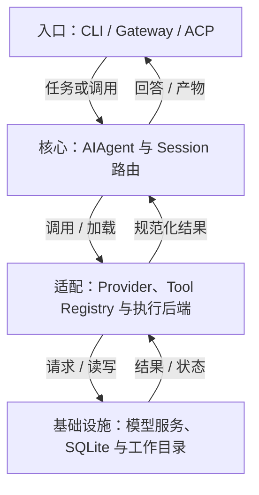
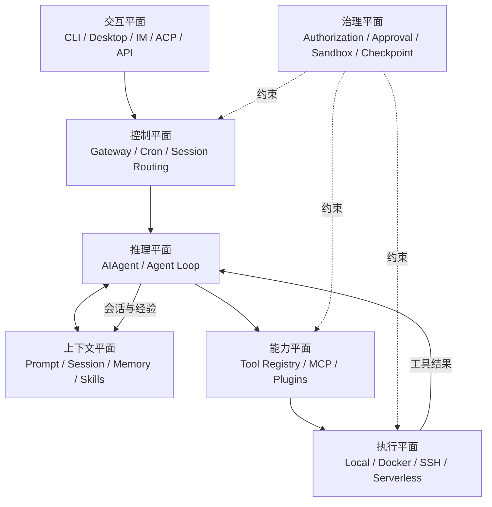
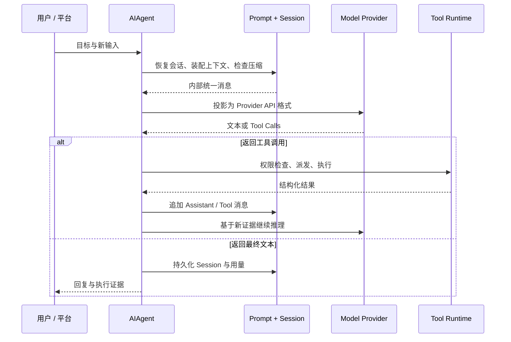
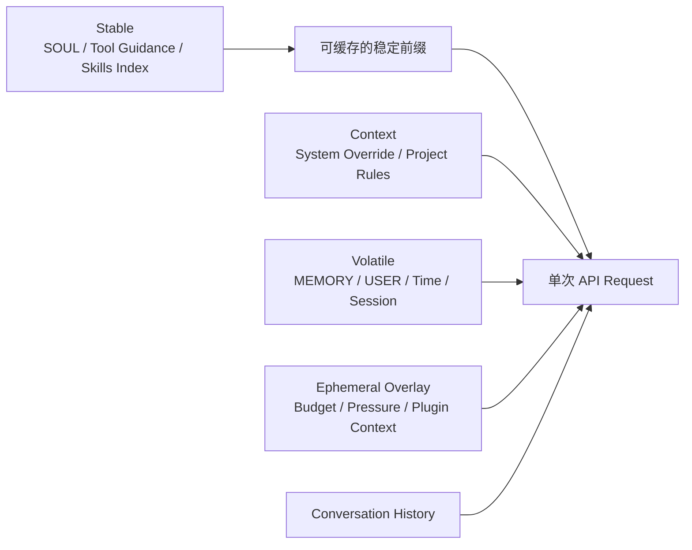

## 定位与价值

Hermes 是把工具循环、会话、消息入口与记忆连成常驻系统的 Agent 框架；相较单次模型脚本，它已提供消息路由和跨会话资产管理。

适合个人助手或受控团队服务；不适合把自动保存的经验直接视为已审核的生产规则。

研究基线：[NousResearch/hermes-agent @ 6327930](https://github.com/NousResearch/hermes-agent/blob/63279301bcbdc185c1b07b98a9312eb0c862f26d/README.md)；源码与社区核对日期为 2026-09-06。

## 技术架构



*图 1｜职责与数据流；逻辑分层不要求分开部署。*

## 核心机制

### 循环与模型适配

#### 先看全局：Hermes 不是一个 Loop，而是七个平面

官方架构图把 CLI、Gateway、ACP、API、Batch 等入口汇聚到 `AIAgent`，再连接 Provider、工具后端和 SQLite Session。这个视角适合找代码入口，但要理解产品，我更愿意把 Hermes 分成七个相互约束的平面：



*图 2｜Hermes 的七个分析平面：六个运行平面加一个治理平面，与下表逐项对应。*

这七个平面分别回答不同问题：

| 平面 | 核心问题 | Hermes 的主要机制 |
| --- | --- | --- |
| 交互 | 用户从哪里发起和接管工作？ | CLI、TUI、Desktop、消息平台、ACP、API |
| 控制 | 任务如何被路由、排队、定时和交付？ | Gateway、Session key、Cron、后台结果投递 |
| 推理 | 模型如何在反馈中连续行动？ | `AIAgent`、多 Provider 适配、重试、Fallback、Iteration Budget |
| 上下文 | 什么信息在何时进入模型？ | Prompt 分层、会话历史、压缩、Memory、Skills、项目规则 |
| 能力 | Agent 能调用哪些外部能力？ | Tool Registry、Toolsets、MCP、Plugins、`execute_code`、Subagents |
| 执行 | 工具在哪种环境运行？ | Local、Docker、SSH、Serverless |
| 治理 | 谁可以触发什么，副作用到哪里为止？ | 用户授权、危险命令审批、写入保护、容器、凭证过滤、Checkpoint |

这也解释了为什么只看 `run_agent.py` 会误判 Hermes。Agent Loop 是心脏，但 Gateway 决定它能否长期在线，Session 决定它能否连续，Skills 决定经验能否复用，安全边界则决定自治是否可接受。官方的[架构总览](https://hermes-agent.nousresearch.com/docs/developer-guide/architecture)也把这些模块视为同一运行系统，而不是一组彼此独立的功能。

#### Agent Loop：把不同模型收敛成同一种行动协议

Hermes 的推理核心是 `AIAgent`。一次 Turn 大致经历：装配或复用 System Prompt、检查上下文压力、把内部消息投影到 Provider 协议、调用模型、解析 Tool Call、执行并回填结果，直到模型给出最终文本或预算耗尽。完整时序见官方的 [Agent Loop Internals](https://hermes-agent.nousresearch.com/docs/developer-guide/agent-loop)。



*图 3｜Hermes Agent Loop 将模型差异收敛为可中断、可续跑的统一行动协议。*

##### 1. Provider 差异被压在边缘

Hermes 同时处理 OpenAI-compatible Chat Completions、OpenAI Responses/Codex 与 Anthropic Messages 等模式，但内部仍尽量使用统一的 `role/content/tool_calls` 消息表示。Provider Adapter 负责输入输出转换，Agent Loop 负责稳定的行动语义。

这是一个非常务实的边界：**模型提供者是可替换的，工具循环不能跟着每个 API 重写。** 代价是适配层必须处理消息交替、Reasoning、流式输出、Prompt Cache、Compaction 和各家 Tool Call 格式的细小差异。多 Provider 并不只是换一个 `base_url`，而是一项持续的协议兼容工程。

##### 2. 中断是一等能力，而不是异常分支

模型请求被放进后台线程，前台同时监听用户新消息、停止信号和超时。发生中断时，未完成响应会被丢弃，不会把半截 Assistant 消息写入历史。Gateway 也用两级 Guard 处理运行中的新消息与 `/stop`、`/approve` 等旁路命令，详见 [Gateway Internals](https://hermes-agent.nousresearch.com/docs/developer-guide/gateway-internals)。

长期 Agent 与聊天机器人的一个关键差别就在这里：聊天产品优化“等它答完”，工作系统必须允许人随时改方向，而且不能因此破坏状态机。

##### 3. 并行有三种，不应混为一谈

Hermes 内部至少有三种并行：

- 同一模型响应返回多个独立 Tool Call 时，运行时可并发执行，再按原始顺序回填结果；
- `delegate_task` 为需要判断的子问题创建独立 Agent 上下文；
- `execute_code` 让模型一次生成程序，由程序在 RPC 通道内批量调用工具。

第一种减少 I/O 等待，第二种购买额外推理能力，第三种用确定性代码替代重复的模型往返。把三者都叫“多 Agent”会丢掉最关键的成本差异。


### Prompt 按更新频率组织

Hermes 的 Prompt 不是把所有资料拼成一大段，而是按稳定性分成三层：

1. **Stable**：身份、工具与模型指导、Skills 索引、环境与平台提示；
2. **Context**：调用方 System Message 和项目上下文文件；
3. **Volatile**：`MEMORY.md`、`USER.md`、外部记忆块、时间、Session、Model 与 Provider 信息。

最终按 `stable → context → volatile` 连接。临时预算提醒、Gateway 会话覆盖层和插件的 `pre_llm_call` 内容则只进入本次 API Call，不污染缓存前缀。具体装配顺序见 [Prompt Assembly](https://hermes-agent.nousresearch.com/docs/developer-guide/prompt-assembly)。



*图 4｜稳定层便于形成可复用前缀；其余内容也可能参与缓存，是否命中取决于实际序列化前缀和 Provider 规则。*

这个设计有三个深层含义。

第一，Prompt Cache 不是最后再加的性能优化，而是信息架构约束。频繁变化的信息越靠后，越容易复用前缀；临时覆盖信息放在后面，减少对既有前缀的扰动；这不保证每次都命中缓存。

第二，Memory 写入与 Memory 生效被刻意分开。Agent 在本轮新增的记忆会立即落盘，但当前 Session 的 System Prompt 是冻结快照，通常要到新 Session 或重建路径才会重新注入。官方[记忆文档](https://hermes-agent.nousresearch.com/docs/user-guide/features/memory/)明确把这种延迟作为缓存稳定性的交换。

第三，项目规则有明确优先级。Hermes 原生的 `.hermes.md` / `HERMES.md` 优先，其次才是 `AGENTS.md`、`CLAUDE.md` 和 Cursor Rules；上下文文件还会经过长度限制与注入模式扫描。换言之，项目文件不是“普通文本”，而是进入高权限 Prompt 的配置输入。

## 快速上手

按官方安装说明安装 Hermes，并准备模型账号。下面用交互向导选模型和工具，再发送只读教学任务。

```bash
hermes --version
hermes model
hermes tools
hermes
```

三个常用配置：

| 配置或安装选项 | 作用 |
| --- | --- |
| `model` | 选择供应商与模型 |
| `terminal.backend` | 选择本地、容器等执行后端 |
| `agent.max_turns` | 限制单次运行的轮数预算 |

其余选项见 [配置参考](https://github.com/NousResearch/hermes-agent/blob/63279301bcbdc185c1b07b98a9312eb0c862f26d/cli-config.yaml.example)。

常见坑：启用工具不等于后端依赖已就绪；先检查 hermes doctor，再在聊天中要求“只读取教学目录并生成摘要”。

验证范围：已核对固定源码的入口、参数与依赖；未以本文示例调用真实模型或部署外部服务。

## 生态与社区

截至 2026-09-06，2026-08-08 至 09-06 UTC 的抽样取得 至少 30 条默认分支提交（上限 30 条）。见 [提交记录](https://github.com/NousResearch/hermes-agent/commits/main/)。

Issue 取 08-08 至 08-30 UTC 创建的最近最多 3 条非 PR 条目，排除机器人和提问者自答；3 条中 1 条观察到维护者文字回复。 [#98931](https://github.com/NousResearch/hermes-agent/issues/98931)：0.12 小时。 样本：[#98936](https://github.com/NousResearch/hermes-agent/issues/98936)、[#98934](https://github.com/NousResearch/hermes-agent/issues/98934)、[#98931](https://github.com/NousResearch/hermes-agent/issues/98931)。小样本不代表 SLA，“未观察到”也不代表其他渠道无人处理。

固定快照许可证：[MIT](https://github.com/NousResearch/hermes-agent/blob/63279301bcbdc185c1b07b98a9312eb0c862f26d/LICENSE)。允许商业使用，但分发时仍须保留版权与许可声明。

同仓提供 Telegram、Discord 等 Gateway 适配、ACP 和工具后端；各通道的凭证、平台限流与授权仍需独立配置。

## 源码阅读路径

阅读顺序：入口 → 核心抽象 → 具体实现 → 测试。

| 顺序 | 目录 → 文件 | 函数、对象或检查重点 |
| --- | --- | --- |
| 1 | [pyproject.toml](https://github.com/NousResearch/hermes-agent/blob/63279301bcbdc185c1b07b98a9312eb0c862f26d/pyproject.toml) | project.scripts 的 hermes 入口 |
| 2 | [hermes_cli/main.py](https://github.com/NousResearch/hermes-agent/blob/63279301bcbdc185c1b07b98a9312eb0c862f26d/hermes_cli/main.py) | main：CLI 分派 |
| 3 | [run_agent.py](https://github.com/NousResearch/hermes-agent/blob/63279301bcbdc185c1b07b98a9312eb0c862f26d/run_agent.py) | AIAgent：模型与工具循环 |
| 4 | [agent/memory_manager.py](https://github.com/NousResearch/hermes-agent/blob/63279301bcbdc185c1b07b98a9312eb0c862f26d/agent/memory_manager.py) | 记忆管理实现 |
| 5 | [tests/run_agent/test_run_agent.py](https://github.com/NousResearch/hermes-agent/blob/63279301bcbdc185c1b07b98a9312eb0c862f26d/tests/run_agent/test_run_agent.py) | 循环测试 |
