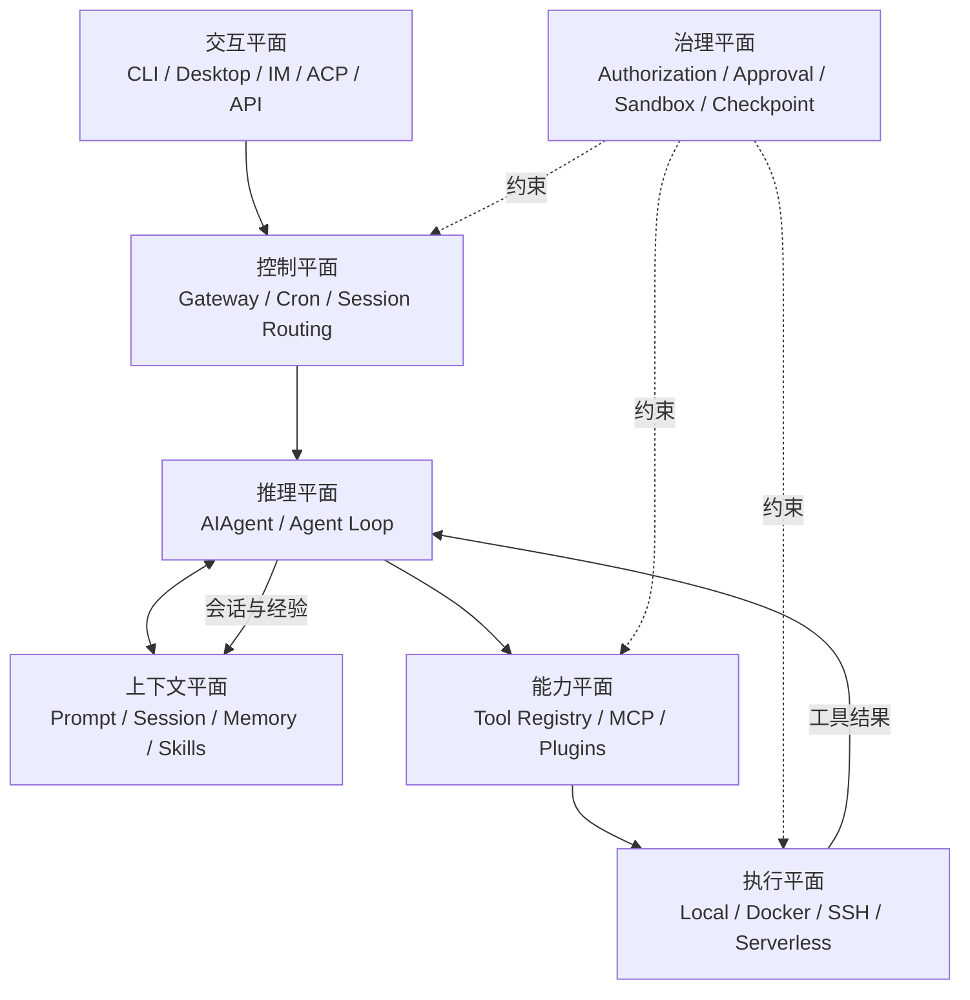
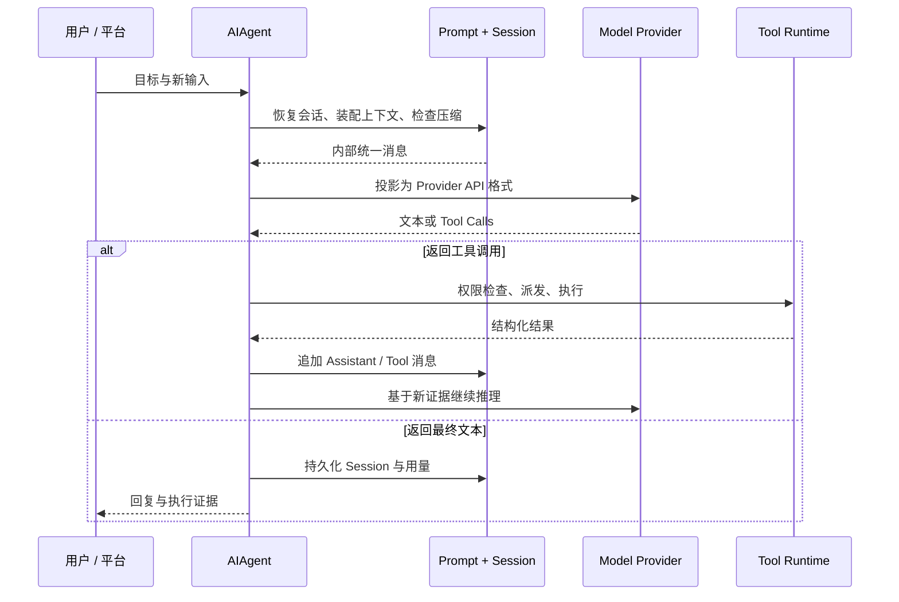
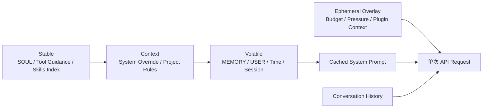
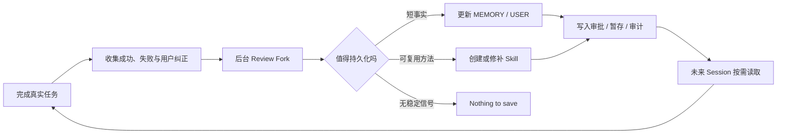

很多人第一次看到 Hermes Agent，会把它理解成“支持很多模型、很多工具和很多聊天平台的开源 Agent”。这个描述没有错，却错过了它真正有辨识度的部分。

Hermes 的核心不是多接几个 API，而是试图回答一个更难的问题：**一个 Agent 如何在几个月甚至几年里持续工作，记住人与项目，把成功经验沉淀成程序性知识，同时又不让上下文、成本和权限一起失控？**

它给出的答案，是把一次模型调用扩展成一套长期运行系统：前台有 Agent Loop，下面有工具与执行环境，旁边有 Session 与 Gateway，背后则有记忆、技能和后台复盘组成的学习闭环。

> [!IMPORTANT]
> **结论先行：**Hermes Agent 最准确的定位，不是“开源版 Claude Code”，也不是“带工具的聊天机器人”，而是一个以个人长期关系为中心、Batteries included 的 Agent OS。它最有价值的设计是把工作记忆、历史检索、事实记忆和程序性技能拆开；它最大的架构风险也来自同一件事——当 Agent 可以改写自己的长期上下文时，错误不再只影响一次回答，而可能进入未来每一次决策。

本文基于 Nous Research 官方仓库 `v0.21.0` 开发线的 [2026-09-03 代码快照](https://github.com/NousResearch/hermes-agent/tree/63279301bcbdc185c1b07b98a9312eb0c862f26d)与官方文档。Hermes 仍在快速演进，因此文中的数字和默认值都应结合版本理解。

## 一、先看全局：Hermes 不是一个 Loop，而是六个平面

官方架构图把 CLI、Gateway、ACP、API、Batch 等入口汇聚到 `AIAgent`，再连接 Provider、工具后端和 SQLite Session。这个视角适合找代码入口，但要理解产品，我更愿意把 Hermes 分成六个相互约束的平面：



这六个平面分别回答不同问题：

| 平面 | 核心问题 | Hermes 的主要机制 |
| --- | --- | --- |
| 交互 | 用户从哪里发起和接管工作？ | CLI、TUI、Desktop、消息平台、ACP、API |
| 控制 | 任务如何被路由、排队、定时和交付？ | Gateway、Session key、Cron、后台结果投递 |
| 推理 | 模型如何在反馈中连续行动？ | `AIAgent`、多 Provider 适配、重试、Fallback、Iteration Budget |
| 上下文 | 什么信息在何时进入模型？ | Prompt 分层、会话历史、压缩、Memory、Skills、项目规则 |
| 能力 | Agent 能调用哪些外部能力？ | Tool Registry、Toolsets、MCP、Plugins、`execute_code`、Subagents |
| 治理 | 谁可以触发什么，副作用到哪里为止？ | 用户授权、危险命令审批、写入保护、容器、凭证过滤、Checkpoint |

这也解释了为什么只看 `run_agent.py` 会误判 Hermes。Agent Loop 是心脏，但 Gateway 决定它能否长期在线，Session 决定它能否连续，Skills 决定经验能否复用，安全边界则决定自治是否可接受。官方的[架构总览](https://hermes-agent.nousresearch.com/docs/developer-guide/architecture)也把这些模块视为同一运行系统，而不是一组彼此独立的功能。

## 二、Agent Loop：把不同模型收敛成同一种行动协议

Hermes 的推理核心是 `AIAgent`。一次 Turn 大致经历：装配或复用 System Prompt、检查上下文压力、把内部消息投影到 Provider 协议、调用模型、解析 Tool Call、执行并回填结果，直到模型给出最终文本或预算耗尽。完整时序见官方的 [Agent Loop Internals](https://hermes-agent.nousresearch.com/docs/developer-guide/agent-loop)。



### 1. Provider 差异被压在边缘

Hermes 同时处理 OpenAI-compatible Chat Completions、OpenAI Responses/Codex 与 Anthropic Messages 等模式，但内部仍尽量使用统一的 `role/content/tool_calls` 消息表示。Provider Adapter 负责输入输出转换，Agent Loop 负责稳定的行动语义。

这是一个非常务实的边界：**模型提供者是可替换的，工具循环不能跟着每个 API 重写。** 代价是适配层必须处理消息交替、Reasoning、流式输出、Prompt Cache、Compaction 和各家 Tool Call 格式的细小差异。多 Provider 并不只是换一个 `base_url`，而是一项持续的协议兼容工程。

### 2. 中断是一等能力，而不是异常分支

模型请求被放进后台线程，前台同时监听用户新消息、停止信号和超时。发生中断时，未完成响应会被丢弃，不会把半截 Assistant 消息写入历史。Gateway 也用两级 Guard 处理运行中的新消息与 `/stop`、`/approve` 等旁路命令，详见 [Gateway Internals](https://hermes-agent.nousresearch.com/docs/developer-guide/gateway-internals)。

长期 Agent 与聊天机器人的一个关键差别就在这里：聊天产品优化“等它答完”，工作系统必须允许人随时改方向，而且不能因此破坏状态机。

### 3. 并行有三种，不应混为一谈

Hermes 内部至少有三种并行：

- 同一模型响应返回多个独立 Tool Call 时，运行时可并发执行，再按原始顺序回填结果；
- `delegate_task` 为需要判断的子问题创建独立 Agent 上下文；
- `execute_code` 让模型一次生成程序，由程序在 RPC 通道内批量调用工具。

第一种减少 I/O 等待，第二种购买额外推理能力，第三种用确定性代码替代重复的模型往返。把三者都叫“多 Agent”会丢掉最关键的成本差异。

## 三、Prompt 架构：真正稀缺的不是 Token，而是稳定前缀

Hermes 的 Prompt 不是把所有资料拼成一大段，而是按稳定性分成三层：

1. **Stable**：身份、工具与模型指导、Skills 索引、环境与平台提示；
2. **Context**：调用方 System Message 和项目上下文文件；
3. **Volatile**：`MEMORY.md`、`USER.md`、外部记忆块、时间、Session、Model 与 Provider 信息。

最终按 `stable → context → volatile` 连接。临时预算提醒、Gateway 会话覆盖层和插件的 `pre_llm_call` 内容则只进入本次 API Call，不污染缓存前缀。具体装配顺序见 [Prompt Assembly](https://hermes-agent.nousresearch.com/docs/developer-guide/prompt-assembly)。



这个设计有三个深层含义。

第一，Prompt Cache 不是最后再加的性能优化，而是信息架构约束。频繁变化的信息越靠后，越容易复用前缀；临时信息不写回持久历史，避免每轮都让缓存失效。

第二，Memory 写入与 Memory 生效被刻意分开。Agent 在本轮新增的记忆会立即落盘，但当前 Session 的 System Prompt 是冻结快照，通常要到新 Session 或重建路径才会重新注入。官方[记忆文档](https://hermes-agent.nousresearch.com/docs/user-guide/features/memory/)明确把这种延迟作为缓存稳定性的交换。

第三，项目规则有明确优先级。Hermes 原生的 `.hermes.md` / `HERMES.md` 优先，其次才是 `AGENTS.md`、`CLAUDE.md` 和 Cursor Rules；上下文文件还会经过长度限制与注入模式扫描。换言之，项目文件不是“普通文本”，而是进入高权限 Prompt 的配置输入。

## 四、四类记忆：Hermes 最值得借鉴的设计

“拥有长期记忆”常被产品描述成一个开关，但 Hermes 实际上把记忆拆成四种载体：

| 记忆类型 | 载体 | 生命周期 | 适合保存 | 主要代价 |
| --- | --- | --- | --- | --- |
| 工作记忆 | 当前 Conversation | 一次 Session | 当前目标、工具结果、临时决策 | Context Window 持续增长 |
| 情景记忆 | SQLite + FTS5 Session History | 跨 Session | 过去发生过什么、原始对话与 Tool Call | 需要主动检索，命中依赖查询词 |
| 事实记忆 | `MEMORY.md` / `USER.md` | 跨 Session、常驻 Prompt | 用户偏好、环境事实、稳定约定 | 每轮占 Token，错误会长期放大 |
| 程序记忆 | Skills | 跨 Session、按需加载 | 可重复工作流、排错路径、验证方法 | 需要选择、版本治理与安全审查 |

这比“把所有历史做向量检索”更克制。

### 1. Session 是事实日志，不是摘要替身

Hermes 把会话、消息、工具调用、Reasoning、用量、模型配置和路由信息写进 SQLite，并用 FTS5、Trigram 与 CJK 索引支持全文检索。Agent 可以通过 `session_search` 找回原始消息，而不是先把所有历史压成一份不可逆的用户画像。官方的 [Session Storage](https://hermes-agent.nousresearch.com/docs/developer-guide/session-storage)展示了 Session、Message、FTS 与写入竞争处理的结构。

这个选择很重要：**Memory 保存结论，Session 保存证据。** 当结论可疑时，系统仍有机会回到原始上下文重新判断。

### 2. 常驻 Memory 被故意做小

内置 `MEMORY.md` 和 `USER.md` 都有严格字符上限，前者保存环境、项目和经验，后者保存用户身份、偏好与协作方式。写满后系统不会静默淘汰，而是要求 Agent 合并或删除旧条目后重试。

小容量迫使 Agent 做策展，而不是做日志复制。常驻 Prompt 中最昂贵的不是存储空间，而是每一次推理都要重新支付的注意力。

### 3. Skills 是程序性记忆，不是长 Prompt 附件

Skills 只在 System Prompt 中暴露精简索引，匹配任务后再读取完整 `SKILL.md`，更深的参考资料继续按需加载。官方[Skills 文档](https://hermes-agent.nousresearch.com/docs/user-guide/features/skills/)将它称为 Progressive Disclosure。

因此，Memory 与 Skill 的分界应该是：

```text
Memory：以后做任何任务都可能需要知道的短事实
Skill：以后做这一类任务时才需要加载的长方法
Session Search：当需要核对过去究竟发生过什么时再查证
```

这套分层是 Hermes 对 Agent 上下文工程最有普适价值的贡献。它不是追求“永不遗忘”，而是让不同信息以不同成本被重新看见。

## 五、“自我进化”到底是什么：受约束的 Artifact Learning

Hermes 把自己描述为 self-improving agent。这个说法很容易被误解成模型会在线微调。源码展示的真实机制更具体，也更可控：**它不会在用户机器上持续更新模型权重，而是持续更新模型下一次会读取的外部制品。**

一次前台任务结束后，后台 Review Fork 可以重放会话，判断是否出现了值得长期保存的用户事实或通用方法。如果有，它通过 `memory` 或 `skill_manage` 修改 Memory 与 Skills；未来 Session 再把这些制品装配进 Prompt。`agent/background_review.py` 的[源码说明](https://github.com/NousResearch/hermes-agent/blob/63279301bcbdc185c1b07b98a9312eb0c862f26d/agent/background_review.py)清楚表明，这个 Fork 与主对话隔离，只开放记忆和技能管理等窄工具面。



我把这种模式称为 **Artifact Learning**：模型参数不变，外部认知制品变了，因此系统行为随经验改变。它有四个优点：

- 可读：人可以直接查看 Memory 和 `SKILL.md`；
- 可编辑：错误知识可以被修订，不必重新训练模型；
- 可移植：Skills 可以进入仓库、团队和 Skill Hub；
- 可审批：`memory.write_approval` 与 `skills.write_approval` 可以把自动写入先暂存，再由人决定是否生效。

但它也有一个比普通 RAG 更危险的失败模式：**错误一旦写入程序性记忆，就会从一次幻觉升级为稳定偏见。** 比如，把一次临时的“工具未安装”总结成“这个工具不可用”，未来 Agent 可能持续拒绝正确路径。Hermes 的 Review Prompt 因此明确禁止把环境瞬态、未解决失败和一次性任务包装成可靠 Skill，并限制后台 Fork 修改用户拥有、Hub 安装或被 Pin 的技能。

所以，自我进化的关键并不是“允许 Agent 写 Skill”，而是形成一条带来源、所有权、审批和回滚的知识变更链。没有这四项，学习闭环很容易变成错误放大器。

## 六、工具运行时：Schema 才是 Agent 的 ABI

Hermes 的工具模块通过中央 Registry 自注册。Registry 保存名称、Toolset、JSON Schema、Handler、可用性检查和运行元数据；启动时再发现内置工具、MCP 工具与 Plugin 工具。只有通过 Toolset 选择和 `check_fn` 可用性检查的工具，才会进入模型看到的 Schema 列表。详见官方 [Tools Runtime](https://hermes-agent.nousresearch.com/docs/developer-guide/tools-runtime)。

这套设计看似是插件机制，实质上定义了 Agent 的 ABI：

- Tool Name 是调用符号；
- JSON Schema 是函数签名；
- Description 是模型选择工具的语义类型；
- Handler 是具体实现；
- Toolset 是能力包与权限边界；
- Hook 是调用前后的策略切面；
- Environment 是副作用真正发生的位置。

对传统程序，缺少一个依赖会在运行时报错；对 Agent，更好的做法是让不可用工具根本不出现在 Schema 中。这样模型不会围绕不存在的能力制定计划。Hermes 还会动态修补 `execute_code` 等工具的说明，只暴露本轮真正可调用的子工具，这是一种很实用的“能力诚实”。

### execute_code：把编排从自然语言移到程序

`execute_code` 并不等同于 Shell。模型先生成 Python 脚本，脚本在子进程里通过本地 RPC 调用白名单工具，只有最终 `print()` 输出回到模型上下文；中间几十次搜索、读取和过滤结果不必逐条占用 Conversation。官方 [Code Execution](https://hermes-agent.nousresearch.com/docs/user-guide/features/code-execution/)文档给出了它的资源限制和凭证过滤模型。

它的本质是**用代码做上下文压缩**：

```text
普通 Tool Loop：调用 → 结果进上下文 → 再推理 → 再调用
execute_code：一次写程序 → 程序完成多步确定性处理 → 只回传聚合结果
```

当任务是“遍历 50 个文件并提取字段”时，程序控制流比模型控制流便宜、稳定，也更容易限制。只有涉及模糊判断和策略变化时，才值得为每一步重新调用模型。

### delegate_task：为判断力购买独立上下文

`delegate_task` 解决的是另一类问题：子任务需要新的推理循环，而不是机械批处理。子 Agent 默认拥有独立对话和终端 Session，只把最终摘要带回父上下文；并发数、最大深度、模型和工具集都可限制。对于并行改代码，可选择 Git Worktree 隔离，避免多个 Agent 在同一工作目录互相覆盖，参见 [Subagent Delegation](https://hermes-agent.nousresearch.com/docs/user-guide/features/delegation/)。

一个尤其成熟的边界是：**结果投递可以持久化，不代表执行本身可恢复。** Hermes 能在进程重启后重新投递已经完成但尚未送达的子任务结果，却不会声称恢复一个崩溃时仍在运行的子 Agent；这种任务会标为 `unknown`，因为外部副作用是否发生无法被证明。真正必须跨重启的工作，应交给 Cron 或可管理的后台进程。

## 七、Gateway：让 Agent 从工具变成常驻服务

如果说 `AIAgent` 是数据面，Gateway 就是 Hermes 的控制面。它把不同消息平台的事件标准化，完成用户授权、Session Key 路由、运行中消息 Guard、命令旁路、进度反馈、结果投递和后台维护。

这层的价值常被低估。一个可以在 Telegram 上工作数小时的 Agent，需要解决的不是“接一个 Bot API”，而是：

- 同一聊天、群组与 Thread 怎样映射到稳定 Session；
- Agent 正在运行时，新消息是排队、打断还是执行控制命令；
- 危险命令的审批如何在异步聊天界面往返；
- Cron 和后台 Agent 的完成结果应该送到哪里；
- 多个 Profile 使用同一平台凭证时如何避免双重消费；
- 进程重启后，哪些投递义务仍然存在。

因此，Hermes 的“跨平台”不是 UI 特性，而是一个持久化、并发和一致性问题。Gateway 与 SQLite Session、Delivery Ledger、Platform Adapter 一起，把一次性的 Agent Loop 包装成长期在线服务。

## 八、安全模型：Guardrail 与 Security Boundary 必须分清

Hermes 的[安全文档](https://hermes-agent.nousresearch.com/docs/user-guide/security/)列出了用户授权、危险命令审批、文件写入保护、容器隔离、MCP 凭证过滤、上下文扫描、跨 Session 隔离和输入清洗等多层防线。真正重要的不是层数，而是它们解决的威胁不同。

| 机制 | 防什么 | 是否属于硬边界 |
| --- | --- | --- |
| Gateway Allowlist / Pairing | 未授权的人调用 Agent | 接入层硬边界 |
| 危险命令 Pattern + Smart Approval | 诚实但犯错的 Agent | Guardrail，可配置关闭 |
| 永久 Blocklist / Deny Rules | 明确不可接受的命令 | 命令入口硬限制 |
| `write_file` / `patch` 路径保护 | 误写密钥与系统文件 | 仅覆盖文件工具，不覆盖 Shell |
| Context / Skill / Memory 扫描 | Prompt Injection 与持久污染 | 启发式 Guardrail |
| Docker / Modal 等隔离环境 | 限制文件、进程与凭证影响范围 | 真正的执行边界 |
| Checkpoint / Worktree | 错误后的恢复与变更隔离 | 恢复机制，不是权限系统 |

这里最容易误读的是文件写入保护。官方明确说明，`write_file` 和 `patch` 的路径 Denylist 不能约束同一 OS 用户权限下的 `terminal`；若把它当成对恶意 Agent 的沙箱，就会产生虚假安全感。真正的安全边界仍然是容器、远程 Sandbox、文件挂载、网络出口和最小权限凭证。

Checkpoint 同样不是沙箱。它会在文件变更前把工作目录快照到独立 Git Object Store，并可在回滚时根据 Agent 写入账本保留用户后续手改，详见 [Checkpoints and Rollback](https://hermes-agent.nousresearch.com/docs/user-guide/checkpoints-and-rollback)。它降低错误成本，却不能阻止数据外传或外部 API 副作用。

对于能改写自身 Memory 与 Skills 的系统，还必须增加一条“认知供应链”安全线：来源是否可信、内容是否被扫描、后台 Agent 是否有写权限、变更是否需要审批、旧版本能否恢复。Hermes 已经提供了这些机制的雏形，但默认允许自动写入；用于工作机器或多人环境时，开启 Memory 与 Skill 写入审批会更稳妥。

## 九、从源码看架构现实：一个正在拆分的模块化单体

Hermes 的逻辑边界比文件边界成熟。

在本文快照中，[`run_agent.py`](https://github.com/NousResearch/hermes-agent/blob/63279301bcbdc185c1b07b98a9312eb0c862f26d/run_agent.py)仍约一万行，[`gateway/run.py`](https://github.com/NousResearch/hermes-agent/blob/63279301bcbdc185c1b07b98a9312eb0c862f26d/gateway/run.py)约三万五千行，[`hermes_state.py`](https://github.com/NousResearch/hermes-agent/blob/63279301bcbdc185c1b07b98a9312eb0c862f26d/hermes_state.py)约一万七千行。与此同时，Conversation Loop、Tool Executor、Prompt Builder、Provider Adapter、Memory Manager 等职责已经逐步下沉到独立模块，原来的大类保留了不少 Forwarder 和兼容入口。

这更像一个**正在拆分的模块化单体**，而不是微内核：

- 优点是所有入口共享同一运行语义，功能演进快，单机部署简单；
- 缺点是中心文件仍承担大量兼容状态，修改一个横切能力时容易触及 Agent、Gateway、Session 和 Display 多条路径；
- Plugin 与 Registry 降低了能力扩展的耦合，却没有自动消除核心生命周期的耦合；
- 大量配置组合意味着“支持某能力”不等于每个 Provider、平台和 Backend 组合都拥有相同行为。

这并不是开源项目独有的问题。任何从 CLI 长成 Desktop、Gateway、Scheduler 与多 Provider 平台的 Agent，都会经历“产品能力先增长，运行时边界后重构”的阶段。Hermes 值得观察的不是它有没有大文件，而是重构能否逐步形成稳定的事件协议、状态所有权与可测试接口。

## 十、Hermes 的五个强项与五个代价

### 五个强项

1. **记忆分层清楚。** 常驻事实、历史证据、程序知识和当前上下文不再竞争同一种存储。
2. **Provider 与执行环境都可替换。** 模型 API、Terminal Backend、Memory Provider 和 Context Engine 各有独立适配面。
3. **控制面完整。** Gateway、Cron、后台投递和 Session 持久化使它适合长久在线，而不只是 IDE 内的一次任务。
4. **成本意识进入架构。** Prompt Cache、按需 Skill、Context Compression、辅助模型和 `execute_code` 都在减少无效 Token 往返。
5. **自我改进可被看见。** 经验落到文件和数据库，而不是藏在不可解释的在线参数更新里。

### 五个代价

1. **认知污染会跨 Session 扩散。** 错误 Memory 或 Skill 比一次错误回复影响更久。
2. **默认能力面很宽。** 消息入口、Shell、文件、浏览器、MCP、凭证和自动写入组合后，部署者必须主动做最小权限设计。
3. **配置矩阵复杂。** Provider × API Mode × Platform × Terminal Backend × Plugin 的组合很难靠少量集成测试完全覆盖。
4. **状态一致性成本高。** Session、Memory、Skill、Checkpoint、后台任务和外部副作用分别有自己的持久化语义。
5. **核心仍有单体引力。** 中心文件和兼容分支会提高维护、审计与二次开发门槛。

因此，Hermes 最适合三类人：希望自托管长期个人 Agent 的高级用户；需要跨消息渠道运行自动化的团队；以及研究 Memory、Skills 和多 Provider Harness 的 Agent 工程师。若目标只是获得最稳妥的仓库内编码体验，Claude Code 或 Codex 的产品化边界通常更省心；若目标是研究和拥有完整运行时，Hermes 的开放度更有吸引力。可结合本站的 [Coding Agent Harness 对决](/writing/coding-agent-harness-showdown/)一起阅读。

## 十一、从 Hermes 可以提炼出的六条架构原则

### 1. 按信息生命周期设计上下文，而不是按来源堆 Prompt

项目规则、用户事实、会话证据和任务方法应该有不同载体、容量和加载时机。一个“万能记忆库”很难同时满足低延迟、可审计、低 Token 与高召回。

### 2. 让 Session 成为证据账本，让 Memory 成为可推翻的结论

长期记忆必须能够回到原始事件核对。只保存总结、不保存来源，会让错误结论越来越难被纠正。

### 3. 自我改进应优先改 Artifact，而不是偷偷改变行为

Memory、Skill、Rule 和 Tool Schema 都是可版本化的行为资产。它们应该拥有来源、Diff、审批、所有权和回滚，而不是成为模型可以无痕改写的隐形状态。

### 4. 区分推理并行、I/O 并行和程序化批处理

并发 Tool Call、Subagent 与 `execute_code` 解决的问题不同。先判断瓶颈是等待、判断力还是重复控制流，再选择机制，避免用昂贵的 Agent 去做便宜的循环。

### 5. 把控制面与执行面分开

Gateway 负责身份、路由、打断和交付，Terminal Backend 负责真实副作用。只有分开，Agent 才能在一个进程重启、一个平台断线或一个执行容器回收后，明确知道什么仍然可信。

### 6. 自治程度应由硬边界决定，而不是由确认次数决定

安全不是给每个 Tool Call 弹窗。更好的方式是先限制身份、目录、网络、凭证、预算和执行环境，再让 Agent 在边界内连续行动。Approval 是补充，Sandbox 才是底座。

## 结语：Hermes 真正实验的是“可积累的 Agent”

多数 Agent 产品优化的是当前任务：更快找到文件、更准调用工具、更顺利生成结果。Hermes 额外优化了任务之间的连接：这次工作留下什么，下一次如何取回，方法怎样升级，错误怎样不再重复。

它因此比普通 Agent Harness 多了一条时间轴。

这条时间轴让 Agent 从无状态工具变成持续协作者，也把系统设计从“如何完成一次 Tool Loop”推向“如何治理一个会形成习惯的长期行动者”。Memory 与 Skills 让它成长；Session 与检索让它可追溯；Gateway 与 Cron 让它持续在线；审批、Sandbox 与 Checkpoint 则努力让这种持续性仍然可控。

Hermes 还不是一个已经完全解耦、默认安全、适合所有组织的 Agent 平台。它更像一台高速演化的原型机：能力丰富，设计思想清楚，核心仍背负单体复杂度，许多安全和治理责任留给部署者。

但它提出了一个很可能比“下一代模型强多少”更长寿的问题：**当 Agent 的价值来自长期积累，我们应该如何设计它的记忆、经验、权限与遗忘？**

Hermes 的答案未必是终局，却已经足够具体，值得所有构建 Agent 系统的人认真拆解。

---

资料截至 2026-09-04。优先引用 Nous Research 官方仓库与官方文档；关于架构优缺点、模块化单体和 Artifact Learning 的表述属于基于源码的分析判断，不是官方自我定义。
