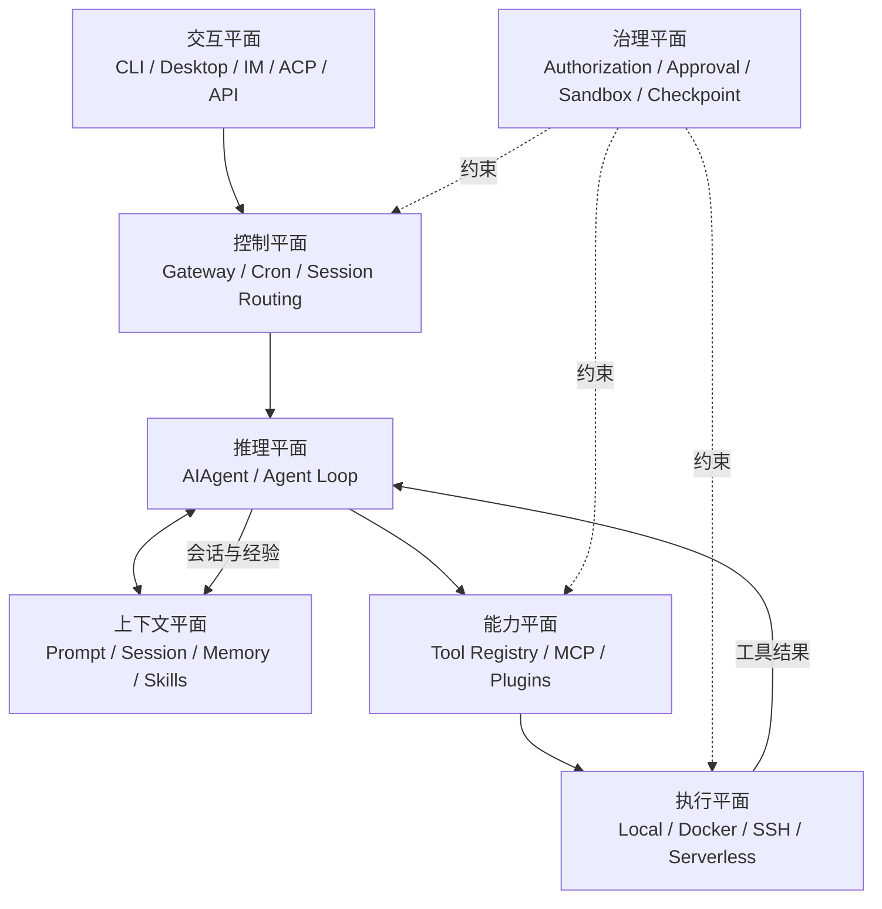
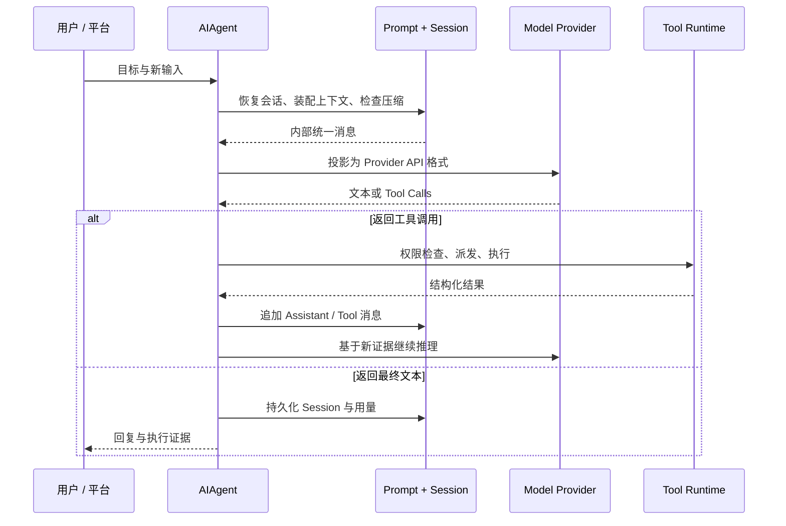
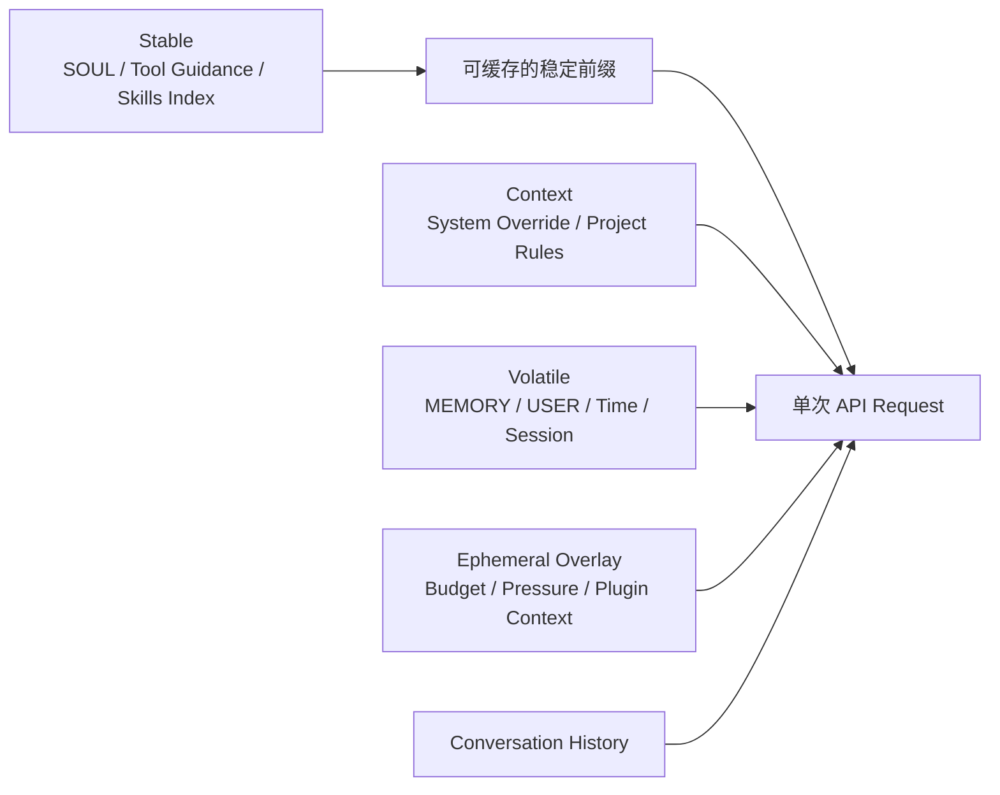

> 系列：[1. 全景](/writing/hermes-agent-series-overview/)｜[2. 运行内核](/writing/hermes-agent-architecture-deep-dive/)｜[3. 工具与服务](/writing/hermes-agent-runtime-services/)｜[4. 记忆与学习](/writing/hermes-agent-memory-governance/)｜[5. 整体判断](/writing/hermes-agent-series-synthesis/)

很多人第一次看到 Hermes Agent，会把它理解成“支持很多模型、很多工具和很多聊天平台的开源 Agent”。这个描述没有错，却错过了它真正有辨识度的部分。

Hermes 的核心不是多接几个 API，而是试图回答一个更难的问题：**一个 Agent 如何在几个月甚至几年里持续工作，记住人与项目，把成功经验沉淀成程序性知识，同时又不让上下文、成本和权限一起失控？**

它给出的答案，是把一次模型调用扩展成一套长期运行系统：前台有 Agent Loop，下面有工具与执行环境，旁边有 Session 与 Gateway，背后则有记忆、技能和后台复盘组成的学习闭环。

> [!IMPORTANT]
> **结论先行：**Hermes Agent 最准确的定位，不是“开源版 Claude Code”，也不是“带工具的聊天机器人”，而是一个以个人长期关系为中心、Batteries included 的 Agent OS。它最有价值的设计是把工作记忆、历史检索、事实记忆和程序性技能拆开；它最大的架构风险也来自同一件事——当 Agent 可以改写自己的长期上下文时，错误不再只影响一次回答，而可能进入未来每一次决策。

本文基于 Nous Research 官方仓库 `v0.21.0` 开发线的 [2026-09-03 代码快照](https://github.com/NousResearch/hermes-agent/tree/63279301bcbdc185c1b07b98a9312eb0c862f26d)与官方文档。Hermes 仍在快速演进，因此文中的数字和默认值都应结合版本理解。

## 先看全局：Hermes 不是一个 Loop，而是七个平面

官方架构图把 CLI、Gateway、ACP、API、Batch 等入口汇聚到 `AIAgent`，再连接 Provider、工具后端和 SQLite Session。这个视角适合找代码入口，但要理解产品，我更愿意把 Hermes 分成七个相互约束的平面：

*图 1｜Hermes 的七个分析平面：六个运行平面加一个治理平面，与下表逐项对应。*

这七个平面分别回答不同问题：

| 平面 | 核心问题 | Hermes 的主要机制 |
| --- | --- | --- |
| 交互 | 用户从哪里发起和接管工作？ | CLI、TUI、Desktop、消息平台、ACP、API |
| 控制 | 任务如何被路由、排队、定时和交付？ | Gateway、Session key、Cron、后台结果投递 |
| 推理 | 模型如何在反馈中连续行动？ | `AIAgent`、多 Provider 适配、重试、Fallback、Iteration Budget |
| 上下文 | 什么信息在何时进入模型？ | Prompt 分层、会话历史、压缩、Memory、Skills、项目规则 |
| 能力 | Agent 能调用哪些外部能力？ | Tool Registry、Toolsets、MCP、Plugins、`execute_code`、Subagents |
| 执行 | 工具在哪种环境运行？ | Local、Docker、SSH、Serverless |
| 治理 | 谁可以触发什么，副作用到哪里为止？ | 用户授权、危险命令审批、写入保护、容器、凭证过滤、Checkpoint |

这也解释了为什么只看 `run_agent.py` 会误判 Hermes。Agent Loop 是心脏，但 Gateway 决定它能否长期在线，Session 决定它能否连续，Skills 决定经验能否复用，安全边界则决定自治是否可接受。官方的[架构总览](https://hermes-agent.nousresearch.com/docs/developer-guide/architecture)也把这些模块视为同一运行系统，而不是一组彼此独立的功能。

## Agent Loop：把不同模型收敛成同一种行动协议

Hermes 的推理核心是 `AIAgent`。一次 Turn 大致经历：装配或复用 System Prompt、检查上下文压力、把内部消息投影到 Provider 协议、调用模型、解析 Tool Call、执行并回填结果，直到模型给出最终文本或预算耗尽。完整时序见官方的 [Agent Loop Internals](https://hermes-agent.nousresearch.com/docs/developer-guide/agent-loop)。

*图 2｜Hermes Agent Loop 将模型差异收敛为可中断、可续跑的统一行动协议。*

### 1. Provider 差异被压在边缘

Hermes 同时处理 OpenAI-compatible Chat Completions、OpenAI Responses/Codex 与 Anthropic Messages 等模式，但内部仍尽量使用统一的 `role/content/tool_calls` 消息表示。Provider Adapter 负责输入输出转换，Agent Loop 负责稳定的行动语义。

这是一个非常务实的边界：**模型提供者是可替换的，工具循环不能跟着每个 API 重写。** 代价是适配层必须处理消息交替、Reasoning、流式输出、Prompt Cache、Compaction 和各家 Tool Call 格式的细小差异。多 Provider 并不只是换一个 `base_url`，而是一项持续的协议兼容工程。

### 2. 中断是一等能力，而不是异常分支

模型请求被放进后台线程，前台同时监听用户新消息、停止信号和超时。发生中断时，未完成响应会被丢弃，不会把半截 Assistant 消息写入历史。Gateway 也用两级 Guard 处理运行中的新消息与 `/stop`、`/approve` 等旁路命令，详见 [Gateway Internals](https://hermes-agent.nousresearch.com/docs/developer-guide/gateway-internals)。

长期 Agent 与聊天机器人的一个关键差别就在这里：聊天产品优化“等它答完”，工作系统必须允许人随时改方向，而且不能因此破坏状态机。

### 3. 并行有三种，不应混为一谈

Hermes 内部至少有三种并行：

- 同一模型响应返回多个独立 Tool Call 时，运行时可并发执行，再按原始顺序回填结果；
- `delegate_task` 为需要判断的子问题创建独立 Agent 上下文；
- `execute_code` 让模型一次生成程序，由程序在 RPC 通道内批量调用工具。

第一种减少 I/O 等待，第二种购买额外推理能力，第三种用确定性代码替代重复的模型往返。把三者都叫“多 Agent”会丢掉最关键的成本差异。

## Prompt 架构：真正稀缺的不是 Token，而是稳定前缀

Hermes 的 Prompt 不是把所有资料拼成一大段，而是按稳定性分成三层：

1. **Stable**：身份、工具与模型指导、Skills 索引、环境与平台提示；
2. **Context**：调用方 System Message 和项目上下文文件；
3. **Volatile**：`MEMORY.md`、`USER.md`、外部记忆块、时间、Session、Model 与 Provider 信息。

最终按 `stable → context → volatile` 连接。临时预算提醒、Gateway 会话覆盖层和插件的 `pre_llm_call` 内容则只进入本次 API Call，不污染缓存前缀。具体装配顺序见 [Prompt Assembly](https://hermes-agent.nousresearch.com/docs/developer-guide/prompt-assembly)。

*图 3｜只有稳定层形成可复用前缀；项目上下文、易变信息、临时覆盖层与历史在单次请求中汇合。*

这个设计有三个深层含义。

第一，Prompt Cache 不是最后再加的性能优化，而是信息架构约束。频繁变化的信息越靠后，越容易复用前缀；临时信息不写回持久历史，避免每轮都让缓存失效。

第二，Memory 写入与 Memory 生效被刻意分开。Agent 在本轮新增的记忆会立即落盘，但当前 Session 的 System Prompt 是冻结快照，通常要到新 Session 或重建路径才会重新注入。官方[记忆文档](https://hermes-agent.nousresearch.com/docs/user-guide/features/memory/)明确把这种延迟作为缓存稳定性的交换。

第三，项目规则有明确优先级。Hermes 原生的 `.hermes.md` / `HERMES.md` 优先，其次才是 `AGENTS.md`、`CLAUDE.md` 和 Cursor Rules；上下文文件还会经过长度限制与注入模式扫描。换言之，项目文件不是“普通文本”，而是进入高权限 Prompt 的配置输入。

---

上一篇：[Hermes 全景](/writing/hermes-agent-series-overview/)。

内核解释了模型如何持续行动，但长期 Agent 还需要连接真实能力与外部入口。下一篇进入工具 ABI、代码编排、子 Agent 与 Gateway。

下一篇：[Hermes 工具](/writing/hermes-agent-runtime-services/)。
