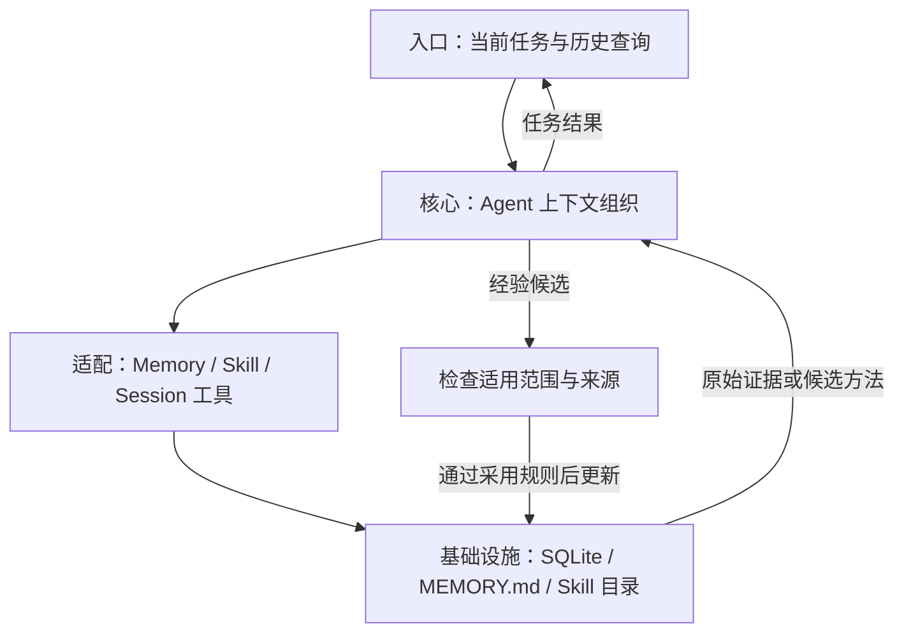
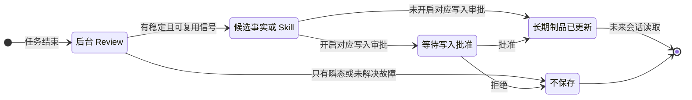

## 定位与价值

本篇讨论临时故障如何留成记录，以及哪些经验可以影响下一次任务；重点是纠错和晋升，而非保存越多越好。

完整定位与安装见[项目总览](/writing/hermes-agent-architecture-deep-dive/)。

研究基线：[NousResearch/hermes-agent @ 6327930](https://github.com/NousResearch/hermes-agent/blob/63279301bcbdc185c1b07b98a9312eb0c862f26d/README.md)；源码与社区核对日期为 2026-09-06。

## 技术架构



*图 1｜职责与数据流；逻辑分层不要求分开部署。*

## 核心机制

### 四种记忆的更新路径

“拥有长期记忆”常被产品描述成一个开关，但 Hermes 实际上把记忆拆成四种载体：

| 记忆类型 | 载体 | 生命周期 | 适合保存 | 主要代价 |
| --- | --- | --- | --- | --- |
| 工作记忆 | 当前 Conversation | 一次 Session | 当前目标、工具结果、临时决策 | Context Window 持续增长 |
| 情景记忆 | SQLite + FTS5 Session History | 跨 Session | 过去发生过什么、原始对话与 Tool Call | 需要主动检索，命中依赖查询词 |
| 事实记忆 | `MEMORY.md` / `USER.md` | 跨 Session、常驻 Prompt | 用户偏好、环境事实、稳定约定 | 每轮占 Token，错误会长期放大 |
| 程序记忆 | Skills | 跨 Session、按需加载 | 可重复工作流、排错路径、验证方法 | 需要选择、版本治理与安全审查 |

这些载体分别承担当前输入、原始记录、短事实和方法复用，检索和更新策略也应分开。

#### 1. Session 是事实日志，不是摘要替身

Hermes 把会话、消息、工具调用、Reasoning、用量、模型配置和路由信息写进 SQLite，并用 FTS5、Trigram 与 CJK 索引支持全文检索。Agent 可以通过 `session_search` 找回原始消息，而不是先把所有历史压成一份不可逆的用户画像。官方的 [Session Storage](https://hermes-agent.nousresearch.com/docs/developer-guide/session-storage)展示了 Session、Message、FTS 与写入竞争处理的结构。

这个选择很重要：**Memory 保存结论，Session 保存证据。** 当结论可疑时，系统仍有机会回到原始上下文重新判断。

#### 2. 常驻 Memory 被故意做小

内置 `MEMORY.md` 和 `USER.md` 都有严格字符上限，前者保存环境、项目和经验，后者保存用户身份、偏好与协作方式。写满后系统不会静默淘汰，而是要求 Agent 合并或删除旧条目后重试。

小容量迫使 Agent 做策展，而不是做日志复制。常驻 Prompt 中最昂贵的不是存储空间，而是每一次推理都要重新支付的注意力。

#### 3. Skills 是程序性记忆，不是长 Prompt 附件

Skills 只在 System Prompt 中暴露精简索引，匹配任务后再读取完整 `SKILL.md`，更深的参考资料继续按需加载。官方[Skills 文档](https://hermes-agent.nousresearch.com/docs/user-guide/features/skills/)将它称为 Progressive Disclosure。

因此，Memory 与 Skill 的分界应该是：

```text
Memory：在所属用户或项目范围内可复用的短事实
Skill：以后做这一类任务时才需要加载的长方法
Session Search：当需要核对过去究竟发生过什么时再查证
```

固定快照 `6327930` 采用这套分层；接入时仍需检查来源、保留期与当前任务适用性。


### 经验晋升与治理

#### “自我进化”到底是什么：受约束的 Artifact Learning

Hermes 把自己描述为 self-improving agent。这个说法很容易被误解成模型会在线微调。源码展示的真实机制更具体，也更可控：**它不会在用户机器上持续更新模型权重，而是持续更新模型下一次会读取的外部制品。**

一次前台任务结束后，后台 Review Fork 可以重放会话，判断是否出现了值得长期保存的用户事实或通用方法。如果有，它通过 `memory` 或 `skill_manage` 修改 Memory 与 Skills；未来 Session 再把这些制品装配进 Prompt。`agent/background_review.py` 的[源码说明](https://github.com/NousResearch/hermes-agent/blob/63279301bcbdc185c1b07b98a9312eb0c862f26d/agent/background_review.py)清楚表明，这个 Fork 与主对话隔离，只开放记忆和技能管理等窄工具面。



*图 2｜Hermes 的 Artifact Learning：开启写入审批时先暂存、获批后生效；未开启时可以自动写入。审批不是所有配置的必经步骤。*

我把这种模式称为 **Artifact Learning**：模型参数不变，外部认知制品变了，因此系统行为随经验改变。它有四个优点：

- 可读：人可以直接查看 Memory 和 `SKILL.md`；
- 可编辑：错误知识可以被修订，不必重新训练模型；
- 可移植：Skills 可以进入仓库、团队和 Skill Hub；
- 可审批：`memory.write_approval` 与 `skills.write_approval` 可以把自动写入先暂存，再由人决定是否生效。

但它也有一个比普通 RAG 更危险的失败模式：**错误一旦写入程序性记忆，就会从一次幻觉升级为稳定偏见。** 比如，把一次临时的“工具未安装”总结成“这个工具不可用”，未来 Agent 可能持续拒绝正确路径。Hermes 的 Review Prompt 因此明确禁止把环境瞬态、未解决失败和一次性任务包装成可靠 Skill，并限制后台 Fork 修改用户拥有、Hub 安装或被 Pin 的技能。

所以，自我进化的关键并不是“允许 Agent 写 Skill”，而是形成一条带来源、所有权、审批和回滚的知识变更链。没有这四项，学习闭环很容易变成错误放大器。

#### 安全模型：Guardrail 与 Security Boundary 必须分清

Hermes 的[安全文档](https://hermes-agent.nousresearch.com/docs/user-guide/security/)列出了用户授权、危险命令审批、文件写入保护、容器隔离、MCP 凭证过滤、上下文扫描、跨 Session 隔离和输入清洗等多层防线。真正重要的不是层数，而是它们解决的威胁不同。

| 机制 | 防什么 | 是否属于硬边界 |
| --- | --- | --- |
| Gateway Allowlist / Pairing | 未授权的人调用 Agent | 接入层硬边界 |
| 危险命令 Pattern + Smart Approval | 诚实但犯错的 Agent | Guardrail，可配置关闭 |
| 永久 Blocklist / Deny Rules | 明确不可接受的命令 | 命令入口硬限制 |
| `write_file` / `patch` 路径保护 | 误写密钥与系统文件 | 仅覆盖文件工具，不覆盖 Shell |
| Context / Skill / Memory 扫描 | Prompt Injection 与持久污染 | 启发式 Guardrail |
| Docker / Modal 等隔离环境 | 限制文件、进程与凭证影响范围 | 取决于挂载、权限、网络和凭证配置 |
| Checkpoint / Worktree | 错误后的恢复与变更隔离 | 恢复机制，不是权限系统 |

这里最容易误读的是文件写入保护。官方明确说明，`write_file` 和 `patch` 的路径 Denylist 不能约束同一 OS 用户权限下的 `terminal`；若把它当成对恶意 Agent 的沙箱，就会产生虚假安全感。真正的安全边界仍然是容器、远程 Sandbox、文件挂载、网络出口和最小权限凭证。

Checkpoint 同样不是沙箱。它会在文件变更前把工作目录快照到独立 Git Object Store，并可在回滚时根据 Agent 写入账本保留用户后续手改，详见 [Checkpoints and Rollback](https://hermes-agent.nousresearch.com/docs/user-guide/checkpoints-and-rollback)。它降低错误成本，却不能阻止数据外传或外部 API 副作用。

对于能改写自身 Memory 与 Skills 的系统，还必须增加一条“认知供应链”安全线：来源是否可信、内容是否被扫描、后台 Agent 是否有写权限、变更是否需要审批、旧版本能否恢复。Hermes 已经提供了这些机制的雏形，但默认允许自动写入；用于工作机器或多人环境时，开启 Memory 与 Skill 写入审批会更稳妥。

#### 用临时故障检查经验是否被误用

在隔离项目中模拟一次“工具未安装”，随后安装工具并启动新 Session。检查后台是否把瞬态失败写成永久禁用方法，能否追到来源、修订制品，以及新会话是否读取正确版本。这是建议验收场景，本文没有实际执行。

需要跨会话、跨渠道持续工作且愿意承担服务与记忆治理时，可以评估 Hermes；仅需要仓库内编码时，应比较现成 Coding Agent 的维护成本。[Coding Agent 比较](/writing/coding-agent-harness-showdown/)提供同维度入口。

---

资料截至 2026-09-04。优先引用 Nous Research 官方仓库与官方文档；关于架构优缺点、模块化单体和 Artifact Learning 的表述属于基于源码的分析判断，不是官方自我定义。

## 快速上手

先按[项目总览](/writing/hermes-agent-architecture-deep-dive/#快速上手)准备运行环境；本篇的最小实验直接执行固定快照中的测试。另需按仓库贡献指南安装开发与测试依赖。

```bash
python -m pytest tests/test_session_skill_previews.py -q
```

观察 Session 中技能预览的边界；不把预览成功当作技能质量通过。

模型、执行环境与存储等共用配置，以及安装常见问题，见[总览的三个配置项](/writing/hermes-agent-architecture-deep-dive/#快速上手)。本轮已核对测试文件与运行入口，未在本文环境执行这条上游测试命令。

## 生态与社区

许可证、官方集成、提交与 Issue 样本统一见[项目总览的生态与社区](/writing/hermes-agent-architecture-deep-dive/#生态与社区)。

## 源码阅读路径

公共安装入口见项目总览。本篇沿相关模块追踪到具体实现与测试：

| 顺序 | 目录 → 文件 | 函数、对象或验证重点 |
| --- | --- | --- |
| 1 | [agent/memory_manager.py](https://github.com/NousResearch/hermes-agent/blob/63279301bcbdc185c1b07b98a9312eb0c862f26d/agent/memory_manager.py) | MemoryManager.build_system_prompt：组织记忆上下文 |
| 2 | [tests/test_session_skill_previews.py](https://github.com/NousResearch/hermes-agent/blob/63279301bcbdc185c1b07b98a9312eb0c862f26d/tests/test_session_skill_previews.py) | 会话中的技能预览用例 |
