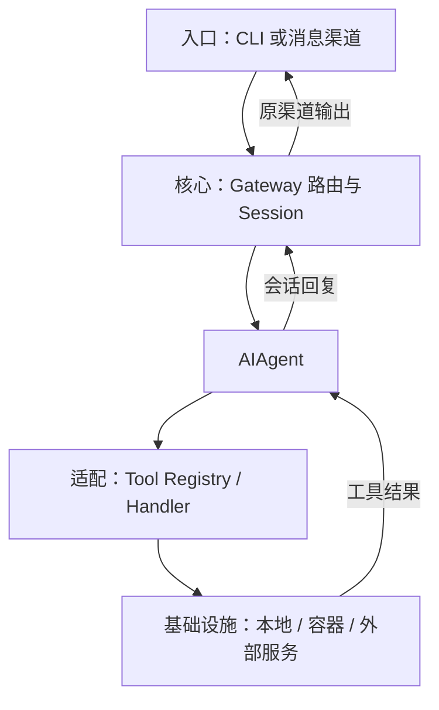
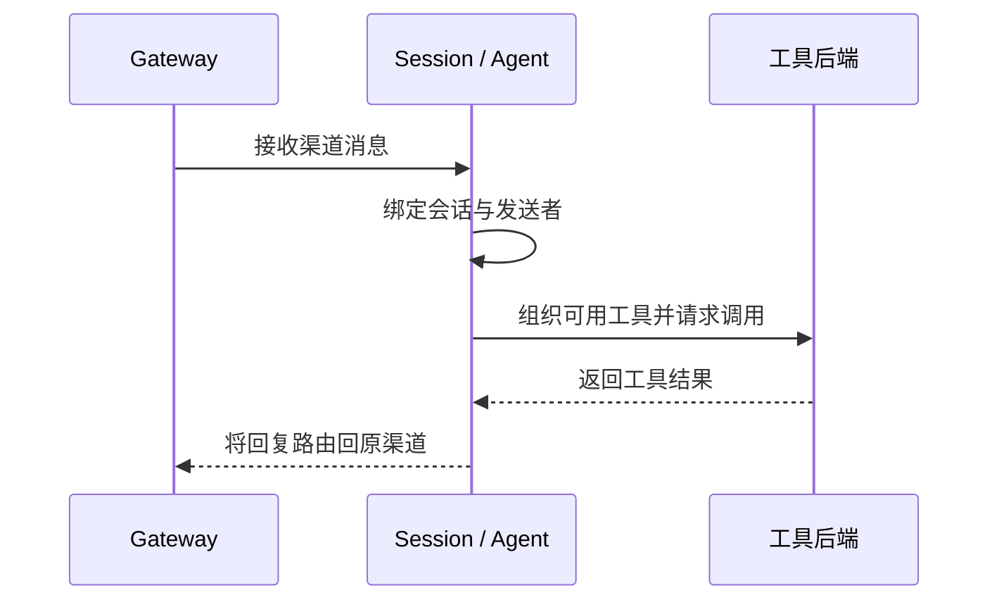

## 定位与价值

本篇讨论两个接入问题：不可用工具为何不该出现在模型 Schema 中，以及消息渠道怎样找到正确 Session。

完整定位与安装见[项目总览](/writing/hermes-agent-architecture-deep-dive/)。

研究基线：[NousResearch/hermes-agent @ 6327930](https://github.com/NousResearch/hermes-agent/blob/63279301bcbdc185c1b07b98a9312eb0c862f26d/README.md)；源码与社区核对日期为 2026-09-06。

## 技术架构



*图 1｜按职责归纳的调用地图；箭头表示请求与结果，不表示四个独立部署服务。*

## 核心机制



*图 2｜本篇关键流程的职责示意；部署者提出的验收要求与框架内建行为需按正文区分。*

### 工具可用性与执行

Hermes 的工具模块通过中央 Registry 自注册。Registry 保存名称、Toolset、JSON Schema、Handler、可用性检查和运行元数据；启动时再发现内置工具、MCP 工具与 Plugin 工具。只有通过 Toolset 选择和 `check_fn` 可用性检查的工具，才会进入模型看到的 Schema 列表。详见官方 [Tools Runtime](https://hermes-agent.nousresearch.com/docs/developer-guide/tools-runtime)。

这套设计看似是插件机制，实质上定义了 Agent 的 ABI：

- Tool Name 是调用符号；
- JSON Schema 是函数签名；
- Description 是模型选择工具的语义类型；
- Handler 是具体实现；
- Toolset 负责能力分组和模型可见工具筛选；实际授权仍需工具后端与执行环境校验；
- Hook 是调用前后的策略切面；
- Environment 是副作用真正发生的位置。

对传统程序，缺少一个依赖会在运行时报错；对 Agent，更好的做法是让不可用工具根本不出现在 Schema 中。这样模型不会围绕不存在的能力制定计划。Hermes 还会动态修补 `execute_code` 等工具的说明，只暴露本轮真正可调用的子工具，这是一种很实用的“能力诚实”。

#### execute_code：把编排从自然语言移到程序

`execute_code` 并不等同于 Shell。模型先生成 Python 脚本，脚本在子进程里通过本地 RPC 调用白名单工具，只有最终 `print()` 输出回到模型上下文；中间几十次搜索、读取和过滤结果不必逐条占用 Conversation。官方 [Code Execution](https://hermes-agent.nousresearch.com/docs/user-guide/features/code-execution/)文档给出了它的资源限制和凭证过滤模型。

它的本质是**用代码做上下文压缩**：

```text
普通 Tool Loop：调用 → 结果进上下文 → 再推理 → 再调用
execute_code：一次写程序 → 程序完成多步确定性处理 → 只回传聚合结果
```

当任务是“遍历 50 个固定格式文件并提取字段”时，确定性程序可以减少模型往返；实际费用和错误率仍要测量，文件格式不一致时也可能需要额外判断。只有涉及模糊判断和策略变化时，才值得为每一步重新调用模型。

#### delegate_task：为判断力购买独立上下文

`delegate_task` 解决的是另一类问题：子任务需要新的推理循环，而不是机械批处理。子 Agent 默认拥有独立对话和终端 Session，只把最终摘要带回父上下文；并发数、最大深度、模型和工具集都可限制。对于并行改代码，可选择 Git Worktree 隔离，避免多个 Agent 在同一工作目录互相覆盖，参见 [Subagent Delegation](https://hermes-agent.nousresearch.com/docs/user-guide/features/delegation/)。

一个尤其成熟的边界是：**结果投递可以持久化，不代表执行本身可恢复。** Hermes 能在进程重启后重新投递已经完成但尚未送达的子任务结果，却不会声称恢复一个崩溃时仍在运行的子 Agent；这种任务会标为 `unknown`，因为外部副作用是否发生无法被证明。Cron 可以重新触发工作，后台进程可以脱离前台交互运行，但都不能据此保证恢复原来的执行点。需要跨进程恢复的业务，应另行保存操作身份、进度和对账依据。


### Gateway 的会话路由

如果说 `AIAgent` 是数据面，Gateway 就是 Hermes 的控制面。它把不同消息平台的事件标准化，完成用户授权、Session Key 路由、运行中消息 Guard、命令旁路、进度反馈、结果投递和后台维护。

这层的价值常被低估。一个可以在 Telegram 上工作数小时的 Agent，需要解决的不是“接一个 Bot API”，而是：

- 同一聊天、群组与 Thread 怎样映射到稳定 Session；
- Agent 正在运行时，新消息是排队、打断还是执行控制命令；
- 危险命令的审批如何在异步聊天界面往返；
- Cron 和后台 Agent 的完成结果应该送到哪里；
- 多个 Profile 使用同一平台凭证时如何避免双重消费；
- 进程重启后，哪些投递义务仍然存在。

因此，Hermes 的“跨平台”不是 UI 特性，而是一个持久化、并发和一致性问题。Gateway 与 SQLite Session、Delivery Ledger、Platform Adapter 一起，把一次性的 Agent Loop 包装成长期在线服务。

经验写入与生效的治理见[记忆篇](/writing/hermes-agent-memory-governance/)。

## 快速上手

先按[项目总览](/writing/hermes-agent-architecture-deep-dive/#快速上手)准备运行环境；本篇的最小实验直接执行固定快照中的测试。另需按仓库贡献指南安装开发与测试依赖。

```bash
python -m pytest tests/test_toolsets.py -q
```

观察 Toolset 如何影响工具可见集合。

模型、执行环境与存储等共用配置，以及安装常见问题，见[总览的三个配置项](/writing/hermes-agent-architecture-deep-dive/#快速上手)。本篇命令仅在明确记录实跑结果时才作为通过证据。

## 生态与社区

许可证、官方集成、提交与 Issue 样本统一见[项目总览的生态与社区](/writing/hermes-agent-architecture-deep-dive/#生态与社区)。本篇的治理建议不表示上游已提供对应 SLA 或托管能力。

## 源码阅读路径

按下面顺序阅读固定提交：先找包或命令入口，再进入核心抽象、具体实现和测试。

| 顺序 | 目录 → 文件 | 函数、对象或检查重点 |
| --- | --- | --- |
| 1 | [pyproject.toml](https://github.com/NousResearch/hermes-agent/blob/63279301bcbdc185c1b07b98a9312eb0c862f26d/pyproject.toml) | project.scripts 的 hermes 入口 |
| 2 | [hermes_cli/main.py](https://github.com/NousResearch/hermes-agent/blob/63279301bcbdc185c1b07b98a9312eb0c862f26d/hermes_cli/main.py) | main：CLI 分派 |
| 3 | [run_agent.py](https://github.com/NousResearch/hermes-agent/blob/63279301bcbdc185c1b07b98a9312eb0c862f26d/run_agent.py) | AIAgent：模型与工具循环 |
| 4 | [agent/memory_manager.py](https://github.com/NousResearch/hermes-agent/blob/63279301bcbdc185c1b07b98a9312eb0c862f26d/agent/memory_manager.py) | 记忆管理实现 |
| 5 | [tests/test_toolsets.py](https://github.com/NousResearch/hermes-agent/blob/63279301bcbdc185c1b07b98a9312eb0c862f26d/tests/test_toolsets.py) | 观察 Toolset 如何影响工具可见集合。 |
