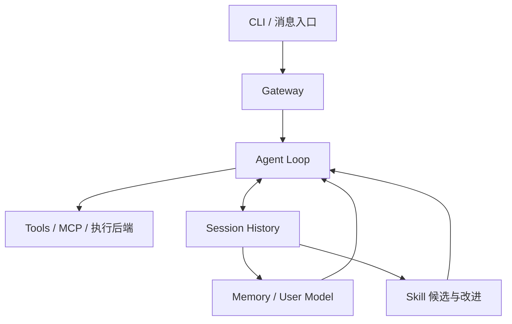

> 系列：[1. 全景](/writing/hermes-agent-series-overview/)｜[2. 运行内核](/writing/hermes-agent-architecture-deep-dive/)｜[3. 工具与服务](/writing/hermes-agent-runtime-services/)｜[4. 记忆与学习](/writing/hermes-agent-memory-governance/)｜[5. 整体判断](/writing/hermes-agent-series-synthesis/)

Hermes Agent 的研究起点不是“支持多少工具”，而是它试图维持一段跨会话、跨渠道、跨执行环境的长期关系。官方仓库把它描述为带闭环学习的 Agent：能够检索历史、维护记忆，并从复杂任务中创建或改进 Skills。[官方仓库](https://github.com/NousResearch/hermes-agent)

*图 1｜Hermes 把一次工具调用扩展为跨渠道、跨任务的长期 Agent。*

接下来三篇沿同一主线推进：先研究模型与工具事件如何形成可中断循环，再看 Gateway 和执行后端怎样把循环变成服务，最后检查历史、事实记忆和程序性 Skill 如何进入未来任务。阅读时始终保留一个警惕：能写入长期状态，不等于写入内容已经可信。

---

下一篇：[运行内核](/writing/hermes-agent-architecture-deep-dive/)。

下一篇从执行事实开始，避免先被“自我进化”愿景带走。
