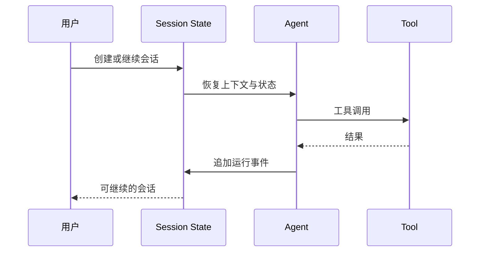

> 系列：[1. 全景](/writing/kimi-code-system-overview/)｜[2. Session 与运行](/writing/kimi-code-session-runtime/)｜[3. Skills 与 Swarm](/writing/kimi-code-skills-swarm/)｜[4. 整体判断](/writing/kimi-code-system-synthesis/)

Kimi Code 把会话保存为可恢复状态，而不是只在终端显示一段文本。官方 [Sessions 文档](https://github.com/MoonshotAI/kimi-code/blob/main/docs/en/guides/sessions.md)说明，状态文件保存会话元数据，`wire.jsonl`记录 Agent 运行事件，用于恢复和回放。

*图 1｜追加事件为恢复提供事实，但恢复策略仍需处理未完成副作用。*

事件日志能回答“发生过什么”，却不能单独回答“可以从哪里安全重试”。如果工具已经写入外部系统但结果未返回，简单重放会产生重复副作用。因此，生产级恢复还需要操作键、幂等协议或业务对账。

持久 Session 的另一价值是 SDK 与 CLI 可以复用同一运行语义。它为长期任务和外部编排打基础，但不应被误写成长期记忆：会话历史保存经历，Memory 或 Skill 才负责把经历转化为未来可用知识。

---

上一篇：[全景](/writing/kimi-code-system-overview/)。

下一篇：[Skills 与 Swarm](/writing/kimi-code-skills-swarm/)。

状态主线清楚之后，下一篇研究能力怎样被发现，以及多个 Agent 怎样共享任务而不共享混乱。
