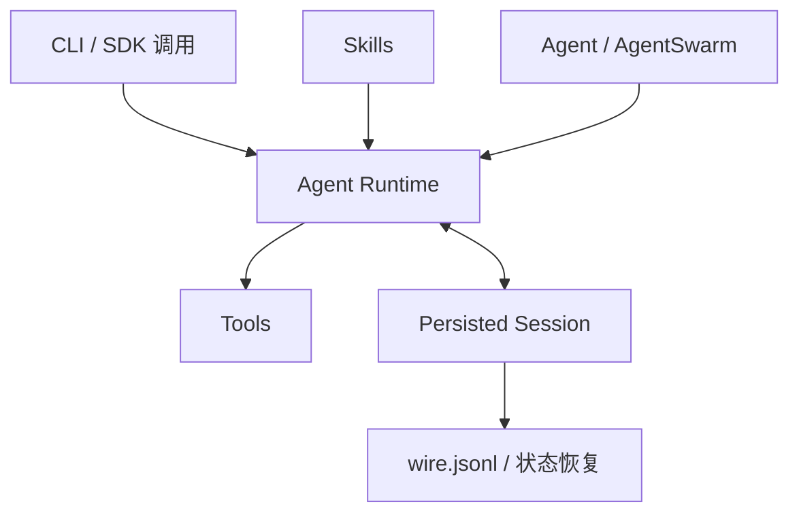
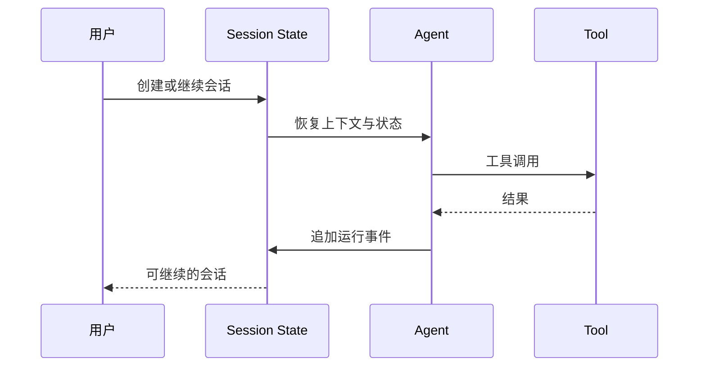

Kimi Code 是当前应研究的主线，旧 [`MoonshotAI/kimi-cli`](https://github.com/MoonshotAI/kimi-cli)已经明确向 Kimi Code CLI 收敛并逐步退出，因此本文以 Kimi Code 为研究对象。[Kimi Code 官方仓库](https://github.com/MoonshotAI/kimi-code)把 CLI 定义为下一代 Agent 的起点。

研究口径：依据文中链接的公开文档，核对日期为 2026-09-06；下图是职责归纳，不是完整部署图，也不作为未运行路径的实测证明。

设会话在修改文件之后、测试之前退出。重新进入 Session 应恢复已记录的工作，并检查磁盘上的修改；如果历史里还有结果未知的外部写入，必须对账后再决定是否重试。下图说明需要检查的状态位置，不代表本文已运行故障实验。

*图 1｜Kimi Code 用持久 Session 连接工具执行、技能加载和多 Agent 协作。*

## Session 与执行循环

Kimi Code 把会话保存为可恢复状态，而不是只在终端显示一段文本。官方 [Sessions 文档](https://github.com/MoonshotAI/kimi-code/blob/main/docs/en/guides/sessions.md)说明，状态文件保存会话元数据，`wire.jsonl`记录 Agent 运行事件，用于恢复和回放。

*图 2｜追加事件为恢复提供事实，但恢复策略仍需处理未完成副作用。*

事件日志能回答“发生过什么”，却不能单独回答“可以从哪里安全重试”。如果工具已经写入外部系统但结果未返回，简单重放会产生重复副作用。因此，生产级恢复还需要操作键、幂等协议或业务对账。

持久 Session 的另一价值是 SDK 与 CLI 可以复用同一运行语义。它为长期任务和外部编排打基础，但不应被误写成长期记忆：会话历史保存经历，Memory 或 Skill 才负责把经历转化为未来可用知识。

## Skills、委派与结果交接

Kimi Code 的 Skills 采用目录化 Markdown 资产，并从项目、用户和共享位置发现。模型可以根据描述自动调用，正文与资源按需进入任务。[Skills 文档](https://github.com/MoonshotAI/kimi-code/blob/main/docs/en/customization/skills.md)还规定了嵌套深度，避免能力调用无限递归。

Agent 与 AgentSwarm 是另一层：前者把子任务交给独立工作单元，后者允许多个任务并行运行。[工具参考](https://github.com/MoonshotAI/kimi-code/blob/main/docs/en/reference/tools.md)说明它们与 Skill 工具并列存在。这意味着“知道怎样做”和“由谁去做”是两个路由决策。

| 决策 | 选择对象 | 失败风险 |
| --- | --- | --- |
| 能力路由 | Skill | 描述误匹配、版本过时 |
| 任务路由 | Agent | 边界不清、摘要丢失 |
| 并发路由 | Swarm | 写冲突、重复工作 |

多个 Agent 不应共享模糊目标后自行碰撞。可靠协作需要明确输入、输出、文件所有权和验收者；并发可能缩短独立子任务的等待时间；吞吐与正确率均需连同协调成本实测。
