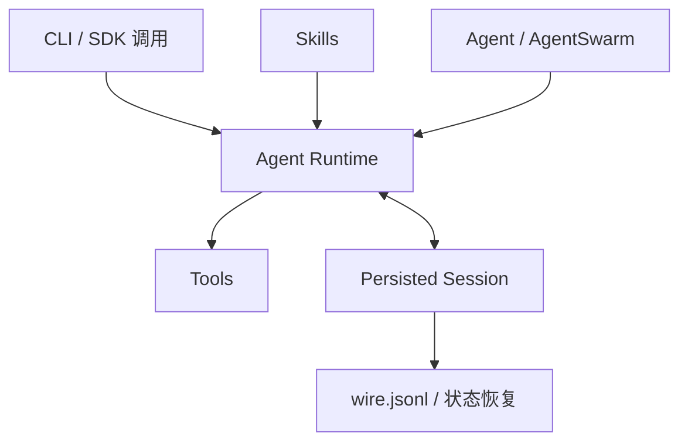

> 系列：[1. 全景](/writing/kimi-code-system-overview/)｜[2. Session 与运行](/writing/kimi-code-session-runtime/)｜[3. Skills 与 Swarm](/writing/kimi-code-skills-swarm/)｜[4. 整体判断](/writing/kimi-code-system-synthesis/)

Kimi Code 是当前应研究的主线，旧 [`MoonshotAI/kimi-cli`](https://github.com/MoonshotAI/kimi-cli)已经明确向 Kimi Code CLI 收敛并逐步退出，因此不再拆成两个系列。[Kimi Code 官方仓库](https://github.com/MoonshotAI/kimi-code)把 CLI 定义为下一代 Agent 的起点。

*图 1｜Kimi Code 用持久 Session 连接工具执行、技能加载和多 Agent 协作。*

第二篇沿 Session 文件和工具事件研究恢复；第三篇进入 Skill 发现、Agent 与 Swarm 并发。终篇重点回答：为什么会话持久化和自动选择 Skill 仍不等于系统已经从经验中学习。

---

下一篇：[Session 与运行](/writing/kimi-code-session-runtime/)。

下一篇先从可恢复事实入手，检查任务中断后系统究竟保存了什么。
