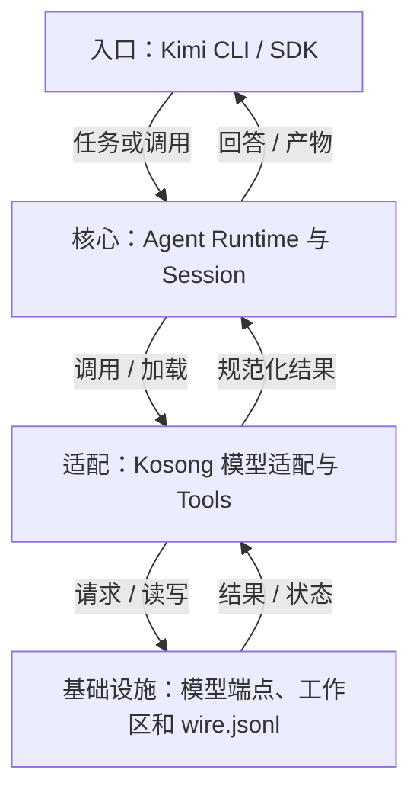
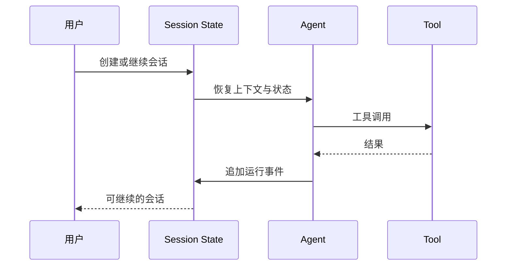

## 定位与价值

Kimi Code 是带持久会话和任务委派能力的编程 Agent；CLI 与 SDK 复用运行状态，省去接入方自行维护一份终端历史、一份模型历史的同步代码。

适合继续长会话与扩展编码工作流；恢复会话不提供外部写入的恰好一次保证。

研究基线：[MoonshotAI/kimi-code @ f9ca333](https://github.com/MoonshotAI/kimi-code/blob/f9ca33376604ae91ea35a4ac1d6f1d4425a5aead/README.md)；源码与社区核对日期为 2026-09-06。

## 技术架构



*图 1｜按职责归纳的调用地图；箭头表示请求与结果，不表示四个独立部署服务。*

## 核心机制

### Session 怎样恢复工作

Kimi Code 把会话保存为可恢复状态，而不是只在终端显示一段文本。官方 [Sessions 文档](https://github.com/MoonshotAI/kimi-code/blob/main/docs/en/guides/sessions.md)说明，状态文件保存会话元数据，`wire.jsonl`记录 Agent 运行事件，用于恢复和回放。



*图 2｜追加事件为恢复提供事实，但恢复策略仍需处理未完成副作用。*

事件日志能回答“发生过什么”，却不能单独回答“可以从哪里安全重试”。如果工具已经写入外部系统但结果未返回，简单重放会产生重复副作用。因此，生产级恢复还需要操作键、幂等协议或业务对账。

持久 Session 的另一价值是 SDK 与 CLI 可以复用同一运行语义。它为长期任务和外部编排打基础，但不应被误写成长期记忆：会话历史保存经历，Memory 或 Skill 才负责把经历转化为未来可用知识。


### Skills 与子任务怎样交接

Kimi Code 的 Skills 采用目录化 Markdown 资产，并从项目、用户和共享位置发现。模型可以根据描述自动调用，正文与资源按需进入任务。[Skills 文档](https://github.com/MoonshotAI/kimi-code/blob/main/docs/en/customization/skills.md)还规定了嵌套深度，避免能力调用无限递归。

Agent 与 AgentSwarm 是另一层：前者把子任务交给独立工作单元，后者允许多个任务并行运行。[工具参考](https://github.com/MoonshotAI/kimi-code/blob/main/docs/en/reference/tools.md)说明它们与 Skill 工具并列存在。这意味着“知道怎样做”和“由谁去做”是两个路由决策。

| 决策 | 选择对象 | 失败风险 |
| --- | --- | --- |
| 能力路由 | Skill | 描述误匹配、版本过时 |
| 任务路由 | Agent | 边界不清、摘要丢失 |
| 并发路由 | Swarm | 写冲突、重复工作 |

多个 Agent 不应共享模糊目标后自行碰撞。可靠协作需要明确输入、输出、文件所有权和验收者；并发可能缩短独立子任务的等待时间；吞吐与正确率均需连同协调成本实测。

## 快速上手

先安装官方 Kimi Code CLI，在 kimi 交互界面完成 /login。示例需要可用模型。

```bash
kimi --version
mkdir -p kimi-demo
cd kimi-demo
printf "# Demo\nNo source files yet.\n" > README.md
kimi -p "读取 README.md 并解释项目现状，不修改文件"
```

三个常用配置：

| 配置或安装选项 | 作用 |
| --- | --- |
| `--model` | 选择已配置的模型别名 |
| `--session` | 恢复指定会话；不等于重新执行所有动作 |
| `--agent` | 新会话选择 Agent 配方；恢复会话不再指定 |

其余选项见 [配置参考](https://github.com/MoonshotAI/kimi-code/blob/f9ca33376604ae91ea35a4ac1d6f1d4425a5aead/docs/en/reference/kimi-command.md)。

常见坑：先在交互模式执行 /login；旧 kimi-cli 教程的安装和配置不能直接套到 Kimi Code。

验证范围：已核对固定源码的入口、参数与依赖；未以本文示例调用真实模型或部署外部服务。

## 生态与社区

截至 2026-09-06，2026-08-08 至 09-06 UTC 的抽样取得 至少 30 条默认分支提交（上限 30 条）。见 [提交记录](https://github.com/MoonshotAI/kimi-code/commits/main/)。

Issue 取 08-08 至 08-30 UTC 创建的最近最多 3 条非 PR 条目，排除机器人和提问者自答；3 条中 0 条观察到维护者文字回复。 样本：[#3378](https://github.com/MoonshotAI/kimi-code/issues/3378)、[#3376](https://github.com/MoonshotAI/kimi-code/issues/3376)、[#3373](https://github.com/MoonshotAI/kimi-code/issues/3373)。小样本不代表 SLA，“未观察到”也不代表其他渠道无人处理。

固定快照许可证：[MIT](https://github.com/MoonshotAI/kimi-code/blob/f9ca33376604ae91ea35a4ac1d6f1d4425a5aead/LICENSE)。允许商业使用，但分发时仍须保留版权与许可声明。

同仓维护 VS Code、Node SDK 与 ACP 接入；AgentSwarm 是运行时委派能力，不是外部协议保证。

## 源码阅读路径

按下面顺序阅读固定提交：先找包或命令入口，再进入核心抽象、具体实现和测试。

| 顺序 | 目录 → 文件 | 函数、对象或检查重点 |
| --- | --- | --- |
| 1 | [apps/kimi-code/package.json](https://github.com/MoonshotAI/kimi-code/blob/f9ca33376604ae91ea35a4ac1d6f1d4425a5aead/apps/kimi-code/package.json) | CLI 构建与启动声明 |
| 2 | [apps/kimi-code/src/main.ts](https://github.com/MoonshotAI/kimi-code/blob/f9ca33376604ae91ea35a4ac1d6f1d4425a5aead/apps/kimi-code/src/main.ts) | CLI 主入口 |
| 3 | [packages/agent-core/src/index.ts](https://github.com/MoonshotAI/kimi-code/blob/f9ca33376604ae91ea35a4ac1d6f1d4425a5aead/packages/agent-core/src/index.ts) | 核心运行时导出 |
| 4 | [packages/agent-core/src/tools/builtin/collaboration/agent.ts](https://github.com/MoonshotAI/kimi-code/blob/f9ca33376604ae91ea35a4ac1d6f1d4425a5aead/packages/agent-core/src/tools/builtin/collaboration/agent.ts) | 子 Agent 工具实现 |
| 5 | [packages/agent-core/test/harness/skill-session.test.ts](https://github.com/MoonshotAI/kimi-code/blob/f9ca33376604ae91ea35a4ac1d6f1d4425a5aead/packages/agent-core/test/harness/skill-session.test.ts) | Skill 与 Session 交互用例 |
