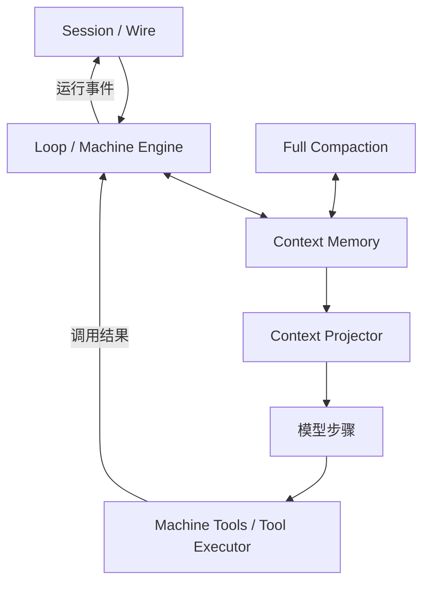
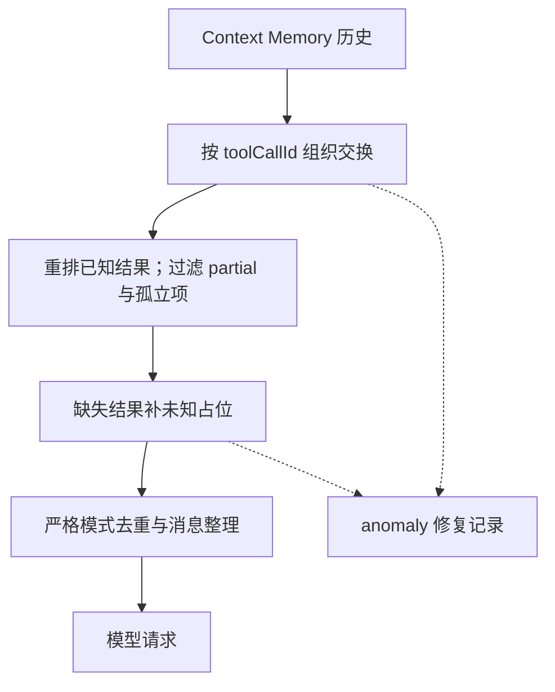
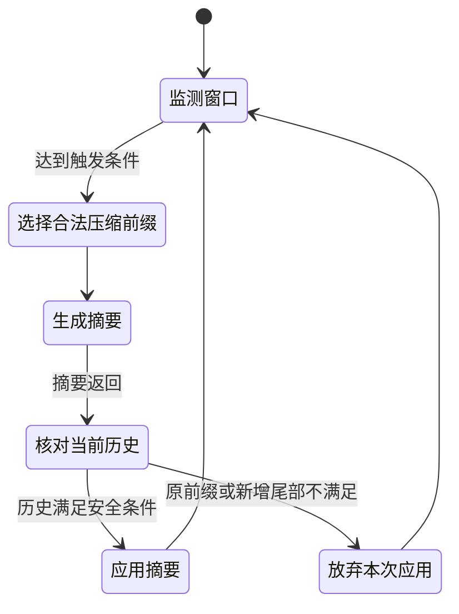
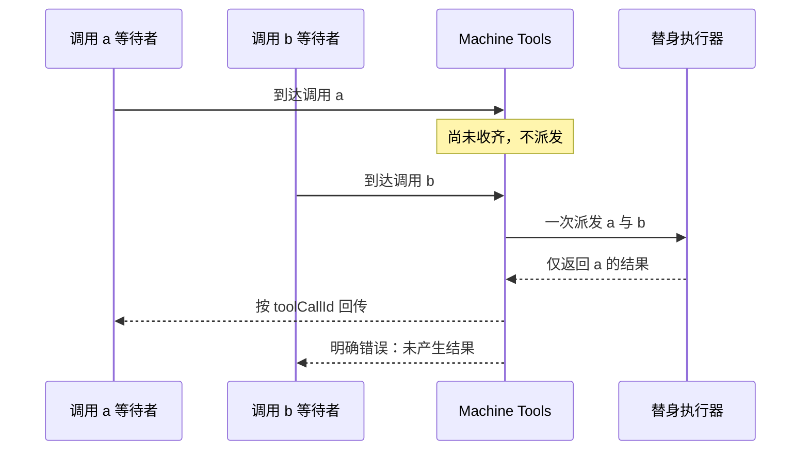

<a id="kimi-code-system-overview"></a>

模型发出两个工具调用，只收到其中一个结果，用户又插入了一条新要求。下一次请求应该包含什么？直接拼接历史可能违反模型接口的消息约束；补写“工具成功”又会伪造任务事实。

Kimi Code 把这个问题分散到几个明确边界：Session 保存运行记录，Context Memory 持有上下文历史，Projector 整理模型输入，Compaction 管理压缩，Tool Executor 承接实际调用。理解这些边界，比把它概括为“支持记忆和工具的 CLI”更有用。

本文研究 [`MoonshotAI/kimi-code@bb16383`](https://github.com/MoonshotAI/kimi-code/tree/bb16383aa15f72954224d37ee0b9babb807e03b3)，应用包版本 0.41.0，源码范围为 TypeScript 的 `packages/agent-core-v2`。旧 `kimi-cli` 的 Python 实现不用于解释本文调用链。下文区分源码分析和六组实际运行的模块实验；没有启动完整 CLI，也没有调用真实模型。

## 会话、循环、上下文与工具怎样连接

<!-- diagram:kimi-code-system-overview-1 -->



架构图限于本文固定的 agent-core-v2。Session / Wire、上下文历史、输入投影与工具执行分开；不混入旧 Python CLI，也不把模块实验等同完整产品运行。

<!-- /diagram -->

| 对象／模块 | 主要职责 | 不能由它单独保证的事情 |
| --- | --- | --- |
| Session、Wire 记录 | 会话元数据、各 Agent 的运行事件与恢复材料 | 外部写入是否成功 |
| Loop／Machine Engine | 接收输入、推动模型步骤、传递取消与结束状态 | 每一次回答都满足业务目标 |
| Context Memory | 持有历史，接收上下文变化与压缩结果 | 历史原样符合所有模型接口 |
| Context Projector | 消息配对、过滤、重排与输入修复 | 被修复的缺失结果确实存在 |
| Full Compaction | 触发、选段、生成摘要并应用结果 | 摘要无信息损失 |
| Machine Tools／Tool Executor | 将模型调用接入批次、校验、调度及结果回传 | 任意外部工具天然幂等 |

会话文档区分了 `state.json` 元数据和各 Agent 目录中的 `wire.jsonl`。后者提供运行事件，恢复时可以据此还原已记录状态；它不是向量记忆库，也不是外部数据库事务日志。[会话文档](https://github.com/MoonshotAI/kimi-code/blob/bb16383aa15f72954224d37ee0b9babb807e03b3/docs/en/guides/sessions.md)

循环引擎暴露提交、转向、通知、取消和重设历史等操作。一次工具步骤经过 Machine Tools 适配到执行器，再把按调用编号配对的结果交回模型过程。压缩服务通过步骤前后等钩子参与上下文管理。这种拆分让“用户又说了一句话”“工具还在运行”“历史需要变短”分别有归属，而不是都由一个追加字符串的函数处理。[引擎](https://github.com/MoonshotAI/kimi-code/blob/bb16383aa15f72954224d37ee0b9babb807e03b3/packages/agent-core-v2/src/agent/loop/machine/engine.ts)、[压缩服务](https://github.com/MoonshotAI/kimi-code/blob/bb16383aa15f72954224d37ee0b9babb807e03b3/packages/agent-core-v2/src/agent/fullCompaction/fullCompactionService.ts)

## Projector：把历史变成合法输入，保留未知

<!-- diagram:kimi-code-system-overview-2 -->



输入投影图对应正文的配对规则。缺失工具结果被明确表示为未知，占位不修改外部执行事实，也不能作为自动重试依据。

<!-- /diagram -->

`project` 将工具调用与结果组织为交换单元，按 `toolCallId` 寻找对应关系。它跳过 `partial` 消息，将被其他消息隔开的工具结果重新放到对应调用附近，丢弃无法配对的孤立结果，并为缺失结果生成明确的占位信息：当前上下文没有这个工具结果，不能假定工具已成功完成。

`projectStrict` 在基础投影后进一步去重、合并连续助手消息、移除开头不符合要求的非用户消息。修复可以通过 anomaly 回调记录，让系统知道发生了重排、补位或丢弃，而不是只得到一份看似正常的输入。[投影实现](https://github.com/MoonshotAI/kimi-code/blob/bb16383aa15f72954224d37ee0b9babb807e03b3/packages/agent-core-v2/src/agent/contextProjector/projection.ts)

考虑这段逻辑历史：

```text
用户：检查两个文件
助手：调用 read(a)，调用 read(b)
工具：返回 a 的内容
用户：接下来先关注 b
```

投影器要让模型看到调用与结果之间合法的结构，同时表达 b 的结果缺失。这里改变的是下一次请求的表示，不是宣布 b 已经执行失败，更不是自动重跑 b。

继承上下文还有一个专门入口：`closeTrailingOpenToolExchange` 为尾部未完成交换补齐“结果未知”的信息，并清除复制后的助手消息的 `partial` 标记。本地实验给它两个调用、一个真实结果，输出保留已知结果并补上另一个未知结果，输入历史没有被原地修改。[继承快照整理](https://github.com/MoonshotAI/kimi-code/blob/bb16383aa15f72954224d37ee0b9babb807e03b3/packages/agent-core-v2/src/agent/contextMemory/openToolExchange.ts)

这项设计保护的是**协议完整性和认识上的诚实**：模型接口得到成对消息，任务仍知道有结果不可确认。若工具是创建工单，下一步应查询工单系统或操作键；只靠补位文本不能消除重复写入风险。

## 压缩：触发阈值、合法切点和应用检查

<!-- diagram:kimi-code-system-overview-3 -->



压缩状态是正文源码行为的归纳。摘要生成成功还要验证原前缀及新增尾部是否允许应用；图省略超窗时的限次缩减重试，不能据此判断摘要质量。

<!-- /diagram -->

### 触发阈值不是固定窗口百分比

默认策略同时检查窗口使用比例和剩余空间。默认比例是 0.85，预留空间为 50,000；预留值为正且小于窗口时，两条条件先满足哪条就触发。

例如最大输入为 100,000，默认触发点是 50,000，而不是 85,000。本地实验确认 49,999 尚不触发，50,000 触发。这个数字是该提交默认策略在指定参数下的结果，模型配置可覆盖比例和预留值，不能写成所有模型通用的推荐值。[DefaultCompactionStrategy](https://github.com/MoonshotAI/kimi-code/blob/bb16383aa15f72954224d37ee0b9babb807e03b3/packages/agent-core-v2/src/agent/fullCompaction/strategy.ts)

字符估计与实际计量也应区分。默认消息估计器用 ASCII 和非 ASCII 字符的不同权重及媒体估计值近似 Token；它适合决策启发式，不等于 Provider 实际账单或精确窗口占用。[估计器](https://github.com/MoonshotAI/kimi-code/blob/bb16383aa15f72954224d37ee0b9babb807e03b3/packages/agent-core-v2/src/llm-adapter/contract/tokens.ts)

### “保留近期消息”受到工具交换边界约束

`computeCompactCount` 从近期向前寻找切点，同时考虑近期消息数、用户消息数和大小预算。`canSplitAfter` 拒绝在用户消息后、带工具调用的助手消息后、工具结果之前以及仍有未闭合交换的位置切开。

原因很具体：把调用放进旧摘要，却把结果孤零零留在近期历史里，可能使后续请求失去合法配对；反过来保留调用却删掉结果，会把已经完成的操作重新变成未知。

但边界检查不意味着“配置四条就一定保留四条”。实验使用七条消息：旧用户、旧回答、新用户、两个工具调用所在的助手消息、结果 a、结果 b、最终回答。每条固定估计为 10 Token，以单独检验切点：

| 近期消息参数 | 实际压缩前缀 | 原样保留尾部 | 工具交换位置 |
| --- | --- | --- | --- |
| 4 | 前 6 条 | 最后 1 条 | 调用和两项结果一起进入压缩前缀 |
| 5 | 前 2 条 | 后 5 条 | 调用和两项结果一起留在尾部 |

实际算法在寻找合法切点时保留已有候选；达到近期窗口条件便可能停止。因此这个参数不是“至少原样保存 N 条”的承诺。上述实验验证的是两种输入下的切点，未验证摘要是否完整保留工具结果，也未用这个固定估计器衡量真实 Token。

### 摘要生成后，还要检查能否应用

生成摘要期间历史可能变化。`historySafeToCompact` 要求当前历史仍包含同一段原始消息前缀，且新增尾部只能是真实用户输入；不满足时取消应用。这避免把针对旧历史生成的摘要直接盖到已经改变的上下文上。[应用前检查](https://github.com/MoonshotAI/kimi-code/blob/bb16383aa15f72954224d37ee0b9babb807e03b3/packages/agent-core-v2/src/agent/fullCompaction/fullCompactionService.ts#L900)

压缩服务还记录压缩数量、Token 信息、缩减材料数量和相关 Wire 行范围；摘要请求溢出时存在缩减历史与限次重试路径。材料缩减可能丢失细节，记录 `droppedCount` 是揭示这种损失，不是证明摘要完整。对自己的 Harness，应分别记录“原历史覆盖范围”和“真正送入摘要模型的材料范围”。

[OpenCode](/writing/opencode-system-overview/)更能帮助理解旧工具输出清理与完整摘要的分工；Kimi Code 这里揭示的是输入配对、合法切点与摘要应用条件。两者可以共同支持[上下文组装](/writing/harness-operations-context/)，但不能据这些局部机制直接判定哪一个压缩效果更好。

## 从模型调用到工具结果，中间还有三道边界

<!-- diagram:kimi-code-system-overview-4 -->



时序对应批次模块实验：收齐 a、b 后才调用替身执行器，执行器只返回 a 时，适配器为 b 产生明确错误。它不证明真实工具调度与权限路径已验证。

<!-- /diagram -->

### 参数解析与执行校验

`parseToolCallArguments` 对空字符串产生空对象，对非法 JSON 也可能返回空对象，但后者额外携带 `parseFailed` 和错误信息。消费者如果只看解析值而忽略标记，就会把损坏参数误当成合法空参数。执行器的 preflight 还会检查工具是否存在、调用是否允许及参数是否通过 Schema。[参数解析](https://github.com/MoonshotAI/kimi-code/blob/bb16383aa15f72954224d37ee0b9babb807e03b3/packages/agent-core-v2/src/tool/tool-args-parse.ts)、[执行器](https://github.com/MoonshotAI/kimi-code/blob/bb16383aa15f72954224d37ee0b9babb807e03b3/packages/agent-core-v2/src/agent/toolExecutor/toolExecutorService.ts)

本地实验只确认非法 JSON 的失败标记与空输入有区别；完整 Schema、权限及具体工具执行未在这个实验中启动。

### 批次适配与并发调度

Machine Tools 根据本轮已知调用建立预期编号集合，收齐待执行调用后交给 `toolExecutor.execute`。结果按 `toolCallId` 送回对应等待者。执行器结束却缺少某项结果时，适配器为剩余项产生明确错误，避免调用永远悬空。[批次适配器](https://github.com/MoonshotAI/kimi-code/blob/bb16383aa15f72954224d37ee0b9babb807e03b3/packages/agent-core-v2/src/agent/loop/machine/tools.ts)

批次不代表无条件并行。`ToolScheduler` 用访问声明判断任务与活跃任务、前方排队任务是否冲突。与前面等待者冲突的后续调用不能随意越过它；无冲突任务可以启动。这个保证依赖访问声明准确，不能把一个未声明写入的外部工具自动变成安全并行工具。[工具调度器](https://github.com/MoonshotAI/kimi-code/blob/bb16383aa15f72954224d37ee0b9babb807e03b3/packages/agent-core-v2/src/agent/toolExecutor/toolScheduler.ts)

批次实验使用确定性替身执行器：a 到达时不派发，b 到达后派发一次；替身只返回 a，最终 b 收到“未产生结果”的错误。它验证适配层配对及收尾，不是完整调度器或真实工具的并发测试。

### 取消与输出收尾

另一个实验在批次未收齐时取消：等待者收到错误，执行器调用次数为零。对于已经启动的工具，执行器还传递取消信号并设置宽限处理，但请求取消不等于外部事务撤销；本实验没有证明运行中工具一定停止。

输出也有不同预算：工具契约中的默认模型输出上限为 50,000 字符，而 `ToolOutputAccumulator` 的默认保留上限是 10,000,000 字符。两者分别控制后续模型呈现与累积材料，不能混为一个限制。本地向累积器写入 10,000,005 个字符，实际保留 10,000,000，并在结果中记录总字符数，以表达发生了省略。[输出累积器](https://github.com/MoonshotAI/kimi-code/blob/bb16383aa15f72954224d37ee0b9babb807e03b3/packages/agent-core-v2/src/tool/output-accumulator.ts)、[工具契约](https://github.com/MoonshotAI/kimi-code/blob/bb16383aa15f72954224d37ee0b9babb807e03b3/packages/agent-core-v2/src/tool/toolContract.ts)

仅有这项记录不等于已将全部原文保存成文件。若交付依赖被省略内容，还要检查截断与持久化服务，以及结果中是否提供可回查位置。

## Skills 与任务委派增加什么能力

Skill 是可复用方法资产。该版本文档允许用户显式调用，也允许模型按描述调用符合条件的 Skill；是否允许模型调用、Skill 类型和嵌套深度都有约束。它改变进入任务的方法与上下文，不能替代执行权限。[Skill 文档](https://github.com/MoonshotAI/kimi-code/blob/bb16383aa15f72954224d37ee0b9babb807e03b3/docs/en/customization/skills.md)

Agent／AgentSwarm 改变由哪个工作单元承担任务。Swarm 接收模板和条目来创建多个子任务，并汇总结果；复用方法和委派工作是两种不同的决策。[工具文档](https://github.com/MoonshotAI/kimi-code/blob/bb16383aa15f72954224d37ee0b9babb807e03b3/docs/en/reference/tools.md)

继承上下文也不等于共享正在运行的父任务。`spawn.ts` 为 fork 检查模型与 Agent 类型兼容性，并提示继承的是参考快照；前文补齐未知工具结果，正是为了让这个快照可被独立消费。子任务得到上下文，不代表取得了父任务的执行权或未完成操作的所有权。[子任务创建](https://github.com/MoonshotAI/kimi-code/blob/bb16383aa15f72954224d37ee0b9babb807e03b3/packages/agent-core-v2/src/session/subagent/spawn.ts)

如果两个子任务都编辑同一文件，消息隔离并不能解决写冲突。任务拆分还应明确写入范围、结果契约和最终合并者；是否比单 Agent 更快、更正确，需要连同协调成本做同题实验。

## 对 Harness 设计的启示与证据边界

Kimi Code 提供了一个具体的设计方向：持久历史与模型输入分离；消息修复显式保留未知；压缩同时考虑预算、交换边界和应用条件；工具执行有从参数到结果的完整收尾路径。它适合用来研究交互频繁、工具密集、会话较长的 Coding Agent。

代价也来自这些分层：排查一次失败，需要同时查看原历史、投影后的请求、压缩记录和工具事件。只读终端对话无法确定信息究竟在哪一步丢失。模块越多，跨模块的编号、版本与事件关联越重要。

[源码模块实验包](/labs/context-tool-study.zip)保存六组 Kimi Code 实验及三组 OpenCode 实验，固定提交和源码哈希，直接打包原始模块执行。替身仅用于工具执行器，未产生外部副作用。本文没有完成进程崩溃恢复、真实模型摘要质量、完整权限路径及多 Agent 写冲突测试；这些仍是采用前需要验证的边界。
