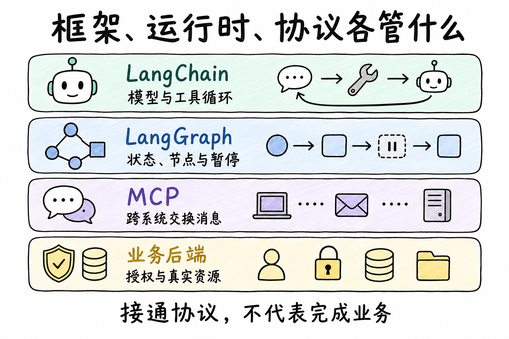
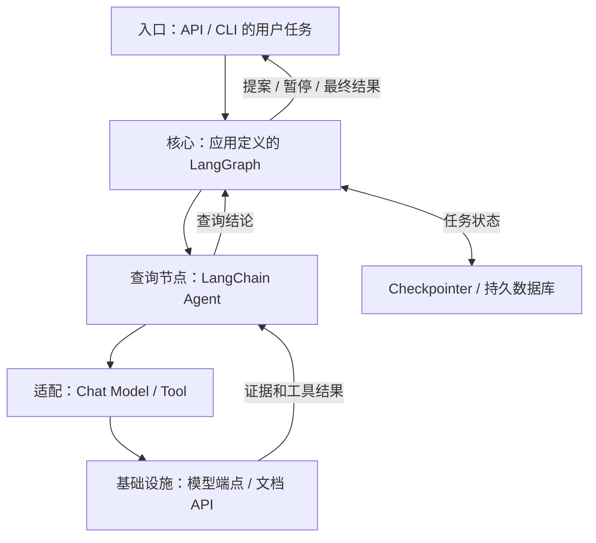
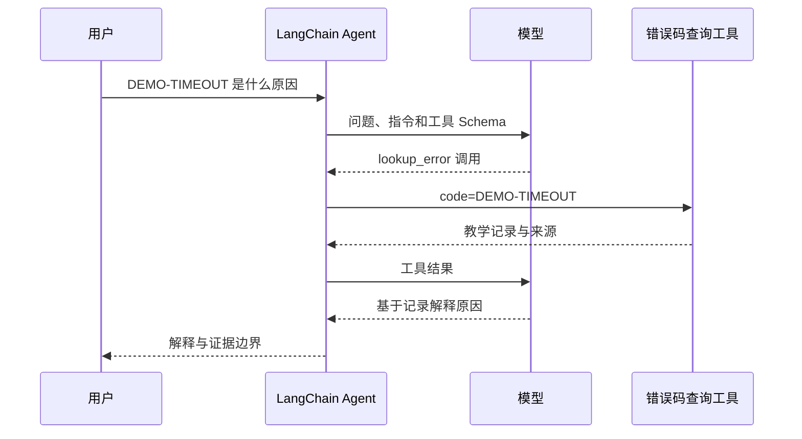
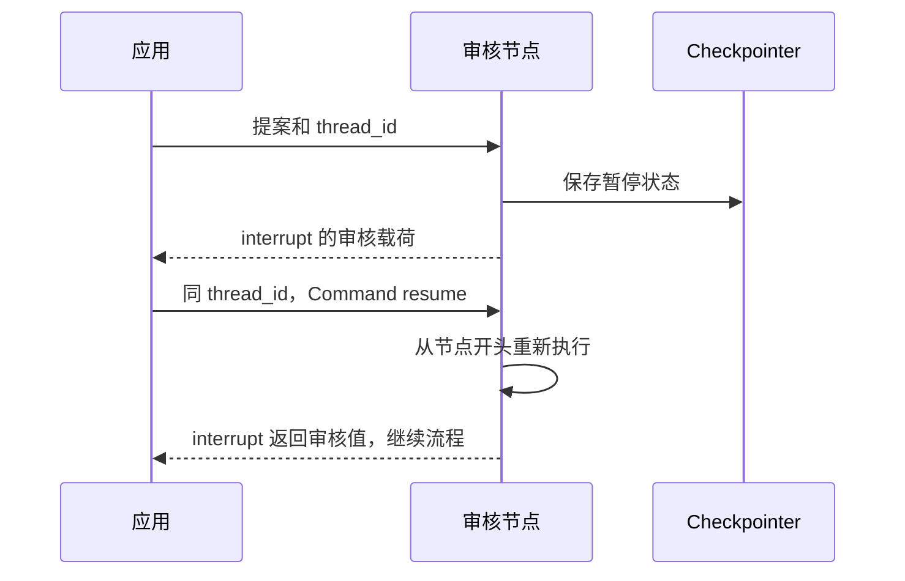

## 定位与价值

**LangChain 是装配模型、工具和常见 Agent 循环的框架；LangGraph 是管理有状态流程、分支和恢复的运行时。** 前者减少手工组织模型与工具往返的代码，后者让“下一步做什么、暂停在哪里”成为可检查的程序结构。MCP 则约定应用怎样连接工具服务，属于通信协议。[官方定位](https://docs.langchain.com/oss/python/langchain/overview)

以登录故障助手为例：查询错误码并解释原因，可以从 LangChain Agent 开始；若任务增加“起草修复建议 → 等待审核 → 执行修改”，再考虑显式定义外层 LangGraph。一次分类或提取通常不需要这些层；已有成熟业务工作流时，也不必为了使用模型而重写编排。

LangChain Agent 本身已建立在 LangGraph 之上；是否额外定义业务图，取决于哪些步骤必须由应用明确控制。本文核对日期为 2026-09-06，源码分别固定到下文阅读路径列出的提交。



## 技术架构



*图 1｜一种组合方案：外层图控制业务步骤，内层 Agent 处理局部查询。MCP 可替换某个工具接入方式，不拥有任务状态。*

| 层 | 职责 | 采用代价 |
| --- | --- | --- |
| 入口 | 校验身份、任务和审核输入 | 应用仍需管理用户权限 |
| 核心 | Agent 工具循环或显式图状态 | 增加状态、节点与恢复语义的设计 |
| 适配 | 模型、工具和可选 MCP 客户端 | 供应商消息与错误语义仍有差异 |
| 基础设施 | 模型服务、业务后端、检查点存储 | 迁移、容量、幂等和运维由部署方负责 |

选 LangChain 的优势是常见 Agent 装配短；代价是仍需理解其内部运行语义。显式 LangGraph 便于检查阶段和恢复位置，但不是节点越多越可靠。业务后端的写入约束不会因采用图编排而消失。

## 核心机制

### 机制一：模型提出调用，工具提供事实

`create_agent` 接收模型、工具与系统指令。模型决定查哪个工具，运行时调用工具并把结果放回消息，然后继续推理或结束。工具描述影响模型选择，工具函数和后端才决定实际访问的数据。



*图 2｜Schema 提供可调用接口；类型校验通过，不代表资料真实、当前或属于当前用户。*

这样设计是为了让开放式判断接触可检查的数据。需要改变调用前后行为时再使用 middleware；强制权限仍放在可信工具服务中。[Agent 接口](https://docs.langchain.com/oss/python/langchain/agents)

### 机制二：暂停保存状态，恢复重新进入节点

LangGraph 的 `State` 保存数据，Node 返回更新，Edge 决定下一步。多个节点更新同一字段时，Reducer 定义覆盖、追加等合并规则；它不会自动识别两段相同证据是不是独立来源。



*图 3｜恢复会再次执行 interrupt 之前的代码；将外部写入放在那里，可能造成重复副作用。*

把审核与提交拆开，可使授权位置明确。但即便提交在下一节点，网络中断后仍可能出现“后端已写入、检查点未记录”的窗口。应用需要稳定操作键、后端幂等与回读；checkpointer 保存进度，不是跨系统事务。[暂停机制](https://docs.langchain.com/oss/python/langgraph/interrupts)

## 快速上手

先看 LangChain 的最小工具调用。需要 Python ≥3.10，安装 `langchain`、`langchain-openai`，设置 `OPENAI_API_KEY` 与账号可用的 `CHAT_MODEL`。这里查询的是教学字典，未执行真实模型请求；升级依赖时应锁定并联测模型集成包。

```python
import os
from langchain.agents import create_agent
from langchain.tools import tool
from langchain_openai import ChatOpenAI

@tool
def lookup_error(code: str) -> str:
    """按完整错误码查询教学记录。"""
    return {"DEMO-TIMEOUT": "教学记录：登录请求超过当前一秒阈值"}.get(code, "未找到记录")

agent = create_agent(
    model=ChatOpenAI(model=os.environ["CHAT_MODEL"]),
    tools=[lookup_error],
    system_prompt="先查记录；区分已知事实与推测。",
)
result = agent.invoke({"messages": [{"role": "user", "content": "DEMO-TIMEOUT 是什么？"}]})
print(result["messages"][-1].content)
```

LangGraph 的暂停实验不需要模型。安装 `langgraph==1.2.11`，将下列代码保存为 `review.py` 后运行 `python review.py`：

```python
from typing import TypedDict
from langgraph.graph import StateGraph, START, END
from langgraph.checkpoint.memory import InMemorySaver
from langgraph.types import interrupt, Command
class State(TypedDict):
    draft: str
    approved: bool
def review(state: State):
    decision = interrupt(state["draft"])
    if type(decision) is not bool:
        raise ValueError("审核结果必须是布尔值")
    return {"approved": decision}
builder = StateGraph(State).add_node("review", review)
builder.add_edge(START, "review").add_edge("review", END)
graph = builder.compile(checkpointer=InMemorySaver())
config = {"configurable": {"thread_id": "demo"}}
print(graph.invoke({"draft": "将登录请求超时阈值从一秒提高到两秒", "approved": False}, config))
print(graph.invoke(Command(resume=True), config))
```

短实验及完整实验已在 Python 3.12、LangGraph 1.2.11 下实际运行，通过暂停、同线程恢复和通过／拒绝分支检查。第一次输出含 `__interrupt__`，第二次 `approved` 变成 `True`。示例只审核提案，不修改登录配置；`Command(resume=True)` 是教学驱动器模拟的外部审核输入。[完整通过／拒绝实验](/labs/project-review/langgraph-review-full.py)进一步演示分支和模拟执行修复。

| 框架 | 三个常用配置 | 作用 |
| --- | --- | --- |
| LangChain | `model` | 选择模型与供应商适配 |
| LangChain | `tools` | 向模型暴露本次所需能力 |
| LangChain | `system_prompt` | 定义任务规则与输出边界 |
| LangGraph | `checkpointer` | 选择状态保存实现 |
| LangGraph | `configurable.thread_id` | 定位同一任务的检查点 |
| LangGraph | `recursion_limit` | 限制图执行步数，避免无界循环 |

常见坑：`InMemorySaver` 随进程退出丢失状态，不能用于证明跨进程恢复；恢复还必须沿用原 `thread_id`。其余选项见 [Graph API](https://docs.langchain.com/oss/python/langgraph/graph-api) 与 [Persistence](https://docs.langchain.com/oss/python/langgraph/persistence)。

## 生态与社区

langchain-ai/langchain：2026-08-08 至 09-06 UTC 的默认分支样本达到 30 条上限，因此只能说至少 30 条。08-08 至 08-30 创建的最近 3 条非 PR Issue 中，未观察到排除机器人和提问者后的维护者文字回复；样本为 [#40043](https://github.com/langchain-ai/langchain/issues/40043)、[#40041](https://github.com/langchain-ai/langchain/issues/40041)、[#40037](https://github.com/langchain-ai/langchain/issues/40037)。

langchain-ai/langgraph：2026-08-08 至 09-06 UTC 的默认分支样本达到 30 条上限，因此只能说至少 30 条。08-08 至 08-30 创建的最近 3 条非 PR Issue 中，未观察到排除机器人和提问者后的维护者文字回复；样本为 [#8764](https://github.com/langchain-ai/langgraph/issues/8764)、[#8761](https://github.com/langchain-ai/langgraph/issues/8761)、[#8759](https://github.com/langchain-ai/langgraph/issues/8759)。

这些是截至 2026-09-06 的小样本，不是 SLA；提交频繁也不等于你需要的集成成熟。两仓采用 MIT，允许商业使用但需保留版权和许可声明；供应商服务费用与条款另算。LangChain 维护核心接口和部分独立集成包；社区连接器与第三方托管服务需分别核对维护归属。

## 源码阅读路径

入口应从 Python 包的导出和构建声明查起，不应硬找不存在的 JavaScript `main`。以下链接固定提交，不会随默认分支改名而改变本文所指实现。

| 顺序 | 目录 → 文件 | 函数或对象 |
| --- | --- | --- |
| 1 | [libs/langchain_v1/pyproject.toml](https://github.com/langchain-ai/langchain/blob/b34f5669de2a19fd260c1c0a78f80977289400f9/libs/langchain_v1/pyproject.toml) | Python 包元数据 |
| 2 | [libs/langchain_v1/langchain/agents/factory.py](https://github.com/langchain-ai/langchain/blob/b34f5669de2a19fd260c1c0a78f80977289400f9/libs/langchain_v1/langchain/agents/factory.py) | create_agent：构造模型与工具循环 |
| 3 | [libs/langgraph/langgraph/graph/state.py](https://github.com/langchain-ai/langgraph/blob/81bf17b23123e4ef8b9d5f49fa09a0122fc2edd1/libs/langgraph/langgraph/graph/state.py) | StateGraph.compile：图定义到可执行图 |
| 4 | [libs/langgraph/langgraph/types.py](https://github.com/langchain-ai/langgraph/blob/81bf17b23123e4ef8b9d5f49fa09a0122fc2edd1/libs/langgraph/langgraph/types.py) | interrupt：暂停 API |
| 5 | [libs/checkpoint/langgraph/checkpoint/memory/__init__.py](https://github.com/langchain-ai/langgraph/blob/81bf17b23123e4ef8b9d5f49fa09a0122fc2edd1/libs/checkpoint/langgraph/checkpoint/memory/__init__.py) | InMemorySaver：具体检查点实现 |
| 6 | [libs/langgraph/tests/test_pregel.py](https://github.com/langchain-ai/langgraph/blob/81bf17b23123e4ef8b9d5f49fa09a0122fc2edd1/libs/langgraph/tests/test_pregel.py) | 调度、状态和恢复测试 |

涉及真实写入的恢复实验见[副作用恢复与对账](/writing/harness-engineering-recovery/)；需要比较其他实现方式时，再读[三种架构的同题实验](/writing/harness-architecture-selection/)。
