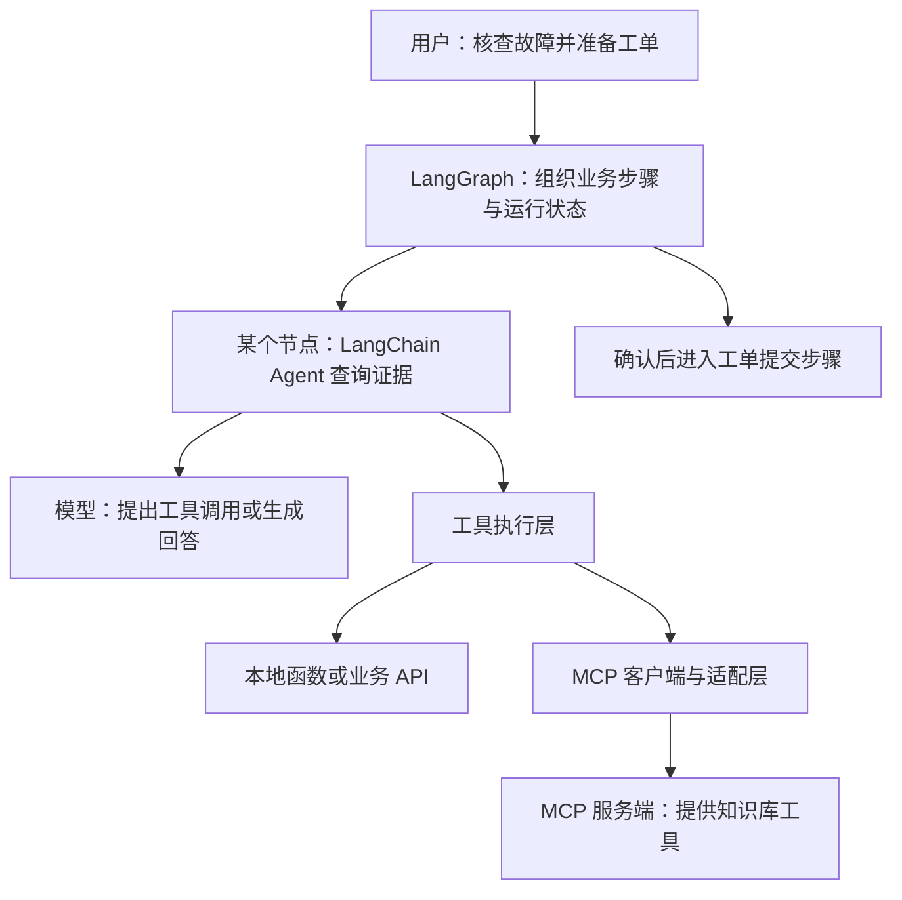
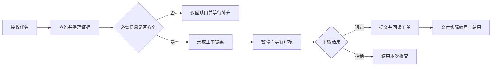

一个知识库助手，最初只需要回答“这个接口为什么报错”。接入搜索工具以后，它可以先查文档再解释。再往前走一步，用户希望它核对故障证据、整理工单、等待确认，最后提交并返回编号。

模型还是那个模型，工程问题却变了：怎样把工具交给模型？哪些步骤必须按顺序执行？等待确认期间把任务放在哪里？服务重启以后，从哪里继续？

LangChain 和 LangGraph 经常在这个时候一起出现，也容易被统称为“Agent 协议”。先把定位说清楚：**LangChain 提供现成、可定制的 Agent 抽象；LangGraph 提供有状态工作流的编排框架与运行时；MCP 约定应用怎样连接工具与上下文。** LangChain 的 Agent 构建在 LangGraph 之上，而使用 LangGraph 并不要求采用 LangChain 的高层 Agent API。选型时真正要判断的是：现成的 Agent 循环是否足够，还是需要直接控制业务流程的每一步。[LangChain 概览](https://docs.langchain.com/oss/python/langchain/overview)、[LangGraph 概览](https://docs.langchain.com/oss/python/langgraph/overview)

本文依据 2026-09-06 核对的官方 Python 文档，围绕这一条任务展开。代码以明确列出的 API 为学习基线，不把在线文档的所有新增接口混进同一个示例。

## 一、先分清协议、框架和运行时

协议约定系统之间怎样交换信息。框架提供开发者使用的接口与组织方式。运行时负责把定义好的计算执行起来，管理状态与调度。

这几个概念可以同时出现在一个系统里：

| 对象 | 在知识库助手里的职责 | 开发者主要定义什么 |
| --- | --- | --- |
| LangChain | 连接模型和工具，建立常见 Agent 循环 | 模型、工具、指令、结构化输出及行为扩展 |
| LangGraph | 编排检索、审核、等待与提交步骤 | 状态、节点、转移条件和恢复位置 |
| MCP | 让助手访问另一个进程或服务提供的能力 | 客户端与服务端遵守的交互约定 |
| 业务后端 | 真正保存工单、检查权限、分配编号 | 业务规则、数据约束和写入接口 |

这里的 MCP 指 Model Context Protocol。其规范定义 host、client、server 等角色；它并不要求参与系统使用 LangChain 或 LangGraph。[MCP 架构规范，2025-11-25](https://modelcontextprotocol.io/specification/2025-11-25/architecture)

假设知识库已经提供 MCP 服务，Agent 应用可以通过适配层把服务端工具交给 LangChain，再在 LangGraph 编排的某个步骤里调用。也可以直接调用本地函数或 HTTP API。是否使用协议，与是否采用图编排，是两项独立选择。



*图 1｜一种组合方式。外层图负责业务步骤，内层 Agent 负责局部查询；这里的外层图由应用显式定义，不是在展开 LangChain Agent 自身的内部图。*

### LangChain 与 LangGraph 的直接对比

把两者放到同一张表里，最容易看清的是开发者需要掌握多少执行细节：

| 维度 | LangChain | LangGraph |
| --- | --- | --- |
| 抽象层级 | 组合模型、工具、提示词与 middleware，定制现成 Agent 循环 | 直接组织有状态工作流，控制步骤与状态迁移 |
| 常用入口 | `create_agent` | `StateGraph`；也提供 Functional API |
| 循环与分支 | Agent 可反复调用工具，并通过 middleware 调整行为 | 显式定义循环、条件分支、并行与汇合 |
| 持久化与人工介入 | 利用底层 LangGraph 的能力，按需配置 | 直接控制检查点、中断与恢复流程 |
| 合理起点 | 常见工具调用 Agent，希望快速落地并逐步定制 | 多阶段业务流程，需要明确规定步骤如何衔接 |

这张表比较的是使用方式。LangChain Agent 同样可以用于生产系统，也能使用持久化与人工介入；只因需求里出现“记忆”或“审批”，还不足以判断必须手写图。LangGraph 也可以直接接入已有模型 SDK 和工具函数，无须先采用 LangChain 的 Agent 抽象。[LangChain 概览](https://docs.langchain.com/oss/python/langchain/overview)、[LangGraph 概览](https://docs.langchain.com/oss/python/langgraph/overview)

## 二、LangChain：把模型和工具组织成可用的 Agent

知识库助手的第一版，可以只有一个工具：根据错误码查文档。模型收到问题，决定是否调用工具；应用执行工具，把结果交回模型；模型根据结果继续查询或回答。

LangChain 的 `create_agent` 提供这类常见循环的入口。开发者可以传入模型、工具和系统指令，也可以用结构化输出约束最终返回值。需要改变调用前后的行为时，再通过 middleware 扩展。[Agents 官方文档](https://docs.langchain.com/oss/python/langchain/agents)

下面是一个最小装配示例。它需要安装 `langchain` 和 `langchain-openai`，配置 `OPENAI_API_KEY`，并把 `CHAT_MODEL` 设为账号可用且支持工具调用的模型名称。检索函数使用本地教学数据，不会访问真实知识库。

```python
import os

from langchain.agents import create_agent
from langchain.tools import tool
from langchain_openai import ChatOpenAI


@tool
def lookup_error(code: str) -> str:
    """按完整错误码查询教学知识库；没有记录时明确返回未找到。"""
    records = {
        "DEMO-429": "教学记录：请求频率超过限制。建议降低并发并检查重试策略。"
    }
    return records.get(code, "未找到对应记录，请补充日志或查阅原始文档。")


agent = create_agent(
    model=ChatOpenAI(model=os.environ["CHAT_MODEL"]),
    tools=[lookup_error],
    system_prompt="先查询知识库再解释错误。区分已知事实与推测，不编造工单编号。",
)

result = agent.invoke({
    "messages": [{"role": "user", "content": "DEMO-429 是什么原因？"}]
})
print(result["messages"][-1].content)
```

这段代码展示的是接口装配，模型调用结果取决于所选模型与运行配置；本文没有对这一段执行真实模型请求。

值得注意的是，**工具描述帮助模型理解用途，工具实现决定实际发生什么。** “不编造工单编号”可以写进提示词，但真正的编号仍然必须来自业务系统。把类型标成 `str`，也不会自动检查调用者是否有权限读取某个项目。

随着需求增加，可以让助手输出 `summary`、`evidence`、`missing_fields` 等字段。字段结构通过校验，只说明数据符合预期形状；“证据确实支持结论”还需要另行验收。这是应用的责任，无法通过换一个 Agent 构造函数消除。

### 不要让旧教程决定今天的架构

LangChain 的名称容易让人联想到线性的“提示词 → 模型 → 解析器”。这样的组合仍然有用途，但不能据此推断它只能执行直线流程，也不能把旧示例里的 Agent 入口直接当成当前推荐写法。

官方 v1 迁移指南把 `create_agent` 作为新的 Agent 入口。当前 `langchain` 主库聚焦 Agent、消息、工具和标准模型接口；`LLMChain`、`ConversationChain` 等旧版 Chains，以及原 `langchain.retrievers` 下的功能，已迁移到 `langchain-classic`。因此，“主库包含 Chains、Agents、Memory”不再适合作为当前包结构的概括，也不能把 LangChain 的定位缩成只提供零件的组件库。阅读教程时，先核对包版本、导入路径和对应文档，再判断示例是否适用于项目。[LangChain v1 迁移指南](https://docs.langchain.com/oss/python/migrate/langchain-v1)

## 三、LangGraph：让运行过程成为显式的数据与结构

用户现在提出新要求：“证据足够就起草工单，缺字段就停下来；我确认后才能提交。”

这个需求有两种不同的判断。怎样从文档中解释故障，可以交给模型；缺少必填字段时能否提交，应由业务规则决定。把后者写成一个明确分支，往往比反复提醒模型更容易检查。

LangGraph 的 Graph API 用 State、Node 和 Edge 表达运行过程：状态承载当前信息，节点执行工作并返回更新，边决定下一步。节点可以调用模型，也可以只是普通函数。[Graph API 官方文档](https://docs.langchain.com/oss/python/langgraph/graph-api)

| 元素 | 本例中的设计 | 需要提前想清楚的问题 |
| --- | --- | --- |
| State | 问题、证据、缺失字段、提案、审核结果 | 哪些是已核验事实，哪些只是候选内容？ |
| Node | 检索、检查、起草、审核、提交 | 本步完成后有什么可检查的产物？ |
| Edge | 证据够则起草；确认通过则提交 | 判断条件由业务代码还是模型提供？ |
| Reducer | 合并多个来源返回的证据 | 追加、覆盖、去重分别适用于哪些字段？ |

Reducer 是字段更新的合并规则。例如多个检索分支都写入证据列表，应用需要定义怎样汇合；不应假定共享一个字段就会自动得到正确的并发结果。

对本例而言，可以给证据分配来源 ID，再按 ID 保留记录。重复检索同一段文档，不应该被汇总成“两份独立证据”。这个语义需要由数据设计表达，画出分支和汇合箭头还不够。



*图 2｜知识库助手的业务流程示意。等待补充与等待审核是两个不同出口；实际应用需要分别定义后续输入怎样重新进入流程。*

选择图编排的价值，在于这些分支与交接能被独立观察、检查和恢复。它不要求一个节点对应一个 Agent，也不要求所有节点都调用模型。关于反馈循环与执行图的进一步关系，可以接续[Loop Engineering 与 Graph Engineering](/writing/loop-graph-engineering/)。

### 图在运行时怎样前进？

`StateGraph` 编译后交给 Pregel 运行时执行。它采用受 Google Pregel 启发的批量同步并行模型，每个 super-step 分为三个阶段：

1. **Plan**：根据输入或上一轮更新的通道，选择本轮需要执行的节点。
2. **Execution**：并行执行选中的节点；本轮写入的通道更新在执行阶段对其他节点不可见。
3. **Update**：汇总写入并更新通道，供下一轮读取。

在知识库助手中，如果两个检索节点被安排在同一轮执行，其中一个不会因为先完成，就让另一个在该轮读到它的新结果。需要依赖这些结果的汇总步骤应安排在后续轮次，并明确字段的合并规则。官方的阶段名称是 **Plan → Execution → Update**。[LangGraph 运行时文档](https://docs.langchain.com/oss/python/langgraph/pregel)

这一机制可以表达循环图，但选择 LangGraph 的理由还包括对状态、暂停和恢复的统一管理。LangChain 的 Agent 循环已经使用这套运行时，不能用“链只能向前、图才能循环”概括今天的两者关系。

## 四、可运行实验：暂停后，究竟从哪里继续？

下面把复杂业务缩小为“起草 → 审核 → 模拟提交”。实验不调用模型、不连接外部系统，方便直接观察 LangGraph 的控制流。本文已在 Python 3.12.13、LangGraph 1.2.11 下实际运行，验证了通过与拒绝两条路径，以及暂停时尚未提交的状态。

先安装依赖，然后把 Python 代码保存为 `review_demo.py` 运行：

```bash
python -m pip install "langgraph==1.2.11"
python review_demo.py
```

```python
from typing import TypedDict

from langgraph.checkpoint.memory import InMemorySaver
from langgraph.graph import END, START, StateGraph
from langgraph.types import Command, interrupt


class State(TypedDict):
    question: str
    draft: str
    approved: bool
    outcome: str


def prepare(state: State):
    return {"draft": f"待核查：{state['question']}"}


def review(state: State):
    print("进入审核节点")  # 用日志观察：恢复时会再次执行这里
    decision = interrupt({"draft": state["draft"]})
    if type(decision) is not bool:
        raise ValueError("审核结果必须是布尔值")
    return {"approved": decision}


def route(state: State):
    return "submit" if state["approved"] else "reject"


def submit(state: State):
    # 只返回演示文本，没有创建真实工单。
    return {"outcome": "模拟提交完成：" + state["draft"]}


def reject(state: State):
    return {"outcome": "审核拒绝，未提交"}


builder = StateGraph(State)
builder.add_node("prepare", prepare)
builder.add_node("review", review)
builder.add_node("submit", submit)
builder.add_node("reject", reject)
builder.add_edge(START, "prepare")
builder.add_edge("prepare", "review")
builder.add_conditional_edges(
    "review", route, {"submit": "submit", "reject": "reject"}
)
builder.add_edge("submit", END)
builder.add_edge("reject", END)
graph = builder.compile(checkpointer=InMemorySaver())

for thread_id, decision in [("approved-demo", True), ("rejected-demo", False)]:
    config = {"configurable": {"thread_id": thread_id}}
    paused = graph.invoke({
        "question": "DEMO-429 是否由并发过高引起？",
        "draft": "", "approved": False, "outcome": "",
    }, config=config)
    assert paused["__interrupt__"] and paused["outcome"] == ""
    print("待审核：", paused["__interrupt__"][0].value)
    # 教学驱动器模拟外部审核结果；真实系统应接收已验证的审核输入。
    final = graph.invoke(Command(resume=decision), config=config)
    assert final["approved"] is decision
    assert final["outcome"].startswith("模拟提交完成" if decision else "审核拒绝")
    print(final["outcome"])
```

通过与拒绝两条路径各自使用独立的 `thread_id`。第一次调用在审核处暂停，`outcome` 仍为空；第二次调用带回布尔结果，选择对应分支。

运行时，每条路径都会打印两次“进入审核节点”。这是关键观察：**恢复会重新进入发生中断的节点，`interrupt()` 之前的代码会再次执行。** 恢复时传入的值成为该次 `interrupt()` 的返回值；调用需要沿用原来的线程 ID。[Interrupts 官方文档](https://docs.langchain.com/oss/python/langgraph/interrupts)

因此，如果把发送通知、创建工单等外部写入放在这行日志的位置，就必须处理重复执行的后果。这个实验把审核与提交分开，是为了让控制边界可见；真正的提交节点仍然需要自己的故障处理。

## 五、持久化保存运行进度，业务系统保存最终事实

在 LangGraph 中，checkpointer 保存线程范围的图状态，store 保存图状态之外、可以跨线程使用的数据。前者适合当前任务的进度与恢复，后者适合用户偏好等跨任务信息。实验里的 `InMemorySaver` 只保存在内存中，进程退出后数据就会丢失。[Persistence 官方文档](https://docs.langchain.com/oss/python/langgraph/persistence)

检查点还支持从已保存的历史位置重新执行，或修改状态后分叉到另一条执行路径。例如，可以保留已检索的证据，修改工单提案后再走一次审核。可选择的位置取决于实际保存的检查点及子图配置；重新执行时，检查点之后的模型调用、API 请求和中断会再次发生，结果也可能变化。调试时要把“查看历史状态”和“从历史状态重新运行”区分开。[Time travel 官方文档](https://docs.langchain.com/oss/python/langgraph/use-time-travel)

把示例接到真实工单系统时，还有一个单靠 checkpoint 解决不了的窗口：

1. 提交接口成功创建了工单。
2. 网络连接断开，应用没有收到成功响应。
3. 运行状态中还没有保存工单编号。
4. 恢复后的应用必须决定查询还是重做。

此时，“没有记录成功”不能推出“没有创建成功”。一种业务实现是，在提交前生成并保存稳定的操作键，后端以该键约束重复写入；遇到结果未知，先按原键查询已有工单，再决定后续处理。

这里的操作键、权限检查与回读验收是应用设计建议，不是声明 LangGraph 自带业务事务保证。即使任务状态完整恢复，外部系统是否发生过写入，仍然要以该系统的事实为准。更完整的处理见[副作用恢复与对账](/writing/harness-engineering-recovery/)。

审核记录也应与提案内容关联。如果用户批准的是“只提交故障摘要”，后来模型又添加了敏感日志，不能继续复用原来的批准结果。最简单的办法是让审核绑定提案版本或内容摘要，提案变化时重新判断授权是否有效。

## 六、MCP 如何接进来？

当知识库从本地函数变成独立服务，需要解决的是能力接入。MCP 适配层可以发现服务端工具，并将其转为 LangChain Agent 可使用的工具对象；LangGraph 则继续管理“何时查询、结果交给谁、下一步是什么”。官方文档提供了对应的 MCP 接入方式，具体导入路径应与项目锁定版本一致。[LangChain MCP 文档](https://docs.langchain.com/oss/python/langchain/mcp)

这里存在三种不同的约定：

| 约定 | 例子 | 出错时检查哪里 |
| --- | --- | --- |
| 通信协议 | 客户端发现并调用知识库工具 | 协议版本、连接、能力协商及返回消息 |
| 框架接口 | 工具接收 `code`，返回可交给模型的内容 | 参数定义、适配器和工具实现 |
| 业务契约 | 无权访问的项目不得读取，工单不可重复创建 | 身份、权限、后端约束和操作记录 |

三者都会影响系统能否完成任务，但修复方式不同。服务端工具调用成功，只能说明那次调用按接口返回；还需要检查结果是否属于当前项目、是否足够回答问题。相关握手与目录更新问题，可以阅读[MCP 生命周期](/writing/harness-foundations-mcp-lifecycle/)。

## 七、怎样选：让任务复杂度决定抽象层级

以下是基于本文场景的工程判断，并非性能基准或通用排名：

| 当前需求 | 合理起点 | 何时考虑进一步编排 |
| --- | --- | --- |
| 一次提取、分类或总结 | 模型 SDK 加输入输出校验 | 开始出现多步依赖和恢复要求 |
| 模型需要自行选择少量工具 | LangChain `create_agent` | 通用工具循环难以清楚表达业务阶段 |
| 常见 Agent 需要记忆或工具审批 | 先配置 LangChain Agent 的检查点与相应 middleware | 需要独立控制多个业务阶段时再显式编排 |
| 多阶段流程包含固定顺序、分支与恢复位置 | 显式 LangGraph 工作流 | 按真实故障细化节点与存储设计 |
| 已有模型 SDK、检索和工具层，只缺状态编排 | 直接使用 LangGraph | 按需复用 LangChain 组件，无须改用其 Agent API |
| 已有成熟业务工作流 | 保留现有编排，在局部接入模型 | 现有系统难以表达所需 Agent 行为时再评估 |
| 工具要被多个应用复用 | 评估 MCP 接口 | 与上述各项组合，不替代业务编排 |

LangChain Agent 本身已经构建在 LangGraph 上，因此不是遇到“需要状态”就必须重写成手工图。例如，`HumanInTheLoopMiddleware` 可以按工具调用策略暂停执行，再结合 checkpointer 与线程 ID 接收审核结果、恢复运行；需要跨进程恢复时，应使用持久化存储。是否进一步显式定义外层流程，取决于哪些步骤需要由业务代码掌握，以及这些步骤是否需要独立检查和恢复。[LangChain 人工介入文档](https://docs.langchain.com/oss/python/langchain/human-in-the-loop)

对知识库助手，我会先做能验证价值的查询版本：它能否找到正确资料，能否承认证据不足？然后加入结构化提案，并在现有 Agent 上配置所需记忆与工具审批；当“核验证据、起草、审核、提交”需要各自有明确的进入条件与恢复位置时，再组织外层图。这样的演进有一个可以持续检查的标准：每增加一层结构，都应该让某个具体故障更容易定位、让某项业务责任更清楚。

需要进一步比较图式编排与其他运行方式时，使用[三种架构的同题实验](/writing/harness-architecture-selection/)。本篇的内存检查点示例只解释暂停位置，该实验才包含持久检查点与真实业务资源。

### 部署与生态需要单独评估

框架选型之外，还要决定谁来运行和维护应用。当前官方文档将部署产品称为 **LangSmith Deployment**；旧资料中的 LangGraph Cloud 名称应与当前产品文档对照。LangSmith 同时提供追踪、评估等能力，部署服务与框架本身应分别评估。[LangGraph 生态说明](https://docs.langchain.com/oss/python/langgraph/overview)、[LangSmith Deployment](https://docs.langchain.com/langsmith/deployment)

对这个工单助手，实际问题是检查点存在哪里、工作进程由谁管理、任务怎样排队，以及故障后如何恢复。可以在自己的服务中运行 LangGraph，也可以评估部署产品。选择商业部署服务时，应核对对应方案的费用、部署条件与条款；采用框架本身不会自动完成这些运维工作。

社区热度可以作为辅助信息，但下载量、生产应用数或增长排名只有附带统计时间、范围与来源才有比较价值。本文以官方接口、运行机制与可验证的任务需求作为选型依据。

## 参考资料

- [LangChain Overview](https://docs.langchain.com/oss/python/langchain/overview)：框架定位。
- [LangChain Agents](https://docs.langchain.com/oss/python/langchain/agents)：Agent 创建与配置。
- [LangChain Human-in-the-loop](https://docs.langchain.com/oss/python/langchain/human-in-the-loop)：工具审批 middleware 与持久化要求。
- [LangChain v1 迁移指南](https://docs.langchain.com/oss/python/migrate/langchain-v1)：新旧入口与包结构。
- [LangGraph Overview](https://docs.langchain.com/oss/python/langgraph/overview)：运行时定位与两者关系。
- [LangGraph Graph API](https://docs.langchain.com/oss/python/langgraph/graph-api)：状态、节点、边与合并。
- [LangGraph Runtime](https://docs.langchain.com/oss/python/langgraph/pregel)：Pregel 与 super-step 三阶段。
- [LangGraph Interrupts](https://docs.langchain.com/oss/python/langgraph/interrupts)：暂停与恢复行为。
- [LangGraph Persistence](https://docs.langchain.com/oss/python/langgraph/persistence)：checkpointer 与 store。
- [LangGraph Time Travel](https://docs.langchain.com/oss/python/langgraph/use-time-travel)：历史检查点的重放与分叉。
- [LangSmith Deployment](https://docs.langchain.com/langsmith/deployment)：当前部署产品与运行方式。
- [LangChain MCP](https://docs.langchain.com/oss/python/langchain/mcp)：协议适配与工具接入。
- [MCP 2025-11-25 架构规范](https://modelcontextprotocol.io/specification/2025-11-25/architecture)：协议角色与边界。
