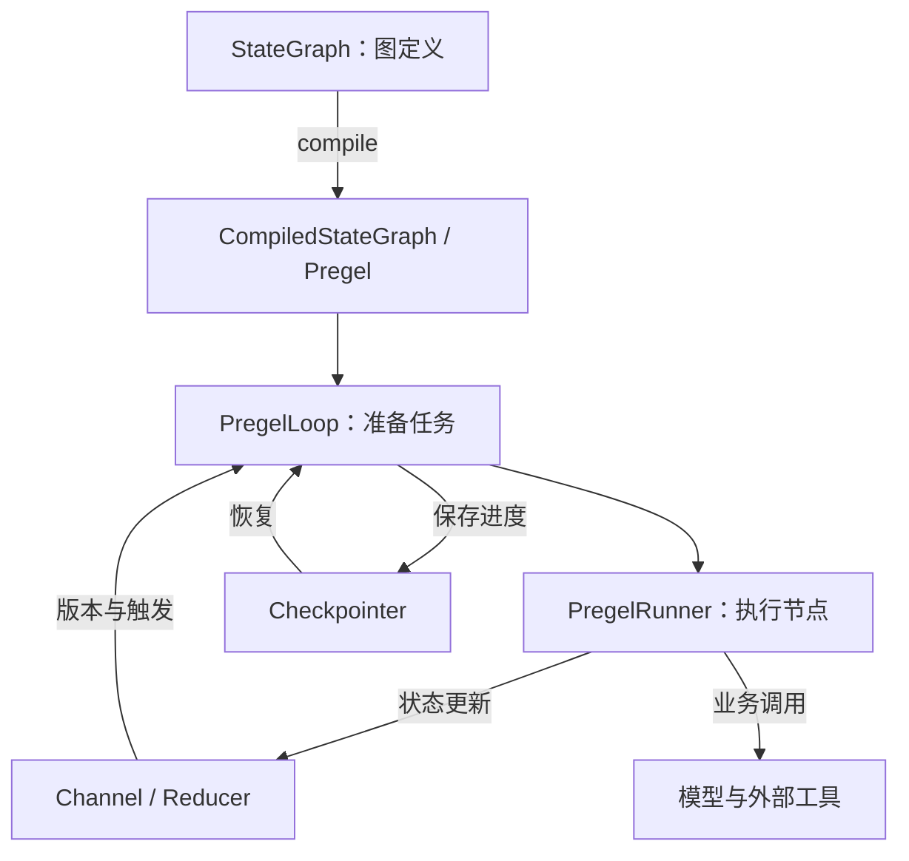
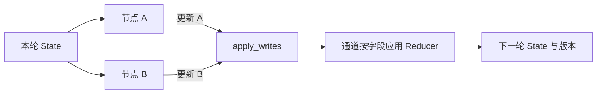
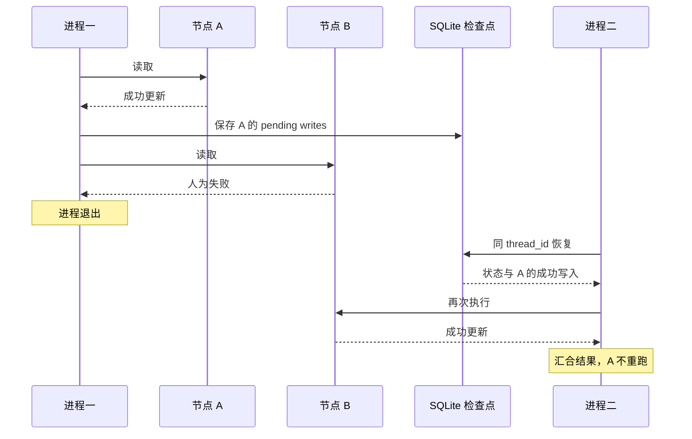
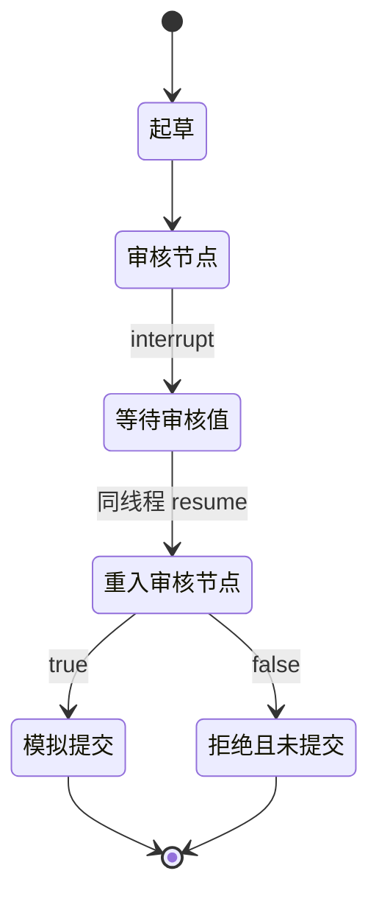

从 StateGraph 的编译与 Pregel 执行器进入 DAG、并行汇合、动态派发、状态合并和检查点，用分支实验解释恢复边界，再接上人工审核与外部写入。

本文源码固定为 `langchain-ai/langgraph@81bf17b23123e4ef8b9d5f49fa09a0122fc2edd1`，核对日期为 2026-09-07；该提交的 Python 包版本为 1.2.11。本轮实验使用发布包 `langgraph==1.2.11`、SQLite checkpointer 3.1.1 和 Python 3.12.13，没有从该提交构建安装包。结论范围是 Python StateGraph/Pregel 路径，不包含托管平台的跨机器调度保证。

## LangGraph：让运行过程成为显式的数据与结构

用户现在提出新要求：“证据足够就起草工单，缺字段就停下来；我确认后才能提交。”

这个需求有两种不同的判断。怎样从文档中解释故障，可以交给模型；缺少必填字段时能否提交，应由业务规则决定。把后者写成一个明确分支，往往比反复提醒模型更容易检查。

LangGraph 的 Graph API 用 State、Node 和 Edge 表达运行过程：状态承载当前信息，节点执行工作并返回更新，边决定下一步。节点可以调用模型，也可以只是普通函数。[Graph API 官方文档](https://docs.langchain.com/oss/python/langgraph/graph-api)

| 元素 | 本例中的设计 | 需要提前想清楚的问题 |
| --- | --- | --- |
| State | 问题、证据、缺失字段、提案、审核结果 | 哪些是已核验事实，哪些只是候选内容？ |
| Node | 检索、检查、起草、审核、提交 | 本步完成后有什么可检查的产物？ |
| Edge | 证据够则起草；确认通过则提交 | 判断条件由业务代码还是模型提供？ |
| Reducer | 合并多个来源返回的证据 | 追加、覆盖、去重分别适用于哪些字段？ |

Reducer 是字段更新的合并规则。例如多个检索分支都写入证据列表，应用需要定义怎样汇合；不应假定共享一个字段就会自动得到正确的并发结果。

对本例而言，可以给证据分配来源 ID，再按 ID 保留记录。重复检索同一段文档，不应该被汇总成“两份独立证据”。这个语义需要由数据设计表达，画出分支和汇合箭头还不够。

等待补充与等待审核是两个不同出口；实际应用需要分别定义后续输入怎样重新进入流程。
选择图编排的价值，在于这些分支与交接能被独立观察、检查和恢复。它不要求一个节点对应一个 Agent，也不要求所有节点都调用模型。关于反馈循环与执行图的进一步关系，可以接续[Loop Engineering 与 Graph Engineering](/writing/harness-engineering-loop/#loop-graph-engineering)。

## 从图定义到运行：编译器、通道、循环与执行器

<!-- diagram:langgraph-runtime-architecture-1 -->



系统架构：按本文固定 Python 提交归纳。StateGraph 编译出运行对象，Loop 准备工作、Runner 执行，通道与检查点保存图进度；外部资源事务仍在图之外。

<!-- /diagram -->

`StateGraph` 是构建器，`compile()` 才得到可执行的 `CompiledStateGraph`。编译不会把图变成一段从头跑到尾的线性代码；它把节点、边和状态字段接成底层运行器能够消费的对象。

| 代码对象 | 具体责任 | 不承担的责任 |
| --- | --- | --- |
| `graph/state.py` 中的构建与编译逻辑 | 校验图结构，注册节点、分支和汇合通道 | 判断业务计划是否正确 |
| Channel | 接收字段更新、记录可读性与版本 | 自动决定证据权威性 |
| `PregelLoop.tick()` | 根据检查点、通道版本和触发关系准备下一批任务 | 执行所有业务工具 |
| `PregelRunner.tick()` / `atick()` | 派发任务，处理运行结果、重试与异常 | 提供外部资源的事务 |
| `apply_writes()` | 将任务输出按通道归组，应用字段更新并推进版本 | 将文件、数据库与图状态原子提交 |
| Checkpointer | 保存图进度和任务写入，供恢复使用 | 保存容器内全部进程与文件 |

源码入口：[编译与连边](https://github.com/langchain-ai/langgraph/blob/81bf17b23123e4ef8b9d5f49fa09a0122fc2edd1/libs/langgraph/langgraph/graph/state.py)、[循环](https://github.com/langchain-ai/langgraph/blob/81bf17b23123e4ef8b9d5f49fa09a0122fc2edd1/libs/langgraph/langgraph/pregel/_loop.py)、[执行器](https://github.com/langchain-ai/langgraph/blob/81bf17b23123e4ef8b9d5f49fa09a0122fc2edd1/libs/langgraph/langgraph/pregel/_runner.py)、[状态更新算法](https://github.com/langchain-ai/langgraph/blob/81bf17b23123e4ef8b9d5f49fa09a0122fc2edd1/libs/langgraph/langgraph/pregel/_algo.py)。

一次普通 StateGraph 执行沿下面的主流程推进：

1. 输入写入起始通道，或者从指定线程的检查点恢复。
2. `prepare_next_tasks()` 根据待派发工作、触发通道及版本信息构造可运行任务。
3. 执行器运行这一轮任务；各节点产生状态更新，同一轮的普通状态读取不会看见其他节点尚未合并的写入。
4. 本轮完成后，`after_tick()` 调用 `apply_writes()` 合并更新；通道版本与检查点随执行推进。
5. 更新激活下一轮节点；没有可运行任务时结束，也可能因中断、异常或步数限制退出。

这一轮称为**超级步（superstep）**。它提供明确的状态可见性边界：节点读取什么，与哪一个线程先跑完分开处理。代价是，在普通超级步路径中，后继工作可能要等本轮较慢的任务。不能仅凭“支持并行”推断它采用按关键路径优先、完成一个立即调度一个的 DAG 调度策略。

## DAG 是一种依赖约束，LangGraph 的执行图可以有环

严格 DAG 的边表达前置依赖。例如 A、B 的结果都产生后，C 才能汇总。若依赖形成环，就无法通过拓扑排序得到合法的先后顺序。

LangGraph 还允许“检查失败 → 返回修改”的回边，因此 StateGraph 不是强制无环的任务表。模型驱动的 Loop 可以表现为几个节点之间的循环，也可以封装在一个节点内部。前者暴露更细的检查点和观察位置；后者图更小，但节点内部的恢复与预算需要自己管理。

可以把三个问题分开：DAG 管依赖，状态机管允许的状态转移，Agent Loop 管下一次行动。在应用明确要求 DAG 时，应另做无环校验；对允许回边的执行图，则应定义终止条件与步数上限。`recursion_limit` 限制图执行步数，不能直接当作模型调用次数或费用上限，因为一个节点可能调用模型多次。

### 两条入边，不一定表示等齐两个上游

假设 A 只用一个节点完成，而 B 要经过 B1、B2 两个节点。比较两种连接方式：

```python
# 分别触发：A 或 B2 产生更新，都可以激活 merge。
graph.add_edge("a", "merge")
graph.add_edge("b2", "merge")

# 显式汇合：merge 等待 A 和 B2 都完成。
graph.add_edge(["a", "b2"], "merge")
```

两种写法不能同时添加到同一示例图。对这个长短分支实验，第一种让 merge 先读到 `[A]`，之后再读到 `[A, B]`；第二种只汇总一次 `[A, B]`。若两个上游恰好位于同一超级步，第一种可能看起来也只汇总一次，因而掩盖错误。**必须用不同长度的分支检验汇合语义。**

实现原因可以直接追到 `CompiledStateGraph.attach_edge()`：列表形式创建 `NamedBarrierValue`，保存预期节点名称集合和已经收到的名称集合。只有二者相等，通道才可用；同一个上游重复报到，不会被算作另一个上游完成。[汇合通道源码](https://github.com/langchain-ai/langgraph/blob/81bf17b23123e4ef8b9d5f49fa09a0122fc2edd1/libs/langgraph/langgraph/channels/named_barrier_value.py)

这仍然不是通用业务验收。一个节点成功返回“未找到资料”，在调度层也是完成。若允许跳过来源或接受部分结果，应把 `found / missing / failed / skipped` 等结果显式写入业务状态，再由汇总节点判断能否交付，不能让一个永远不会运行的分支留在固定汇合条件中。

### 运行时才知道任务数量：Send

研究对象由用户临时提供，无法提前画出每个节点实例时，可以在条件路由中返回多个 `Send("read", input)`。它们使用同一个节点定义，但携带各自的输入，适合 Map-Reduce 式处理。

本轮实验向 read 派发 A、B、C 三个输入，每个返回自己的证据，merge 得到 `[A, B, C]`。这个实验验证的是一层 fan-out 的行为；多轮循环、嵌套分支和跨任务版本的汇合，还需要业务标识与相应实验，不能由这个结果外推。

并发额度与任务依赖也是两个维度。把 `max_concurrency` 设为 2，只约束该执行配置下的并发；它没有自动定义租户公平性、外部 API 限流或父子任务共享费用。这些约束需要调度服务或应用预算机制配合，见[任务服务](/writing/harness-operations-production/)。

## Reducer 合并的是更新，不是自动合并真相

<!-- diagram:langgraph-runtime-architecture-2 -->



数据流：普通超级步中，节点读取本轮状态，更新在步末经通道合并后供下一步使用。Reducer 决定字段合并规则，不负责认定证据真假。

<!-- /diagram -->

`Annotated[list[str], operator.add]` 很适合演示分支结果追加，但列表追加不去重。一次真实的新调用与一次重复提交是否应计为两条记录，取决于字段含义。

| 状态字段 | 可采用的规则 | 反例 |
| --- | --- | --- |
| 原始调用记录 | 按调用 ID 保存每次真实调用 | 按文本去重会漏掉重复调用的实际成本 |
| 已核验证据 | 按来源、版本和片段键合并 | 重复检索不能增加独立证据数 |
| 当前提案 | 单写者或显式版本检查 | 并行分支“最后到达者覆盖”可能抹掉修订 |
| 分支完成集合 | 按任务版本和分支 ID 记录 | 只统计数量会接受旧版本结果 |

该版本 `apply_writes()` 会按任务路径排序以稳定更新应用顺序，但稳定顺序不等于业务冲突已经解决。需要依赖到达顺序的 Reducer、会丢失来源的覆盖规则，都应该明确写出适用条件。并发控制的进一步问题见[版本冲突、锁与背压](/writing/harness-foundations-concurrency/)。

## 检查点实验：一个分支失败，不代表全部重做

<!-- diagram:langgraph-runtime-architecture-4 -->



恢复时序对应 SQLite、同步持久化和 B 延迟失败的受控实验。成功的 A 写入得以保存；不代表外部调用完成但尚未保存时也不会重复。

<!-- /diagram -->

本轮让 A、B 并行读取，A 成功，B 人为抛出异常，然后结束 Python 子进程。另一个子进程用同一个 SQLite 文件和 `thread_id`，调用 `graph.invoke(None, config)` 继续。实验显式使用同步持久化模式，B 延迟失败以让 A 的写入先保存。

| 实验 | 实际结果 | 支持的结论 |
| --- | --- | --- |
| 不等长分支分别连边 | 汇总先出现 A，再出现 A、B | 多条入边不能替代明确的汇合条件 |
| 列表形式显式汇合 | 只出现一次 A、B | 此图按两个上游身份等待 |
| 三个 `Send` | 一次汇总 A、B、C | 此 fan-out 可以共享节点定义、分开输入 |
| B 失败后新进程恢复 | A 调用 1 次，B 调用 2 次 | 此检查点保留成功任务的 pending writes，恢复不重跑 A |

最后一个行为对应 `PregelLoop` 对成功任务写入的重新应用。它不意味着任意位置的写入都不会重复：如果外部调用完成，而结果还没持久化，恢复仍可能再次执行。内存 checkpointer 也不能让另一个进程读取先前进度。

[实验包](/labs/harness-source-study.zip)包含脚本、依赖版本和原始结果。四个场景没有调用模型，没有测试数据库损坏、多机并发或真实外部 API，不能作为质量或吞吐排名。

## 可运行实验：暂停后，究竟从哪里继续？

<!-- diagram:langgraph-runtime-architecture-3 -->



状态机对应下文已运行的起草—审核示例。恢复重入审核节点；提交只生成演示文本。真实认证、审批绑定和外部写入不在该实验内。

<!-- /diagram -->

下面把复杂业务缩小为“起草 → 审核 → 模拟提交”。实验不调用模型、不连接外部系统，方便直接观察 LangGraph 的控制流。本文已在 Python 3.12.13、LangGraph 1.2.11 下实际运行，验证了通过与拒绝两条路径，以及暂停时尚未提交的状态。

先安装依赖，然后把 Python 代码保存为 `review_demo.py` 运行：

```bash
python -m pip install "langgraph==1.2.11"
python review_demo.py
```

```python
from typing import TypedDict

from langgraph.checkpoint.memory import InMemorySaver
from langgraph.graph import END, START, StateGraph
from langgraph.types import Command, interrupt

class State(TypedDict):
    question: str
    draft: str
    approved: bool
    outcome: str

def prepare(state: State):
    return {"draft": f"待核查：{state['question']}"}

def review(state: State):
    print("进入审核节点")  # 用日志观察：恢复时会再次执行这里
    decision = interrupt({"draft": state["draft"]})
    if type(decision) is not bool:
        raise ValueError("审核结果必须是布尔值")
    return {"approved": decision}

def route(state: State):
    return "submit" if state["approved"] else "reject"

def submit(state: State):
    # 只返回演示文本，没有创建真实工单。
    return {"outcome": "模拟提交完成：" + state["draft"]}

def reject(state: State):
    return {"outcome": "审核拒绝，未提交"}

builder = StateGraph(State)
builder.add_node("prepare", prepare)
builder.add_node("review", review)
builder.add_node("submit", submit)
builder.add_node("reject", reject)
builder.add_edge(START, "prepare")
builder.add_edge("prepare", "review")
builder.add_conditional_edges(
    "review", route, {"submit": "submit", "reject": "reject"}
)
builder.add_edge("submit", END)
builder.add_edge("reject", END)
graph = builder.compile(checkpointer=InMemorySaver())

for thread_id, decision in [("approved-demo", True), ("rejected-demo", False)]:
    config = {"configurable": {"thread_id": thread_id}}
    paused = graph.invoke({
        "question": "DEMO-429 是否由并发过高引起？",
        "draft": "", "approved": False, "outcome": "",
    }, config=config)
    assert paused["__interrupt__"] and paused["outcome"] == ""
    print("待审核：", paused["__interrupt__"][0].value)
    # 教学驱动器模拟外部审核结果；真实系统应接收已验证的审核输入。
    final = graph.invoke(Command(resume=decision), config=config)
    assert final["approved"] is decision
    assert final["outcome"].startswith("模拟提交完成" if decision else "审核拒绝")
    print(final["outcome"])
```

通过与拒绝两条路径各自使用独立的 `thread_id`。第一次调用在审核处暂停，`outcome` 仍为空；第二次调用带回布尔结果，选择对应分支。

运行时，每条路径都会打印两次“进入审核节点”。这是关键观察：**恢复会重新进入发生中断的节点，`interrupt()` 之前的代码会再次执行。** 恢复时传入的值成为该次 `interrupt()` 的返回值；调用需要沿用原来的线程 ID。[Interrupts 官方文档](https://docs.langchain.com/oss/python/langgraph/interrupts)

因此，如果把发送通知、创建工单等外部写入放在这行日志的位置，就必须处理重复执行的后果。这个实验把审核与提交分开，是为了让控制边界可见；真正的提交节点仍然需要自己的故障处理。

## 持久化保存运行进度，业务系统保存最终事实

在 LangGraph 中，checkpointer 保存线程范围的图状态，store 保存图状态之外、可以跨线程使用的数据。前者适合当前任务的进度与恢复，后者适合用户偏好等跨任务信息。实验里的 `InMemorySaver` 只保存在内存中，进程退出后数据就会丢失。[Persistence 官方文档](https://docs.langchain.com/oss/python/langgraph/persistence)

把示例接到真实工单系统时，还有一个单靠 checkpoint 解决不了的窗口：

1. 提交接口成功创建了工单。
2. 网络连接断开，应用没有收到成功响应。
3. 运行状态中还没有保存工单编号。
4. 恢复后的应用必须决定查询还是重做。

此时，“没有记录成功”不能推出“没有创建成功”。一种业务实现是，在提交前生成并保存稳定的操作键，后端以该键约束重复写入；遇到结果未知，先按原键查询已有工单，再决定后续处理。

这里的操作键、权限检查与回读验收是应用设计建议，不是声明 LangGraph 自带业务事务保证。即使任务状态完整恢复，外部系统是否发生过写入，仍然要以该系统的事实为准。更完整的处理见[副作用恢复与对账](/writing/harness-engineering-recovery/)。

审核记录也应与提案内容关联。如果用户批准的是“只提交故障摘要”，后来模型又添加了敏感日志，不能继续复用原来的批准结果。最简单的办法是让审核绑定提案版本或内容摘要，提案变化时重新判断授权是否有效。

模型与工具的高层装配，见 [LangChain：模型、工具、中间件与 Agent 装配](/writing/langchain-agent-architecture/)。

## 选择 LangGraph，要接受哪些工程成本

当任务有明确分支、人工停顿和需要单独恢复的步骤时，显式图能让这些控制点进入可检查的数据结构。代价是维护状态 schema、Reducer、节点粒度和恢复兼容性；图画得更细，还会增加中间状态和检查点管理。

如果任务只需要短暂的模型—工具循环，先从较小的循环开始更容易解释。若需要把等待数天、Worker 更换和历史兼容纳入基础设施，可以继续研究 [Temporal](/writing/temporal-durable-execution/)。如果难点是 Shell、文件和进程该在哪里运行，应看 [OpenHands SDK 的工作空间设计](/writing/openhands-sdk-architecture/)；这不是增添几条图边就能解决的问题。
