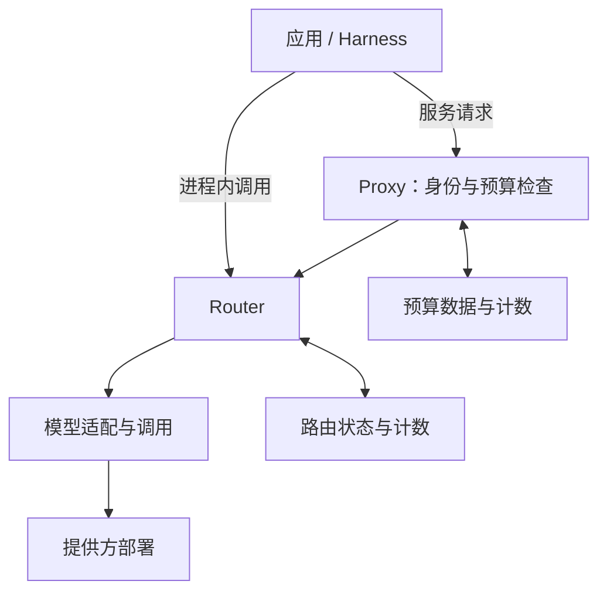
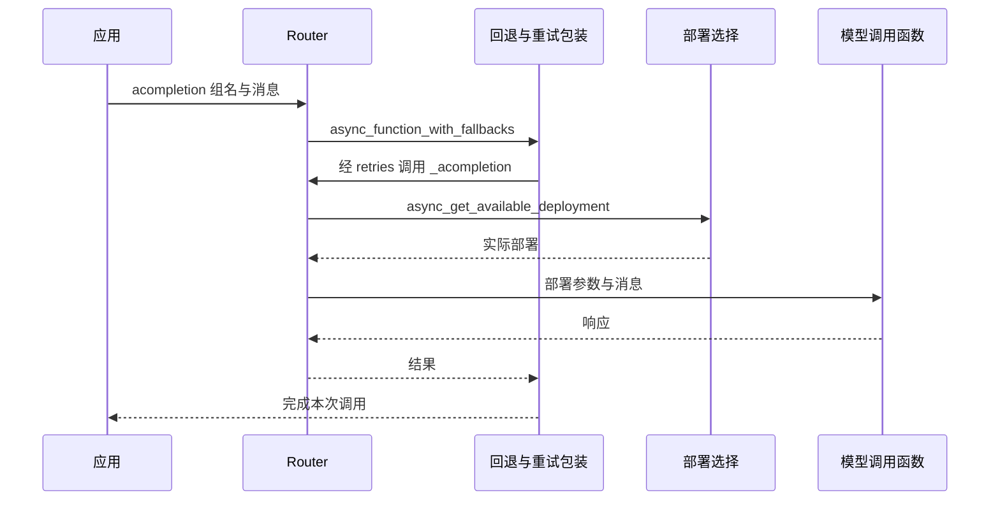
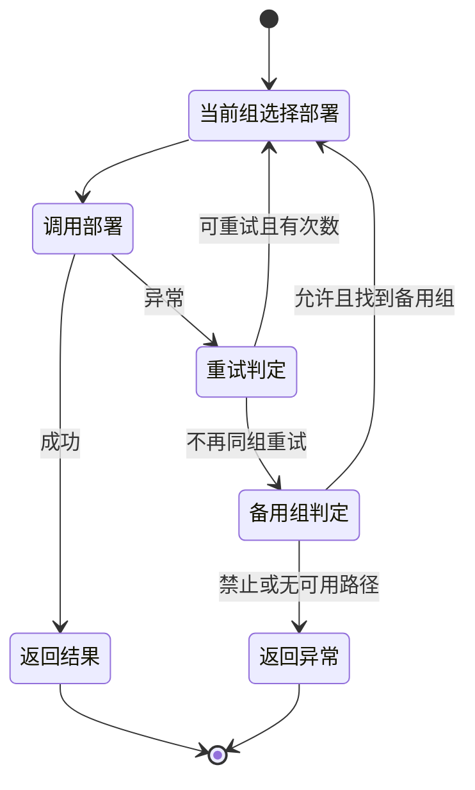

Agent 请求一次模型，背后可能发生多次尝试：先选一个部署，失败后同组重试，再切换备用模型。应用看到的是一次调用，网关管理的是一串带状态、费用和输出边界的执行。

LiteLLM 把这部分能力集中起来。理解它需要回答三个问题：**选中了谁，失败后改变了什么，哪些状态必须共享。** 统一接口只是入口，路由正确性取决于这些问题有没有明确答案。

本文固定分析 [BerriAI/litellm v1.100.0，提交 e4f2526](https://github.com/BerriAI/litellm/tree/e4f25265704e2b2c6cf6e81be2e4c5cffff896f4)。重点是 Python SDK 的异步 Router 路径、缓存与 Proxy 预算检查；不代表仓库全部服务或其他版本。八组实验使用 `litellm==1.100.0` 的真实 Router／缓存类，模型调用函数返回受控结果。所分析的 Python 文件均与安装包核对哈希；没有调用真实模型或启动 Proxy。

## 模块分工：协议、选路与治理

<!-- diagram:litellm-gateway-architecture-1 -->

两种接入架构：进程内 Router 与 Proxy 服务是可选入口。Proxy 的身份预算检查不能从 Router 配置推导；图中治理能力来自源码，本文没有启动 Proxy。

<!-- /diagram -->

以一个需要查资料并生成工具调用的 Agent 为例，职责可以这样划分：

| 模块 | 接收什么 | 负责什么 |
| --- | --- | --- |
| Agent／Harness | 用户任务、历史与工具结果 | 决定本轮需要什么能力，何时执行工具，如何验收 |
| LiteLLM Router | 模型组、消息、请求参数 | 筛选部署，选择目标，组织重试与回退 |
| LiteLLM 模型调用与适配 | 实际提供方、模型、凭证与参数 | 接入不同提供方，处理请求、响应与异常的协议差异 |
| Proxy 身份与策略检查 | 调用方身份、模型访问与预算配置 | 在服务入口执行对应治理检查 |
| 缓存、计数与日志 | 部署状态、请求事件、用量 | 为路由和预算提供状态，记录实际执行 |

应用可以直接在进程内使用 Router，也可以通过 Proxy 服务接入。两条路径的治理条件不同：**导入 Router 并配置 API Key，不等于已经部署了虚拟密钥鉴权与组织预算。** Proxy 的虚拟密钥检查有自己的调用链。[鉴权调用位置](https://github.com/BerriAI/litellm/blob/e4f25265704e2b2c6cf6e81be2e4c5cffff896f4/litellm/proxy/auth/user_api_key_auth.py#L2077)

这也划出了 Harness 的边界。网关可以替换一次推理的服务路径；工具写入是否已经成功、任务是否应该继续，仍需要 [Harness 的操作状态与恢复契约](/writing/harness-engineering-recovery/)。

## 模型名称有三层，不能混为一个字段

<!-- diagram:litellm-gateway-architecture-2 -->

数据流使用本文别名示例：应用名、模型组和实际部署是三个身份。观测记录需要同时保留它们；组内配置相同不等于模型能力相同。

<!-- /diagram -->

假设应用请求 `assistant`，它是模型组 `primary` 的别名；`primary` 下有两个部署。一次请求涉及三种身份：

| 身份 | 示例 | 用途 |
| --- | --- | --- |
| 应用别名与模型组 | `assistant → primary` | 稳定应用接口，组织候选集合与组间回退 |
| 提供方模型 | `openai/gpt-4o-mini` | 指定实际模型调用路径 |
| 部署编号 | `primary-a`、`primary-b` | 区分同组部署，关联选择、状态与观测 |

同一个组可以包含不同部署；同一个提供方模型也可以出现在多个部署中。因此，只记录应用传入的 `model`，无法解释实际流量落在哪里。日志至少需要保留请求组、实际部署、提供方模型和尝试序号。

实验给 `primary` 的两个部署分别配置权重 0 和 1，再通过别名 `public` 选择，实际得到权重为 1 的部署。这同时验证别名解析和部署选择，未验证任何模型的生成质量。

模型组是配置关系，不是能力证明。把两个模型放在一个组里，不会自动使它们拥有相同的图片输入、工具协议或上下文容量。组的采用条件还需要[模型能力与协议约束](/writing/harness-operations-model-gateway/)。

## 一次请求怎样走完

<!-- diagram:litellm-gateway-architecture-4 -->

时序聚焦一次成功的普通异步请求。实验在提供方函数边界返回受控响应，未验证真实 HTTP、协议适配或模型质量。

<!-- /diagram -->

普通异步对话请求的主路径可以按以下顺序阅读；带优先级调度、提示管理等分支另有处理。

1. `Router.acompletion` 接收模型组和消息，整理本次调用参数，把 `_acompletion` 作为实际执行函数。
2. `async_function_with_fallbacks` 组织回退；每次尝试先进入 `async_function_with_retries`。
3. `_acompletion` 调用 `async_get_available_deployment`，从当前可用候选中选择一个部署。
4. 将部署参数装入请求，准备提供方客户端；根据配置取得并发信号量并执行调用前检查，再等待 `litellm.acompletion`。
5. 正常结果返回；异常交给重试或回退逻辑，流式结果交给相应包装器。请求事件进入指标与回调路径。

这里的模型函数在实验中被替换成固定响应与固定异常；选择、重试和回退仍执行上游 Router。这样能检查控制流，但无法证明适配器、HTTP 传输与提供方共同工作的结果。[请求入口](https://github.com/BerriAI/litellm/blob/e4f25265704e2b2c6cf6e81be2e4c5cffff896f4/litellm/router.py#L2328)、[单次部署调用](https://github.com/BerriAI/litellm/blob/e4f25265704e2b2c6cf6e81be2e4c5cffff896f4/litellm/router.py#L3120)

## 先筛候选，再选择；权重不是限流

多候选异步路径会根据配置处理健康状态、冷却、禁用标记、调用前检查、标签和顺序等条件，之后才执行选择策略。部分检查需要开关或相应参数；直接指定部署等分支也有不同路径，不能把这一过程理解成所有请求都经过同一份能力审计。[候选处理](https://github.com/BerriAI/litellm/blob/e4f25265704e2b2c6cf6e81be2e4c5cffff896f4/litellm/router.py#L11810)

`simple-shuffle` 的规则尤其值得细读。它按 `weight → rpm → tpm` 的优先级寻找可用权重；具体是否采用某个字段，先看第一个候选有没有设置该字段。选定字段后，对所有候选的对应值归一化，再随机选择。配置应保持一致，避免依赖候选顺序解释缺省值。

这段函数中的 RPM／TPM 是**分配流量的权重**。例如两个部署配置 100 和 200，表达的是不同的选择概率；这个函数没有据此计数并拒绝第 101 次请求。实际限额检查要看启用的策略和调用前检查。`usage-based-routing-v2` 则包含读取与递增分钟计数、超限抛错的路径。[权重选择源码](https://github.com/BerriAI/litellm/blob/e4f25265704e2b2c6cf6e81be2e4c5cffff896f4/litellm/router_strategy/simple_shuffle.py)、[用量检查源码](https://github.com/BerriAI/litellm/blob/e4f25265704e2b2c6cf6e81be2e4c5cffff896f4/litellm/router_strategy/lowest_tpm_rpm_v2.py#L62)

另一个反直觉结果：所有候选权重都是 0 时，函数会继续检查其他权重字段；没有正权重可用，最终退回均匀随机选择。实验确认这种配置仍能返回部署。因此，**权重 0 不能用作可靠的停用开关**。对照实验将一个部署设为 `model_info.blocked=true`，即使它的权重更高，也只选中了另一个活动部署。

策略的选择应围绕要控制的量。`least-busy` 用回调增加、减少在途请求计数，适合研究并发负载；它并不直接评价答案。请求数相同的两个部署，也可能因请求长度或模型速度而负载不同。[在途计数实现](https://github.com/BerriAI/litellm/blob/e4f25265704e2b2c6cf6e81be2e4c5cffff896f4/litellm/router_strategy/least_busy.py)

## 重试与回退：改变的是次数、部署还是模型组

<!-- diagram:litellm-gateway-architecture-3 -->

重试状态图归纳普通非流式路径，省略可选 order 与同组加权分支。次数、错误分类与配置共同决定转移；超窗专用回退和流式切换另见正文。

<!-- /diagram -->

失败之后，需要区分三件事：

| 动作 | 保留什么 | 可能改变什么 |
| --- | --- | --- |
| 同组重试 | 当前请求目标组 | 再次执行部署选择，未必仍是上一次部署 |
| 同组其他顺序层级 | 模型组 | 转向更高 `order` 的候选层级 |
| 跨组回退 | 一次上层调用 | 改用备用模型组，实际能力与提供方都可能变化 |

`async_function_with_retries` 再次调用实际执行函数；后者会重新进入部署选择。因此，“重试”不能一概解释为向同一台机器重发。本文为了得到确定轨迹，每个实验组只有一个部署：第一次受控 500 错误后，同组第二次调用成功。

重试次数也不是一个孤立配置：源码处理请求级次数、部署异常携带的次数以及按错误类型和模型组设置的策略。错误是否可重试，还会受到剩余候选与回退配置影响。评估请求放大时，应读取最终生效的策略并记录实际尝试，不能只看一个全局参数。[重试实现](https://github.com/BerriAI/litellm/blob/e4f25265704e2b2c6cf6e81be2e4c5cffff896f4/litellm/router.py#L7152)

回退部分先处理禁止回退、同组顺序层级等条件，再进入相应错误路径。该版本还包含可选的同组加权故障转移，不能假设每次错误都会立即跨组。[回退入口与顺序层级](https://github.com/BerriAI/litellm/blob/e4f25265704e2b2c6cf6e81be2e4c5cffff896f4/litellm/router.py#L6788)

上下文超限有独立的 `context_window_fallbacks`。实验同时配置普通备用组 `backup` 和超窗备用组 `long`：抛出 `ContextWindowExceededError` 后，轨迹是 `primary → long`，没有经过 `backup`。其中 `long` 只是实验组名，实验没有测量模型的真实窗口。

同理，错误分类只能决定走哪条配置路径，无法证明新路径满足任务约束。超窗时换到更便宜却更小的模型，可能反复失败；遇到策略拒绝，也不能把跨提供方切换作为绕过边界的手段。

`disable_fallbacks=true` 的实验则只执行了一次主组调用，并将原来的 `InternalServerError` 交还上层。禁用回退与禁用重试是两个问题；该实验另外将重试次数设为 0。

## 流式输出：已经交给用户的内容形成切换边界

非流式请求可以在结果交付前隐藏一次失败，流式请求需要考虑已经发出的内容。

该版本的异步流包装器捕获 `MidStreamFallbackError` 后，会检查是否处于首块之前，以及是否已经生成实际内容。如果已经有内容，且不属于首块前失败，它会抛出原异常或当前异常；通过该条件后，才继续尝试回退。[流式回退条件](https://github.com/BerriAI/litellm/blob/e4f25265704e2b2c6cf6e81be2e4c5cffff896f4/litellm/router.py#L2465)

由此可得一个设计判断：**不能把 LiteLLM 的备用模型配置理解为任意位置的无缝续写。** 首块前的失败与已经输出半段内容的失败，产品必须区别处理。这一结论来自源码阅读，本文未运行流式传输实验。

对工具调用，这个边界更重要。主模型已经输出半段参数，备用模型可能选择了不同工具；把两段输出拼接，无法维持同一个调用的语义。Harness 应在完整调用通过校验后再派发工具，并在失败时恢复到合法的请求边界。[工具契约](/writing/harness-engineering-tools/)

## 冷却、缓存与预算：状态需要怎样共享

冷却用于暂时减少对失败部署的请求。该版本会检查部署身份、冷却开关、冷却时间和错误条件；它不是“任意异常都立即拉黑”。具体候选路径还存在健康检查相关的恢复条件，部署时应验证所用配置。[冷却判断](https://github.com/BerriAI/litellm/blob/e4f25265704e2b2c6cf6e81be2e4c5cffff896f4/litellm/router_utils/cooldown_handlers.py#L258)

`DualCache` 提供内存与可选 Redis 两级存取。普通读取先找内存，未命中再找 Redis，并可回填内存。它适合降低状态读取成本，但“有缓存对象”并不意味着多个进程共享最新状态。实验创建两个独立的内存缓存实例，向第一个写入 7，第二个仍读到空值。[普通缓存读取](https://github.com/BerriAI/litellm/blob/e4f25265704e2b2c6cf6e81be2e4c5cffff896f4/litellm/caching/dual_cache.py#L153)

Proxy 的预算读取对此作了专门处理。`_virtual_key_max_budget_check` 调用 `get_current_spend`；后者优先读取跨实例 Redis 计数，并在相应条件下用已记录的权威费用核验与修复。它没有直接套用普通 DualCache 的内存优先读取。源码也提供计数不可验证时拒绝放行的可选策略。[密钥预算检查](https://github.com/BerriAI/litellm/blob/e4f25265704e2b2c6cf6e81be2e4c5cffff896f4/litellm/proxy/auth/auth_checks.py#L4726)、[跨实例费用读取](https://github.com/BerriAI/litellm/blob/e4f25265704e2b2c6cf6e81be2e4c5cffff896f4/litellm/proxy/proxy_server.py#L2433)

这个差异说明，缓存顺序也是业务语义：路由状态的读取延迟和预算的累计一致性，需要分别考虑。不能由普通缓存的行为推断预算检查，也不能因为存在 Redis 就认定所有状态都具有相同的一致性。

本文没有验证 Proxy 的多实例并发、费用写回、Redis 故障或预算超调上界。对严格预算场景，仍需专门实验确认在途请求、实际费用回写和不可用状态下的准入行为。请求结果缓存则是另一个机制，不应与这里的状态计数混称为缓存命中率。

## 八组实验支持哪些结论

所有模型名只用于路由识别；实验脚本在提供方函数边界制造响应，阻止网络连接，并关闭遥测。冷却被关闭，以便把重试与回退的控制流单独观察。

| 场景 | 观察到的结果 |
| --- | --- |
| 别名与 0／1 权重 | 解析别名后选中正权重部署 |
| 候选全部零权重 | 仍从候选中选出部署 |
| 同组一次重试 | 主组调用两次，第二次成功 |
| 普通跨组回退 | 主组失败，备用组成功 |
| 超窗专用回退 | 主组失败，直接进入超窗备用组 |
| 禁止回退、零重试 | 只调用主组，原异常交回调用者 |
| 禁用部署 | 被禁用部署未进入最终选择 |
| 两个独立内存缓存 | 写入只在第一个实例可见 |

这些结果验证所列配置的局部行为，不证明真实模型等价、限流吞吐、流式可靠性或生产预算正确性。完整脚本、锁定依赖、文件哈希与结果见[可下载实验包](/labs/litellm-source-study.zip)。

## 什么情况下值得采用

如果主要问题是多个模型提供方的接入、部署选择与故障处理，LiteLLM 可以集中这部分机制。接入方式应由治理边界决定，而不是默认建设完整网关服务。

| 条件 | 可考虑的方式 | 需要承担的代价 |
| --- | --- | --- |
| 单个应用管理模型路由 | 进程内 SDK／Router | 应用承担配置、状态和升级管理 |
| 多个应用需要统一入口与身份预算 | Proxy 服务 | 增加服务部署、存储、策略与故障域 |
| 任务依赖特定模型能力 | 限制模型组与回退集合 | 牺牲部分可用路径，换取经过验证的协议与能力约束 |
| 工具可能产生外部写入 | 网关配合持久任务状态 | 另建操作标识、对账与验收，避免推理重试带动业务重做 |

不存在脱离任务约束的最佳路由。合理的采用顺序是：先固定输入、工具协议和数据范围，建立合格候选；再明确重试、输出交付与预算边界；最后比较实际任务的成功率、时延和全部尝试费用。LiteLLM 提供可组合的路由机制，Harness 需要把这些机制放进一项可验收的任务中。
