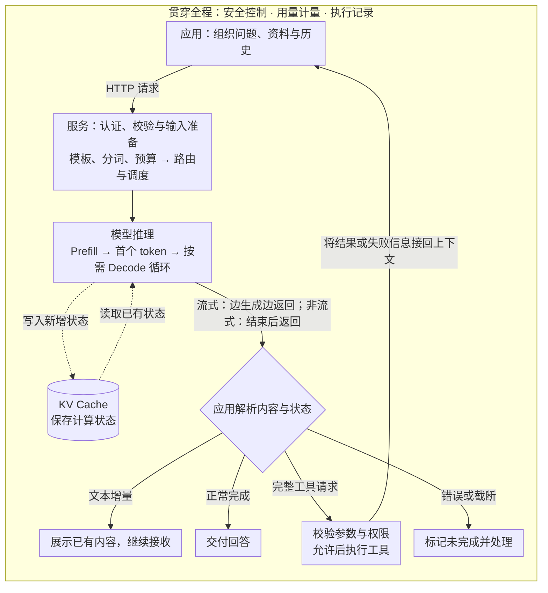

**一次模型调用，包含三件事：准备输入、计算输出、交付结果。** 模型负责生成，服务系统安排资源，应用决定拿到结果后是结束，还是执行工具再继续。

先看完整流程。图以常见的文本生成 API 和应用侧工具为例：实线表示执行与返回路径，虚线表示缓存读写；最外层的安全、计量与记录贯穿全过程。

路由、分词等环节的具体位置可能随部署变化，调度也会持续参与生成。流式箭头表示计算和传输可以交错进行，**不是等推理全部结束才开始返回**；应用收到文本增量后继续接收，只有拿到结束状态，才能判断这一轮是否完成。图中省略了各阶段通向错误处理的连线。

下面跟着一句“帮我分析这份报告”走一遍。这是假设案例；本文依据截至 2026 年 9 月 17 日核对的官方资料，讨论自回归 Transformer 文本服务，不代表某家闭源厂商的内部部署，也没有运行模型实测。

## 1. 请求进入：先决定模型能看到什么

用户只输入一句话，应用通常还要附上系统指令、对话历史、报告内容和工具定义。报告是否解析完整、金额单位有没有保留、关键表格是否被选中，都在影响后面的回答。**模型只能依据这次实际获得的内容分析，“文件上传成功”不等于所有内容已经进入上下文。** 检索如何提供材料，见 [RAG](/writing/rag/)。

应用把这些内容发送给服务，服务检查身份、格式、模型权限与额度，再准备模型输入。聊天消息会按模型使用的模板转换为序列，经分词成为 token ID；这些整数映射成向量，进入计算。Token 不固定等于一个字或一个单词，模板和分词也不必在调用者本地完成。[Hugging Face：Chat templates](https://huggingface.co/docs/transformers/en/chat_templating)

输入还要经过上下文预算检查。指令、历史、资料、工具定义都可能占空间，接下来的生成也受窗口和输出上限约束。超限时如何拒绝、压缩或停止，取决于接口与应用策略；不能默认服务会无损地删掉不重要的内容。[Anthropic：Context windows](https://platform.claude.com/docs/en/build-with-claude/context-windows)

请求通过检查之后，仍可能等待计算资源。模型服务通常由多个实例承担，一个实例也可能使用多张 GPU。路由决定送到哪里，调度决定何时执行、与哪些请求共同计算。因此，屏幕上的等待既可能来自模型计算，也可能来自网络和排队。

## 2. 模型推理：先处理输入，再逐步生成

真正进入模型后，有两个关键阶段。

**Prefill：处理已知输入。** 模型通过各层注意力和前馈网络计算报告与问题的表示，并建立后续生成需要的状态。输入位置可以在一层内并行处理，但因果注意力仍限制每个位置只能访问允许的前文。常驻服务的模型权重通常已经加载；Prefill 不是每次重新加载整个模型。

处理到输入末尾时，模型得到下一 token 的候选分数。生成策略据此选择首个 token：可以取最高分项，也可以按概率采样。Temperature 等参数影响选择方式，不直接保证事实正确。[Hugging Face：Generation strategies](https://huggingface.co/docs/transformers/en/generation_strategies)

**Decode：利用已有状态继续生成。** 刚选出的 token 成为下一步输入，模型再计算、再选择，直到满足停止条件。因而，输入处理完毕时通常已能产生首个 token；后续回答则沿着生成循环逐步展开。[Hugging Face：缓存与生成循环](https://huggingface.co/docs/transformers/en/cache_explanation)

这解释了为什么“读一份长报告”和“写一篇长分析”是不同负担：前者增加输入处理，后者增加后续生成。推测解码等优化可以一次验证多个候选 token，但不改变输出依赖前文这一基础。[Hugging Face：Assisted decoding](https://huggingface.co/docs/transformers/en/assisted_decoding)

## 3. KV Cache：省下重复计算，也占用资源

生成每个新 token 时，模型都要利用前文。**KV Cache 保存各层注意力中已经算出的 Key、Value，让下一步复用这些数值状态，并追加新位置的状态。** 它不是报告摘要、模型权重或现成答案，也不意味着这次对话即时训练了模型。

缓存节省计算，却需要存储。对普通全注意力模型，上下文越长、并发请求越多，KV 状态通常越大。所以，模型能装进显卡，不代表它还能同时接待很多长请求。

还要区分两种复用：

| 复用方式 | 省下什么 | 保留什么成本 |
| --- | --- | --- |
| 一次生成中的 KV Cache | 重算前文 K、V 的工作 | 每步读取状态、计算并生成新内容 |
| 跨请求的前缀缓存 | 相同且兼容前缀的重复输入计算 | 新增输入和后续输出的计算 |

例如，同一份报告放在稳定前缀里，不同请求只更换末尾问题，就可能复用前缀状态。前提是输入与配置兼容、缓存仍然可用；语义相似并不足够，命中缓存也不会直接返回上次答案。[vLLM：Automatic Prefix Caching](https://docs.vllm.ai/en/latest/features/automatic_prefix_caching/)

服务还可以用连续批处理，让完成的请求退出、待处理请求加入；用分块 Prefill 减少长输入对正在生成的请求的干扰。这些优化主要改变资源利用和等待体验，不能简单理解为“模型更聪明了”。[Hugging Face：Continuous batching](https://huggingface.co/docs/transformers/en/continuous_batching)、[vLLM：调度优化](https://docs.vllm.ai/en/latest/configuration/optimization/)

## 4. 流式返回：生成、传输和显示是三件事

模型选出 token 后，服务还要解码、封装响应，通过网络送到应用。**流式模式允许已有内容先返回，模型同时继续生成；非流式模式通常等待完整响应。** 这是返回方式的区别，不决定模型是否需要逐步计算。

流式事件可能包含文本、工具参数片段或状态。一个事件不固定对应一个 token，token 也不固定对应屏幕上的一个字；代理缓冲、SDK 解析和界面绘制都会影响显示节奏。[Anthropic：Streaming messages](https://platform.claude.com/docs/en/build-with-claude/streaming)

判断速度时，应分清三种问题：

| 观察 | 可能涉及的环节 |
| --- | --- |
| 很久才出现首个正文 | 网络、排队、输入处理，也可能有额外思考或工具等待 |
| 内容出现后仍不断停顿 | 后续生成、资源调度、网络与缓冲 |
| 整个任务很久才完成 | 总输出长度、多次模型请求、工具执行和重试 |

TTFT 描述首 token 等待，ITL 描述 token 间隔，但要标明测量位置：客户端首个事件、首段正文和引擎首 token 不是同一时刻，客户端事件间隔也不能直接冒充引擎 ITL。

收到一些文字不等于完成。正常结束、达到长度上限、工具请求和传输失败，需要分别处理；推理模型还可能生成额外思考内容，使可见字数不足以反映全部生成量。[Anthropic：Thinking](https://platform.claude.com/docs/en/build-with-claude/extended-thinking)

## 5. 工具调用：模型提出动作，程序负责执行

如果模型发现报告缺少背景资料，它可能输出一个检索工具请求，包含工具名称和查询参数。**输出调用请求仍然是生成，真正搜索资料的是执行工具的程序。**

对应用侧工具，一轮典型闭环是：

1. 应用完整接收并解析工具请求，检查参数、权限和执行条件。
2. 条件满足后执行工具，把结果或明确的失败信息接回上下文。
3. 发起下一次模型请求，让模型依据新增信息继续回答。

因此，一次用户提问可以包含多次模型 API 请求。工具调用在流式与非流式模式下都可以成立；流式收到半段参数，也不能当作完整调用直接执行。提供商托管的工具则可能在一次外部 API 请求内部完成往返，执行责任与应用侧工具不同。[Anthropic：Tool use](https://platform.claude.com/docs/en/agents-and-tools/tool-use/overview)

把这些步骤组织起来、处理异常并决定何时继续，就是 [Agent Runtime](/writing/agent-runtime/) 承担的工作。对于会修改外部状态的工具，还要核验结果：没有收到响应，不等于操作没有发生，重试前需要考虑去重与幂等。

## 6. 安全与计量：沿途发生，结束时汇总

安全控制分布在不同位置：入口认证识别调用者，资料访问限制可读范围，工具授权约束动作，输出阶段可以检查内容。日志和用量也随执行产生，最终再汇总到一次任务。它们不是回答后补做的最后一步。

账单同样不能只看回答字数。长输入、额外思考、工具和多次请求都可能带来消耗。缓存 token 可能是输入的分类，思考 token 可能已计入输出，不能把“输入、缓存、思考、输出”盲目相加。例如 Claude 按输出计量思考 token，同时单独报告缓存创建与读取等字段，应按各自定义核算。[Anthropic：上下文与思考计量](https://platform.claude.com/docs/en/build-with-claude/context-windows)、[Prompt caching](https://platform.claude.com/docs/en/build-with-claude/prompt-caching)

应用至少应关联任务 ID、每次请求的模型与结束原因、耗时、用量、重试，以及工具的执行结果。这样才能分辨究竟是模型生成慢、工具等待长，还是重试推高了成本。完整报告和敏感参数是否进入日志，应另行控制。

## 回到整条链路

一句“帮我分析这份报告”，背后先是应用准备依据、服务安排资源，再是模型用 Prefill 处理输入、用 KV Cache 支撑后续 Decode。内容可以边生成边返回；遇到工具请求，执行结果又进入下一轮。

**看懂一次调用，最终是为了分清四件事：模型依据什么回答，时间花在哪里，任务是否完成，费用由什么构成。** 质量问题先查输入和生成依据，延迟问题沿网络、调度、推理和工具定位，完成与否看结果和结束状态，成本则按整项任务的实际用量核算。沿着这条链路，才能把一个模糊的“模型问题”定位到具体环节。
