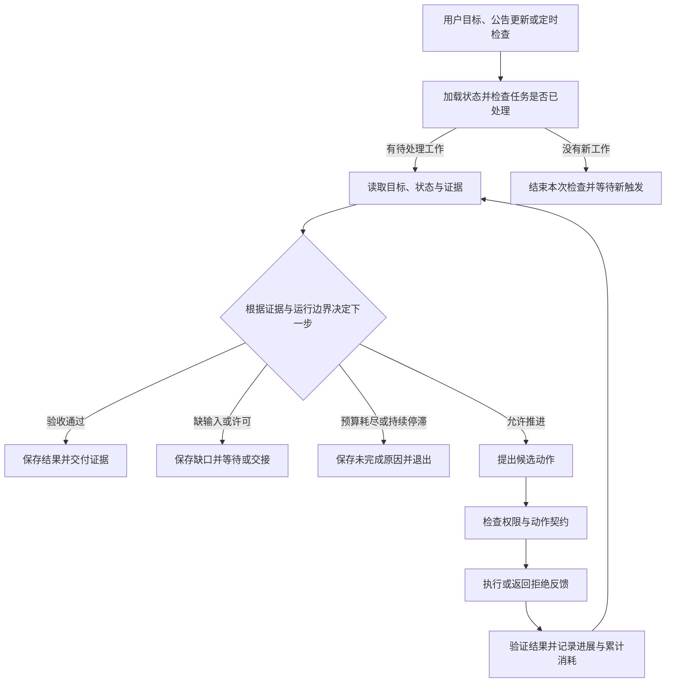
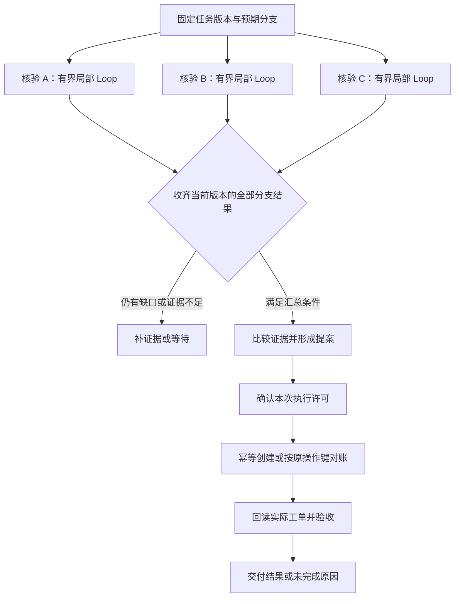

让 Agent 核验一份公告，它可能需要“读取、发现缺口、继续查找、重新判断”。如果这项工作每天都要做，系统还需要发现新公告、唤起核验任务、保存已处理记录，并决定何时等待或交给人。把任务扩大到三份公告，它又需要决定哪些核验可以同时开始、什么时候汇总，以及谁负责最后创建工单。

两类问题经常混在一起。前者关心工作如何被触发、根据反馈推进并有依据地结束，后者关心多个行动之间如何连接。一个不断重试的循环可能毫无进展；一张连接完整的流程图也可能在缺少关键证据时提前汇总。

**Loop Engineering 设计持续工作的触发、反馈与控制机制，Graph Engineering 设计执行结构与协作契约。** 本文先用“词源 → 本质 → 类比 → 要素 → 边界 → 应用”六个维度讲清 Loop，再拆解 Graph，并用同一个案例说明两者如何组合。它接续[从 Prompt 到 Context，再到 Harness](/writing/prompt-context-harness-engineering/)：当指令和材料已经组织好，运行系统还要决定事情怎样一步步发生。

## 一、总览：反馈的时间顺序与任务的依赖结构

先约定术语。本文把 **Loop Engineering** 用作“围绕任务触发、执行反馈、验证、状态与退出设计持续工作机制”的工程称呼；把 **Graph Engineering** 用作“围绕节点、边、共享状态和调度设计 Agent 执行图”的工程称呼。这是便于讨论的工作定义，不是两个已经统一标准化的学科分类。这里讨论的 Graph 是执行图，知识图谱中的实体与关系属于另一种图。

| 视角 | 核心问题 | 主要设计对象 | 应修复的典型故障 |
| --- | --- | --- | --- |
| Loop | 何时开始，得到反馈后怎样推进，何时结束？ | 触发、验证、跨轮状态、进展判据、退出与等待 | 重复处理、无效重试、过早完成、永不停止 |
| Graph | 哪些工作可以开始，结果怎样交接？ | 节点契约、依赖边、分支、汇合、状态更新 | 漏执行前置步骤、分支覆盖、错用旧结果 |
| Harness | 谁负责执行、保存事实和验证结果？ | 上下文、权限、工具、持久状态、预算、验收 | 恢复后重复写入、授权失效、成功无法查证 |

一个简单循环可以画成带回边的图；图中某个节点也可以运行一个局部循环。“用了 while”与“用了图框架”只是实现线索，无法直接说明系统有多少自主性或可靠性。

Anthropic 将预定义代码路径的工作流与由模型动态决定过程的 Agent 作了区分。这个区分提示我们：**控制路径由谁决定，与路径用代码还是图表示，是两个问题。** 固定图可以包含模型路由，普通函数也可以实现确定性工作流。[Building effective agents](https://www.anthropic.com/engineering/building-effective-agents)

## 二、Loop Engineering：用六个维度理解持续工作的控制机制

### 1. 词源拆解：让反馈驱动下一步

**Loop**（循环）意味着执行产生结果，结果经过验证，验证反馈决定下一步。**Engineering**（工程化）意味着把目标、触发方式、验证标准、状态记录与控制边界设计成可以运行、检查和维护的机制。

因此，可以把 Loop Engineering 理解为：**设计一套根据反馈持续推进任务，并能在明确边界内结束或交接的 Agent 工作机制。**

关键是反馈有没有改变后续行动。连续调用模型很多次，只能说明系统在运行；每轮发现了什么、修正了什么、是否更接近目标，才能说明循环是否有效。

### 2. 本质定义：把“下一步怎么办”变成可运行的规则

> Loop Engineering 是设计、实现和调优 AI Agent 外层工作循环的工程实践。系统根据目标、事件或时间触发任务，调用一个或多个 Agent 执行工作，依据可检查的证据验证结果，保存必要状态，再决定继续推进、等待条件变化、完成退出或请求人工介入。

这一定义强调持续组织工作的责任，既包括围绕一个目标多轮推进，也包括跨运行的任务发现与调度。

| 形式 | 驱动方式 | 示例 |
| --- | --- | --- |
| 目标驱动 | 围绕一个目标迭代，直到达标或触及边界 | 核验指定公告，补齐证据后交付结论 |
| 事件或时间驱动 | 在事件发生或预定时间到达时发现并处理工作 | 收到公告更新后核验；每天检查尚未处理的冲突 |

两者可以组合：每日检查发现一份新公告，再启动有界的核验任务。监控服务可以长期存在，每次唤起的任务仍须有清楚的完成、等待或退出规则。社区仓库中的每日分诊、CI 排查等模式体现了这种组织方式。[Loop Engineering 实践仓库](https://github.com/cobusgreyling/loop-engineering)

2026 年 6 月，Addy Osmani 等实践者开始集中讨论这一概念。它更适合被定位为正在形成的工程实践；其新颖性与实际收益仍在研究中。本文用职责划分解释它，不把 Prompt、Context、Harness、Loop 写成彼此取代的行业阶段。[Addy Osmani：Loop Engineering](https://addyosmani.com/blog/loop-engineering/)、[Loop Engineering 探索性研究](https://arxiv.org/abs/2608.21884)

核心问题有三个：**什么时候开始？凭什么认为有进展？什么时候继续、停止或交接？**

### 3. 通俗类比：给工作安排一套反馈制度

假设你让同事整理一份报告。你可以逐轮交代：“先列提纲”“补这组数据”“修改第三段”“再检查一遍”。也可以提前约定：

> 每周一读取最新数据，按模板生成报告；检查数据完整性与引用来源；发现问题后修订。全部检查通过就保存待审稿；缺少关键数据就等待补充；连续两次修订仍无法解决，就带着问题和已尝试的方法交给我。

后者体现了循环工程的思路：你把自己的工作判断，转化为触发规则、验收标准、反馈路径和交接条件。“两次”只是这项工作的约定，需要根据任务调整。

这个类比强调控制责任的变化。Prompt Engineering 仍然有价值，因为循环中的任务说明、工具使用规则与评审指令都需要表达清楚。

### 4. 核心要素：一个工作循环需要回答六个问题

下面六项是便于设计和检查的工程归纳，并非固定的行业标准。

| 要素 | 要回答的问题 | 典型设计 |
| --- | --- | --- |
| 目标与验收 | 做成什么才算完成？ | 交付物、验收条件、任务范围 |
| 触发与调度 | 什么时候开始，下一项做什么？ | 用户目标、事件或定时触发、任务去重 |
| 执行与反馈 | 本轮做什么，结果如何改变下一步？ | 规划、工具调用、观察、调整策略 |
| 验证与进展 | 有什么证据证明有效？ | 测试、数据校验、评分规则、必要的独立评审 |
| 状态与恢复 | 下次如何接着做？ | 已完成事项、失败尝试、产物位置、检查点 |
| 边界与交接 | 什么时候停、等或找人？ | 时间与费用预算、轮数限制、停滞检测、权限边界、人工接管 |

验证机制必须检查实际结果。例如，Agent 说“工单已经创建”，需要由权威系统中的工单记录支持。对代码任务，测试通过能支持多大范围的完成判断，也取决于测试覆盖了哪些验收条件。[Anthropic：Agent 评估方法](https://www.anthropic.com/engineering/demystifying-evals-for-ai-agents)

独立 Evaluator 是一种可选增强。Anthropic 的实践表明，分离生成与评审有助于处理自评偏宽的问题，但评审 Agent 本身仍需调校；模型能力提升后，它对部分任务也可能成为额外开销。因此，成熟循环需要可信的验证机制，是否引入第二个 Agent 应由验证收益决定。[Anthropic：长时间运行应用的 Harness 设计](https://www.anthropic.com/engineering/harness-design-long-running-apps)

### 5. 边界辨析：按职责理解各类工程实践

| 概念 | 主要关注点 |
| --- | --- |
| Prompt Engineering | 如何表达任务、约束和输出要求 |
| Context Engineering | 每一步提供哪些知识、历史、工具信息和状态 |
| Agent Loop | 一次运行内部如何反复调用模型、使用工具、接收结果 |
| Harness Engineering | 如何组织模型运行所需的控制逻辑、工具、上下文和执行环境 |
| Loop Engineering | 如何持续触发和管理工作，根据结果验证、续跑、等待、退出或交接 |
| Graph Engineering | 步骤或 Agent 之间的依赖、分支、并行、汇合与数据流 |

Harness 与 Loop 的边界并非统一标准。部分实践把 Loop 放在 Harness 之上，强调跨运行的调度；Anthropic 的 Harness 定义本身也包含驱动模型和工具调用的循环。上表是一种职责划分，实际实现中允许重叠。[Addy Osmani](https://addyosmani.com/blog/loop-engineering/)、[Anthropic：Managed Agents 架构](https://www.anthropic.com/engineering/managed-agents)

Loop 可以管理一个或多个 Agent；Graph 的节点也可以是普通函数。Agent 数量、控制权归属和执行结构是不同维度，不能用“单 Agent 是 Loop，多 Agent 是 Graph”来区分。

还要分清三种“再来一次”：工具重试处理暂时性故障，Agent 再规划处理证据变化，外层任务恢复处理中断后的未完成责任。三者不应各自无限重试，也不应在恢复时都获得一份全新预算。创建工单后响应丢失，应进入[副作用恢复与对账](/writing/harness-engineering-recovery/)，不能直接重发创建请求。

### 6. 应用场景：让反馈明确、迭代有价值

选择场景时，先看目标能否说明白、结果能否检查、反馈能否指导下一轮行动。清晰的评价标准和可衡量的改进，是迭代式 Agent 工作流的重要适用条件。[Anthropic：Building effective agents](https://www.anthropic.com/engineering/building-effective-agents)

| 场景 | 反馈闭环示例 | 验收或交接示例 |
| --- | --- | --- |
| Bug 修复 | 复现 → 修改 → 测试 → 根据失败修正 | 相关验收通过；无法复现则交接 |
| CI 排查 | 接收失败事件 → 定位 → 修复 → 重跑 | 检查通过；外部服务故障则等待 |
| 数据清洗 | 检测异常 → 清洗 → 校验 → 处理剩余问题 | 满足质量规则；歧义数据交人判断 |
| 内容生产 | 初稿 → 核查事实与结构 → 修订 → 复审 | 达到约定标准；关键证据缺失则暂停 |

回到本文的教学任务：核验公告 A 的生效日，与知识库记录比较；发现冲突时形成提案，得到允许后创建一张待核验工单。知识库记录为 9 月 1 日，公告修订版写明 9 月 15 日，但 Agent 最先读到的摘要没有修订信息。

合理的循环应该发现证据不够，定位原公告，再把新证据用于比较。失败的循环则可能反复换措辞搜索，获得相同摘要，却把每次调用都当作进展。为此，可以先写出以下运行约定：

| 约定 | 本任务的具体含义 |
| --- | --- |
| 触发 | 用户指定公告，或发现尚未处理的公告修订版 |
| 目标 | 核验生效日；有冲突时按许可创建待核验工单 |
| 进展证据 | 取得修订版原文、确认字段冲突，或定位明确的访问障碍 |
| 完成条件 | 核验结论带有来源；需要创建的工单已回读且字段符合提案 |
| 退出或交接 | 预算耗尽、重复探索无进展、关键资料不可访问或缺少执行许可 |
| 持久记录 | 公告版本、已查来源、未解决缺口、累计消耗与工单操作键 |



*图 1｜外层机制负责触发与接续工作，局部循环负责根据反馈推进。等待状态只有在所需条件变化后才恢复；恢复时继承原任务状态与预算。图中省略超时和结果未知等具体错误分支。*

在这个任务里，模型说“我换个方法再试试”只是行动提议。每轮可以记录已满足的证据要求、剩余缺口、动作标识、结果指纹和累计消耗。重复检测应同时考虑动作与结果：同一个查询在数据更新后可能有价值，不同措辞的查询也可能返回同一份无用材料。

读取索引页可能只是准备工作，不要求每步立即提高答案分数，但累计探索必须受预算限制。下文代码用“连续两轮没有新证据”演示停滞检测，这是教学策略，不是通用阈值。继续、等待、取消与终态的完整生命周期见[运行循环与规划](/writing/harness-engineering-loop/)。

## 三、Graph Engineering：把交接条件变成执行结构

### 从单份核验扩展到三份资料

现在要求核验 A、B、C 三份公告，分别形成带来源的结果，汇总所有冲突，再创建一张工单。核验彼此独立，可以并行；汇总依赖三份结果；如果本次写入需要审批，审批必须绑定最终提案。

把每份核验都放进一个大循环，会让“当前查谁、谁已完成、能否汇总”等状态不断混入模型上下文。显式执行图可以把这些调度条件交给程序。



*图 2｜箭头表达业务依赖，不对应某个 SDK 的完整代码。汇合菱形表示应用要求的屏障，不能仅凭画出三条入边就假设框架会等待全部分支。*

LangGraph 的 Graph API 使用 State、Nodes、Edges 表达工作流，节点可以包含模型调用，也可以只是普通代码。它还通过 reducer 定义状态更新如何合并。这提供了一种具体实现方式；本文的业务契约并不依赖必须使用 LangGraph。[Graph API 官方文档](https://docs.langchain.com/oss/python/langgraph/graph-api)

### 节点边界应对应可验收、可恢复的工作

把节点命名为“研究员”“专家”“总结者”，并没有说明输入和产物。对本任务更有帮助的节点契约是：

| 节点 | 必需输入 | 产物与完成证据 | 失败出口 |
| --- | --- | --- | --- |
| 核验来源 | source_id、资料版本、待核验字段 | 字段判断、证据引用、尚未解决的缺口 | 证据不足或来源不可用 |
| 汇总提案 | 本次要求的所有来源结果 | 保留冲突与来源的工单提案及摘要哈希 | 缺分支、版本不一致或证据冲突待处理 |
| 确认许可 | 操作者、具体动作、当前提案哈希 | 与该动作及版本绑定的有效许可 | 拒绝、撤销或等待 |
| 写入与对账 | 有效许可、候选参数、持久操作键 | 权威资源编号与实际状态 | 结果未知、业务拒绝或参数冲突 |
| 验收 | 原任务要求与实际资源 | 字段一致性检查和交付引用 | 未通过，进入明确修复流程 |

不是每个节点都需要一次模型调用，也不是每个节点都值得成为独立 Agent。来源读取与字段校验可能由普通函数完成；需要独立上下文或专业推理时，再考虑委派。多 Agent 的预算和产物责任见[协作篇](/writing/harness-operations-multi-agent/)。

拆节点的一个实用问题是：如果这里中断，下次必须重做多少工作？一个节点包办三份检索、汇总、审批和写入，恢复时会很难说明哪些代码可能再执行。拆得过细又会增加状态读写、调度和调试成本。边界应对应清楚的输入输出、故障范围和验收责任。

### 边要表达条件，汇合要知道在等谁

“A 连到汇总”可能表示 A 完成就触发，也可能是屏障的一部分，必须核对框架语义。动态拆分任务尤其需要在派发前记录预期分支集合，例如 `{A, B, C}`；只统计“收到了三个结果”，会把 A 的两次重放误认为额外完成了一份工作。

汇合节点应逐项检查分支标识、任务版本和结果状态。三份分支都结束，但 C 返回 `needs_evidence`，只能说明工作已返回，不能说明证据已充分。业务可以允许带缺口的部分报告，也可以要求补齐资料后才能写入，但这个选择必须在任务契约中明确。

分支超时之后，汇合不能无期限等下去；父任务应定义截止时间、部分交付策略与取消传播。用户修改待核验范围时，则需要更新任务版本和预期分支集合，使旧结果失效或重新核验。状态变化必须能被汇合节点识别，不能只追加一条聊天消息。

### 合并规则往往比画图更重要

让 A、B、C 都返回 `result`，可能产生覆盖或并发更新错误；把所有结果追加到列表里，又可能在重试后收进重复条目。更稳妥的教学方案是用“任务版本 + 来源编号”作为逻辑键，保存带来源版本的结果。

相同逻辑键、相同结果可视为重放；相同键却出现不同结果，应保留冲突并进入修订决策。不要未经定义就采用“最后到达者胜出”，因为到达顺序通常不代表事实新旧或证据权威性。

如果调度器可能改变结果到达顺序，合并规则就要考虑顺序对结果是否有影响；如果允许重放，还要考虑重复更新是否改变状态。累加 Token 消耗与合并事实是两种不同口径：前者可能应计入真实发生的每次调用，后者不应把同一事实复制三遍。一个通用的列表追加函数不能替代这些业务判断。

### 执行图可以有环，任务依赖要说明环的用途

严格的任务依赖 DAG 不允许环，因为“先完成 A 才能开始 B，先完成 B 才能开始 A”无法启动。Agent 的执行图却可以有回边，例如证据不足时返回检索。这里的环表示迭代控制，并不一定是依赖定义错误。

有环也意味着图本身不会证明程序能结束。每条回边都需要退出条件、资源上限和停滞处理。框架的递归或步数限制通常只是调度层保护；例如 LangGraph 文档中的 recursion limit 计量 super-step，不能直接充当整项任务跨恢复的费用预算。[Graph API：运行步数限制](https://docs.langchain.com/oss/python/langgraph/graph-api#recursion-limit)

## 四、组合与演变：固定主干，保留有边界的探索

对于这个案例，一个自然的组合是：任务调度层在发现新资料时启动核验；Graph 管理三个来源的依赖、汇合和最终写入；每个核验节点内部使用有界的 Agent Loop，决定下一步读取哪份原文、是否需要补充搜索，以及何时返回证据缺口。

这是一种按问题增长的建设顺序，而非整个行业必须经历的替代史：

| 任务变化 | 可以增加的机制 | 新增责任 |
| --- | --- | --- |
| 材料齐全，步骤固定 | 普通函数或固定流程 | 输入与结果校验 |
| 需要根据反馈寻找缺失证据 | 有界 Agent Loop | 进展、停止与预算 |
| 多份任务有分支和依赖 | 显式 Graph | 节点契约、汇合与合并 |
| 主干稳定，局部路径不确定 | Graph 包含局部 Loop | 局部退出、全局预算和结果交接 |
| 新工作持续到来 | 事件或定时触发的外层 Loop | 发现任务、去重、跨运行状态与交接 |
| 任务跨会话、审批或故障恢复 | 持久化 Harness | 重放、授权复检与副作用对账 |

在本文的职责划分中，Graph 描述执行结构，局部 Loop 描述反馈迭代，外层 Loop 组织持续到来的工作；Harness 提供它们所需的运行控制、上下文、执行许可、工具与事实存储。一个具体系统可以由同一套运行器承担其中多项职责。上一篇的 Prompt 与 Context 也继续发挥作用：局部核验需要清楚的判断规则和正确材料，外层汇总需要分支结果及其来源，不必复制所有子循环的聊天历史。

### 恢复边界落在节点之外

检查点只能恢复运行状态，业务副作用仍要对账。LangGraph 的中断节点重执行规则及可运行例子集中在[框架与协议篇](/writing/langchain-langgraph-frameworks-and-protocols/)。本篇的组合约束是：审批先于写入，局部 Loop 的重复执行不能产生新业务操作键，旧图任务不能默认交给不兼容的新图。三种控制引擎如何承担这项责任，见[架构选型](/writing/harness-architecture-selection/)。

## 五、实践：先验证循环与汇合的两个不变量

以下 Python 3 示例不调用模型、不连接外部服务，只检验两个局部规则：在本教学策略下，连续两轮没有新证据就返回停滞；汇合以分支身份判断完整性，拒绝旧任务版本和冲突重放。它不是完整运行器，也没有实现并发调度、持久恢复和工单写入。

```python
def collect_evidence(observations, budget=4, stall_limit=2):
    seen, stalls, used = set(), 0, 0
    for batch in observations:
        if used >= budget:
            return "exhausted", seen, used
        used += 1
        new = set(batch) - seen
        seen.update(new)
        stalls = 0 if new else stalls + 1
        if stalls >= stall_limit:
            return "stalled", seen, used
    return "observations_ended", seen, used


def join_results(expected, updates, task_version):
    merged = {}
    for update in updates:
        source = update["source"]
        if update["task_version"] != task_version or source not in expected:
            raise ValueError("stale or unexpected branch")
        if source in merged and merged[source] != update:
            raise ValueError("conflicting replay")
        merged[source] = dict(update)
    ready = set(merged) == expected and all(
        item["status"] == "verified" for item in merged.values()
    )
    return ready, merged


a = {"source": "A", "task_version": 1, "status": "verified"}
b = {"source": "B", "task_version": 1, "status": "verified"}
assert collect_evidence([["v2"], ["v2"], ["v2"]])[0] == "stalled"
assert collect_evidence([["v1"], ["v2"]], budget=1)[0] == "exhausted"
assert not join_results({"A", "B"}, [a, a], 1)[0]
assert join_results({"A", "B"}, [a, b, a], 1)[0]
assert join_results({"A", "B"}, [a, b], 1) == join_results({"A", "B"}, [b, a], 1)
assert not join_results({"A", "B"}, [a, {**b, "status": "needs_evidence"}], 1)[0]

for updates in ([{**a, "task_version": 0}], [a, {**a, "status": "needs_evidence"}]):
    try:
        join_results({"A", "B"}, updates, 1)
    except ValueError:
        pass
    else:
        raise AssertionError("invalid result was accepted")
print("PASS: loop bounds and branch join contracts")
```

这里的 `verified` 是测试输入，不是可以盲信的模型自评。真实系统需要先校验证据与节点产物，再形成相应状态。`observations_ended` 也只代表演示输入用完，不能作为任务成功信号。

这段代码可以验证重复结果、缺失分支和版本错误等具体反例。要比较 Loop 与 Graph 在真实任务中的效果，还需接入同一组模型、工具和材料；代码断言不能证明图编排提高了模型正确率。

### 接入真实运行系统后，再演练六种故障

| 故障注入 | 预期处理 | 必须检查的事实 |
| --- | --- | --- |
| 检索连续返回相同摘要 | 局部 Loop 有界退出或切换有依据的策略 | 调用消耗与未解决缺口 |
| A 的结果重复送达，B 尚未返回 | 汇合继续等待 B | 按身份记录的预期与已收分支 |
| 用户修改任务后，旧 C 结果迟到 | 不混入新版本提案 | 任务版本与失效记录 |
| 一个分支因权限不足结束 | 按契约等待或部分交付 | 未取得的证据与实际授权边界 |
| 工单写入成功，但检查点未保存 | 恢复后用原键对账 | 实际工单数量与字段 |
| 审批等待期间提案发生变化 | 旧许可不能直接授权新提案 | 许可所绑定的动作及哈希 |

预算耗尽与取消也应向局部 Loop 和在途分支传播；最终写入与验收要预留资源。父任务不能让每个分支都自行读取同一个余额后各自花完。具体执行实验可以接续 [Mini Harness 实战](/writing/harness-integration-lab/)，其中单动作恢复机制是基础，本篇的并行图与局部探索需要另外实现。

### 评测要分别观察局部推进与全局交付

固定模型、工具和数据快照，比较单 Loop、固定 Graph、Graph 加局部 Loop 三种配置。任务样本覆盖材料完整、证据缺失、分支超时和写入结果未知；总预算包含重试、汇总与验收，不只计算首次模型调用。

Loop 层记录无进展调用比例、退出原因和取证成功率；Graph 层记录缺分支汇总、重复合并、旧版本混用和关键路径耗时；整项任务记录实际资源验收通过率、重复写入、总成本和人工介入。并行可能缩短等待时间，同时增加调用费用，两项指标都应保留。

先用固定工具桩验证调度与恢复，再用多个模型试次检验任务质量。没有实验数据时，可以解释机制为何可能有用，但不应编造“图比循环快多少”或“成功率提高多少”。评测设计可参考[可重复的回归系统](/writing/agent-evaluation-engineering/)。

## 六、回到设计：让不确定性在有边界的位置发生

材料已经齐全时，固定流程足够；需要发现缺失证据时，为局部工作增加反馈循环；出现分支、依赖与恢复交接时，把它们写成执行图。无论选择哪种表示，仍要回答：什么算进展、何时允许下一步、结果由谁验收、中断之后哪些事实还能成立。

对本文的资料核验任务，最终设计可以浓缩为三份产物：一份明确触发、进展与退出条件的循环约定，一张标明预期分支和汇合条件的执行图，一份写入与恢复契约。**循环设计的核心能力，是为推进与退出提供可检查的依据，让每一轮行动有理由，让完成与交接有标准。**

## 参考资料

Loop Engineering 定义与新增资料核对日期：2026-09-06；原有框架资料核对日期：2026-09-05。术语划分、案例结构、故障表及示例代码为本文的工程归纳；框架行为以对应文档和实际安装版本为准。

- [Addy Osmani：Loop Engineering](https://addyosmani.com/blog/loop-engineering/)，2026 年 6 月的实践者定义、触发与持续工作机制。
- [Cobus Greyling：loop-engineering](https://github.com/cobusgreyling/loop-engineering)，任务模式、状态与运行控制的社区实践。
- [Loop Engineering: Building Blocks, Adoption, and Impact](https://arxiv.org/abs/2608.21884)，关于概念形成与采用情况的探索性预印本，收益结论仍需进一步研究。
- [Anthropic：Harness design for long-running application development](https://www.anthropic.com/engineering/harness-design-long-running-apps)，生成与评审分离的作用、调校和成本取舍。
- [Anthropic：Demystifying evals for AI agents](https://www.anthropic.com/engineering/demystifying-evals-for-ai-agents)，实际结果、执行轨迹与评估器的区分。
- [Anthropic：Scaling Managed Agents](https://www.anthropic.com/engineering/managed-agents)，Harness、会话和执行环境的职责划分。
- [Anthropic：Building effective agents](https://www.anthropic.com/engineering/building-effective-agents)，预定义工作流、动态 Agent 与反馈优化的设计背景。
- [LangGraph：Graph API overview](https://docs.langchain.com/oss/python/langgraph/graph-api)，状态、节点、边、合并规则与调度步数。
- [LangGraph：Thinking in LangGraph](https://docs.langchain.com/oss/python/langgraph/thinking-in-langgraph)，从业务步骤和状态设计节点边界。
- [LangGraph：Persistence](https://docs.langchain.com/oss/python/langgraph/persistence)，checkpointer、store 与内存实现的边界。
- [LangGraph：Interrupts](https://docs.langchain.com/oss/python/langgraph/interrupts)，暂停、恢复与节点代码重执行。
