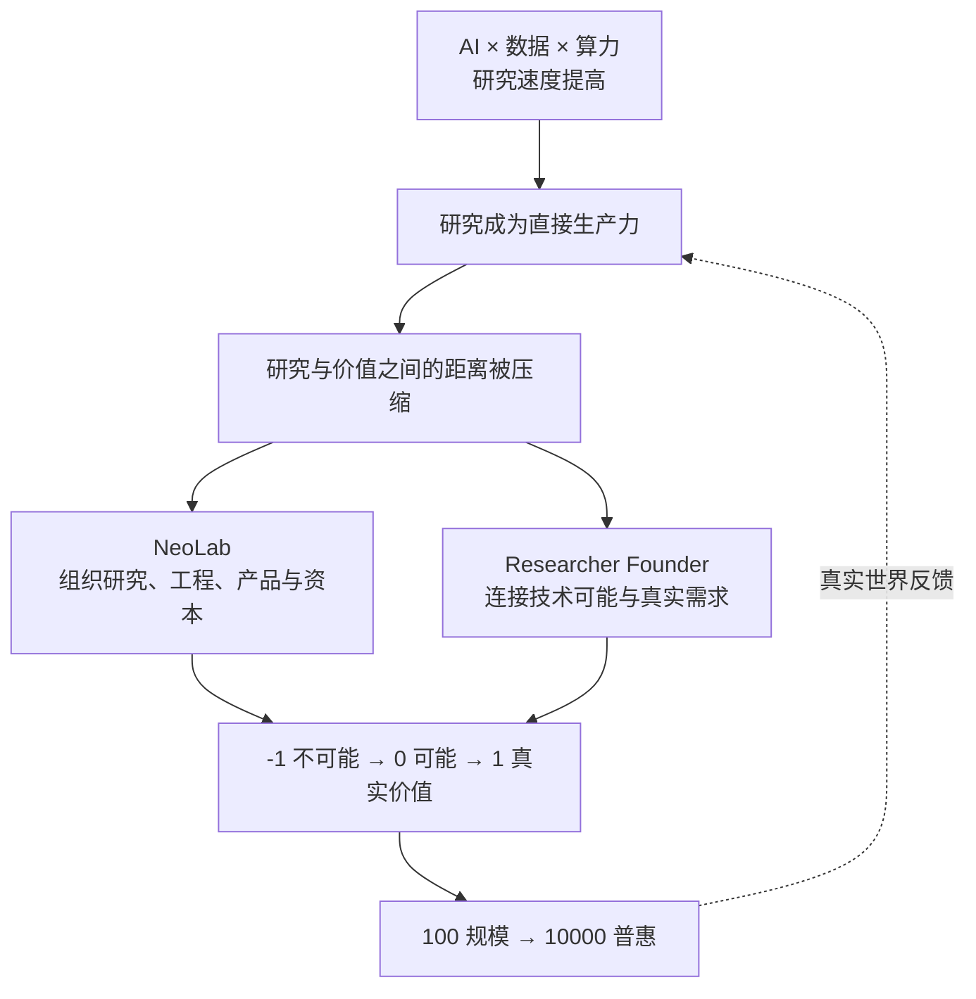

> 系列：[1. 工作系统](/writing/product-work-methodology/)｜[2. 结果契约](/writing/agent-product-contracts-context/)｜[3. 产品节奏](/writing/agent-product-evaluation-rhythm/)｜[4. 组织未知](/writing/lu-qi-researcher-founder/)｜[5. 思维与行动](/writing/researcher-founder-thinking/)｜[6. 学习边界](/writing/learning-organization-boundaries/)｜[7. 整体思考](/writing/ai-product-work-synthesis/)

陆奇这次关于 Researcher Founder 的分享，表面上谈的是“研究型创业者”，实际上讨论的是一个更大的变化：**当 AI 同时进入科研、工程和商业环节，创新不再是一场从实验室到市场的接力赛，而开始成为研究、产品、组织和资本同步迭代的过程。**

所以，这场分享最重要的并不是列举了哪些 AI 机会，而是提出了一个关于新时代创新机制的判断：

> 研究正在从生产力的上游，进入生产过程本身。

本文是对[奇绩创业公开课 Researcher Founder 系列第一课](https://github.com/MiraclePlus/contents/blob/main/docs/%E7%A0%94%E7%A9%B6%E5%9E%8B%E5%88%9B%E4%B8%9A%E8%80%85%EF%BC%9A%E5%A6%82%E4%BD%95%E4%BB%8E%20-1%20%E5%88%B0%201%20%E5%8A%A0%E9%80%9F%E5%88%9B%E6%96%B0%EF%BD%9C%E5%A5%87%E7%BB%A9%E5%88%9B%E4%B8%9A%E5%85%AC%E5%BC%80%E8%AF%BE%20Researcher%20Founder%20%E7%B3%BB%E5%88%97%E7%AC%AC%E4%B8%80%E8%AF%BE.md)的分析性总结，不是逐字稿。我更想追问的是：陆奇依据什么得出这些结论，这些判断中哪些最值得创业者重视，又有哪些边界不能忽略。

*图：陆奇演讲课件，来源于奇绩创坛公开内容。*

## 真正的变化不是多了一个 AI 工具，而是生产力结构变了

很多人从“AI 可以做什么”出发理解这一轮变化：写代码、做设计、生成内容、自动回复客户。但陆奇把分析尺度向上提了一层，从生产力的四个要素观察变化：

| 生产力要素 | 过去 | 正在发生的变化 |
| --- | --- | --- |
| 生产者 | 开发、市场与运营人员 | 研究者成为直接生产者，硅基智能承担更多执行 |
| 生产过程 | 开发、运营与商业化 | 研究本身进入持续生产过程 |
| 生产工具 | 机器、设备与软件系统 | 算力、模型与智能体成为核心工具 |
| 生产对象 | 原材料、商品、信息与流程 | 数据同时是投入、过程资产与产出 |

这个判断的关键不在于“研究更重要了”，而在于**研究到价值之间的转化链条显著缩短了**。

过去，基础发现需要经过漫长的工程化和产业化才可能成为产品。今天，AI 可以帮助人类搜索资料、提出假设、设计实验、编写代码和分析结果；研究产出的代码、模型、材料设计或决策方案，又能直接进入生产系统。用户反馈随后迅速回到下一轮研究。

因此，研究与商业之间的关系，正在从“成果转化”变成“共同演进”。

*图 1｜当研究、工程与市场的反馈距离缩短，Researcher Founder 连接技术可能、真实需求与规模化价值。*

这张逻辑图解释了整场分享：因为研究、工程和市场之间的反馈周期缩短，旧的组织边界开始松动；组织变化又进一步放大了研究进入现实世界的速度。

## 下一代公司的竞争，是“组织未知”的能力

陆奇用 **NeoLab，新实验室**，描述正在形成的新型前沿组织。

NeoLab 不是传统实验室的公司化，也不是在公司里增加一个研究部门。它要在同一个组织内同时承担四类风险：

- **科学风险：** 原理和技术路径是否成立；
- **工程风险：** 能力能否成为稳定、可重复的系统；
- **市场风险：** 是否存在真实而持续的需求；
- **资本风险：** 组织能否获得足够长的时间和资源完成探索。

在传统创新体系中，这四种风险通常由不同机构、不同阶段承担：科研机构负责证明可能，企业负责工程和市场，大公司与资本再负责规模化。但在大模型、AI for Science、脑机接口、具身智能和商业航天等领域，它们已经很难被拆开。

研究需要数据和算力，数据来自真实场景；工程需要产品反馈，产品验证又可能改变研究方向。于是研究、工程、产品、市场和资本必须形成一个高频闭环。

这也是陆奇列举 OpenAI、Anthropic、SpaceX 等公司的真正用意：值得关注的不只是它们拥有某项技术，而是它们证明了，创业公司也可以直接承担过去只有国家实验室、大型研究机构或科技巨头才能承担的前沿任务。

由此可以得到一个更有解释力的判断：**未来最重要的公司，未必只是更会做产品的公司，而可能是更会组织研究、工程、资本与市场的公司。**

## 研究型创业者不是一种身份，而是一种能力结构

Researcher Founder 很容易被理解成“科学家出来创业”。但陆奇真正强调的，是一种复合能力结构：既能把问题从“不可能”推到“可能”，又能把“可能”推向真实价值。

这类人既需要科学家的好奇心、第一性原理和研究判断，也需要创业者理解需求、组织资源、承担风险和持续行动的能力。

背后还有一个重要的稀缺性迁移：随着 AI 降低代码、原型和信息处理的成本，“能不能做”会越来越便宜，“做什么才重要”会越来越昂贵。

因此，未来真正稀缺的能力会逐渐变成：

- 能否提出高质量的问题；
- 能否判断什么值得长期投入；
- 能否理解尚未被准确表达的需求；
- 能否把技术嵌入真实工作流；
- 能否在高度不确定中组织行动。

这也是为什么分享中反复强调从 **Book Smart** 走向 **Street Smart**。后者不是世故，而是对用户、交易、预算、流程、组织和价值流动的真实理解。一个人可以非常聪明，却仍然不知道客户为什么付钱、产品为什么进不了工作流，或者组织内部为什么无法推动一个看似正确的方案。

---

上一篇：[产品节奏](/writing/agent-product-evaluation-rhythm/)。

组织形态的变化已经出现，但抽象判断还不能指导个人行动。下一篇把研究、创新与斜率三种思维，落到选择问题和接触真实世界的方法。

下一篇：[思维与行动](/writing/researcher-founder-thinking/)。
