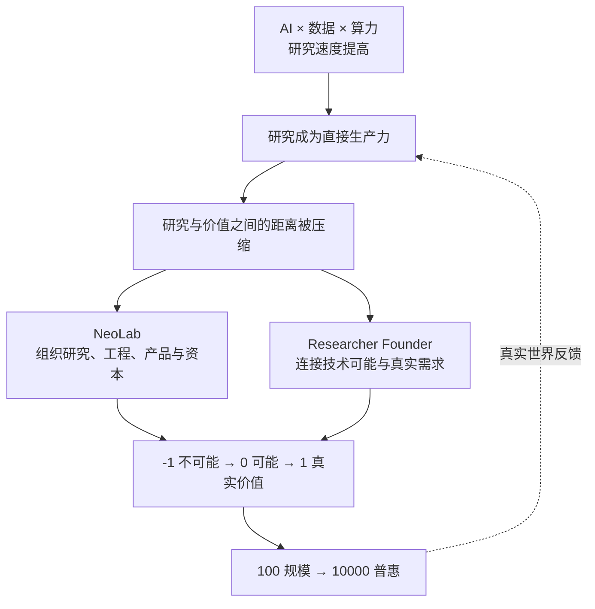

陆奇这次关于 Researcher Founder 的分享，表面上谈的是“研究型创业者”，实际上讨论的是一个更大的变化：**当 AI 同时进入科研、工程和商业环节，创新不再是一场从实验室到市场的接力赛，而开始成为研究、产品、组织和资本同步迭代的过程。**

所以，这场分享最重要的并不是列举了哪些 AI 机会，而是提出了一个关于新时代创新机制的判断：

> 研究正在从生产力的上游，进入生产过程本身。

本文是对[奇绩创业公开课 Researcher Founder 系列第一课](https://github.com/MiraclePlus/contents/blob/main/docs/%E7%A0%94%E7%A9%B6%E5%9E%8B%E5%88%9B%E4%B8%9A%E8%80%85%EF%BC%9A%E5%A6%82%E4%BD%95%E4%BB%8E%20-1%20%E5%88%B0%201%20%E5%8A%A0%E9%80%9F%E5%88%9B%E6%96%B0%EF%BD%9C%E5%A5%87%E7%BB%A9%E5%88%9B%E4%B8%9A%E5%85%AC%E5%BC%80%E8%AF%BE%20Researcher%20Founder%20%E7%B3%BB%E5%88%97%E7%AC%AC%E4%B8%80%E8%AF%BE.md)的分析性总结，不是逐字稿。我更想追问的是：陆奇依据什么得出这些结论，这些判断中哪些最值得创业者重视，又有哪些边界不能忽略。

*图：陆奇演讲课件，来源于奇绩创坛公开内容。*

## 一、真正的变化不是多了一个 AI 工具，而是生产力结构变了

很多人从“AI 可以做什么”出发理解这一轮变化：写代码、做设计、生成内容、自动回复客户。但陆奇把分析尺度向上提了一层，从生产力的四个要素观察变化：

| 生产力要素 | 过去 | 正在发生的变化 |
| --- | --- | --- |
| 生产者 | 开发、市场与运营人员 | 研究者成为直接生产者，硅基智能承担更多执行 |
| 生产过程 | 开发、运营与商业化 | 研究本身进入持续生产过程 |
| 生产工具 | 机器、设备与软件系统 | 算力、模型与智能体成为核心工具 |
| 生产对象 | 原材料、商品、信息与流程 | 数据同时是投入、过程资产与产出 |

这个判断的关键不在于“研究更重要了”，而在于**研究到价值之间的转化链条显著缩短了**。

过去，基础发现需要经过漫长的工程化和产业化才可能成为产品。今天，AI 可以帮助人类搜索资料、提出假设、设计实验、编写代码和分析结果；研究产出的代码、模型、材料设计或决策方案，又能直接进入生产系统。用户反馈随后迅速回到下一轮研究。

因此，研究与商业之间的关系，正在从“成果转化”变成“共同演进”。

这张逻辑图解释了整场分享：因为研究、工程和市场之间的反馈周期缩短，旧的组织边界开始松动；组织变化又进一步放大了研究进入现实世界的速度。

## 二、下一代公司的竞争，是“组织未知”的能力

陆奇用 **NeoLab，新实验室**，描述正在形成的新型前沿组织。

NeoLab 不是传统实验室的公司化，也不是在公司里增加一个研究部门。它要在同一个组织内同时承担四类风险：

- **科学风险：** 原理和技术路径是否成立；
- **工程风险：** 能力能否成为稳定、可重复的系统；
- **市场风险：** 是否存在真实而持续的需求；
- **资本风险：** 组织能否获得足够长的时间和资源完成探索。

在传统创新体系中，这四种风险通常由不同机构、不同阶段承担：科研机构负责证明可能，企业负责工程和市场，大公司与资本再负责规模化。但在大模型、AI for Science、脑机接口、具身智能和商业航天等领域，它们已经很难被拆开。

研究需要数据和算力，数据来自真实场景；工程需要产品反馈，产品验证又可能改变研究方向。于是研究、工程、产品、市场和资本必须形成一个高频闭环。

这也是陆奇列举 OpenAI、Anthropic、SpaceX 等公司的真正用意：值得关注的不只是它们拥有某项技术，而是它们证明了，创业公司也可以直接承担过去只有国家实验室、大型研究机构或科技巨头才能承担的前沿任务。

由此可以得到一个更有解释力的判断：**未来最重要的公司，未必只是更会做产品的公司，而可能是更会组织研究、工程、资本与市场的公司。**

## 三、研究型创业者不是一种身份，而是一种能力结构

Researcher Founder 很容易被理解成“科学家出来创业”。但陆奇真正强调的，是一种复合能力结构：既能把问题从“不可能”推到“可能”，又能把“可能”推向真实价值。

这类人既需要科学家的好奇心、第一性原理和研究判断，也需要创业者理解需求、组织资源、承担风险和持续行动的能力。

背后还有一个重要的稀缺性迁移：随着 AI 降低代码、原型和信息处理的成本，“能不能做”会越来越便宜，“做什么才重要”会越来越昂贵。

因此，未来真正稀缺的能力会逐渐变成：

- 能否提出高质量的问题；
- 能否判断什么值得长期投入；
- 能否理解尚未被准确表达的需求；
- 能否把技术嵌入真实工作流；
- 能否在高度不确定中组织行动。

这也是为什么分享中反复强调从 **Book Smart** 走向 **Street Smart**。后者不是世故，而是对用户、交易、预算、流程、组织和价值流动的真实理解。一个人可以非常聪明，却仍然不知道客户为什么付钱、产品为什么进不了工作流，或者组织内部为什么无法推动一个看似正确的方案。

## 四、三种思维：研究、创新与斜率

陆奇将研究型创业者需要的底层能力概括为三种思维。

### 1. 研究思维：选择比努力更重要

研究不能只追求短期新颖性，而要寻找“高水位”问题。

分享中给出了一个很有启发性的表达：

> 影响力 = 问题水位 × 持续时间。

一项工作即使短期热门，如果很快被替代，长期影响力仍然有限；如果它能持续成为后来研究、开发和产业的基础，其价值就会随时间不断累积。

因此，判断一个方向时，不应只问“能不能发表”或“现在热不热”，还应该问：

- 它连接的是局部技巧，还是更大的科学与产业结构？
- 它能否持续产生新的问题、工具和能力？
- 它未来是否具有不可替代性？
- 它可能产生怎样的研究、开发、产业和社会影响？

*图：演讲提出的系统性选题方法。来源于奇绩创坛公开内容。*

分享进一步把选方向拆成四步：选领域、到前沿、找空白、挖潜力。其核心并不是预测热点，而是寻找**个人禀赋、持久兴趣和问题空间**的交集。

### 2. 创新思维：从技术能力回到真实需求

陆奇对创新的定义，不是简单发明新技术，而是用更好的方法满足真实需求。

尤其在 AI 时代，表层功能很容易被复制。真正决定产品价值的，是能否看见功能背后的深层需求。企业可能说自己需要会议助手，但真正需要的可能是更好的感知、判断、协作与执行；个人购买一个看似没有功能价值的产品，背后可能是情绪、身份、关系、审美与归属感。

因此，不能从“我觉得有没有用”判断需求，而要观察真实行为：用户为什么使用、为什么付费、价值在哪里流动，以及产品为什么能进入或不能进入工作流。

这就是“研创一体”的含义：研究阶段就理解未来价值，产品阶段仍然回到科学与技术的第一性原理。它不要求基础研究立刻商业化，而是要求研究者从一开始就拥有更宽的坐标系。

### 3. 斜率思维：成长速度比静态能力更重要

AI 时代，一个人今天处于什么水平固然重要，但更重要的是他能否持续更新。陆奇把斜率拆成三部分：

- **认知斜率：** 学习新技术、理解新产业并更新判断的速度；
- **能动性斜率：** 在资源不足、路径不清时推动事情发生的能力；
- **品味斜率：** 判断什么值得做、什么足够好、什么具有长期价值的能力。

*图：高斜率人才与组织的能力结构。来源于奇绩创坛公开内容。*

同样，组织也有斜率。真正的 AI 原生组织，不只是给员工购买 AI 工具，而是让人和 AI 共同形成更快的学习、决策、执行与反馈闭环。

所以，研究思维决定能否看到高水位问题，创新思维决定能否把问题推向真实价值，斜率思维决定能否在长期不确定性中持续进化。

## 五、方法论最终落到三个动作

### 1. 到“河”对面去

“河”的一边是技术，另一边是用户、产业和真实工作流。

过去技术与开发能力稀缺，创业者往往先在技术一侧做好产品，再把它搬到需求一侧。AI 降低开发成本后，稀缺性开始倒转：技术实现越来越容易获得，对需求和场景的深度理解反而变得稀缺。

*图：从技术侧走向需求侧的“过河”隐喻。来源于奇绩创坛公开内容。*

FDE，前线部署工程师，只是一个具体角色。更广义的趋势是 **FDX**：产品、设计、工程、研究乃至组织负责人，都需要更加靠近一线。因为只有进入现场，才能看见问题如何发生、价值如何流动、技术怎样才能真正进入系统。

### 2. 到“墙”外面去

学校、实验室和大厂能够提供系统训练，但无法完整模拟创业的不确定性。创业只能在行动中学习。

选择大厂还是创业公司，也不应只看平台名气，而应判断哪个环境能提供更真实的问题、更快的反馈和更高的成长斜率。选择的目的不是获得一个标签，而是进入一个更有效的训练系统。

### 3. 到同行者中去

前沿创业不是个人英雄主义。越是不确定的问题，越需要高密度的人才、信息、反馈和信任。

人脉在这里不是简单的社交资源，而是一张认知网络和行动网络。好的社区真正提供的也不是热闹，而是让判断和行动共同加速的环境。

## 六、这场分享中最值得重视的三个判断

### 判断一：最大的变量，是反馈周期正在缩短

这是整场分享中最有价值的洞察。它比“AI 将产生很多创业机会”更有解释力。

研究、工程和市场之间的反馈周期缩短，可以同时解释三件事：为什么新公司能够承担更基础的问题，为什么团队会变小而人才密度提高，以及为什么研究、产品和销售的边界正在模糊。

谁能建立更短、更真实、更高质量的反馈循环，谁就更有机会穿越从 -1 到 1 的不确定性。

### 判断二：未来的壁垒，可能是组织学习速度，而不是单点技术

模型会迭代，工具会普及，代码成本会下降。更难复制的是：谁能更早发现高水位问题，更快进入真实场景，更有效吸收反馈，再把这些反馈变成新的研究与工程优势。

竞争的单位将从“某个模型或产品”，逐渐变成“整个组织的学习速度”。这也是斜率思维从个人能力延伸到组织设计之后最重要的含义。

### 判断三：研究与创业的起点都在前移

过去，创业往往从一个产品想法开始；未来，越来越多创业会从一个尚未解决的高水位问题开始。

与此同时，研究者也需要更早思考真实需求、工程路径和影响空间。研究与创业不是在某个成熟技术成果出现后才发生交接，而是在问题定义阶段就开始相互影响。

这意味着创业的起点前移到了三个更难的问题：

1. 什么能力正在从不可能变成可能？
2. 这种能力最终会改变什么真实需求？
3. 应该建立怎样的组织，才能持续完成从研究到价值的跃迁？

## 七、还需要保留的三条边界

陆奇的方向判断很有启发性，但如果把它直接变成创业口号，也可能忽略几个重要边界。

第一，**研创一体不等于让所有研究立即商业化。** 过早服从短期客户与收入，也可能让研究被局部需求牵引，失去长期价值。真正困难的是在长期科学价值与现实反馈之间建立循环，而不是简单选择其中一边。

第二，**NeoLab 并不天然比传统组织更有效。** 它同时承担四类风险，也意味着治理难度、资本压力和利益冲突都会增加。没有高质量判断与长期激励，“研究驱动”也可能退化成昂贵但无法验证的叙事。

第三，**不是每位优秀研究者都必须成为创业者。** 新时代需要的是研究与创新之间更好的连接，不是让所有人拥有同一种职业身份。研究型创业者更准确的理解，是一种可以由创始人、团队和生态共同完成的能力结构。

保留这些边界，反而能让“研究成为直接生产力”成为一个可检验、可迭代的命题，而不是一场关于未来的情绪动员。

## 结语：从理解机会，走向创造未来

陆奇所谓的 Researcher Founder，本质上是能够同时理解技术可能性、真实需求和组织方式的人。

他不一定首先是一位传统意义上的创业者，也不一定首先是一位科学家。他可能是一名学生、一位工程师、一位行业专家，或者一个刚开始制作原型的人。

但他必须从高水位问题出发，进入真实世界，在行动和反馈中建立判断，再与高密度的同行者一起，把“不可能”变成“可能”，把“可能”变成价值。

AI 时代最大的机会，或许不只是使用一种新技术，而是重新参与创造未来的过程。

---

本文课件截图均来自奇绩创坛公开发布的演讲整理，版权归原作者及发布方所有，仅用于内容评论与学习交流。建议结合[演讲全文](https://github.com/MiraclePlus/contents/blob/main/docs/%E7%A0%94%E7%A9%B6%E5%9E%8B%E5%88%9B%E4%B8%9A%E8%80%85%EF%BC%9A%E5%A6%82%E4%BD%95%E4%BB%8E%20-1%20%E5%88%B0%201%20%E5%8A%A0%E9%80%9F%E5%88%9B%E6%96%B0%EF%BD%9C%E5%A5%87%E7%BB%A9%E5%88%9B%E4%B8%9A%E5%85%AC%E5%BC%80%E8%AF%BE%20Researcher%20Founder%20%E7%B3%BB%E5%88%97%E7%AC%AC%E4%B8%80%E8%AF%BE.md)阅读。
