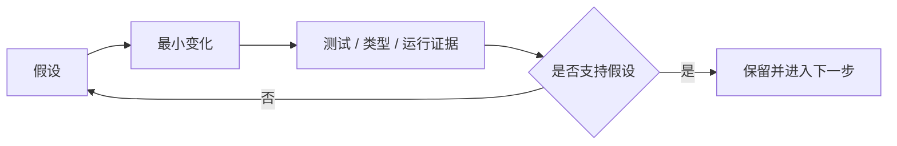

> 系列：[1. 全景](/writing/mattpocock-skills-overview/)｜[2. 对齐与语言](/writing/mattpocock-skills-alignment/)｜[3. 反馈与设计](/writing/mattpocock-skills-feedback-loops/)｜[4. 整体判断](/writing/mattpocock-skills-synthesis/)

代码生成变快后，系统真正的速度上限转移到反馈。TDD Skill 用失败测试建立目标，再用最小实现获得下一轮信号；Bug 诊断 Skill 分阶段复现、定位和验证，避免模型在多个假设之间同时修改。

架构 Skill 则不承诺自动重构整个旧系统，而是调查深模块机会，把候选和理由交给人选择。这种克制很重要：Agent 能快速制造大范围变化，但结构判断需要业务语言、历史约束和迁移成本。

*图 1｜小步循环让错误尽早暴露，速度来自反馈频率而非单次变更规模。*

Skill 可以规定循环，但证据仍必须来自真实工具。没有测试环境、浏览器或可观察系统，流程写得再好也只能得到语言上的“验证”。

---

上一篇：[对齐与语言](/writing/mattpocock-skills-alignment/)。

下一篇：[整体判断](/writing/mattpocock-skills-synthesis/)。

终篇把对齐、语言和反馈连起来，判断小型 Skills 为什么比完整流程接管更适合某些团队。
