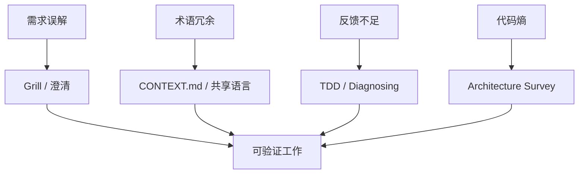
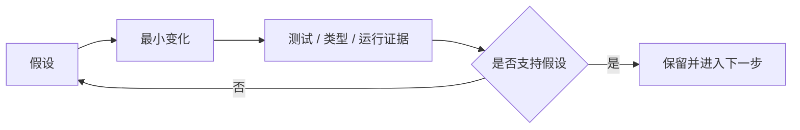

[`mattpocock/skills`](https://github.com/mattpocock/skills)明确反对由庞大方法论接管完整开发过程，转而提供小型、可修改、可组合的个人工程 Skills。仓库从真实失败出发：Agent 没理解需求、不了解项目语言、缺少运行反馈，以及在高速度下制造结构熵。

*图 1｜Skills 不是完整流程引擎，而是对常见失效点的局部干预。*

## 需求与共享语言的对齐

`grill-me`与`grill-with-docs`不急于给方案，而是通过连续问题暴露目标、边界和未知。它们把“需求不清”当作需要处理的工作状态，而不是让模型用默认假设填满空白。

追问的产物不应只留在会话。仓库进一步把领域术语写进 CONTEXT.md，把难以解释的选择写进 ADR。共享语言减少 Agent 每次重新推断概念的成本，也让文件、函数和讨论使用相同词汇。

这套方法的边界是不能无限访谈。好的 Skill 需要明确退出条件：关键用户、成功标准、不可接受结果和验证方式已经足够清楚，就进入小步实现；仍有高影响分歧，则把问题交还给人决定。

例如，用户说“让导入更快”。澄清后确认：一万行 CSV 必须在约定时间内导入，失败行要能下载重试，禁止跳过校验。这时就可以形成基线测量和失败样本；继续追问按钮颜色不会改变当前实现决策，应停止扩展问题。这个例子用于说明澄清的退出条件。

## 反馈循环与局部修正

代码生成变快后，测试、审查和运行反馈可能成为新的瓶颈。TDD Skill 用失败测试建立目标，再用最小实现获得下一轮信号；Bug 诊断 Skill 分阶段复现、定位和验证，避免模型在多个假设之间同时修改。

架构 Skill 则不承诺自动重构整个旧系统，而是调查深模块机会，把候选和理由交给人选择。这种克制很重要：Agent 能快速制造大范围变化，但结构判断需要业务语言、历史约束和迁移成本。

*图 2｜小步循环让错误尽早暴露，速度来自反馈频率而非单次变更规模。*

Skill 可以规定循环，但证据仍必须来自真实工具。没有测试环境、浏览器或可观察系统，流程写得再好也只能得到语言上的“验证”。
