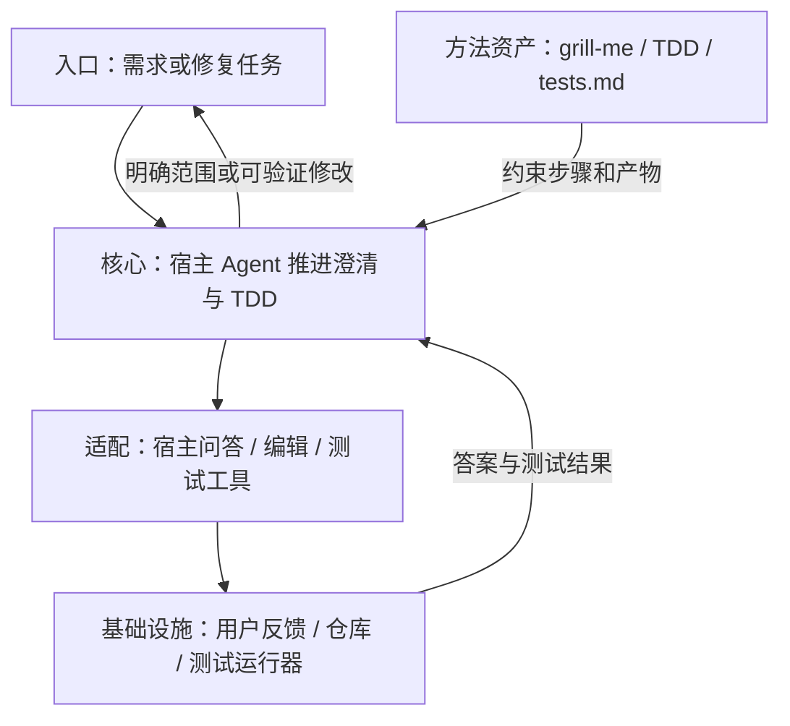
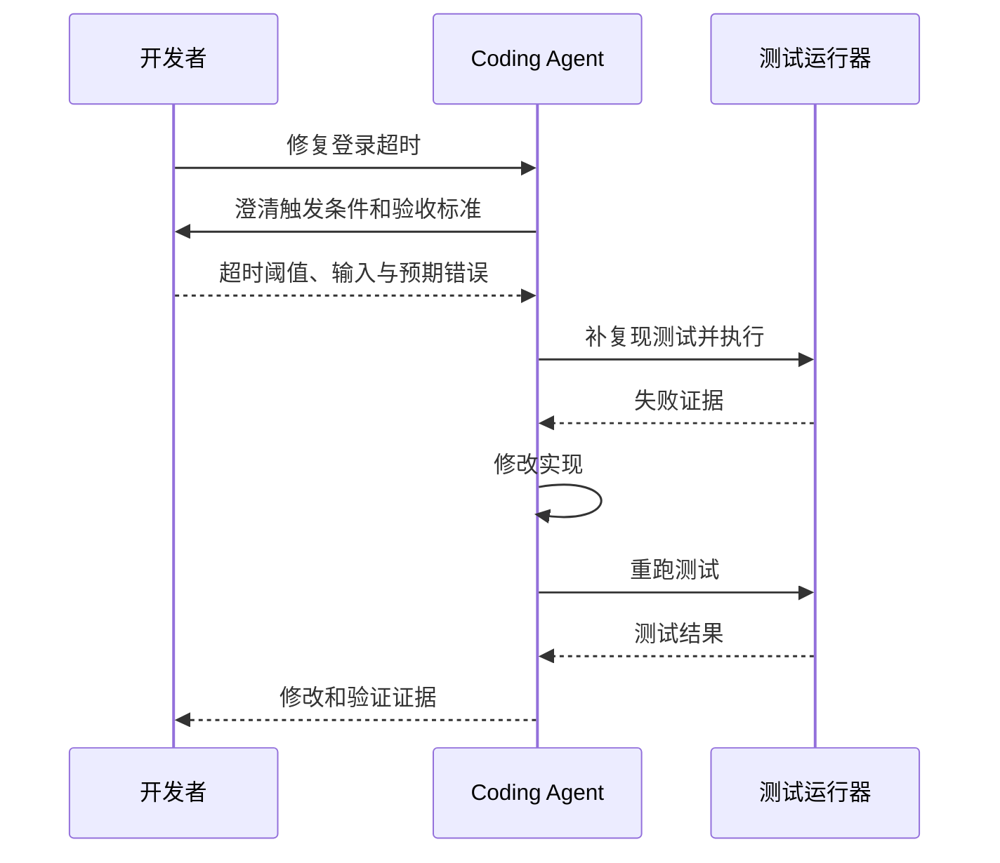

## 定位与价值

Matt Pocock Skills 是围绕需求澄清、设计与 TDD 的工作方法库；相较让模型一次生成整套实现，它把关键决策和反馈拆成可检查步骤。

适合需要把问题问清、以测试约束实现的团队；它不提供后台调度、工具隔离或持久工作流引擎。

研究基线：[mattpocock/skills @ 3cca18b](https://github.com/mattpocock/skills/blob/3cca18b368ae95cdbdebbff572ccafa662551015/README.md)；源码与社区核对日期为 2026-09-06。

## 技术架构



*图 1｜职责与数据流；逻辑分层不要求分开部署。*

## 核心机制



*图 2｜宿主读取 Skill 后执行工具；Skill 文件提供方法，不会自行发起工具调用。*

### 需求和语言怎样对齐

`grill-me`与`grill-with-docs`不急于给方案，而是通过连续问题暴露目标、边界和未知。它们把“需求不清”当作需要处理的工作状态，而不是让模型用默认假设填满空白。

追问的产物不应只留在会话。仓库进一步把领域术语写进 CONTEXT.md，把难以解释的选择写进 ADR。共享语言减少 Agent 每次重新推断概念的成本，也让文件、函数和讨论使用相同词汇。

这套方法的边界是不能无限访谈。好的 Skill 需要明确退出条件：关键用户、成功标准、不可接受结果和验证方式已经足够清楚，就进入小步实现；仍有高影响分歧，则把问题交还给人决定。

例如，用户说“让导入更快”。澄清后确认：一万行 CSV 必须在约定时间内导入，失败行要能下载重试，禁止跳过校验。这时就可以形成基线测量和失败样本；继续追问按钮颜色不会改变当前实现决策，应停止扩展问题。这个例子用于说明澄清的退出条件。


### 测试怎样驱动局部修正

代码生成变快后，测试、审查和运行反馈可能成为新的瓶颈。TDD Skill 用失败测试建立目标，再用最小实现获得下一轮信号；Bug 诊断 Skill 分阶段复现、定位和验证，避免模型在多个假设之间同时修改。

架构 Skill 则不承诺自动重构整个旧系统，而是调查深模块机会，把候选和理由交给人选择。这种克制很重要：Agent 能快速制造大范围变化，但结构判断需要业务语言、历史约束和迁移成本。


*图 3｜小步循环让错误尽早暴露，速度来自反馈频率而非单次变更规模。*

Skill 可以规定循环，但证据仍必须来自真实工具。没有测试环境、浏览器或可观察系统，流程写得再好也只能得到语言上的“验证”。

## 快速上手

需要 Node/npm 与支持 Skills 的宿主。命令进入安装向导，选择要使用的宿主与技能。

```bash
npx skills@latest add mattpocock/skills
```

三个常用配置：

| 配置或安装选项 | 作用 |
| --- | --- |
| `name` | 技能标识，对应要调用的方法 |
| `description` | 明确需求澄清或开发阶段 |
| `--skill` | 用安装器选择所需技能，避免无关方法常驻 |

其余选项见 [配置参考](https://github.com/mattpocock/skills/blob/3cca18b368ae95cdbdebbff572ccafa662551015/README.md)。

常见坑：安装完成不代表技能已经被调用；在宿主中说明“使用 grill-me 澄清登录超时修复范围，先不要改代码”。

验证范围：已核对固定源码的入口、参数与依赖；未以本文示例调用真实模型或部署外部服务。

## 生态与社区

截至 2026-09-06，2026-08-08 至 09-06 UTC 的抽样取得 至少 30 条默认分支提交（上限 30 条）。见 [提交记录](https://github.com/mattpocock/skills/commits/main/)。

Issue 取 08-08 至 08-30 UTC 创建的最近最多 3 条非 PR 条目，排除机器人和提问者自答；3 条中 0 条观察到维护者文字回复。 样本：[#1006](https://github.com/mattpocock/skills/issues/1006)、[#1005](https://github.com/mattpocock/skills/issues/1005)、[#1003](https://github.com/mattpocock/skills/issues/1003)。小样本不代表 SLA，“未观察到”也不代表其他渠道无人处理。

固定快照许可证：[MIT](https://github.com/mattpocock/skills/blob/3cca18b368ae95cdbdebbff572ccafa662551015/LICENSE)。允许商业使用，但分发时仍须保留版权与许可声明。

作者维护技能正文与 Claude 插件分发；宿主模型和工具由调用方提供，仓库中的 tests.md 是写作指导而非自动测试结果。

## 源码阅读路径

阅读顺序：入口 → 核心抽象 → 具体实现 → 测试。

| 顺序 | 目录 → 文件 | 函数、对象或检查重点 |
| --- | --- | --- |
| 1 | [package.json](https://github.com/mattpocock/skills/blob/3cca18b368ae95cdbdebbff572ccafa662551015/package.json) | 插件版本与校验脚本 |
| 2 | [skills/productivity/grill-me/SKILL.md](https://github.com/mattpocock/skills/blob/3cca18b368ae95cdbdebbff572ccafa662551015/skills/productivity/grill-me/SKILL.md) | 需求澄清方法入口 |
| 3 | [skills/engineering/tdd/SKILL.md](https://github.com/mattpocock/skills/blob/3cca18b368ae95cdbdebbff572ccafa662551015/skills/engineering/tdd/SKILL.md) | TDD 的主流程 |
| 4 | [skills/engineering/tdd/tests.md](https://github.com/mattpocock/skills/blob/3cca18b368ae95cdbdebbff572ccafa662551015/skills/engineering/tdd/tests.md) | 测试质量指导；并非可执行测试套件 |

技能正文属于声明式方法，没有函数入口时直接沿资源引用阅读，不虚构运行时调用栈。
