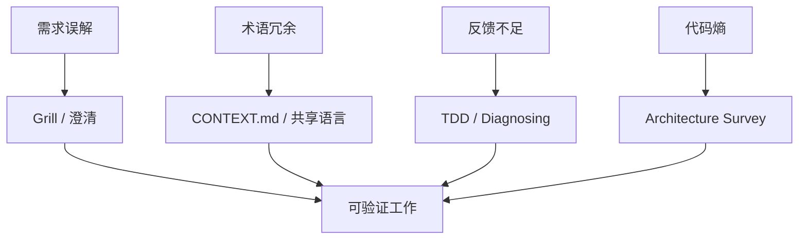

> 系列：[1. 全景](/writing/mattpocock-skills-overview/)｜[2. 对齐与语言](/writing/mattpocock-skills-alignment/)｜[3. 反馈与设计](/writing/mattpocock-skills-feedback-loops/)｜[4. 整体判断](/writing/mattpocock-skills-synthesis/)

[`mattpocock/skills`](https://github.com/mattpocock/skills)明确反对由庞大方法论接管完整开发过程，转而提供小型、可修改、可组合的个人工程 Skills。仓库从真实失败出发：Agent 没理解需求、不了解项目语言、缺少运行反馈，以及在高速度下制造结构熵。

*图 1｜Skills 不是完整流程引擎，而是对常见失效点的局部干预。*

第二篇研究需求追问和共享语言，第三篇研究反馈循环和架构维护。终篇判断为什么“保留人的控制权”是这套仓库最核心的设计选择。

---

下一篇：[对齐与语言](/writing/mattpocock-skills-alignment/)。

下一篇先处理最昂贵的失败：代码写得很快，但问题从一开始就理解错了。
