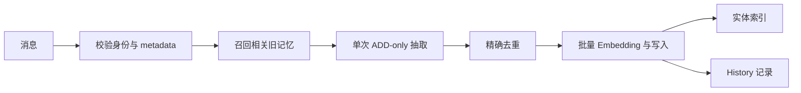

> Mem0 源码研究系列：[1. 全景](/writing/mem0-series-overview/)｜[2. 写入](/writing/mem0-add-pipeline/)｜[3. 检索](/writing/mem0-hybrid-retrieval/)｜[4. 生产边界](/writing/mem0-production-boundaries/)｜[5. 整体判断](/writing/mem0-series-synthesis/)

Mem0 的 `add()` 不是把整段对话原样塞进向量库。启用 `infer` 时，它先建立身份范围，再召回相关旧记忆作为抽取上下文，让模型只输出值得新增的独立事实。

*图 1｜v3 写入链路把理解、去重和索引放在一次有边界的追加操作中。*

## 第一道边界是身份，不是 Embedding

`add()` 要求 `user_id`、`agent_id` 或 `run_id` 至少形成一个作用域。普通用户事实与带 assistant 消息的 Agent 经验会选择不同抽取路径；程序性记忆还要求显式的 `procedural_memory` 类型。

这些字段不是普通标签。它们决定后续相关记忆召回、实体合并与搜索过滤的边界。如果应用允许模型自行填写 `user_id`，再正确的向量检索也可能稳定地召回另一个用户的事实。

## ADD-only 保留历史，也转移冲突

v3 先取相关旧记忆，再用一个 Prompt 抽取“新的、可独立使用的事实”。系统不再让自动管线覆盖或删除旧记录，只防止内容完全相同的精确重复，然后批量写入主集合，并把实体写入并行的实体集合。

假设一月写入“住在上海”，六月写入“搬到杭州”。ADD-only 保留两条时间证据，避免模型一次误判就抹去历史；代价是“现在住哪里”不再能靠库中只有一个值来回答，而要依赖时间信息、排序和应用规则。

显式 `update`、`delete` 与 `expiration_date` 仍然存在，所以 ADD-only 的准确含义是：**自动抽取不擅自改写过去，不是系统永远不能纠错。**

## 两种旁路承担不同责任

主向量集合保存事实及作用域 metadata；实体集合把规范化实体与相关 memory IDs 连接起来，为搜索提供实体重合信号。SQLite history 则记录显式增删改的变化，用于排障与审计。实体连接是检索特征，不等于 OSS 提供了一套可遍历的知识图谱。

写入落地前至少要补四个应用契约：输入授权、有效时间、来源引用、删除传播。Mem0 帮你生成事实，却无法知道某条对话是否受合规保留期约束，也无法替你清理日志、缓存和下游 Prompt。

这与 [Agent 记忆设计：写入与纠错](/writing/agent-memory-writing/)讨论的是同一个问题，但这里的答案更具体：Mem0 v3 选择先追加证据，再把当前性判断交给读取与显式维护。

源码入口与官方说明

- [`Memory.add()` 与写入实现](https://github.com/mem0ai/mem0/blob/dae67f74f5cc7bf138c7d7d6f9cec5ce4b4373b3/mem0/memory/main.py)
- [OSS v2 → v3 迁移说明](https://github.com/mem0ai/mem0/blob/dae67f74f5cc7bf138c7d7d6f9cec5ce4b4373b3/docs/migration/oss-v2-to-v3.mdx)

---

上一篇：[系统全景](/writing/mem0-series-overview/)。

下一篇：[多信号检索如何把旧事实重新排序](/writing/mem0-hybrid-retrieval/)。
