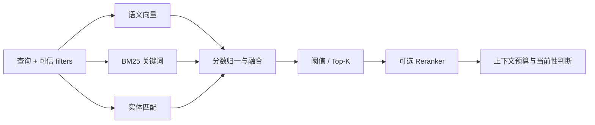

> Mem0 源码研究系列：[1. 全景](/writing/mem0-series-overview/)｜[2. 写入](/writing/mem0-add-pipeline/)｜[3. 检索](/writing/mem0-hybrid-retrieval/)｜[4. 生产边界](/writing/mem0-production-boundaries/)｜[5. 整体判断](/writing/mem0-series-synthesis/)

语义相似度擅长找到意思相近的记忆，却不擅长同时识别精确术语、同一实体和事实是否仍然有效。Mem0 v3 因此把查询拆成三类信号，再融合为一个结果分数。

*图 1｜召回负责形成候选集，最终能否使用仍取决于过滤、预算与业务语义。*

## 三类信号修正不同盲区

语义向量覆盖改写和近义表达；BM25 提高错误码、产品名和专有词等精确匹配的可见性；实体集合则让查询与记忆共享人、项目或地点时获得额外信号。系统会根据运行时实际可用的信号调整融合，而不是假设所有后端都具备同样能力。

这意味着“配置了 Mem0”不等于“启用了完整混合检索”。例如部分 Vector Store 没有关键词搜索；Python OSS 若缺少 NLP 依赖，会回落到语义检索；Qdrant 的稀疏检索还依赖相应组件。生产评测必须记录实际启用的后端和依赖，而不能只记录 SDK 版本。

## 先过滤身份，再讨论相关性

v3 的 `search()` 把 `user_id`、`agent_id`、`run_id` 放进 `filters`。过滤不是排序之后的装饰，而是候选集的安全边界。应用还可叠加 metadata 条件、时间范围、失效状态、阈值和 Top-K。

阈值也不能从旧版直接照搬。v3 的 `score` 是多信号融合结果，绝对数值口径已经变化；官方迁移说明明确建议用代表性查询重新校准。一个在演示集上看起来漂亮的 `0.7`，没有跨模型、后端和数据分布的天然意义。

## 相关不等于当前

回到“上海—杭州”案例，两条事实可能都与“住哪里”高度相关。实体匹配甚至会同时增强它们。系统需要时间字段、关系词和应用层规则判断哪条描述当前状态，必要时回看来源，而不是让最高相似度自动成为真相。

因此，Mem0 的检索结果最好被视为“候选证据”，再经过四道门：可信身份范围、有效时间、冲突处理、上下文预算。与 [Agent 记忆设计：检索与装配](/writing/agent-memory-retrieval/)相比，Mem0 提供了较强的平面召回能力，却没有替应用建立目录导航或团队角色装配模型。

实现与配置入口

- [`Memory.search()` 实现](https://github.com/mem0ai/mem0/blob/dae67f74f5cc7bf138c7d7d6f9cec5ce4b4373b3/mem0/memory/main.py)
- [Reranker Search](https://github.com/mem0ai/mem0/blob/dae67f74f5cc7bf138c7d7d6f9cec5ce4b4373b3/docs/open-source/features/reranker-search.mdx)
- [Metadata Filtering](https://github.com/mem0ai/mem0/blob/dae67f74f5cc7bf138c7d7d6f9cec5ce4b4373b3/docs/open-source/features/metadata-filtering.mdx)

---

上一篇：[写入管线](/writing/mem0-add-pipeline/)。

下一篇：[可替换组件之后，生产责任落在哪里](/writing/mem0-production-boundaries/)。
