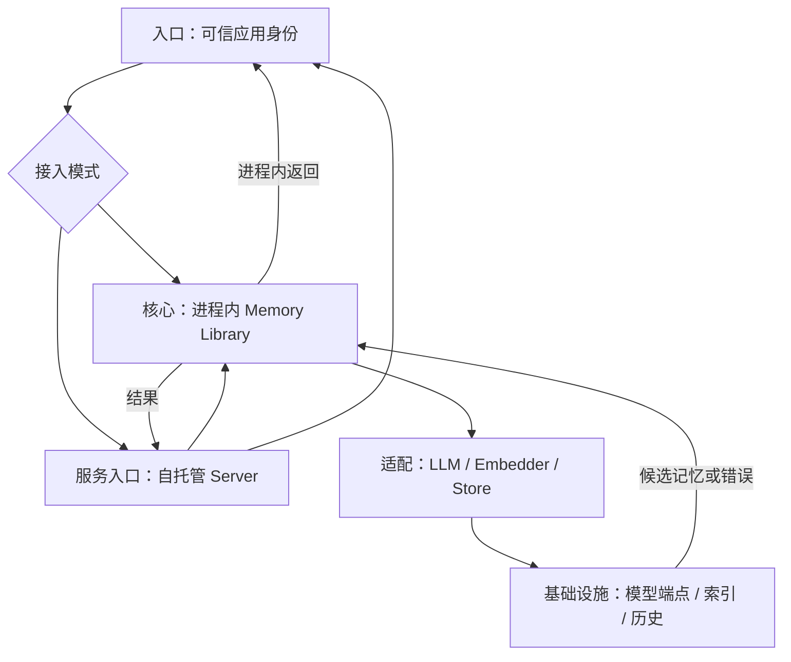
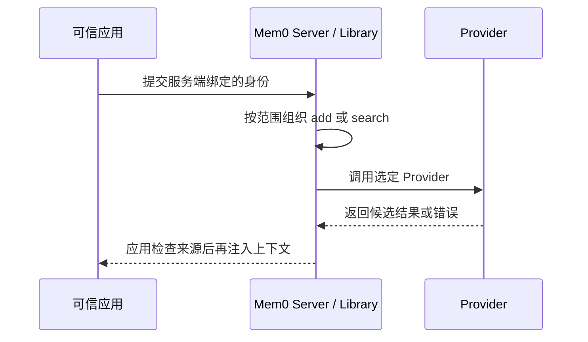

## 定位与价值

本篇讨论把相同 add/search 逻辑放进库或服务后，谁负责身份、凭证、重试与删除，以及替换 Provider 后需要重测什么。

完整定位与安装见[项目总览](/writing/mem0-series-overview/)。

研究基线：[mem0ai/mem0 @ dae67f7](https://github.com/mem0ai/mem0/blob/dae67f74f5cc7bf138c7d7d6f9cec5ce4b4373b3/README.md)；源码与社区核对日期为 2026-09-06。

## 技术架构



*图 1｜职责与数据流；逻辑分层不要求分开部署。*

## 核心机制



*图 2｜本篇关键流程的职责示意；部署者提出的验收要求与框架内建行为需按正文区分。*

### Library 与 Server 的部署边界

Library 模式接入最短，适合在单个应用内验证 add/search 闭环，但进程生命周期、并发、重试与凭证都由宿主负责。自托管 Server 增加 API、Dashboard、用户密钥和请求审计等运行面，同时引入数据库迁移、容量、备份与服务升级责任。

两者都不自动完成“把记忆安全注入 Agent”的最后一公里。应用仍需决定检索发生在模型调用前还是工具执行后、召回失败是否降级、多少字符进入 Prompt，以及删除请求如何传播到缓存和派生数据。


### 更换组件后的契约回归

#### Provider 兼容不等于行为等价

不同 Vector Store 对关键词检索、过滤、批量操作和本地锁的支持并不相同；替换 LLM 会改变抽取粒度，替换 Embedding 会改变历史向量空间，打开 reranker 又会改变延迟和排序。配置层可以统一接口，却无法让这些实现具备同一质量分布。

上线前至少保留一组固定契约样本：跨用户不能串记；新旧事实能正确判定；过期记录不可见；删除后搜索、history、实体集合和应用缓存符合约定；组件故障时主任务能按设计降级。参考 [Agent 记忆设计：治理与验证](/writing/agent-memory-governance/)中的反例，不要只跑一条“我喜欢披萨”的 Happy Path。

#### OSS 与 Platform 必须分开描述

当前 v3 的 OSS 不再包含旧版外部 Graph Store 路径；原生、自动的 Graph Memory 属于 Mem0 Platform。OSS 的实体集合服务于检索加权，不返回可遍历的关系图。文章、架构图和采购判断若把两者合并，就会高估自托管能力，也会漏掉平台锁定与数据边界问题。

最可靠的生产清单不是“支持多少 Provider”，而是每次版本和配置变化之后，身份、当前性、召回、延迟、成本、删除与审计是否仍通过同一套回归。

#### 适合与不适合

当核心对象是用户事实、偏好和 Agent 经验，数据主要按身份隔离，应用愿意自己维护时间与上下文预算时，Mem0 是清晰的起点。如果问题主要是大规模文档的层级导航、文件关系和逐层读取，应该先研究 [OpenViking 全景](/writing/openviking-series-overview/)；如果重点是团队资产、审核、角色装配与跨 Agent 共享，则应看 [TencentDB Agent Memory 全景](/writing/tencentdb-agent-memory-overview/)。

这不是功能多少的排序，而是核心对象不同。Mem0 的主语是“某个身份拥有的记忆”，不是完整知识文件系统，也不是团队经验控制面。

<details>
<summary>官方部署与版本边界</summary>

- [Open Source Overview](https://github.com/mem0ai/mem0/blob/dae67f74f5cc7bf138c7d7d6f9cec5ce4b4373b3/docs/open-source/overview.mdx)
- [Open Source Configuration](https://github.com/mem0ai/mem0/blob/dae67f74f5cc7bf138c7d7d6f9cec5ce4b4373b3/docs/open-source/configuration.mdx)
- [Self-hosted REST API](https://github.com/mem0ai/mem0/blob/dae67f74f5cc7bf138c7d7d6f9cec5ce4b4373b3/docs/open-source/features/rest-api.mdx)

</details>

## 快速上手

先按[项目总览](/writing/mem0-series-overview/#快速上手)准备运行环境；本篇的最小实验直接执行固定快照中的测试。另需按仓库贡献指南安装开发与测试依赖。

```bash
python -m pytest tests/test_memory.py -q
```

检查 SDK 契约；真实 Provider 切换仍需单独运行集成样本。

模型、执行环境与存储等共用配置，以及安装常见问题，见[总览的三个配置项](/writing/mem0-series-overview/#快速上手)。本篇命令仅在明确记录实跑结果时才作为通过证据。

## 生态与社区

许可证、官方集成、提交与 Issue 样本统一见[项目总览的生态与社区](/writing/mem0-series-overview/#生态与社区)。

## 源码阅读路径

阅读顺序：入口 → 核心抽象 → 具体实现 → 测试。

| 顺序 | 目录 → 文件 | 函数、对象或检查重点 |
| --- | --- | --- |
| 1 | [pyproject.toml](https://github.com/mem0ai/mem0/blob/dae67f74f5cc7bf138c7d7d6f9cec5ce4b4373b3/pyproject.toml) | mem0ai 包与 Python 版本要求 |
| 2 | [mem0/memory/main.py](https://github.com/mem0ai/mem0/blob/dae67f74f5cc7bf138c7d7d6f9cec5ce4b4373b3/mem0/memory/main.py) | Memory.add / search：公开入口 |
| 3 | [mem0/configs/base.py](https://github.com/mem0ai/mem0/blob/dae67f74f5cc7bf138c7d7d6f9cec5ce4b4373b3/mem0/configs/base.py) | MemoryConfig：组件配置 |
| 4 | [mem0/utils/factory.py](https://github.com/mem0ai/mem0/blob/dae67f74f5cc7bf138c7d7d6f9cec5ce4b4373b3/mem0/utils/factory.py) | Provider 工厂 |
| 5 | [tests/test_memory.py](https://github.com/mem0ai/mem0/blob/dae67f74f5cc7bf138c7d7d6f9cec5ce4b4373b3/tests/test_memory.py) | 检查 SDK 契约；真实 Provider 切换仍需单独运行集成样本。 |
