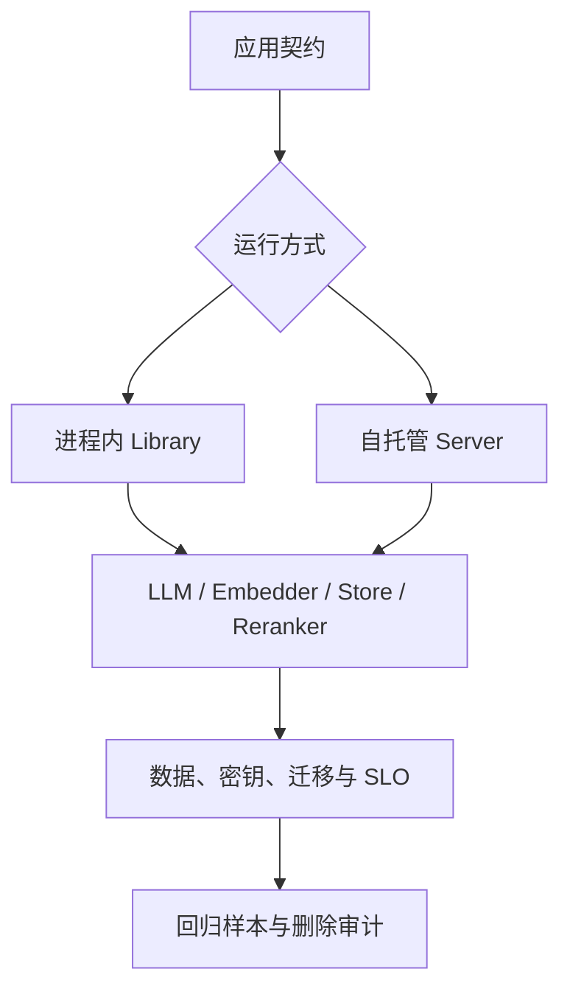

> Mem0 源码研究系列：[1. 全景](/writing/mem0-series-overview/)｜[2. 写入](/writing/mem0-add-pipeline/)｜[3. 检索](/writing/mem0-hybrid-retrieval/)｜[4. 生产边界](/writing/mem0-production-boundaries/)｜[5. 整体判断](/writing/mem0-series-synthesis/)

Mem0 开源版既可以作为 Python/TypeScript 库嵌入应用，也可以运行自托管服务。LLM、Embedding、Vector Store 和 Reranker 都能替换。可替换性扩大了部署自由，也把组合验证交给了部署者。

*图 1｜组件自由度越高，越需要用应用契约约束组合结果。*

## Library 和 Server 保护的边界不同

Library 模式接入最短，适合在单个应用内验证 add/search 闭环，但进程生命周期、并发、重试与凭证都由宿主负责。自托管 Server 增加 API、Dashboard、用户密钥和请求审计等运行面，同时引入数据库迁移、容量、备份与服务升级责任。

两者都不自动完成“把记忆安全注入 Agent”的最后一公里。应用仍需决定检索发生在模型调用前还是工具执行后、召回失败是否降级、多少字符进入 Prompt，以及删除请求如何传播到缓存和派生数据。

## Provider 兼容不等于行为等价

不同 Vector Store 对关键词检索、过滤、批量操作和本地锁的支持并不相同；替换 LLM 会改变抽取粒度，替换 Embedding 会改变历史向量空间，打开 reranker 又会改变延迟和排序。配置层可以统一接口，却无法让这些实现具备同一质量分布。

上线前至少保留一组固定契约样本：跨用户不能串记；新旧事实能正确判定；过期记录不可见；删除后搜索、history、实体集合和应用缓存符合约定；组件故障时主任务能按设计降级。参考 [Agent 记忆设计：治理与验证](/writing/agent-memory-governance/)中的反例，不要只跑一条“我喜欢披萨”的 Happy Path。

## OSS 与 Platform 必须分开描述

当前 v3 的 OSS 不再包含旧版外部 Graph Store 路径；原生、自动的 Graph Memory 属于 Mem0 Platform。OSS 的实体集合服务于检索加权，不返回可遍历的关系图。文章、架构图和采购判断若把两者合并，就会高估自托管能力，也会漏掉平台锁定与数据边界问题。

最可靠的生产清单不是“支持多少 Provider”，而是每次版本和配置变化之后，身份、当前性、召回、延迟、成本、删除与审计是否仍通过同一套回归。

官方部署与版本边界

- [Open Source Overview](https://github.com/mem0ai/mem0/blob/dae67f74f5cc7bf138c7d7d6f9cec5ce4b4373b3/docs/open-source/overview.mdx)
- [Open Source Configuration](https://github.com/mem0ai/mem0/blob/dae67f74f5cc7bf138c7d7d6f9cec5ce4b4373b3/docs/open-source/configuration.mdx)
- [Self-hosted REST API](https://github.com/mem0ai/mem0/blob/dae67f74f5cc7bf138c7d7d6f9cec5ce4b4373b3/docs/open-source/features/rest-api.mdx)

---

上一篇：[混合检索](/writing/mem0-hybrid-retrieval/)。

下一篇：[更短的接口没有消灭记忆复杂度](/writing/mem0-series-synthesis/)。
