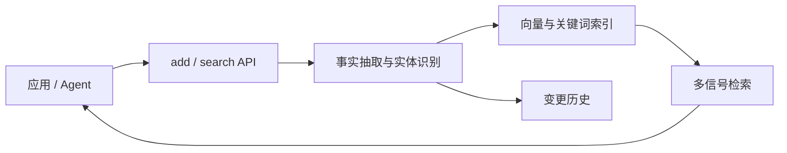
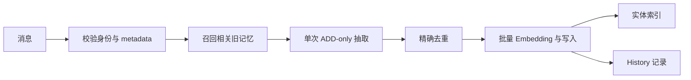
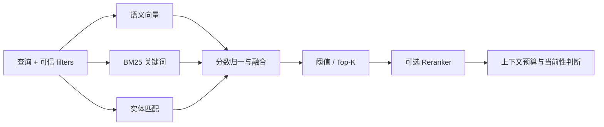

> 版本范围：2026-09-05 核查的 `mem0ai/mem0` 提交 [`dae67f7`](https://github.com/mem0ai/mem0/tree/dae67f74f5cc7bf138c7d7d6f9cec5ce4b4373b3)。本文聚焦开源 Python/TypeScript SDK 与自托管服务；Mem0 Platform 的原生 Graph Memory 不等同于 OSS 能力。

Mem0 最容易被理解成“给 Agent 加一个向量库”，但它真正封装的是一条从对话到可复用事实的短路径：应用只面对 `add`、`search`、显式更新和删除，内部负责事实抽取、作用域、索引与排序。

*图 1｜Mem0 把记忆压缩成一条可嵌入应用的数据通路。*

## 先看五层责任

| 层 | Mem0 提供什么 | 接入方仍要决定什么 |
|---|---|---|
| 接口 | `add`、`search`、CRUD、history | 何时调用、失败是否阻断主任务 |
| 抽取 | LLM 把消息变成事实或程序性记忆 | 哪些输入允许长期保存 |
| 作用域 | `user_id`、`agent_id`、`run_id` 与 metadata | 身份是否来自可信服务端 |
| 检索 | 语义、BM25、实体匹配与可选 reranker | 阈值、预算与当前性规则 |
| 运行 | 可替换 LLM、Embedder、Vector Store；库或服务部署 | 密钥、迁移、审计、删除传播与 SLO |

这个地图揭示了 Mem0 的核心取舍：它优先降低集成摩擦，而不是替应用做完整的知识治理。短接口让记忆更容易进入产品，也更容易让团队忽略写入授权、时间冲突和删除闭环。

## 写入：身份、抽取与索引

Mem0 的 `add()` 不是把整段对话原样塞进向量库。启用 `infer` 时，它先建立身份范围，再召回相关旧记忆作为抽取上下文，让模型只输出值得新增的独立事实。

*图 2｜v3 写入链路把理解、去重和索引放在一次有边界的追加操作中。*

## 第一道边界是身份，不是 Embedding

`add()` 要求 `user_id`、`agent_id` 或 `run_id` 至少形成一个作用域。普通用户事实与带 assistant 消息的 Agent 经验会选择不同抽取路径；程序性记忆还要求显式的 `procedural_memory` 类型。

这些字段不是普通标签。它们决定后续相关记忆召回、实体合并与搜索过滤的边界。如果应用允许模型自行填写 `user_id`，再正确的向量检索也可能稳定地召回另一个用户的事实。

## ADD-only 保留历史，也转移冲突

v3 先取相关旧记忆，再用一个 Prompt 抽取“新的、可独立使用的事实”。系统不再让自动管线覆盖或删除旧记录，只防止内容完全相同的精确重复，然后批量写入主集合，并把实体写入并行的实体集合。

假设一月写入“住在上海”，六月写入“搬到杭州”。ADD-only 保留两条时间证据，避免模型一次误判就抹去历史；代价是“现在住哪里”不再能靠库中只有一个值来回答，而要依赖时间信息、排序和应用规则。

显式 `update`、`delete` 与 `expiration_date` 仍然存在，所以 ADD-only 的准确含义是：**自动抽取不擅自改写过去，不是系统永远不能纠错。**

## 两种旁路承担不同责任

主向量集合保存事实及作用域 metadata；实体集合把规范化实体与相关 memory IDs 连接起来，为搜索提供实体重合信号。SQLite history 则记录显式增删改的变化，用于排障与审计。实体连接是检索特征，不等于 OSS 提供了一套可遍历的知识图谱。

写入落地前至少要补四个应用契约：输入授权、有效时间、来源引用、删除传播。Mem0 帮你生成事实，却无法知道某条对话是否受合规保留期约束，也无法替你清理日志、缓存和下游 Prompt。

这与 [Agent 记忆设计：写入与纠错](/writing/agent-memory-writing/)讨论的是同一个问题，但这里的答案更具体：Mem0 v3 选择先追加证据，再把当前性判断交给读取与显式维护。

语义相似度擅长找到意思相近的记忆，却不擅长同时识别精确术语、同一实体和事实是否仍然有效。Mem0 v3 因此把查询拆成三类信号，再融合为一个结果分数。

*图 3｜召回负责形成候选集，最终能否使用仍取决于过滤、预算与业务语义。*

## 三类信号修正不同盲区

语义向量覆盖改写和近义表达；BM25 提高错误码、产品名和专有词等精确匹配的可见性；实体集合则让查询与记忆共享人、项目或地点时获得额外信号。系统会根据运行时实际可用的信号调整融合，而不是假设所有后端都具备同样能力。

这意味着“配置了 Mem0”不等于“启用了完整混合检索”。例如部分 Vector Store 没有关键词搜索；Python OSS 若缺少 NLP 依赖，会回落到语义检索；Qdrant 的稀疏检索还依赖相应组件。生产评测必须记录实际启用的后端和依赖，而不能只记录 SDK 版本。

## 先过滤身份，再讨论相关性

v3 的 `search()` 把 `user_id`、`agent_id`、`run_id` 放进 `filters`。过滤不是排序之后的装饰，而是候选集的安全边界。应用还可叠加 metadata 条件、时间范围、失效状态、阈值和 Top-K。

阈值也不能从旧版直接照搬。v3 的 `score` 是多信号融合结果，绝对数值口径已经变化；官方迁移说明明确建议用代表性查询重新校准。一个在演示集上看起来漂亮的 `0.7`，没有跨模型、后端和数据分布的天然意义。

## 相关不等于当前

回到“上海—杭州”案例，两条事实可能都与“住哪里”高度相关。实体匹配甚至会同时增强它们。系统需要时间字段、关系词和应用层规则判断哪条描述当前状态，必要时回看来源，而不是让最高相似度自动成为真相。

因此，Mem0 的检索结果最好被视为“候选证据”，再经过四道门：可信身份范围、有效时间、冲突处理、上下文预算。与 [Agent 记忆设计：检索与装配](/writing/agent-memory-retrieval/)相比，Mem0 提供了较强的平面召回能力，却没有替应用建立目录导航或团队角色装配模型。

源码入口与官方说明

- [`Memory.add()` 与写入实现](https://github.com/mem0ai/mem0/blob/dae67f74f5cc7bf138c7d7d6f9cec5ce4b4373b3/mem0/memory/main.py)
- [OSS v2 → v3 迁移说明](https://github.com/mem0ai/mem0/blob/dae67f74f5cc7bf138c7d7d6f9cec5ce4b4373b3/docs/migration/oss-v2-to-v3.mdx)

实现与配置入口

- [`Memory.search()` 实现](https://github.com/mem0ai/mem0/blob/dae67f74f5cc7bf138c7d7d6f9cec5ce4b4373b3/mem0/memory/main.py)
- [Reranker Search](https://github.com/mem0ai/mem0/blob/dae67f74f5cc7bf138c7d7d6f9cec5ce4b4373b3/docs/open-source/features/reranker-search.mdx)
- [Metadata Filtering](https://github.com/mem0ai/mem0/blob/dae67f74f5cc7bf138c7d7d6f9cec5ce4b4373b3/docs/open-source/features/metadata-filtering.mdx)

