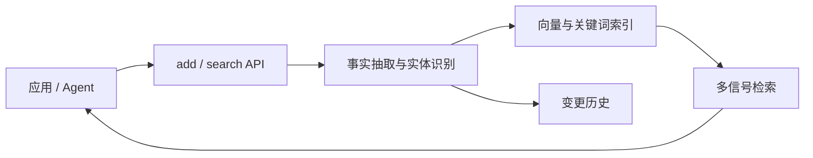

> Mem0 源码研究系列：[1. 全景](/writing/mem0-series-overview/)｜[2. 写入](/writing/mem0-add-pipeline/)｜[3. 检索](/writing/mem0-hybrid-retrieval/)｜[4. 生产边界](/writing/mem0-production-boundaries/)｜[5. 整体判断](/writing/mem0-series-synthesis/)

> 版本范围：2026-09-05 核查的 `mem0ai/mem0` 提交 [`dae67f7`](https://github.com/mem0ai/mem0/tree/dae67f74f5cc7bf138c7d7d6f9cec5ce4b4373b3)。本文聚焦开源 Python/TypeScript SDK 与自托管服务；Mem0 Platform 的原生 Graph Memory 不等同于 OSS 能力。

Mem0 最容易被理解成“给 Agent 加一个向量库”，但它真正封装的是一条从对话到可复用事实的短路径：应用只面对 `add`、`search`、显式更新和删除，内部负责事实抽取、作用域、索引与排序。

*图 1｜Mem0 把记忆压缩成一条可嵌入应用的数据通路。*

## 先看五层责任

| 层 | Mem0 提供什么 | 接入方仍要决定什么 |
|---|---|---|
| 接口 | `add`、`search`、CRUD、history | 何时调用、失败是否阻断主任务 |
| 抽取 | LLM 把消息变成事实或程序性记忆 | 哪些输入允许长期保存 |
| 作用域 | `user_id`、`agent_id`、`run_id` 与 metadata | 身份是否来自可信服务端 |
| 检索 | 语义、BM25、实体匹配与可选 reranker | 阈值、预算与当前性规则 |
| 运行 | 可替换 LLM、Embedder、Vector Store；库或服务部署 | 密钥、迁移、审计、删除传播与 SLO |

这个地图揭示了 Mem0 的核心取舍：它优先降低集成摩擦，而不是替应用做完整的知识治理。短接口让记忆更容易进入产品，也更容易让团队忽略写入授权、时间冲突和删除闭环。

## v3 改变了研究重点

当前 OSS v3 自动抽取从“抽取后再做 ADD/UPDATE/DELETE 决策”改为单次 **ADD-only**。新事实默认追加，精确重复由哈希去重，矛盾与过期信息更多交给检索排序、失效时间和显式治理处理。同时，检索从单一语义相似度扩展为语义、BM25 与实体匹配的融合。

因此本系列不再把主要篇幅花在旧版的更新决策 Prompt 上。第二篇沿 `add()` 数据流看事实如何进入两类索引；第三篇研究新旧事实怎样被重新排序；第四篇检查可替换组件、自托管和平台能力边界；终篇再判断“通用记忆层”究竟通用到哪里。

Mem0 是 [Agent 记忆设计母系列](/writing/agent-memory-design-competitive-analysis/)中的事实记忆路线。这里先把它独立研究透彻，不急着与 OpenViking 或 TencentDB Agent Memory 做功能总分。

---

下一篇：[一次 add 如何变成可检索事实](/writing/mem0-add-pipeline/)。

下一篇从写入开始，因为检索质量的上限，先由系统选择保存了什么决定。
