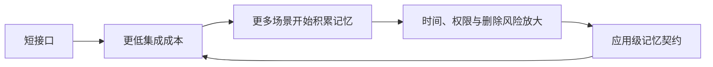

> Mem0 源码研究系列：[1. 全景](/writing/mem0-series-overview/)｜[2. 写入](/writing/mem0-add-pipeline/)｜[3. 检索](/writing/mem0-hybrid-retrieval/)｜[4. 生产边界](/writing/mem0-production-boundaries/)｜[5. 整体判断](/writing/mem0-series-synthesis/)

Mem0 的价值，是把“每个应用都重新实现一遍的事实记忆管线”压缩成稳定入口：消息进入 `add`，事实被提炼和分域；问题进入 `search`，多种信号形成候选证据。它尤其适合个性化助手、客服、学习产品等需要低摩擦跨会话记忆的场景。

但简洁 API 只隐藏了实现细节，没有消灭四类系统问题：写入是否得到授权，事实何时失效，新旧结论如何冲突，删除怎样穿透派生数据。v3 的 ADD-only 甚至更诚实地暴露了这一点——系统选择保留历史证据，因此应用必须定义“当前真相”怎样形成。

*图 1｜采用成本下降后，治理能力必须同步进入产品闭环。*

## 适合与不适合

当核心对象是用户事实、偏好和 Agent 经验，数据主要按身份隔离，应用愿意自己维护时间与上下文预算时，Mem0 是清晰的起点。如果问题主要是大规模文档的层级导航、文件关系和逐层读取，应该先研究 [OpenViking 全景](/writing/openviking-series-overview/)；如果重点是团队资产、审核、角色装配与跨 Agent 共享，则应看 [TencentDB Agent Memory 全景](/writing/tencentdb-agent-memory-overview/)。

这不是功能多少的排序，而是核心对象不同。Mem0 的主语是“某个身份拥有的记忆”，不是完整知识文件系统，也不是团队经验控制面。

## 最后留下三条实施原则

第一，把搜索结果当候选证据，不当最终事实。第二，把身份从认证上下文注入，不交给模型生成。第三，用真实冲突、撤权和删除样本评测每次组件或版本变化。

做到这些，短 API 才会成为生产杠杆；否则它只是让未经治理的长期状态更容易进入每一次模型调用。

---

上一篇：[生产边界](/writing/mem0-production-boundaries/)。

本系列到此完成。回到 [Mem0 系统全景](/writing/mem0-series-overview/)，可以看到它最值得学习的不是某个 Prompt，而是怎样把记忆抽取与检索做成可嵌入的产品接口。接下来可回到 [Agent 记忆设计母系列](/writing/agent-memory-design-competitive-analysis/)，再用统一生命周期建立跨项目关联。
