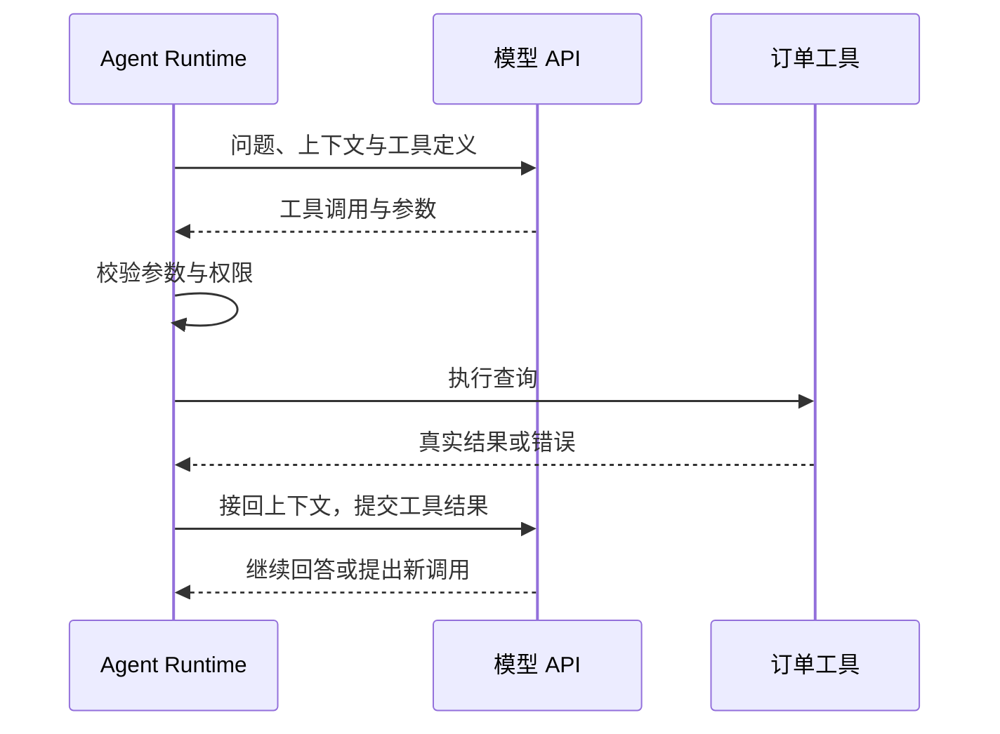

用户问：“查一下订单 O-1042 到哪了。”模型返回一个查询指令，程序执行查询，再把结果交给模型组织成回答。

这段过程包含三种职责：**模型理解问题、生成下一步；工具与业务系统执行动作；Agent Runtime 组织调用、保存状态并推进任务。** OpenAI 与 Anthropic 的 API，就是这些职责之间交换信息的接口。

理解两种协议，关键是看清：模型收到了什么，返回了什么，以及返回之后谁接着做。

## 两种协议，约定了怎样的交互

通常所说的“OpenAI 协议”和“Anthropic 协议”，指两家的模型 API 契约：请求与响应的结构、工具调用的表达方式，以及上下文如何续接。

OpenAI 有多种接口。其中，Chat Completions 围绕消息组织交互；Responses 使用类型化对象，整合工具与会话能力。官方仍支持前者，建议新项目采用后者。本文用 **OpenAI Responses 与 Anthropic Messages** 对照。[OpenAI 迁移指南](https://developers.openai.com/api/docs/guides/migrate-to-responses)

| 交互内容 | OpenAI Responses | Anthropic Messages |
| --- | --- | --- |
| 请求入口 | `POST /v1/responses` | `POST /v1/messages` |
| 问题与指令 | `input`、`instructions` | `messages`、`system` |
| 工具参数定义 | `parameters` | `input_schema` |
| 模型提出工具调用 | `function_call` 对象 | `tool_use` 内容块 |
| 程序回传执行结果 | `function_call_output` | user 消息中的 `tool_result` |
| 上下文续接 | 可传历史或引用前一 Response | 基础路径显式重传消息历史 |

它们都能表达“模型需要调用工具”，但字段、对象和续接规则不同。兼容 Chat Completions，也不意味着兼容 Responses 的全部能力。[Anthropic Messages 指南](https://platform.claude.com/docs/en/build-with-claude/working-with-messages)

## 一个订单查询，怎样通过两种协议完成

以下是教学范例，`MODEL_ID` 需替换为支持相应功能的模型；响应只展示关键字段。先看 OpenAI，再看 Anthropic，始终跟踪同一件事：**声明工具 → 生成调用 → 执行并回传。**

### OpenAI：调用与结果是独立对象

向 `https://api.openai.com/v1/responses` 提交下面的 JSON。请求使用 Bearer API Key 认证和 `Content-Type: application/json`。

```json
{
  "model": "MODEL_ID",
  "store": true,
  "instructions": "仅查询订单，依据工具结果回答。",
  "input": "查一下订单 O-1042 到哪了。",
  "tools": [{
    "type": "function",
    "name": "get_order_status",
    "description": "查询当前用户有权访问的订单状态。",
    "parameters": {
      "type": "object",
      "properties": {"order_id": {"type": "string"}},
      "required": ["order_id"],
      "additionalProperties": false
    },
    "strict": true
  }]
}
```

`tools` 声明可用动作，`parameters` 定义参数结构。它没有上传查询函数的实现，也没有让模型获得数据库连接。

假设模型决定查询，返回的关键字段如下：

```json
{
  "id": "resp_1",
  "status": "completed",
  "output": [{
    "type": "function_call",
    "call_id": "call_1",
    "name": "get_order_status",
    "arguments": "{\"order_id\":\"O-1042\"}"
  }]
}
```

模型生成了工具名与参数。`arguments` 是 JSON 字符串，`call_id` 关联这次调用和后续结果。**此时订单还没有被查询：`completed` 只是这次响应生成完了。**

Runtime 解析参数、检查当前用户的权限，真正执行查询。假设结果是“已发货”，回传对象如下：

```json
{
  "type": "function_call_output",
  "call_id": "call_1",
  "output": "{\"order_id\":\"O-1042\",\"status\":\"shipped\"}"
}
```

把这个对象放进下一次请求的 `input` 数组，并设置 `previous_response_id: "resp_1"`，即可接回前一轮上下文；`model` 和所需指令仍要明确提交。特别是 `instructions` 不会随 Response 引用自动继承。模型读到工具结果后，才能有依据地回答“订单已发货”。[OpenAI 工具调用](https://developers.openai.com/api/docs/guides/function-calling)、[Response 续接规则](https://developers.openai.com/api/reference/cli/resources/responses/methods/create)

### Anthropic：调用与结果放在消息内容块里

向 `https://api.anthropic.com/v1/messages` 提交下面的 JSON。可使用 `x-api-key` 认证，同时携带 `anthropic-version: 2023-06-01` 与 JSON 内容类型头；版本头和模型版本是两回事。[Anthropic API 概览](https://platform.claude.com/docs/en/api/overview)

```json
{
  "model": "MODEL_ID",
  "max_tokens": 1024,
  "system": "仅查询订单，依据工具结果回答。",
  "messages": [{"role": "user", "content": "查一下订单 O-1042 到哪了。"}],
  "tools": [{
    "name": "get_order_status",
    "description": "查询当前用户有权访问的订单状态。",
    "input_schema": {
      "type": "object",
      "properties": {"order_id": {"type": "string"}},
      "required": ["order_id"],
      "additionalProperties": false
    }
  }]
}
```

这里用 `input_schema` 定义参数，`max_tokens` 限制本次输出。假设模型返回：

```json
{
  "role": "assistant",
  "content": [{
    "type": "tool_use",
    "id": "toolu_1",
    "name": "get_order_status",
    "input": {"order_id": "O-1042"}
  }],
  "stop_reason": "tool_use"
}
```

`tool_use` 是 assistant 消息中的内容块，最终的 `input` 已是对象。`stop_reason` 提醒 Runtime：这一轮停在了工具调用处，需要程序接手。

查询完成后，追加下面这条消息：

```json
{
  "role": "user",
  "content": [{
    "type": "tool_result",
    "tool_use_id": "toolu_1",
    "content": "{\"order_id\":\"O-1042\",\"status\":\"shipped\"}"
  }]
}
```

下一次请求要保留原问题、完整的 assistant 调用内容，再紧接这条结果消息，并提交所需模型、指令和工具配置。`tool_use_id` 对应原调用 ID；这里的 user 是协议角色，不代表真人又说了一句话。模型随后依据结果继续回答。[Anthropic 工具回传](https://platform.claude.com/docs/en/agents-and-tools/tool-use/handle-tool-calls)

两套报文表达的是同一个闭环：



一次用户提问，可能包含多次模型请求。**工具调用协议把模型生成的行动意图，变成程序可以识别、执行和反馈的对象。**

## 模型内部做什么，Runtime 做什么

模型可以理解问题、规划步骤、选择工具、生成参数，也可以根据工具结果修正判断。这些工作发生在推理与生成过程中。

数据库查询、网络请求、代码运行和文件写入，则需要实际的程序与执行环境。Runtime 负责把两者接起来，并管理这项工作的状态。

| 工作 | 模型负责的部分 | 模型外负责的部分 |
| --- | --- | --- |
| 规划与决策 | 判断下一步做什么 | 提供目标、上下文和可用工具 |
| 工具调用 | 生成工具名与参数 | 校验权限，执行程序，返回结果 |
| 多轮推进 | 根据新结果继续推理 | 保存历史与执行状态，发起下一次请求 |
| 异常恢复 | 分析错误，提出调整方案 | 重试、等待审批、控制预算和恢复任务 |
| 完成交付 | 生成答案和自检判断 | 根据真实结果验收，决定继续或结束 |

这条边界最容易在三个地方被混淆。

**第一，模型认为“可以执行”，不等于业务授权。** 查询哪个订单可以由模型提出，当前用户能查哪些订单，必须由真实身份与业务权限决定。

**第二，模型记得上下文，不等于系统保存了任务。** 下一轮能看到什么，取决于应用或厂商服务怎样保存、选择和接回历史。普通对话不会把订单状态写进模型权重。

**第三，模型停止生成，不等于任务完成。** Responses 的 `completed` 可能只完成了工具请求生成；Messages 的 `end_turn` 也只表示本轮结束。退款是否成功，要看退款系统的状态，不能只看模型是否说了“成功”。[Anthropic 停止原因](https://platform.claude.com/docs/en/build-with-claude/handling-stop-reasons)

因此，Runtime 可以从一段简单循环开始：准备上下文、请求模型、处理工具、回传结果、再次请求。任务越长，越需要持久化、预算、异常处理和业务验收。[Agent Runtime](/writing/agent-runtime/)

## API 支持一种能力，不代表模型独自完成它

除了工具调用，两家的协议还暴露思考、结构化输出、流式事件和状态管理能力。它们各自解决的问题不同。

| 能力 | 协议提供什么 | 仍需分清的边界 |
| --- | --- | --- |
| 结构化输出 | 按 Schema 生成参数或最终 JSON | 格式正确，不证明事实正确或操作已授权 |
| Reasoning / Thinking | 配置推理行为，返回摘要或续接状态 | 可见摘要不是全部内部计算，原生状态要按契约保留 |
| 流式输出 | 逐步返回文字、工具参数与状态事件 | 参数片段尚未完整时，不能直接执行 |
| 会话与缓存 | 续接上下文或复用前缀处理 | 不自动构成长期记忆、任务恢复或业务事务 |

例如，两家都支持相应的结构约束能力：Responses 的最终 JSON 配置使用 `text.format`，Messages 使用 `output_config.format`；工具参数也有各自的严格模式。但一个完全符合 Schema 的 `{"delivered": true}`，仍可能错误地把“已发货”说成“已送达”。[OpenAI 结构化输出](https://developers.openai.com/api/docs/guides/structured-outputs)、[Anthropic 结构化输出](https://platform.claude.com/docs/en/build-with-claude/structured-outputs)

思考与状态也是如此。模型可以进行复杂推理，应用却不能只保存用户可见的文字，就假定能够重建同一上下文。部分路径还需要保留不透明的 reasoning 或 thinking 状态；跨厂商切换时不能简单改名复用。[OpenAI Reasoning](https://developers.openai.com/api/docs/guides/reasoning)、[Anthropic Thinking](https://platform.claude.com/docs/en/build-with-claude/thinking)

### 托管工具：执行责任交给了厂商服务

使用平台提供的搜索或代码执行工具时，厂商服务可以在一次外部请求中完成“生成调用—执行工具—继续生成”。应用不必亲自处理每一轮工具往返。[OpenAI 工具](https://developers.openai.com/api/docs/guides/tools)、[Anthropic 服务端工具](https://platform.claude.com/docs/en/agents-and-tools/tool-use/server-tools)

但搜索仍由搜索服务完成，代码仍在运行环境中执行。**“API 内完成”不等于“模型内完成”：部分 Runtime 职责被厂商托管了。** 判断一个工具在哪里执行，应看它的执行契约，而不是工具由谁命名或定义。

## 理解 Agent，就沿着一次动作往下追

模型越强，规划、判断和根据反馈调整行动的工作，就越可以交给模型。执行系统仍要管理另一组事实：允许做什么，已经做过什么，失败后怎样继续，结果是否达到了要求。

OpenAI 与 Anthropic 的字段不同，但都让我们看见这次交接：**模型提出下一步，执行系统落实动作，再把真实结果交回模型。** Runtime 把这些往返组织成持续任务；厂商可以代管其中一部分，却不会让执行职责消失。

理解边界，最有效的问题始终是：**谁提出、谁执行、谁保存状态、谁判断完成。**

本文沿用 2026-09-17 核对的官方资料。示例为教学构造，未调用真实模型或业务服务；具体参数支持以所选模型与接入渠道为准。接口细节另见 [OpenAI API](/writing/openai-api-protocol/)和 [Anthropic API](/writing/anthropic-api-protocol/)。
