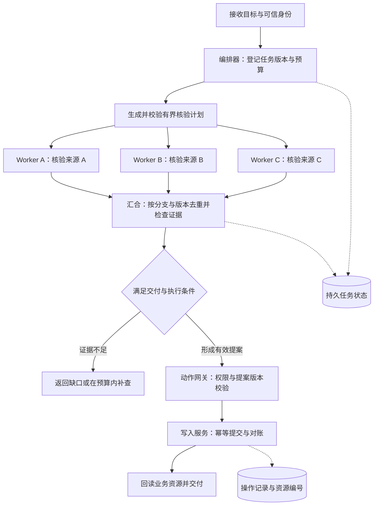

一个团队准备做资料研究助手：读取多个来源，比较相互矛盾的结论，形成报告，必要时创建工单。原型里安排了研究员、分析师、审稿人和执行员，几轮对话之后，报告看起来不错。进入业务环境后，问题变成了：为什么重复搜索？谁决定研究已经足够？某个分支超时后要不要交付？创建工单成功但响应丢失，重跑会不会多建一张？

这些问题决定 Multi-Agent 的技术架构。角色名称只能描述分工；真正的选型需要明确控制权、上下文、状态和副作用怎样在组件之间流动。

**对于需要可追踪业务交付的系统，本文建议先建立单 Agent 基线，再采用“显式流程控制 + 有界专业子任务 + 集中写入”的组合，用评测证明哪些环节值得增加 Agent。** 这是面向本文场景的工程建议，不是对所有任务的统一排名。

本文接续[Loop 与 Graph Engineering](/writing/loop-graph-engineering/)，聚焦选型决策；委派字段、预算传播等细节可结合[多 Agent 协作责任](/writing/harness-operations-multi-agent/)阅读。框架选型资料补充核验于 **2026 年 9 月 6 日**，产品能力以所链接的官方文档为准，文中的案例、容量和门槛均为设计示例，未经线上性能验证。

## 先回答五个问题，缩小候选范围

选型的顺序是：明确任务约束，确定控制权和恢复边界，再选框架。先把下面五个问题写成可验证的条件，通常比同时安装十个 SDK 更有帮助。

| 筛选问题 | 需要写清楚的条件 | 对架构选择的影响 |
| --- | --- | --- |
| 任务有多复杂？ | 固定步骤、独立分支，还是需要反复补证据？ | 固定步骤先用普通代码；独立探索考虑 Supervisor；依赖与汇合复杂时考虑执行图 |
| 任务要运行多久？ | 响应期限、最长等待、失败后允许重做多少工作？ | 秒级任务关注调用开销；跨进程或长时间等待需要持久状态与恢复入口 |
| 哪些步骤必须受控？ | 哪些可自由探索，哪些必须按 SOP、审批或业务规则执行？ | 程序控制业务状态迁移，在明确预算内开放局部 Agent 循环 |
| 团队能维护什么？ | 语言、现有任务平台、模型端点、工具集成与维护人力？ | 优先能复用现有能力的实现，再比较引入 SDK 后省下和新增的工作 |
| 必须怎样部署？ | 自托管或托管、数据去向、租户隔离、RBAC 与审计要求？ | 同时筛选 SDK、存储和运行平台，确认每一项能力由谁提供 |

对于本文的资料核验助手，答案是：三个可独立探索的来源，分钟级交付，业务写入必须受控，沿用现有后端服务，任务和证据需要持久保存。由此得到初始方向：**外层显式流程，内部有界并行，集中汇总和写入。** LangGraph 可以进入候选，但还要与现有任务平台上的普通代码比较。

运行时长只是信号，真正决定是否需要恢复能力的是重做代价、外部副作用和等待方式。两秒的支付动作也需要对账；十分钟的只读离线分析如果允许整体重跑，则未必需要复杂工作流引擎。对不能丢失进度的任务，应排除没有可靠恢复路径的整体方案；恢复能力可以来自框架，也可以来自外部任务平台。

## 先把三个选型层次分开

本文将 Agent 视为一个能够根据反馈选择后续动作的运行单元，它拥有自己的指令、上下文和可用工具。多个角色提示词顺序执行，不一定需要多个独立 Agent；一张包含十个函数节点的图，也不自动成为多 Agent 系统。

| 选型层次 | 要回答的问题 | 典型选择 |
| --- | --- | --- |
| 协作拓扑 | 谁拆任务、谁接收结果、谁继续和结束？ | Supervisor、Handoff、执行图、对等协作 |
| 实现框架 | 用什么抽象表达调用、状态和交接？ | 普通代码、LangGraph、OpenAI Agents SDK、CrewAI、Microsoft Agent Framework |
| 运行与部署 | 谁保存任务事实，进程故障后谁继续？ | 单进程、持久任务队列、工作流引擎、独立 Agent 服务 |

这三层可以自由组合。Supervisor 可以写在普通 Python 服务里，也可以是图中的节点；同一个图既可以进程内运行，也可以将重型任务交给外部 Worker。选了支持检查点的框架，仍然需要决定检查点存在哪里、谁触发恢复，以及恢复时哪些外部动作可能再次执行。

“状态图”“角色团队”“插件化”也不属于同一层次：状态图描述控制流，角色团队描述组织任务的抽象，插件化描述能力怎样扩展。它们可以同时出现在一个系统中，不能作为互斥的五选一选项。

## 判断是否需要多个 Agent

沿用开头的场景：核验三份产品公告的生效日期，与内部记录比较，生成带来源的差异报告；只有任务授权允许且证据满足要求时，才创建待核验工单。

如果三份公告格式固定，一次并行 HTTP 请求、字段提取和规则比较就能完成，不需要给每份公告配一位“研究员”。如果每份公告都需要多次检索、追踪修订记录和判断证据，则独立上下文与局部推理循环可能有价值。

| 观察到的瓶颈 | 先尝试的改动 | 何时升级为多 Agent |
| --- | --- | --- |
| 等待几个独立工具返回 | 并行工具调用 | 每个分支都需要独立的多步判断 |
| 工具太多，模型经常选错 | 工具检索、按需加载、明确路由 | 专业领域之间长期存在明显的上下文干扰 |
| 长文塞满上下文 | 检索、摘要、结构化中间产物 | 子任务能独立收集证据并交付可验证结果 |
| 必须按顺序完成审批与写入 | 确定性状态机或工作流 | 部分步骤确实需要自主探索 |
| 想提高答案可信度 | 来源核验与独立验收 | 第二条检验路径能发现第一条路径的真实错误 |

LangChain 官方将上下文管理、职责分离和并行作为多 Agent 的常见动因，同时列出 Subagents、Handoffs、Skills 与 Router 等不同模式。这些模式提供的是设计空间，不能替代具体任务上的测量。[Multi-agent 文档](https://docs.langchain.com/oss/python/langchain/multi-agent)

Anthropic 的研究系统采用协调者与并行子 Agent，服务于多方向资料探索。其公开经验也指出，这类系统会显著增加 Token 消耗，并不适合所有强依赖、共享上下文的任务。这个案例支持“为可分解的研究增加上下文容量”，不支持“增加 Agent 数量就一定更准确”。[官方工程案例](https://www.anthropic.com/engineering/multi-agent-research-system)

## 协作拓扑怎样选择

下面的分类用于讨论控制权。同一个系统可以组合多种模式，执行图也能承载 Supervisor 或 Handoff。

| 结构 | 控制权与结果去向 | 适合的任务 | 主要代价 |
| --- | --- | --- | --- |
| Supervisor / Manager | 协调者委派，子任务返回，协调者汇总 | 多方向研究、多个专业分析合成一个交付物 | 协调者成为瓶颈，摘要可能丢证据 |
| Hierarchical / 层级委派 | Manager 将大任务交给下级 Manager，逐层返回结果 | 子项目能独立计划、执行和验收的复杂任务 | 多层协调增加延迟，预算与证据可能在交接中丢失 |
| Handoff | 当前 Agent 将后续对话交给另一 Agent | 客服分流、专业咨询接管 | 上下文与权限交接复杂，容易来回转交 |
| Workflow / Graph | 程序维护依赖、路由、汇合和终态 | 有明确步骤、等待和恢复要求的业务流程 | 需要显式建模状态和异常分支 |
| Peer-to-peer / 共享黑板 | 多个参与者交换消息或更新共同任务板 | 分工动态、需要反复协商的探索任务 | 消息增多，冲突与结束条件难控制 |

### Supervisor：需要一个人对最终产物负责

三份公告各自核验，最终只交付一份差异报告，很适合 Manager 调用专业子任务。子 Agent 返回证据包，Manager 负责比较、补缺口和组织结果。

关键是让返回值足以检查：资料版本、判断依据、引用、未解决问题和完成状态。只有一段流畅摘要时，Manager 很难区分“没找到”与“已证实不存在”。如果协调者必须重新读完所有原文，拆分可能没有减少认知负担，只增加了一层调用。

OpenAI Agents SDK 区分 agents as tools 与 handoffs：前者由 Manager 保留控制权并调用专业 Agent；后者切换当前活动 Agent，让接手者继续处理对话。对于本例，优先采用前者，因为三份核验都应返回给同一个交付责任人。[Agent orchestration](https://openai.github.io/openai-agents-python/multi_agent/)

层级委派是在这一结构上增加协调层。只有下级任务足够独立、需要自己的计划与验收时，多一层 Manager 才有价值。企业有三级组织，并不意味着系统也应有三级 Agent；本文的三个核验分支先保持一层委派即可。

### Handoff：需要专业 Agent 接管后续交互

用户先咨询产品，随后进入售后排障，此时接管比每句话都经由总协调者转述更自然。转交必须携带必要事实、当前问题和可用权限，也要说明接手后的退出路径。

Handoff 不意味着可以把整段历史和所有凭据一并复制。权限由服务端身份与策略决定，不能因对话到了“财务 Agent”就自动获得财务写权限。系统还应记录当前负责人和转交次数；反复转交却没有新增信息，应触发明确的兜底流程。

### 执行图：需要明确什么时候可以进入下一步

资料核验的顺序要求很清楚：固定范围，派发核验，收齐当前版本结果，形成提案，检查执行许可，写入并回读。适合由图或状态机表达外层依赖，节点内部保留有限探索。

LangGraph 的 Graph API 用状态、节点和边描述执行，并通过 reducer 指定状态更新的合并方式。节点可以是普通函数，也可以包含 Agent 循环。因此采用图框架不要求每个节点都调用模型。[Graph API](https://docs.langchain.com/oss/python/langgraph/graph-api)

一张图的价值取决于交接契约。汇合节点要知道本轮预期有哪些分支；重复收到 A 的结果不能当成 B 已完成；所有分支结束也不等于所有证据充分。

### 对等协作：只有协商本身有价值时才采用

多人围绕同一个复杂方案提出修改，可能需要来回协商。但如果目标只是分别核验三份公告，让所有 Agent 互相聊天通常会增加重复理解和冲突处理。

若允许每对 Agent 建立一条双向沟通关系，潜在关系数是 $n(n-1)/2$；这是连接数量的上界示意，不是实际消息量或成本公式。实际开销取决于路由、轮数和每次传递的上下文。

共享黑板应保存带版本的任务与产物引用，并由明确规则裁决竞争写入。广播聊天记录无法替代任务认领、过期租约、冲突检测和验收。开始采用这一模式前，至少要能解释：为什么中心委派不够，以及谁有权宣布整个任务结束。

## 将拓扑落到框架

下表列出值得进入候选的方向。“优先评估”是基于任务的工程判断，不是性能排名。普通代码也保留在表中，便于判断引入框架究竟减少了多少维护工作。

### 按任务选择入口

| 候选 | 主要组织方式 | 何时优先评估 | 采用时的主要工作 |
| --- | --- | --- | --- |
| 普通代码 + 模型 SDK | 函数、路由与现有任务平台 | 路径少，团队已有可靠调度与存储 | 避免逐渐重复实现复杂状态管理 |
| LangGraph | 显式 State、Node、Edge | 复杂分支、汇合、循环与中断恢复 | 状态设计、合并规则、检查点与版本迁移 |
| CrewAI Crews + Flows | 角色与任务，由 Flow 组织控制流 | 分工容易表达，团队愿意以 Flow 管理业务步骤 | 明确 Crew 自治范围与 Flow 的恢复边界 |
| OpenAI Agents SDK | Agents as tools、Handoff | 专业子任务调用或对话接管 | 对接业务状态、审批入口和运行平台 |
| Google ADK | Agent 组合、工作流与路由 | 希望复用 ADK 工具及部署生态 | 按目标语言核验功能，测试会话后端兼容性 |
| Microsoft Agent Framework | Agent 与 Workflow | 已有 .NET / Microsoft 集成，或评估 AutoGen 迁移 | 检查目标 SDK、模型接入与迁移回归 |
| AG2 | 对话、GroupChat 与发言者选择 | 多方讨论及动态协商本身有价值 | 控制发言路由、终止条件与上下文开销 |

LangGraph 的状态与检查点见[Persistence](https://docs.langchain.com/oss/python/langgraph/persistence)；CrewAI 的两层组合见[Flows](https://docs.crewai.com/en/concepts/flows)；OpenAI 的两种控制权安排见[Agent orchestration](https://openai.github.io/openai-agents-python/multi_agent/)。Google ADK 同时提供固定工作流与动态路由，并不限于层级树，见[Agent routing](https://adk.dev/agents/routing/)；Microsoft 的构建入口见[官方概览](https://learn.microsoft.com/en-us/agent-framework/overview/)。

AG2 的 GroupChat 可以由 GroupChatManager 选择下一位发言者，因此“对话驱动”也不等于“没有中心节点”。要比较的是实际采用的路由机制。[AG2 GroupChat](https://ag2ai.mintlify.app/docs/user-guide/advanced-concepts/groupchat/groupchat)

### 持久化和人工介入要看具体机制

“支持持久化”可能只表示保存聊天记录，也可能表示保存待恢复的执行状态。“支持人工介入”可能只是终端输入，也可能包含跨进程审批。选型表需要写清保存对象、恢复入口和适用限制。

| 候选 | 状态与恢复机制 | 人工介入机制 | 必测边界 |
| --- | --- | --- | --- |
| LangGraph | Checkpointer 保存线程图状态；Store 保存跨线程数据 | `interrupt` 暂停，提交恢复值后继续 | 持久存储、恢复时节点重跑与副作用幂等 |
| CrewAI Flows | `@persist` 保存 Flow 状态，默认 SQLite 后端 | `@human_feedback` 收集审核反馈并可路由 | 所用版本、异步反馈入口、恢复范围 |
| OpenAI Agents SDK | Sessions 管理会话；`RunState` 可序列化暂停中的运行 | 工具审批可批准、拒绝并恢复运行 | 运行状态的存储与重建、嵌套审批、取消传播 |
| Google ADK | SessionService 有内存、数据库等实现 | Action confirmations 请求工具执行确认 | 确认机制与会话后端能否同时使用 |

LangGraph 的中断恢复依赖检查点和线程标识，恢复时包含中断的节点会从头执行，需要处理中断之前可能重复发生的动作。[Interrupts](https://docs.langchain.com/oss/python/langgraph/interrupts)

CrewAI 的 Flow 持久化已在公开文档中提供，不能归为“仅企业版支持”。`@human_feedback` 文档标注要求 1.8.0 及以上；如果通过模型把自由文本归类为批准或拒绝，还应另外实现业务认可的明确授权记录。[Flow Persistence](https://docs.crewai.com/en/concepts/flows#flow-persistence)、[Human Feedback](https://docs.crewai.com/en/learn/human-feedback-in-flows)

OpenAI Agents SDK 的人工审批是独立的暂停与恢复机制，不能用 Guardrail 一项代替。Guardrail 用于校验和拦截；人工审批还需要可信的决策人、具体调用参数及批准记录。`RunState` 可以保存后在后续进程恢复，但应用仍需安排持久存储和唤醒执行。[Human-in-the-loop](https://openai.github.io/openai-agents-python/human_in_the_loop/)

Google ADK 的数据库会话服务可以持久保存会话，但本次核验时，Action confirmations 文档仍列出不支持 `DatabaseSessionService` 与 `VertexAiSessionService` 的限制。两个能力各自存在，不代表可以直接组合成跨重启的审批流程；必须在锁定版本和后端上验证。[SessionService](https://adk.dev/sessions/session/)、[确认机制的已知限制](https://adk.dev/tools-custom/confirmation/#known-limitations)

### 技术栈和扩展需求怎样收窄候选

Python 团队可从上面的任务入口筛选；已有 .NET 服务和 Microsoft 集成的团队可把 Microsoft Agent Framework 纳入首轮。TypeScript 团队还可以评估 Mastra，其工作流通过配置的存储保存暂停快照，再从指定步骤恢复。[Mastra Suspend and resume](https://mastra.ai/docs/workflows/suspend-and-resume)

Java / Spring 团队可以评估 Spring AI Alibaba：官方将 Graph 作为 Agent Framework 的底层运行时，提供状态持久化与工作流编排。是否引入跨语言服务，应由现有能力和维护成本决定。[Spring AI Alibaba 官方仓库](https://github.com/alibaba/spring-ai-alibaba)

**DeepSeek Harness 更适合放在“是否需要定制运行内核”这一轮比较。** 它通过 Cordis 组合插件，官方仓库仍标为开发者预览并提示兼容性破坏；会话持久化有独立机制。若目标只是串联几个专业 Agent，需要先证明替换 Loop、工具或会话机制的需求值得承担这部分维护成本。[官方仓库](https://github.com/deepseek-ai/deepseek-harness)、[Session Persistence](https://deepseek-harness.github.io/deepseek-harness/en/reference/subsystems/persistence)。架构细节可继续阅读本站的[插件组合分析](/writing/deepseek-harness-composition/)。

模型接入也应与部署绑定分开比较。OpenAI Agents SDK 支持扩展模型提供商；接入其他模型后，仍要实测工具调用、结构化输出、流式行为和用量统计。能切换模型不意味着所有功能等价，也不能据默认提供商就断言无法替换。[Models](https://openai.github.io/openai-agents-python/models/)

对 RBAC、审计和数据驻留等要求，分别核验 SDK、托管平台、模型请求和观测服务。自托管编排器并不说明模型请求也在本地；购买托管平台也不自动完成业务授权设计。

### 把项目生命周期和迁移成本纳入决策

**AutoGen 与 AG2 应分别评估。** 本次核验时，Microsoft AutoGen 官方仓库已声明进入维护模式，不再接收新功能增强，并建议新用户从 Microsoft Agent Framework 开始。AG2 有独立仓库和文档，不能把 Microsoft AutoGen 的维护状态直接套用到 AG2。[AutoGen 官方仓库](https://github.com/microsoft/autogen)、[AG2 官方仓库](https://github.com/ag2ai/ag2)

已有系统先验证迁移收益与回归风险。CrewAI 原型跑通后，也没有必然迁移到 LangGraph 的理由；只有恢复能力、控制流表达或维护成本出现了可测量的缺口，迁移才值得进入计划。

最后留下两种候选，完成同一个端到端任务。学习成本用首次实现、定位故障、恢复任务和升级版本的实际工时衡量。大量框架都能画出“研究员 → 分析师 → 审稿人”，差异更容易在这些操作中暴露。

## 部署边界跟随故障与权限边界

多个逻辑 Agent 可以处在一个进程中。只有出现独立扩缩容、不同依赖、强隔离、长时间等待或跨团队所有权时，才需要扩大运行边界。

| 部署方式 | 适用条件 | 需要接受的成本 |
| --- | --- | --- |
| 单进程内多会话 | 短任务、同一信任域、便于整体重启 | 共享进程故障与资源，需额外持久化才能恢复 |
| 编排服务 + Worker 队列 | 独立任务多、需要削峰与分开扩容 | 消息重投、租约、去重、取消和容量控制 |
| 持久工作流 + Agent 活动 | 长任务、外部事件、审批等待、跨服务步骤 | 工作流版本与重放规则，活动副作用的幂等处理 |
| 独立 Agent 服务 | 跨团队或跨信任域，接口需独立演进 | 网络故障、身份认证、协议兼容和服务运维 |

把 Agent 放进独立进程不会自动提供权限隔离。如果进程继承同一套高权限凭据，数据访问边界仍然相同。真正的隔离需要落实到身份、凭据、文件系统、网络和工具入口。

MCP 主要标准化 AI 应用与工具、资源及外部数据之间的连接；A2A 面向 Agent 之间的互操作与任务协作。它们解决不同接口问题，可以组合使用。[MCP 介绍](https://modelcontextprotocol.io/docs/getting-started/intro)、[A2A 介绍](https://a2a-protocol.org/latest/topics/what-is-a2a/)

对本项目的三个内部 Worker，类型化函数或内部任务 API 已经可能足够。跨团队独立服务需要发现能力、交换任务状态与产物时，再评估 A2A。无论使用什么协议，业务授权、预算、取消落地与外部动作对账仍要有实现责任人。

## 一个可落地的参考架构

对资料核验与工单创建，初始方案采用“外层显式流程 + 并行只读 Worker + 单一写入服务”。拆分范围可由模型提出，最终由程序验证和登记；固定三份公告时，直接使用确定性拆分即可。



*图 1｜参考结构区分研究产物和业务写入。虚线表示持久记录；图中未展开每个节点的异常出口。补查必须继续消耗原任务预算，不能通过重建任务绕过上限。*

### 将事实、产物和对话分开保存

任务状态保存“谁在做什么”：任务版本、预期分支、尝试次数、预算占用、截止时间与终态。证据产物保存“为什么这样判断”：原始来源、引用位置、资料版本、提取结果与冲突。Agent 对话历史服务于局部推理，可以压缩，但不能成为业务事实的唯一副本。

下面是本文应用层的结果契约示意，不是任一框架或协议的原生对象：

```json
{
  "task_id": "verify-20260905-001",
  "task_version": 3,
  "branch_id": "source-a",
  "attempt_id": "attempt-02",
  "status": "needs_evidence",
  "artifact_ref": "artifacts/verify-20260905-001/v3/source-a/attempt-02.json",
  "source_revision": "revision-2",
  "missing": ["尚未取得生效日期的原始条款"],
  "usage": { "input_tokens": 8200, "output_tokens": 900 }
}
```

图中的汇合器按 `(task_id, task_version, branch_id)` 判断逻辑分支，按尝试标识追踪重试。同一结果重投应去重；两个尝试返回不同结论，应按受控的尝试状态接收并保留冲突记录，不能盲目采用最后到达者。产物引用也必须经过访问控制，不能让模型提供任意路径就被读取。

### 为最终写入设置唯一责任入口

Worker 只生成证据与提案，工单创建统一经过写入服务。该服务检查当前可信授权、提案版本和业务前置条件，再使用已持久化的操作键提交。

如果下游支持幂等键，同一次业务意图的重试应复用原键；提案变更则要重新校验其授权和操作关系。如果下游不支持幂等，需要通过业务唯一约束、外部关联号查询或人工对账处理不确定结果，不能声称一个本地检查点就能提供端到端 exactly-once。

“超时”必须进一步区分：尚未发出、已发出但结果未知、已明确失败。第二种情况先对账，避免重复创建。更多恢复语义见[副作用恢复与对账](/writing/harness-engineering-recovery/)。

### 预算、取消和验收属于运行控制

启动子任务时原子预留预算，完成后结算；还要为汇总与验收保留额度。限制维度至少包括并发、模型与工具调用、时间和费用。框架的轮数上限无法覆盖所有成本来源。

父任务取消后，停止新派发，将取消意图持久化并传递到在途任务。迟到结果不能重新推进已取消的写入流程；已发生的动作仍需记录和对账。即使远端无法立即停止，也要阻止它继续获得新的执行许可。

验收器检查用户要求和真实资源。模型审稿适合发现表达缺口，日期一致性、引用可访问性、资源是否存在等条件，应尽量由独立程序或人工核验，避免 Agent 自己宣布成功。

## 用成本与关键路径判断并行收益

对彼此独立的核验分支，在资源足够且没有限流的简化情况下，可以用下式估计端到端延迟：

$$
T_{parallel} \approx T_{plan} + \max(T_1,\ldots,T_n) + T_{merge} + T_{verify}
$$

顺序执行对应的是各分支耗时之和。真实系统还应加入排队、限流和重试；共享工具容量不足时，并行甚至会增加尾部延迟。

例如三个分支分别需要 20、25、30 秒，规划 5 秒、汇总 10 秒、验收 5 秒，则顺序方案约 95 秒，并行方案约 50 秒。**这些是手工设定的算例，不是框架跑分。** 如果某一分支延长到 90 秒，全部收齐才交付的策略就会受它支配。

费用则应覆盖规划、全部分支、汇总、重试与验收。多 Agent 的额外开销来自重复指令、上下文传递、结果压缩和协调，也可能因专业模型与上下文缩短而部分抵消，必须按实际计费口径统计。

不能把“CrewAI 的 Token 消耗是 LangGraph 的三倍”写成普遍结论。缺少同任务、同模型、同工具、相同验收标准和重复运行记录时，这个倍率无法指导选型。应比较最终通过验收的交付成本，并单独记录协调开销。

按[任务成本口径](/writing/ai-capability-product-metrics/)统计单位验收交付成本，分子包含失败和返工，分母只计通过验收的交付。这里的拓扑比较额外关注协调、重复上下文和尾部等待的增量，避免再次只比单次模型价格。

## 用同一组任务完成 PoC

先固定任务、数据快照、工具权限、验收规则与版本，再比较三条路线：单 Agent、单 Agent 加并行工具、显式编排加多个 Agent。优先使用同一模型做对照，之后再单独比较混合模型策略，避免把模型差异误算成架构收益。

第一轮可以选择 30 个分层任务，每个方案每题运行 3 次；这是启动实验的示例规模，不足以证明罕见风险已经消失。样本应覆盖简单查询、多来源独立核验、强依赖推理和带外部动作的任务。保留未用于调试的验收集，并报告逐题差异与波动，不能只展示最成功的一次。

| 验证维度 | 记录内容 | 用来决定什么 |
| --- | --- | --- |
| 交付质量 | 验收通过率、证据覆盖、冲突保留、人工修正量 | 拆分是否改善真实产物 |
| 时间与成本 | 端到端延迟分布、排队时间、单位验收交付成本 | 并行是否值得额外消耗 |
| 协作开销 | 重复检索、重复上下文、转交与返工次数 | 拓扑是否过于复杂 |
| 恢复行为 | 重投、进程退出、迟到结果、审批后改稿 | 状态边界是否正确 |
| 业务正确性 | 越权写入、重复资源、取消后新动作 | 是否满足上线硬门槛 |

故障注入至少包含四个场景：分支结果重复投递；旧任务版本的结果迟到；工单创建成功后响应丢失；父任务取消时仍有 Worker 运行。检查权威资源与可信审计记录，不能仅看模型输出“已处理”。

选型门槛要在实验之前确定。例如业务可以要求“本轮故障用例全部符合契约，验收通过率不低于基线，延迟达到业务期限，成本不超过预算”。哪些指标允许交换、哪些是硬约束，由业务目标决定。有限测试中没有出现事故，只说明本轮未观察到，不是未来永不发生的保证。指标设计可参考[Agent 评测指标](/writing/agent-evaluation-metrics/)。

## 将选择写成一份架构决策记录

对于本文的资料核验场景，可以先形成以下待验证决策：

| 决策项 | 初始选择与理由 |
| --- | --- |
| 协作模式 | 外层执行图，节点内按需调用有界 Worker；交付责任集中 |
| 框架候选 | LangGraph 与现有任务平台上的普通代码进入 PoC，比较状态治理的实际成本 |
| 对话入口 | 需要专业接管时再加入 Handoff，当前核验分支统一返回汇总器 |
| 部署方式 | 先保持一个服务和持久状态，重型或需要隔离的任务再拆 Worker |
| 数据与写入 | 证据产物独立保存，业务写入经过统一权限与幂等入口 |
| 复审条件 | 验收收益不明显则减少 Agent；等待、扩容或权限边界变化时调整部署 |

选择 LangGraph 进入候选，是因为本例需要显式汇合与恢复；如果团队已经有成熟工作流平台，普通代码可能需要维护的新增组件更少。如果产品核心变成多轮客服接管，OpenAI Agents SDK 的 Handoff 模式值得优先评估；团队已有 CrewAI 或 Microsoft 生态资产时，则应将迁移与维护成本放入同一份比较表。

一份有效的选型结论应留下任务范围、比较结果、接受的代价、尚未验证的假设和复审触发条件。等到数据证明某个专业子任务能够独立完成、减少关键路径或提高验收质量，再扩大它的自治范围。架构沿着已经测得的收益增长，团队才能解释每增加一个 Agent，系统究竟获得了什么。
