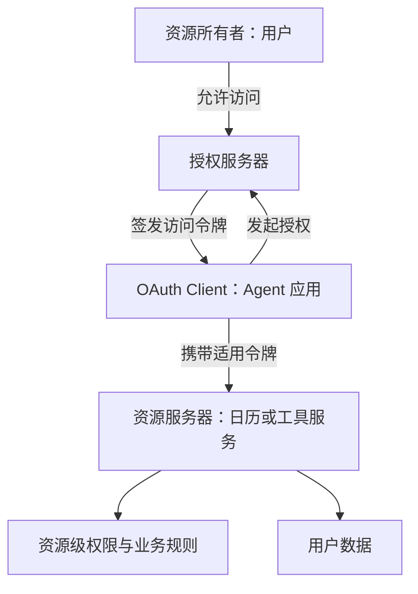
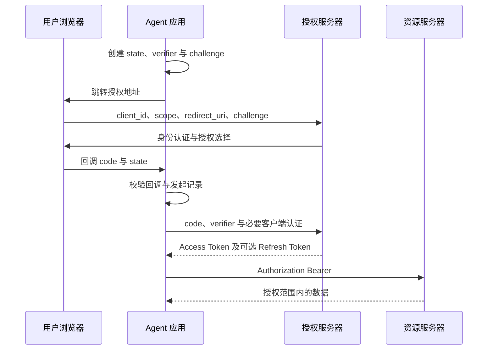
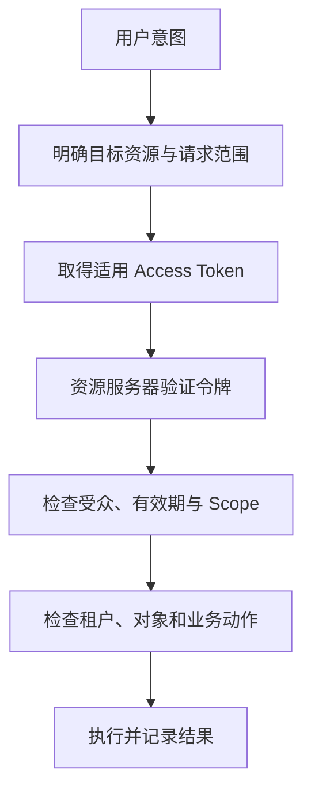
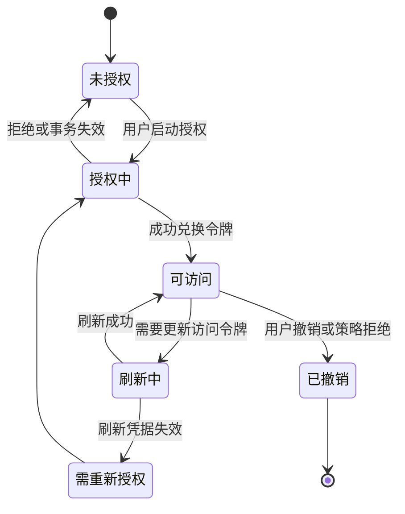

OAuth 解决的是：一个客户端如何获得访问资源的受限授权，而不必拿到资源所有者的密码。在 Agent 产品里，用户可以允许助手读取自己的日历，而不应因此把日历账户密码、所有文件和管理权限一并交给模型。

本文以 OAuth 2.0 的 RFC 6749、PKCE 的 RFC 7636 和安全最佳实践 RFC 9700 为基线，2026-09-07 核对。不把 OAuth 2.1 草案或特定厂商扩展当成已经普遍部署的契约。示例为架构与报文设计，未接入真实身份提供商。[OAuth 2.0](https://www.rfc-editor.org/rfc/rfc6749.html)、[安全最佳实践](https://www.rfc-editor.org/info/rfc9700/)

## 架构：四个角色与两个不同的问题



客户端、授权服务器和资源服务器是逻辑角色，可以由不同服务承担。用户是否已登录是身份认证问题；客户端是否有权读取某项资源是授权问题。OAuth 本身没有定义一个可直接当作登录身份的统一用户对象。

Harness 可能同时承担两种角色：面对外部业务 API，它是 OAuth Client；面对自己的用户或其他 Agent，它又可能提供受保护资源。两条授权链的令牌不能混用。

## 三种凭据各有用途

| 凭据 | 谁使用 | 用途 | 不应做什么 |
| --- | --- | --- | --- |
| Authorization Code | 客户端向 Token 端点兑换 | 短期、一次性的授权码 | 直接作为业务 API Token |
| Access Token | 客户端访问资源服务器 | 在规定范围访问资源 | 发给不匹配的下游服务 |
| Refresh Token | 客户端向授权服务器兑换 | 获取后续访问令牌 | 放进模型上下文或普通资源请求 |

Access Token 不一定是 JWT，也可能是不透明字符串；客户端不应依赖解析内部字段来决定是否有权访问。[Bearer Token 用法](https://www.rfc-editor.org/rfc/rfc6750.html)

资源服务器要按自身令牌配置验证有效性和适用范围。拿到一个看似合法的 Token，最多是进入授权判断的条件之一，不是对任意资源的通行证。

## 授权码与 PKCE 的完整流程



本文推荐显式维护一次性授权事务：绑定发起用户会话、授权服务器、redirect URI、state 和 PKCE verifier。回调只能消费对应事务，不能从查询参数任意选择下一个兑换端点。

PKCE 将授权码与发起方持有的随机 verifier 绑定。S256 方式为：

```text
challenge = BASE64URL_WITHOUT_PADDING(SHA256(ASCII(verifier)))
```

发起时发送 challenge，兑换时发送 verifier。截获授权码的一方若没有 verifier，就不能按原交易成功兑换。PKCE 不替代 TLS，也不让不可信客户端变可信。[RFC 7636](https://www.rfc-editor.org/rfc/rfc7636.html)

`state` 关联客户端授权事务并用于抵御回调混淆／CSRF；PKCE 绑定授权码兑换方；OIDC 的 nonce 绑定身份响应。三者解决的问题有交集但并不等价，不能随意删掉一个字段后声称其他字段完全替代了它。

## 客户端类型影响凭据保存方式

能够在受控服务器保存秘密的客户端，与分发到浏览器或用户机器上的客户端不同。把同一个 client secret 编译进桌面应用并不能使其成为可保密的凭据。

原生应用应通过外部用户代理完成授权，并使用适合平台的回调和 PKCE。回环地址、应用链接等方式各有条件，不能把任意本地监听端口视为已验证的回调目标。[原生应用最佳实践](https://www.rfc-editor.org/rfc/rfc8252.html)

后台服务使用 Client Credentials 时，通常以应用自身的授权身份行动；这不等于“代表某个登录用户”。用户委派任务转为后台运行后，系统仍需保存委派主体和权限边界，不能悄悄切换成权限更大的服务账户。

## Scope、Resource 与实际业务权限



Scope 表达授权能力范围，Resource Indicator 用来指明目标资源。即使 Scope 同为 `read`，发给日历服务的 Token 也不应被另一个文档服务接受。[Resource Indicators](https://www.rfc-editor.org/rfc/rfc8707.html)

令牌验证通过后，资源服务器仍要确认用户是否属于租户、是否有权读取这个具体文档，以及资源是否已被撤销共享。Scope 不是完整的对象权限模型。

在 MCP 中，Server 可以是受保护资源；客户端通过资源元数据发现授权服务器并获得适用于该 Server 的 Token。Server 再访问下游日历时，需要下游适用的授权，不能把上游 Token 不加区分地透传。[MCP 授权](https://modelcontextprotocol.io/specification/2025-11-25/basic/authorization)

## 刷新、撤销和并发不是后台细节



这是客户端设计状态，不是 OAuth 线上枚举。多个 Worker 同时刷新会竞争轮换凭据；建议由受控凭据管理器协调刷新，并原子保存新令牌，避免某个 Worker 把旧 Refresh Token 写回。

撤销端点和资源服务器的感知时间也要分开。自包含 Token 的本地验证、在线 introspection 和缓存策略具有不同的撤销延迟；不能承诺“点击退出后所有 Token 瞬间失效”。[令牌撤销](https://www.rfc-editor.org/rfc/rfc7009.html)、[Token Introspection](https://www.rfc-editor.org/rfc/rfc7662.html)

## Agent 委派不应无限放大权限

当 Agent A 请求 Agent B 完成任务时，需要回答：B 使用自己的服务身份，还是获得用户授权的一部分？如果授权服务器支持 Token Exchange，可以按受众、范围和主体语义获取下游令牌；这不是把原令牌复制一份。[Token Exchange](https://www.rfc-editor.org/rfc/rfc8693.html)

审计至少应关联用户主体、客户端身份、目标服务和实际操作。自然语言中的“帮我处理一下”不能替代可执行权限范围。高影响动作还可以要求具体资源与版本的业务确认，但不应每次重复弹出已经明确授予且仍有效的同一授权。

## 接入时最值得验证的失败

| 场景 | 应有结果 |
| --- | --- |
| 回调 state 不匹配或已消费 | 拒绝继续兑换 |
| 授权码被另一个 verifier 兑换 | 授权服务器拒绝 |
| Token 受众不匹配 | 资源服务器拒绝 |
| Scope 有效但用户无对象权限 | 业务服务拒绝 |
| 多 Worker 同时刷新 | 不覆盖最新有效凭据 |
| 用户撤销后任务还在运行 | 后续访问按撤销与缓存策略收敛 |

这是一组接入验收要求，不是本网站已经实现 OAuth 服务的声明。用户登录与身份 Claim 验证见[OpenID Connect](/writing/openid-connect/)，工具执行决策见[OPA](/writing/opa-policy-architecture/)。OAuth 解决授权的取得与使用；每次业务动作仍需对应服务做最终判断。
