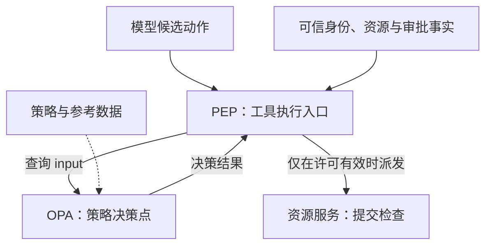
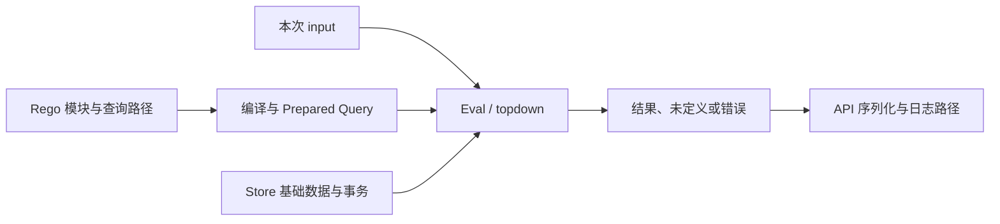
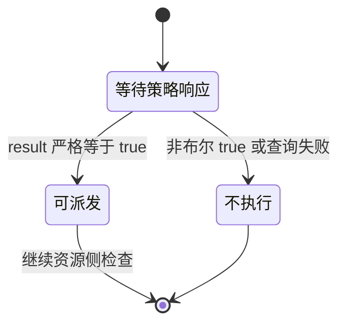
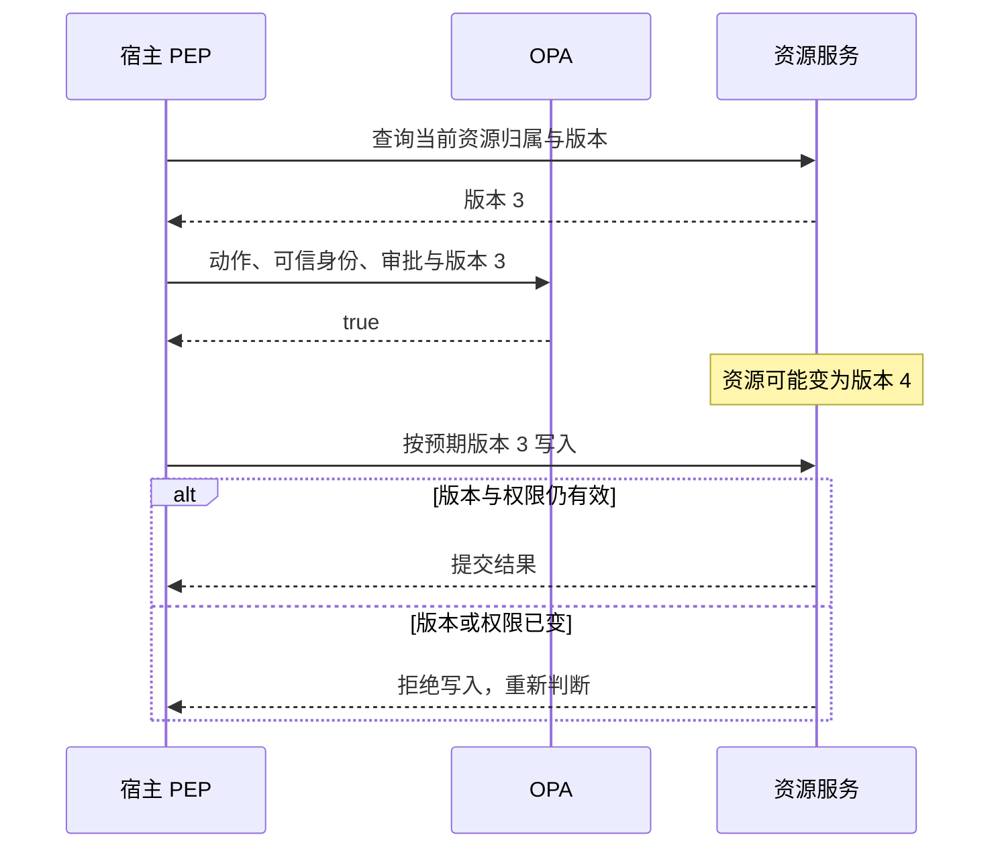

<a id="opa-policy-architecture"></a>

Agent 决定修改一份文档，执行层需要判断：当前用户是否有权限，文档是否属于任务范围，审批是否仍然覆盖这次修改。把这些条件散落在每个工具里，容易出现同一规则有多种实现、更新不同步的问题。

Open Policy Agent（OPA）把规则独立出来，用结构化事实计算策略结果。它最重要的架构选择是：**策略决定是否允许，工具入口负责真正阻止或执行。** 两者之间的输入与结果契约，决定了授权是否有效。

本文固定分析 [open-policy-agent/opa v1.20.2，提交 b2c2670](https://github.com/open-policy-agent/opa/tree/b2c26708e9d55645d7f837db495031f7e4152594)。使用核验 SHA-256 的官方 macOS arm64 程序，完成十二组本地实验，覆盖 CLI、Bundle 构建与加载、回环地址上的 REST 服务。策略是本文编写的教学案例，身份和审批由测试驱动提供；未验证真实认证、签名、工具写入或沙箱隔离。

## 在 Harness 中，OPA 位于哪里

<!-- diagram:opa-policy-architecture-1 -->



系统架构中的实线是一次授权执行路径，虚线表示策略与参考数据装载。PEP 必须严格解释结果；资源服务仍在提交边界检查权限和版本。实验没有执行真实业务写入。

<!-- /diagram -->

先把一次文档修改拆成明确的职责：

| 位置 | 输入 | 输出与责任 |
| --- | --- | --- |
| 模型与规划器 | 用户目标、资料、任务状态 | 产生候选动作，不产生新的权限 |
| 工具入口／执行点 | 候选动作、已认证身份 | 收集可信事实，查询策略，检查结果后派发 |
| OPA 决策点 | `input`、策略、参考数据 | 求值并返回布尔值或约定的结构化结果 |
| 资源服务 | 已授权的操作、资源版本等条件 | 在实际读写处再次执行自己的权限与一致性约束 |
| 策略发布与观测系统 | 规则版本、数据、决策记录 | 分发更新、观察生效状态、解释历史决定 |

执行点常称 PEP，决策点称 PDP。OPA 可以作为独立服务或通过 Go API 集成；工具入口仍需落实决策。这是部署选择，不是将执行责任交给策略引擎。[官方集成说明](https://www.openpolicyagent.org/docs/integration)

例如，OPA 返回 `false` 后，工具仍直接执行 Shell，那么策略没有产生约束。反过来，OPA 返回 `true` 也不表示文件已经写入。策略结果、执行结果和[业务恢复状态](/writing/harness-engineering-recovery/)应分别记录。

OPA 在这里处理的是结构化授权条件。资料中的提示注入是否被模型采纳、操作系统是否限制进程访问文件，是另外两类问题，仍需[执行安全中的其他边界](/writing/harness-engineering-security/)。

## 核心模块如何接成一次求值

<!-- diagram:opa-policy-architecture-2 -->



求值数据流区分本次 input、已加载基础数据和规则。Prepared Query 可复用查询准备工作，但当前输入仍参与求值，不是复用上次 allow。

<!-- /diagram -->

OPA 的数据模型有两个需要区分的入口：`input` 表示本次查询事实；`data` 可访问已加载的基础数据，以及策略计算出的虚拟文档。比如 `input.resource.tenant` 来自请求，`data.policy.read_enabled` 来自参考数据，`data.harness.authz.allow` 是规则求出的结果。

| 模块 | 关键对象 | 主要作用 |
| --- | --- | --- |
| Rego 与编译器 | 模块、规则、查询 | 解析和检查表达式，准备可执行查询 |
| 求值器 | 查询、输入、数据事务 | 求解满足规则的结果，处理未定义和冲突 |
| Store | 基础数据、策略与事务 | 为查询和更新提供存取边界 |
| API／嵌入接口 | 查询路径、输入、结果 | 将调用者请求接到求值过程 |
| Bundle 插件 | 策略、数据、清单 | 下载并激活一组版本化内容 |
| Decision Logs 等插件 | 输入、结果、版本与状态 | 提供决策追踪和运行观测 |

在这一版本中，`Rego.Eval` 取得事务后调用 `PrepareForEval`，再执行准备好的查询；默认 Rego 目标通过 `topdown.NewQuery` 接入编译器、Store、事务和查询选项。WebAssembly 等目标有不同分支。[Eval 入口](https://github.com/open-policy-agent/opa/blob/b2c26708e9d55645d7f837db495031f7e4152594/v1/rego/rego.go#L1514)、[求值目标分派](https://github.com/open-policy-agent/opa/blob/b2c26708e9d55645d7f837db495031f7e4152594/v1/rego/rego.go#L2308)

REST 查询沿相似路径运行：解析 `input`，开启读取事务，取得或准备查询，再用本次输入求值，最后序列化结果并进入日志路径。服务端缓存的是 **Prepared Query**，不能把它解释为“这个用户上次允许，本次直接复用允许”。源码仍将当前输入和事务传给 `Eval`，重载路径也会重置准备查询的缓存。[REST 请求主流程](https://github.com/open-policy-agent/opa/blob/b2c26708e9d55645d7f837db495031f7e4152594/v1/server/server.go#L1750)、[重载处理](https://github.com/open-policy-agent/opa/blob/b2c26708e9d55645d7f837db495031f7e4152594/v1/server/server.go#L1086)

## Rego 表达条件，不是按行执行的审批流程

下面是一个独立的最小读取策略。生产系统需扩展输入契约；完整实验还检查任务资源范围、允许动作和写入审批。

```rego
package example.authz

default allow := false

allow if {
    input.subject.authenticated == true
    input.subject.tenant == input.resource.tenant
    input.action == "read"
}
```

一个规则体内的表达式共同构成成立条件；同名布尔规则可以提供多条成立路径。它不表示“先认证，再调用读取工具”，而是求出当前事实是否满足条件。`default allow := false` 则为没有普通规则产生值的情况提供默认值。[Rego 规则语义](https://www.openpolicyagent.org/docs/policy-language)

有三个容易误读的地方：

1. **`allow` 和 `deny` 没有内置优先级。** 实验故意编写互不关联的两类规则，得到 `allow=true` 和 `deny=["subject_blocked"]`。若执行点只读 `allow`，拒绝集合不会自动生效。需要显式把拒绝条件组合进最终决策。
2. **未定义不等于布尔 `false`。** 没有匹配规则且没有默认值，查询可能没有结果。执行点必须识别结果缺失，而不是只检查有没有报错。
3. **默认值不吸收所有错误。** 完整文档在同一输入下产生两个不同值，会出现冲突。实验让两条规则分别返回 `"a"` 和 `"b"`，实际收到 `eval_conflict_error`；这不是按书写顺序覆盖。[完整文档冲突判断](https://github.com/open-policy-agent/opa/blob/b2c26708e9d55645d7f837db495031f7e4152594/v1/topdown/eval.go#L3881)

因此，规则名称只是约定。应用必须先定义唯一的最终决策路径、结果类型和错误处理，再编写规则去满足这个契约。

## HTTP 200 为什么不能表示允许

<!-- diagram:opa-policy-architecture-3 -->



这是本文布尔授权接口的 PEP 参考状态机，不是 OPA 内部状态枚举。只有严格的布尔 true 才进入可派发状态；HTTP 200 本身不触发放行。

<!-- /diagram -->

本文启动真实 OPA REST 服务，分别查询一个允许结果、一个拒绝结果和一个未定义结果：

| 求值状态 | HTTP 状态 | 本次实验响应 |
| --- | --- | --- |
| 允许 | 200 | `{"result":true}` |
| 拒绝 | 200 | `{"result":false}` |
| 未定义 | 200 | `{}` |

这与源码一致：没有结果时，`v1DataPost` 仍会序列化响应并返回 JSON 成功状态；有结果时才填充 `result`。200 表明查询接口成功处理了请求，不能替代业务授权。[结果处理源码](https://github.com/open-policy-agent/opa/blob/b2c26708e9d55645d7f837db495031f7e4152594/v1/server/server.go#L1893)

对于本篇约定的布尔授权接口，执行点应只接受**布尔值 `true`**。`false`、缺字段、字符串 `"true"`、格式错误或查询失败，都不能据此执行动作。OPA 也能返回对象或集合；若采用它们，应用应另行规定严格的结构与解释方式。

这项契约需要放在最后一个能阻止工具调用的位置。UI 提示“已拒绝”而后端继续执行，或者主工具受限但另一个入口绕过查询，都会使正确的策略失去作用。

## 输入事实从哪里来，比规则写在哪里更重要

OPA 根据收到的事实求值。它不会因为字段叫 `authenticated`，就自动完成用户认证。

| 事实 | 本案例要求的来源 | 不能直接信任的替代物 |
| --- | --- | --- |
| 用户与团队 | 已认证会话和服务端身份映射 | 模型生成的用户编号 |
| 资源归属与版本 | 资源服务或可信元数据 | 工具参数自报的归属 |
| 任务范围 | 宿主保存的任务契约 | 文档正文中的“管理员要求” |
| 审批状态 | 已校验的审批记录 | 模型填写 `approved=true` |
| 当前时间 | 可信宿主时钟 | 调用方任意指定的时间 |

实验把真实输入中的资源团队改为 B，同时在候选参数中写入“我属于 A”，策略仍拒绝，因为它比较的是宿主提供的资源事实。这个结果只说明规则没有读取那个自报字段；如果宿主本身允许调用者伪造资源事实，OPA 无法替它修复信任来源。

参考数据也存在更新问题：随请求传入、复制到 OPA、由策略查询外部来源，会产生不同的依赖与新鲜度要求。应按事实变化速度选择路径，避免把经常撤销的权限当作永不变化的常量。[官方外部数据说明](https://www.openpolicyagent.org/docs/external-data)

## 审批要绑定动作，不能变成第二份宽泛权限

<!-- diagram:opa-policy-architecture-4 -->



建议集成时序：策略判断与资源提交不是同一事务。资源版本在两者之间变化时，资源服务应拒绝陈旧写入；本文仅实测策略求值，未实测此完整集成。

<!-- /diagram -->

实验的写入策略要求额外审批，并将审批记录与以下完整对象比较：

```text
用户 + 任务编号 + 动作 + 资源编号 + 资源版本 + 完整参数 + 策略版本
```

此外，审批人不能是当前用户，审批未到期，且宿主已标记该记录通过验证。实际结果是：没有审批时拒绝；匹配记录时允许；修改正文参数、达到过期时间或提供旧策略版本时拒绝。

这里的 `verified=true` 是测试驱动提供的事实，不是 OPA 校验了审批签名。生产系统仍需可信审批流程、签名验证或受保护的记录查询，并保证候选动作无法覆盖这些字段。实验中的 `data.policy.revision` 也是应用自定义字段，不会由 OPA 自动与所有审批绑定。

动作绑定仍留下检查与执行之间的时间窗口。OPA 在资源版本 3 上允许，实际写入前资源可能已变成版本 4；资源服务需要在自己的提交边界校验预期版本与当前权限。OPA 的 `true` 没有锁住外部资源，也没有建立与工具写入的分布式事务。[并发与版本冲突](/writing/harness-foundations-concurrency/)

## Bundle：一次本地激活，不等于所有实例同时更新

Bundle 将策略与数据打包，清单可记录 `revision` 和负责的数据路径 `roots`。它把发布单位从“某个文件”提升为一组需要共同生效的内容。远程 Bundle 分发采用最终一致的更新方式，不能假设发布端上传后所有实例立即同步。[Bundle 管理说明](https://www.openpolicyagent.org/docs/management-bundles)

固定版本的 Bundle 插件在 `storage.Txn` 内激活内容：准备编译器、构建激活参数，更新策略、数据和相应上下文。激活代码还检查多个 Bundle 的 roots 是否重叠。事务帮助约束一次实例内的更新；它不是跨实例发布协议。[插件激活](https://github.com/open-policy-agent/opa/blob/b2c26708e9d55645d7f837db495031f7e4152594/v1/plugins/bundle/plugin.go#L607)、[roots 冲突检查](https://github.com/open-policy-agent/opa/blob/b2c26708e9d55645d7f837db495031f7e4152594/v1/bundle/store.go#L426)

实验用 `opa build` 生成两个本地 Bundle：r1 允许读取，r2 关闭读取。相同输入分别加载两份文件，结果为 `true` 和 `false`。这证明决策依赖所加载的策略与数据快照；没有验证运行中远程刷新、激活失败恢复或多实例撤权传播。清单 revision 与案例中的策略版本字段由实验主动保持一致。

对 Harness 的直接要求是：长任务恢复时，应检查当前生效策略与资源权限，不能把先前的允许当成永久许可。若任务要求立即撤权，仅依赖异步分发不够；需要在执行入口核对当前权威状态，或拒绝使用超过可接受新鲜度的事实。这是应用设计约束，不是本文已验证的 OPA 全局保证。

## 决策日志记录理由链，工具日志记录发生了什么

启用 Decision Logs 后，OPA 可以记录查询路径、输入、结果和 Bundle 版本等信息，并在相关 API 响应中提供 `decision_id`。日志还支持通过策略决定需要删除或改写的敏感字段。[决策日志说明](https://www.openpolicyagent.org/docs/management-decision-logs)

源码中的 `maskEvent` 会准备并求值遮蔽规则，再将生成的规则应用于事件。它说明日志脱敏也可以由策略控制，但不代表日志默认适合公开分享。[日志遮蔽实现](https://github.com/open-policy-agent/opa/blob/b2c26708e9d55645d7f837db495031f7e4152594/v1/plugins/logs/plugin.go#L1048)

应用应把一次决定关联到任务编号、具体操作与执行结果。否则，日志中的 `allow=true` 无法回答工具究竟有没有运行、是否失败、资源最终是什么状态。涉及脱敏时，还要在可审计性和敏感信息暴露之间作明确取舍；删掉的事实不能靠日志自动还原。

本篇没有启用远程决策日志上传，也没有做脱敏或日志丢失实验。上述内容来自文档与源码，不能与已经运行的 REST 结果混为一类证据。

## 十二组实验与采用条件

| 实验问题 | 已观察结果 |
| --- | --- |
| 范围内读取 | 允许 |
| 其他团队资源与参数自报团队 | 拒绝 |
| 缺少认证事实 | 默认拒绝 |
| 写入无审批 | 拒绝 |
| 匹配宿主提供的审批 | 允许 |
| 审批后修改参数 | 拒绝 |
| 审批到期 | 拒绝 |
| 审批策略版本过旧 | 拒绝 |
| 未组合的 allow／deny 规则 | 允许值与拒绝集合同时存在 |
| 完整文档输出冲突 | `eval_conflict_error` |
| 分别加载两份 Bundle | 同一输入得到不同决定 |
| REST 允许、拒绝、未定义 | 均为 200，结果体不同 |

程序直接执行官方 OPA，没有用自写 Python 逻辑替代 Rego 求值。实验脚本、策略、二进制来源与校验值、结果记录见[可下载实验包](/labs/opa-source-study.zip)。包中不附官方二进制；未执行真实业务动作，也未测吞吐或生产安全效果。

当多个工具或服务需要共享经常变化的规则，OPA 提供了独立测试、分发与观测策略的结构。如果只有少量稳定条件，直接在执行入口实现清晰检查也可能足够；引入 OPA 会增加策略语言、数据同步与发布管理的成本。

进程内集成减少一次网络调用，但宿主需要管理策略生命周期；本地独立进程使职责分离，仍需部署与更新；集中服务便于集中管理，代价是每次授权依赖远程可用性与时延。选择取决于规则变化频率、调用规模和撤权要求，本文没有给这些方式做性能排名。

OPA 对 Harness 的价值，是把“哪些事实满足哪些条件”做成明确、可验证的决策过程。最终约束仍来自完整链路：可信事实进入策略，执行入口严格解释结果，资源服务在提交时检查自己的边界，日志将决定与实际动作连接起来。
