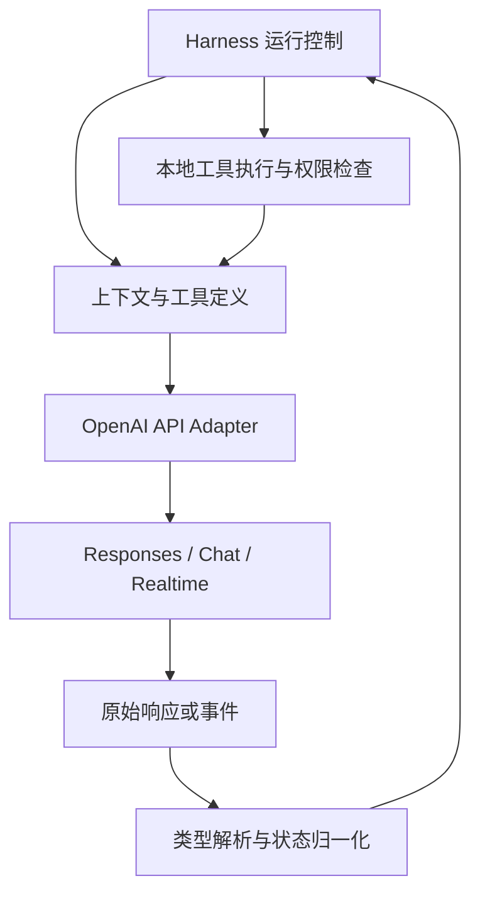
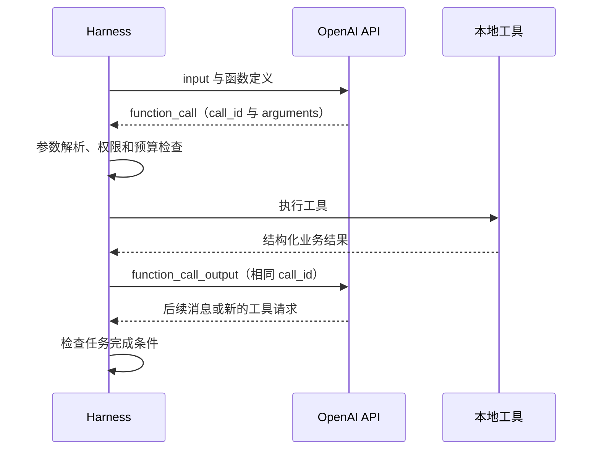
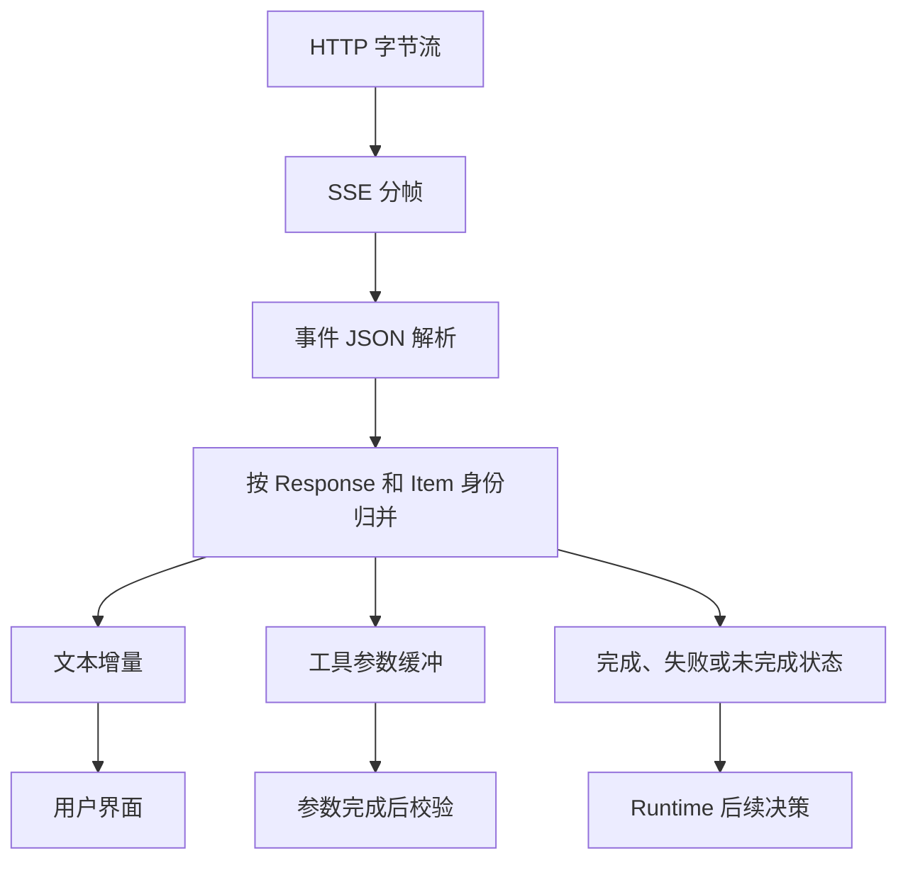
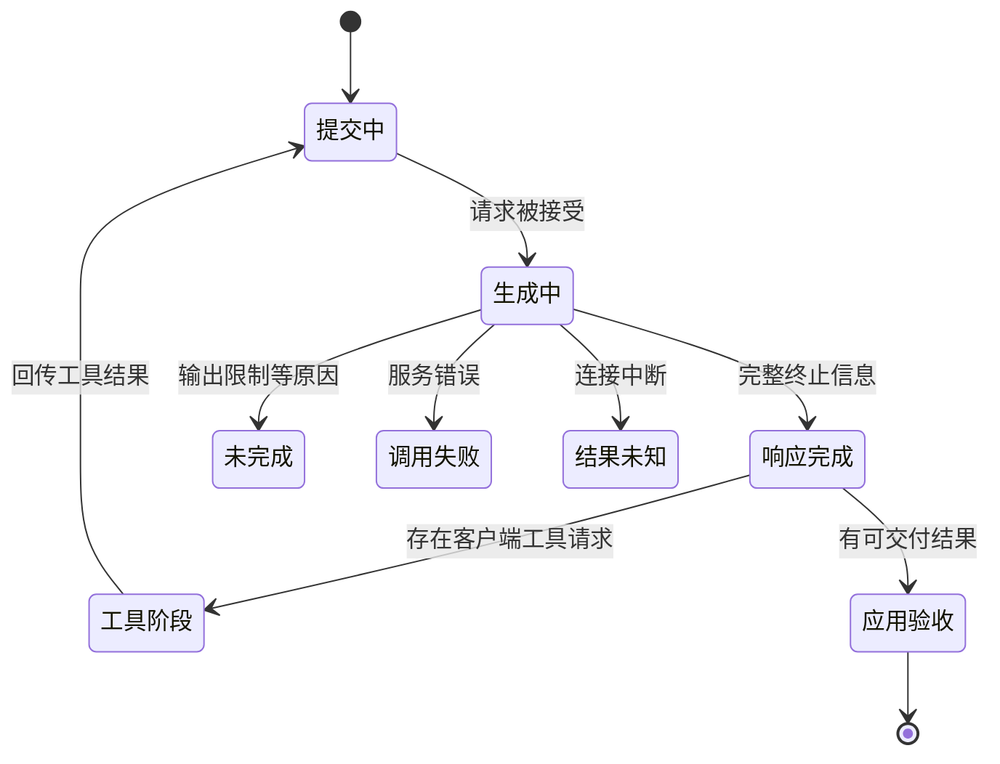

“OpenAI API 协议”通常指一组厂商接口契约，而不是一份像 HTTP 一样独立于厂商的统一标准。对 Harness 最关键的是：输入如何表达、输出有哪些类型、工具由谁执行、流何时结束，以及下一轮如何带回上下文。

本文以 **2026-09-07 官方文档**为依据，重点讨论 Responses，同时比较 Chat Completions 与 Realtime。模型、账户和接口支持存在差异，示例使用待配置的模型标识，不提供未经验证的全模型兼容承诺。没有发送付费模型请求；代码与报文用于说明协议。

## 架构：API Adapter 位于模型与运行控制之间



Adapter 应保留原始类型、ID 和结束信息，再生成供 Runtime 使用的语义事件。只返回 `string` 会丢失工具调用、拒绝、未完成原因和使用量。模型选择下一步，Runtime 决定是否可以执行。

HTTP API Key 认证通常由服务端适配器管理；不能为了让浏览器直接调用而把长期密钥放进前端包。Realtime 客户端连接按其会话凭据机制处理，不能与普通服务端密钥路径混用。

## 三种接口不能只改 URL

| 接口 | 核心对象 | 对 Harness 的影响 |
| --- | --- | --- |
| Chat Completions | `messages`、`choices`、`message`、`finish_reason` | 主要由应用管理会话历史 |
| Responses | `input`、类型化 `output` Items、Response 状态 | 分别处理文本、工具与其他输出项 |
| Realtime | 持续会话、输入输出事件和媒体流 | 管理打断、音频与实时会话状态 |

Responses 把 `message`、`function_call`、`function_call_output` 等作为不同 Item。迁移需要同时改输入、输出解析和状态续接，不能只把 `/chat/completions` 换成 `/responses`。[Responses 迁移指南](https://developers.openai.com/api/docs/guides/migrate-to-responses)

Realtime 面向持续的低延迟交互，有自己的事件和媒体连接机制。语音打断不仅是取消一次 HTTP 请求，还涉及用户实际听到多少内容以及如何保持对话状态一致；不应让普通文本流适配器假装完整支持它。[Realtime 文档](https://developers.openai.com/api/docs/guides/realtime)

## Responses 的输出是对象集合

下面是作者构造的请求体形状，`MODEL_ID` 必须替换为账户可用且支持相关功能的模型：

```json
{
  "model":"MODEL_ID",
  "instructions":"仅查询工单状态；不修改工单。",
  "input":"查询工单 T-17。",
  "tools":[{
    "type":"function",
    "name":"get_ticket",
    "description":"按工单 ID 查询状态。",
    "parameters":{
      "type":"object",
      "properties":{"ticket_id":{"type":"string"}},
      "required":["ticket_id"],
      "additionalProperties":false
    },
    "strict":true
  }]
}
```

函数工具参数是 JSON Schema。Strict 模式要求使用支持的 Schema 子集；它提高形状约束，不证明工单 ID 存在，也不授予跨租户查询权。[Function calling](https://developers.openai.com/api/docs/guides/function-calling)

不要假设 `output[0]` 一定是文本消息。完整解析器应遍历类型化输出，区分可显示文本、工具请求和需要续传的上下文项。SDK 的 `output_text` 是便利聚合，不应成为整个运行系统唯一的返回值。

## 工具调用需要应用完成闭环



`call_id` 关联函数请求与结果；Output Item 自身的 `id`、Response ID 和 HTTP 请求追踪 ID 不是同一个对象。把结果关联到错误 ID，模型就无法看到对应调用的完成结果。

函数工具通常由应用执行；平台托管工具按其服务端机制运行。两类工具的权限、成本、日志和中断能力可能不同，不能用一个“工具已执行”的布尔值掩盖所有差异。[工具调用机制](https://developers.openai.com/api/docs/guides/function-calling)

模型产生多个调用时，先区分独立查询与有依赖的写操作。并行参数代表可用的生成行为，不等于所有业务调用都适合并发。Runtime 可以排队、拒绝或等待批准，并应将结果准确关联回原调用。

以下两个 JSON 对象分别展示收到的函数调用 Item 和下一轮回传的结果 Item，都是作者构造的片段，不是完整 HTTP 请求：

```json
{"type":"function_call","id":"fc_7","call_id":"call_7","name":"get_ticket","arguments":"{\"ticket_id\":\"T-17\"}"}
```

```json
{"type":"function_call_output","call_id":"call_7","output":"{\"ticket_id\":\"T-17\",\"status\":\"open\"}"}
```

这里的 `arguments` 和 `output` 是字符串承载的内容，不能在网关中因二次编码变成多一层引号的字符串。应用管理历史时，还要保留原调用及相关输出上下文；仅把结果句子作为新用户消息发送，会丢掉工具关联。

## 流式解析是状态机，不是字符串拼接



Responses 有 `response.output_text.delta`、函数参数增量和终止类事件。字节分片可能切开一个 JSON 字符串；参数分片本身也可能是暂时不完整的 JSON。应该先完成网络分帧，再按事件类型归并，不能收到一半参数就执行写工具。[流式响应](https://developers.openai.com/api/docs/guides/streaming-responses)



这是 Runtime 的语义投影，不是把所有框内名称当作 API status 枚举。一次 Response 已完成，可以只是“模型完成了工具请求生成”；它不代表本地工具或用户任务已经完成。

连接结束但没有完整终态时，应保留未知或不完整状态。网络重试可能产生新 Response；若之前工具已经执行，重试整个任务可能重复副作用。工具幂等与结果对账仍由 Harness 和业务服务负责。

## 会话续接和持久化需要显式选择

Responses 可以由应用显式提供历史 Items，也可以使用 `previous_response_id` 关联响应，或使用 Conversations 管理会话。它们带来的状态归属和运维依赖不同。[会话状态](https://developers.openai.com/api/docs/guides/conversation-state)

| 方式 | 主要收益 | 需要承担的责任 |
| --- | --- | --- |
| 应用保存并重传历史 | 可控、易审查和跨供应商迁移 | 正确保留工具和推理相关项 |
| Response 链接 | 减少应用手动组装 | 跟踪远端对象与可用性 |
| 持久 Conversation | 明确远端会话身份 | 租户绑定、删除和生命周期 |

应用不应只保存用户可见文字后就认为能重建同一推理上下文。某些模型与模式需要保留额外的 reasoning 项；可显示摘要不等于完整可续接状态。每轮关键指令也应按接口契约明确发送，不能假设一切会自动继承。

存储开关、数据保留政策与客户端日志是不同层面的设置。设定 `store` 不会自动清理本地日志。Background 模式也有自己的运行、查询、取消和数据保留限制，必须按该模式文档判断，不能把它等同于任意长任务持久执行。[Background 模式](https://developers.openai.com/api/docs/guides/background)

## Structured Outputs 与业务验收分离

Responses 的结构化文本配置使用 `text.format`；Chat Completions 使用自己的配置形状。JSON 合法、Schema 合法与内容正确是三个层次。拒绝和输出截断仍需独立处理，不能直接把半截结构强制解析成空对象。[结构化输出](https://developers.openai.com/api/docs/guides/structured-outputs)

例如一个报告 Schema 要求 `sources` 数组，但数组中所有 URL 都不存在。结构校验可以通过，研究任务依然失败。工具参数严格生成也是同理：字段没有多余键，不代表请求获得授权或数值符合业务规则。

## “OpenAI compatible” 应逐项验收

接入第三方网关时，至少分别验证：普通文本、类型化工具调用、多个并行调用、参数分片、拒绝、截断、Usage、会话续接与取消。兼容 Chat Completions 不代表兼容 Responses；路径可用不代表所有模型支持相同参数。

本文建议 Adapter 暴露能力矩阵和原始响应旁路：无法无损映射的字段显式保留或报不支持，而不是静默丢弃。实际提供商、模型返回标识、请求追踪 ID 和网关路由应进入观测记录，便于解释降级后的结果。

与[Anthropic API](/writing/anthropic-api-protocol/)的比较，应落在消息对象、工具关联、停止原因和上下文续接这些行为上。如何路由和降级见[LLM Gateway](/writing/harness-operations-model-gateway/)。本文没有运行两家模型的同题评测，接口分析不构成模型能力排名。
