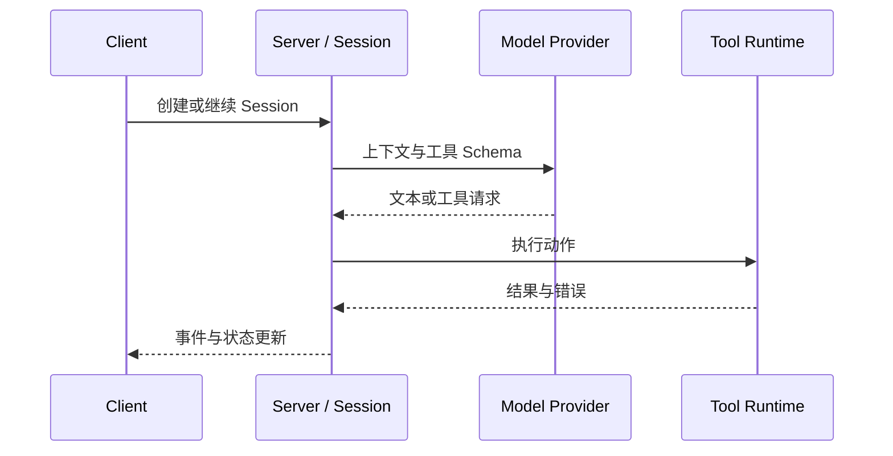

> 系列：[1. 全景](/writing/opencode-system-overview/)｜[2. 运行与状态](/writing/opencode-client-server-runtime/)｜[3. Agents 与扩展](/writing/opencode-agents-skills-plugins/)｜[4. 整体判断](/writing/opencode-system-synthesis/)

OpenCode 的 Client/Server 结构把“怎样展示任务”和“任务怎样运行”分开。TUI、桌面端或 SDK 发送请求，Server 负责项目、Session、消息、Provider、工具和事件；客户端订阅状态变化，而不各自复制一套 Agent Loop。

*图 1｜Session 是运行事实的中心，客户端只是不同投影。*

这条边界带来复用，也带来协议责任：事件顺序、断线恢复、工具中断和 Provider 差异必须在 Server 侧形成稳定语义。否则多个客户端虽然连接同一接口，却会对“任务是否结束”得到不同答案。

开放 Provider 选择降低模型绑定，但无法消除消息格式、工具调用、推理块和错误语义的差异。适配层的价值，是保留上层真正需要的事件，而不是把所有供应商压成最低公分母。

---

上一篇：[全景](/writing/opencode-system-overview/)。

下一篇：[Agents 与扩展](/writing/opencode-agents-skills-plugins/)。

运行主链确定后，下一篇检查外部规则和代码可以在多深的位置改变它。
