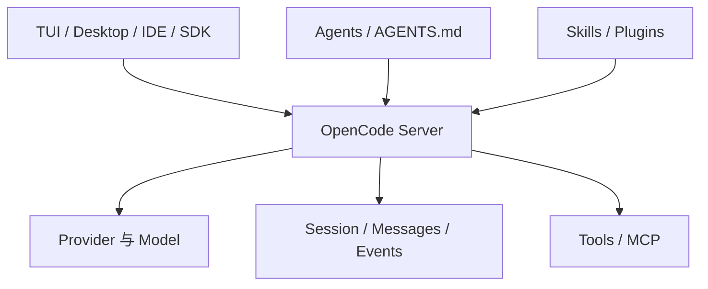

> 系列：[1. 全景](/writing/opencode-system-overview/)｜[2. 运行与状态](/writing/opencode-client-server-runtime/)｜[3. Agents 与扩展](/writing/opencode-agents-skills-plugins/)｜[4. 整体判断](/writing/opencode-system-synthesis/)

OpenCode 的研究价值在于核心产品和扩展体系都能沿开放源码检查。它不是一个单文件 CLI，而是由服务端状态、不同客户端、Provider 适配、Session、工具和配置系统共同组成的 Coding Agent。[官方仓库](https://github.com/anomalyco/opencode)

*图 1｜Client/Server 边界使同一运行状态可以服务多种交互表面。*

本系列第二篇沿 Session 和事件进入运行主链，第三篇研究 Agents、Skills、权限和 Plugins 的装配方式。终篇不做模型效果排名，而判断开放源码怎样帮助团队控制供应商、界面和工作流差异。

---

下一篇：[运行与状态](/writing/opencode-client-server-runtime/)。

下一篇先看一次任务在 Server 内怎样形成可消费的状态与事件。
