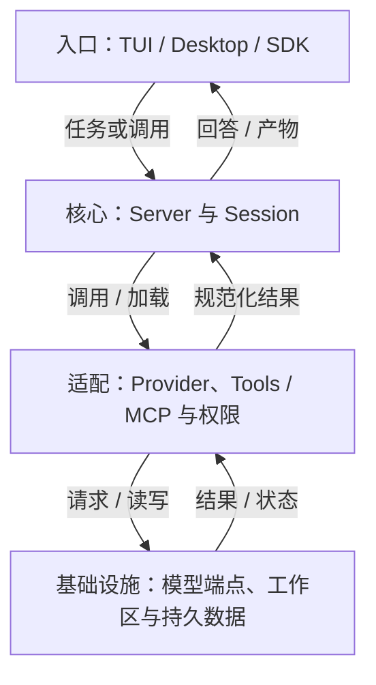
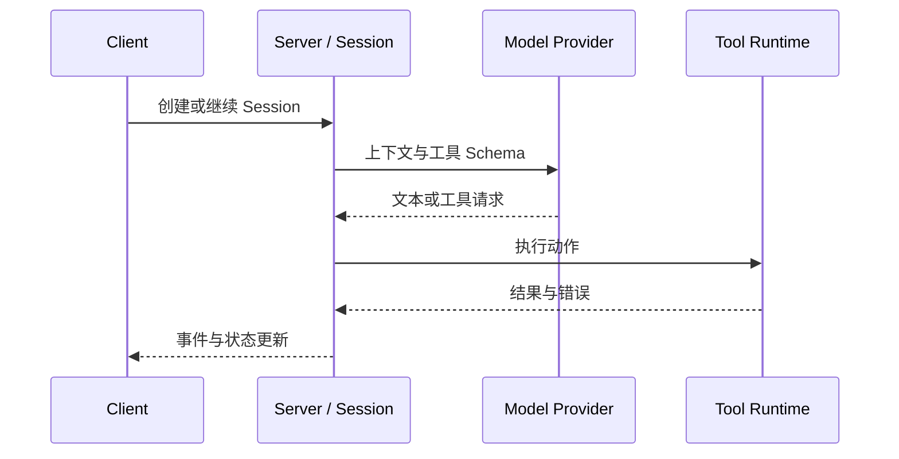

## 定位与价值

OpenCode 是采用客户端／服务端结构的开源编程 Agent；多种界面共用服务端 Session 和模型适配，减少每个客户端各写一套执行循环的成本。

适合多客户端和多模型接入；不适合把 Provider 可切换当作行为完全一致，或把插件当作无权限的普通文本。

研究基线：[anomalyco/opencode @ 7c2199d](https://github.com/anomalyco/opencode/blob/7c2199d84a5830f70a8250731a42ff958145b4d6/README.md)；源码与社区核对日期为 2026-09-06。

## 技术架构



*图 1｜职责与数据流；逻辑分层不要求分开部署。*

## 核心机制

### 扩展如何影响执行

OpenCode 把扩展拆成不同粒度。AGENTS.md 提供项目长期说明；Agent 定义角色、模型、工具和权限；Skill 用描述参与发现，正文按需加载；Plugin 则运行 JavaScript 或 TypeScript 代码，接入生命周期事件。[Skills 文档](https://opencode.ai/docs/skills)与[Agents 文档](https://opencode.ai/docs/agents)分别说明了知识加载和执行角色。

| 扩展 | 改变什么 | 信任等级 |
| --- | --- | --- |
| AGENTS.md | 常驻项目上下文 | 提示级 |
| Skill | 某类任务的方法 | 提示级、按需加载 |
| Agent | 模型、工具、权限与角色 | 配置级 |
| Plugin | 生命周期与运行代码 | 进程代码级 |

开放带来的最大误区，是把这四者都称为“插件”。Skill 即使写得很强硬，最终仍由模型解释；Plugin 可以直接产生副作用，必须像依赖代码一样审查。权限应在工具和 Agent 边界执行，而不是只靠 Skill 文本约束。

OpenCode 也兼容多种 Skills 目录，这有利于迁移，却可能产生重复名称、覆盖顺序和版本漂移。生产使用需要维护来源、安装版本和冲突诊断，而不能只保证文件被发现。


### 多个客户端怎样共用 Session

OpenCode 的 Client/Server 结构把“怎样展示任务”和“任务怎样运行”分开。TUI、桌面端或 SDK 发送请求，Server 负责项目、Session、消息、Provider、工具和事件；客户端订阅状态变化，而不各自复制一套 Agent Loop。



*图 2｜Session 是运行事实的中心，客户端只是不同投影。*

这条边界带来复用，也带来协议责任：事件顺序、断线恢复、工具中断和 Provider 差异必须在 Server 侧形成稳定语义。否则多个客户端虽然连接同一接口，却会对“任务是否结束”得到不同答案。

开放 Provider 选择降低模型绑定，但无法消除消息格式、工具调用、推理块和错误语义的差异。适配层的价值，是保留上层真正需要的事件，而不是把所有供应商压成最低公分母。

## 快速上手

需要 Node/npm 和一个模型供应商账号；安装版本与本文源码 package.json 一致，先完成供应商登录。

```bash
npm install -g opencode-ai@1.18.29
mkdir -p opencode-demo
cd opencode-demo
printf "# Demo\nNo source files yet.\n" > README.md
opencode run --agent plan "解释 README.md，不修改文件"
```

三个常用配置：

| 配置或安装选项 | 作用 |
| --- | --- |
| `model` | provider/model 格式的模型选择 |
| `permission` | 控制工具的 allow、ask、deny 行为 |
| `mcp` | 注册工具服务及其连接配置 |

其余选项见 [配置参考](https://opencode.ai/docs/config/)。

常见坑：先运行 opencode auth login 配置供应商；plan 模式仍需核对自定义 Agent 和权限覆盖。

验证范围：已核对固定源码的入口、参数与依赖；未以本文示例调用真实模型或部署外部服务。

## 生态与社区

截至 2026-09-06，2026-08-08 至 09-06 UTC 的抽样取得 至少 30 条默认分支提交（上限 30 条）。见 [提交记录](https://github.com/anomalyco/opencode/commits/dev/)。

Issue 取 08-08 至 08-30 UTC 创建的最近最多 3 条非 PR 条目，排除机器人和提问者自答；3 条中 0 条观察到维护者文字回复。 样本：[#46314](https://github.com/anomalyco/opencode/issues/46314)、[#46313](https://github.com/anomalyco/opencode/issues/46313)、[#46311](https://github.com/anomalyco/opencode/issues/46311)。小样本不代表 SLA，“未观察到”也不代表其他渠道无人处理。

固定快照许可证：[MIT](https://github.com/anomalyco/opencode/blob/7c2199d84a5830f70a8250731a42ff958145b4d6/LICENSE)。允许商业使用，但分发时仍须保留版权与许可声明。

仓库维护桌面端、TUI、JavaScript SDK 和插件接口；具体 Provider 与社区插件需分别验证。

## 源码阅读路径

阅读顺序：入口 → 核心抽象 → 具体实现 → 测试。

| 顺序 | 目录 → 文件 | 函数、对象或检查重点 |
| --- | --- | --- |
| 1 | [packages/opencode/package.json](https://github.com/anomalyco/opencode/blob/7c2199d84a5830f70a8250731a42ff958145b4d6/packages/opencode/package.json) | bin 与开发入口 |
| 2 | [packages/opencode/src/index.ts](https://github.com/anomalyco/opencode/blob/7c2199d84a5830f70a8250731a42ff958145b4d6/packages/opencode/src/index.ts) | CLI 启动 |
| 3 | [packages/core/src/session/prompt.ts](https://github.com/anomalyco/opencode/blob/7c2199d84a5830f70a8250731a42ff958145b4d6/packages/core/src/session/prompt.ts) | Session Prompt 核心实现 |
| 4 | [packages/opencode/src/session/processor.ts](https://github.com/anomalyco/opencode/blob/7c2199d84a5830f70a8250731a42ff958145b4d6/packages/opencode/src/session/processor.ts) | 会话处理接口 |
| 5 | [packages/opencode/test/session/prompt.test.ts](https://github.com/anomalyco/opencode/blob/7c2199d84a5830f70a8250731a42ff958145b4d6/packages/opencode/test/session/prompt.test.ts) | 提示和工具循环用例 |
