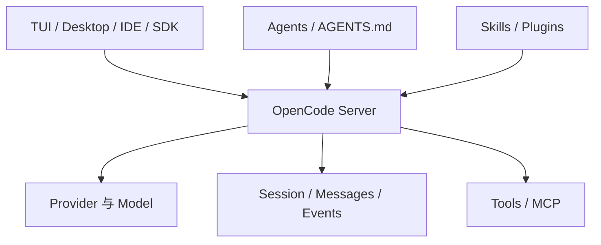
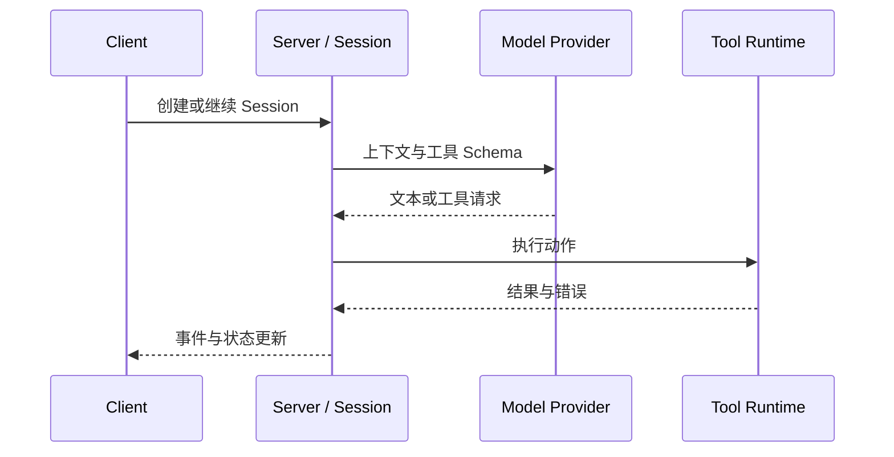

OpenCode 的研究价值在于核心产品和扩展体系都能沿开放源码检查。它不是一个单文件 CLI，而是由服务端状态、不同客户端、Provider 适配、Session、工具和配置系统共同组成的 Coding Agent。[官方仓库](https://github.com/anomalyco/opencode)

*图 1｜Client/Server 边界使同一运行状态可以服务多种交互表面。*

## Agent、Skill 与 Plugin 的分工

OpenCode 把扩展拆成不同粒度。AGENTS.md 提供项目长期说明；Agent 定义角色、模型、工具和权限；Skill 用描述参与发现，正文按需加载；Plugin 则运行 JavaScript 或 TypeScript 代码，接入生命周期事件。[Skills 文档](https://opencode.ai/docs/skills)与[Agents 文档](https://opencode.ai/docs/agents)分别说明了知识加载和执行角色。

| 扩展 | 改变什么 | 信任等级 |
| --- | --- | --- |
| AGENTS.md | 常驻项目上下文 | 提示级 |
| Skill | 某类任务的方法 | 提示级、按需加载 |
| Agent | 模型、工具、权限与角色 | 配置级 |
| Plugin | 生命周期与运行代码 | 进程代码级 |

开放带来的最大误区，是把这四者都称为“插件”。Skill 即使写得很强硬，最终仍由模型解释；Plugin 可以直接产生副作用，必须像依赖代码一样审查。权限应在工具和 Agent 边界执行，而不是只靠 Skill 文本约束。

OpenCode 也兼容多种 Skills 目录，这有利于迁移，却可能产生重复名称、覆盖顺序和版本漂移。生产使用需要维护来源、安装版本和冲突诊断，而不能只保证文件被发现。

## 客户端、服务端与 Session

OpenCode 的 Client/Server 结构把“怎样展示任务”和“任务怎样运行”分开。TUI、桌面端或 SDK 发送请求，Server 负责项目、Session、消息、Provider、工具和事件；客户端订阅状态变化，而不各自复制一套 Agent Loop。

*图 2｜Session 是运行事实的中心，客户端只是不同投影。*

这条边界带来复用，也带来协议责任：事件顺序、断线恢复、工具中断和 Provider 差异必须在 Server 侧形成稳定语义。否则多个客户端虽然连接同一接口，却会对“任务是否结束”得到不同答案。

开放 Provider 选择降低模型绑定，但无法消除消息格式、工具调用、推理块和错误语义的差异。适配层的价值，是保留上层真正需要的事件，而不是把所有供应商压成最低公分母。
