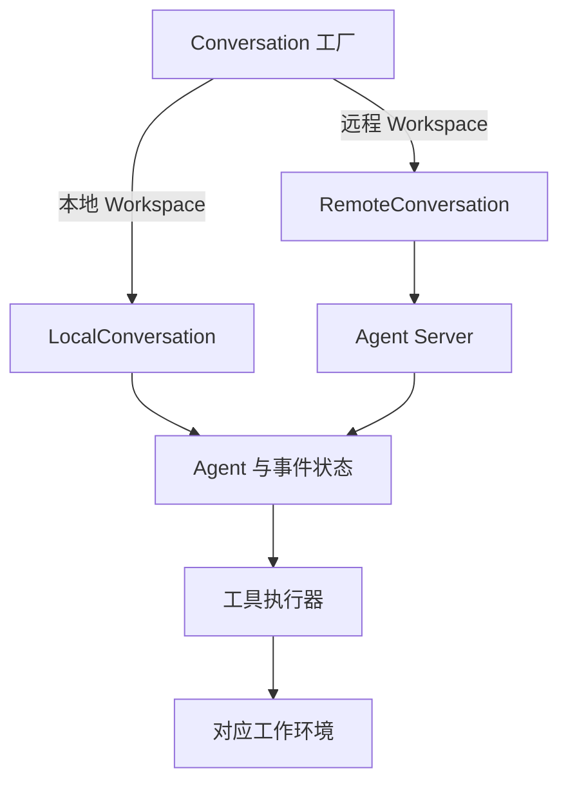
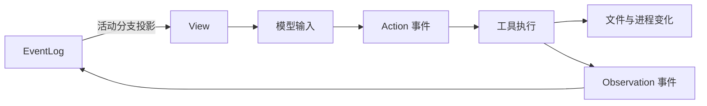
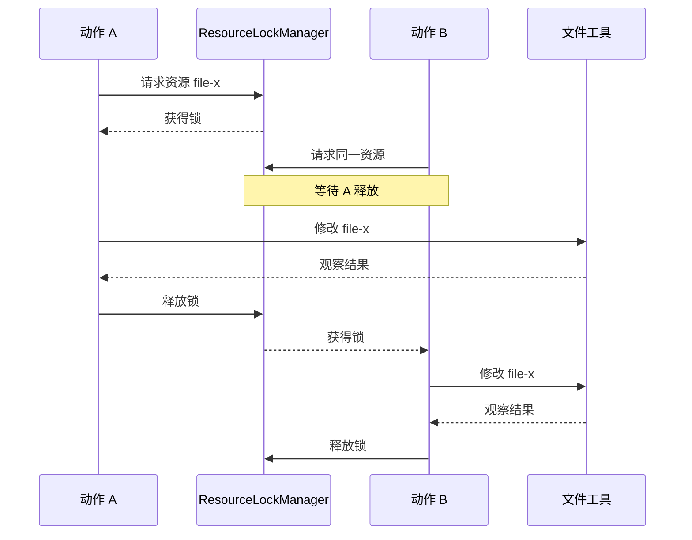
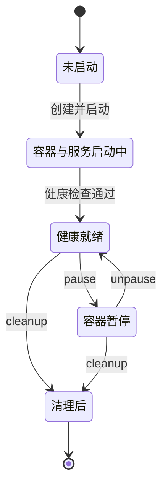

让 Agent 修改一个项目，至少有三种状态需要保持一致：它认为自己已经完成了什么，下一次模型调用能看到什么，以及工作目录和进程实际上变成了什么。

OpenHands Software Agent SDK 将它们放在不同对象中：Conversation 管理运行与事件，Agent 根据上下文决定动作，工具把动作变成观察，Workspace 确定运行环境。理解这些边界，才能判断“暂停”“恢复”“并行”和“完成”分别意味着什么。

本文分析 `OpenHands/software-agent-sdk@aa84db8216192568c4436d0dcc36f4caf8516c5b`，核对日期为 2026-09-07，该提交 SDK 包版本为 1.44.1。研究对象是这个仓库中的 Python SDK、工具和工作空间实现，不是 OpenHands 产品界面，也不将早期主仓库的运行时结构混入当前设计。以下属于锁定源码分析；本轮没有安装运行完整 OpenHands、调用模型或启动 Docker，因此不报告任务成功率、隔离强度或性能结果。

## 四个包如何构成一条执行链

<!-- diagram:openhands-sdk-architecture-1 -->

源码架构：Conversation 根据 Workspace 选择本地或远程会话。远程 Agent Server 承接执行与事件访问；图不把独立调度平台归入 SDK。

<!-- /diagram -->

| 包 | 核心责任 | 主要对象 |
| --- | --- | --- |
| `openhands-sdk` | 定义 Agent、会话、事件、模型和工具契约 | `Agent`、`Conversation`、`ConversationState`、`ToolDefinition` |
| `openhands-tools` | 提供具体工具与执行实现 | 文件编辑、终端、任务跟踪等工具 |
| `openhands-agent-server` | 通过网络承接远程会话执行与事件访问 | Agent Server 的 REST / WebSocket 接口 |
| `openhands-workspace` | 管理具体远程环境的创建与生命周期 | Docker 等 Workspace 实现 |

`Conversation` 是工厂：传入本地目录或 `LocalWorkspace`，返回本地会话；传入远程 Workspace，返回连接 Agent Server 的远程会话。这样，上层仍围绕同一种工作对象编程，运行位置由 Workspace 决定。[Conversation 工厂源码](https://github.com/OpenHands/software-agent-sdk/blob/aa84db8216192568c4436d0dcc36f4caf8516c5b/openhands-sdk/openhands/sdk/conversation/conversation.py)

这不代表本地和远程没有差别。远程环境引入网络可用性、凭证、服务健康检查和资源回收；调用接口相近，只是把差异集中在边界。仓库还明确将自动化调度、webhook 与运行派发归到另一仓库；不能因为 SDK 能执行一个会话，就认为它自带完整的定时任务平台。[仓库职责说明](https://github.com/OpenHands/software-agent-sdk/blob/aa84db8216192568c4436d0dcc36f4caf8516c5b/README.md#repository-boundaries)

## 主流程：模型生成动作，运行系统处理动作的后果

以“修改配置并运行测试”为例，本地主要路径如下：

1. 创建 Conversation，绑定 Agent、Workspace、持久化位置和运行限制。
2. 用户消息进入会话事件；`run()` 或异步 `arun()` 推进 Agent。
3. `Agent.step()` 先检查当前分支是否有尚未匹配结果的动作；若有，优先走待处理动作路径，而非立即让模型再生成一批动作。
4. 正常采样时，从 `state.view` 准备模型消息。如果需要压缩上下文，先产生 Condensation 事件，再在后续步骤继续。
5. 模型响应被转换为消息或动作事件，经过 Hook 与确认策略相关处理，进入工具执行。
6. `_ActionBatch` 组织一批动作，经 `ParallelToolExecutor` 执行；结果按动作 ID 关联，再发出相应事件。
7. 观察进入会话状态，下一次模型调用使用更新后的视图；结束动作、暂停、等待确认或运行限制改变推进状态。

这条链中，模型只提出调用内容。动作是否被执行、如何关联结果、何时暂停，是运行系统的责任。`_ActionBatch` 还会截断同一批中位于 Finish 动作之后的调用，避免一批响应已经要求结束，却继续执行后续动作。[Agent 与动作批处理源码](https://github.com/OpenHands/software-agent-sdk/blob/aa84db8216192568c4436d0dcc36f4caf8516c5b/openhands-sdk/openhands/sdk/agent/agent.py)

“先处理未匹配动作”也是一个恢复边界：日志中有 Action、没有结果，不代表外部动作没有发生。若写文件或创建远程资源后进程退出，应用仍需核对实际结果；单靠补齐消息对不能获得业务上的恰好一次执行。

## 事件、视图与工作目录分别保存什么

<!-- diagram:openhands-sdk-architecture-2 -->

事件与环境两条数据链：事件投影成模型输入，工具改变工作环境并返回观察。View 回退不会沿箭头自动撤销文件；该图基于源码，未运行完整 SDK。

<!-- /diagram -->

| 状态 | 代表什么 | 能否替代其他状态 |
| --- | --- | --- |
| EventLog | 会话事件及其身份、父子关系 | 不能代替目录内文件和后台进程 |
| ConversationState | 运行状态、活动分支及会话配置等 | 不能独立证明外部动作成功 |
| View | 从当前分支事件得到的模型可用视图 | 不是完整历史的永久替代品 |
| Workspace 文件 | 当前源码、中间文件与成果 | 不能解释每个修改为何发生 |
| 终端与进程 | Shell 环境、运行中命令及会话状态 | 不能仅靠聊天历史完整还原 |

`EventLog` 经 FileStore 存储事件，并维护事件 ID 与位置索引；事件的 `parent_id` 用于沿分支回溯。`ConversationState.view` 则可以增量追加当前分支的新事件，在分支变化等情况下重新构建。因此，事件记录与模型上下文是两个不同的数据结构。[事件存储](https://github.com/OpenHands/software-agent-sdk/blob/aa84db8216192568c4436d0dcc36f4caf8516c5b/openhands-sdk/openhands/sdk/conversation/event_store.py)、[会话状态与视图缓存](https://github.com/OpenHands/software-agent-sdk/blob/aa84db8216192568c4436d0dcc36f4caf8516c5b/openhands-sdk/openhands/sdk/conversation/state.py)

一个具体后果是：用户切换到较早的会话分支，不会因为 View 回退就自动撤销已经修改的文件。若产品提供“回到这里重新尝试”，还要明确工作目录使用哪个版本，以及先前进程是否仍在运行。这是由状态边界推导出的设计要求，不是声明 SDK 会自动回滚环境。

压缩同样作用于输入视图。View 处理 Condensation 事件，再将相应视图供模型使用；审计与恢复不能只保存最终那一份压缩后的消息。应用还需保证关键目标、未完成动作和必要证据仍能被模型获取，见[上下文组装](/writing/harness-operations-context/)。[视图实现](https://github.com/OpenHands/software-agent-sdk/blob/aa84db8216192568c4436d0dcc36f4caf8516c5b/openhands-sdk/openhands/sdk/context/view/view.py)

持久化也有具体限制：没有配置持久存储时可以回退到内存；状态保存中的秘密在没有 cipher 时会被脱敏，不能假定恢复后凭证仍可用。EventLog 的本地文件锁说明还特别指出 NFS 等网络文件系统的限制，不能从本机锁推导出可靠的分布式多写者协议。

## 并行工具：限制线程数之外，还要声明资源

<!-- diagram:openhands-sdk-architecture-4 -->

锁时序示意两个动作声明同一资源的情况。锁只在共享该管理器的执行范围内协调；结果列表顺序不等于副作用发生顺序。

<!-- /diagram -->

两个检索请求通常可以并行，但同一终端中的 `cd` 与运行测试有共享状态，两个文件编辑操作也可能覆盖同一文件。OpenHands 将“允许多少并行”与“哪些调用冲突”分开处理。

`ParallelToolExecutor` 有每个执行器的并发限制；同步路径可使用线程池。它读取工具的 `declared_resources()`，经 `ResourceLockManager` 对共享资源加锁。资源键排序后再获取锁，用于避免按不同顺序获取同组锁造成的死锁；资源锁使用 FIFO 机制。[并行执行器](https://github.com/OpenHands/software-agent-sdk/blob/aa84db8216192568c4436d0dcc36f4caf8516c5b/openhands-sdk/openhands/sdk/agent/parallel_executor.py)、[资源锁](https://github.com/OpenHands/software-agent-sdk/blob/aa84db8216192568c4436d0dcc36f4caf8516c5b/openhands-sdk/openhands/sdk/conversation/resource_lock_manager.py)

| 教学情境 | 需要识别的共享状态 | 设计含义 |
| --- | --- | --- |
| 同时编辑同一个文件 | 文件路径对应的资源 | 即使线程不同，也应串行保护 |
| 同时编辑独立文件 | 各自文件资源 | 可以利用并行，但还要检查跨文件逻辑依赖 |
| 向同一终端连续输入 | 终端会话 | 命令不是彼此独立的无状态函数 |
| 两个执行器修改同一宿主目录 | 可能没有共享同一个锁管理器 | 需要工作区隔离或额外协调 |

最后一行尤其重要：执行器实例拥有自己的锁管理器，不能把它解释为跨会话、跨进程或跨主机的全局锁。工具若声明错资源，也会使局部保护失效。路径别名、符号链接和工具之间隐含的依赖，都需要实现者进一步处理。

执行器按输入动作顺序返回结果列表，动作批处理再按 ID 关联；这有助于稳定事件消费，但返回顺序不代表外部副作用按这个顺序发生。依赖 B 的动作 A 不应仅因为“结果最后排在 B 后面”就并发派发。任务依赖应在[执行图](/writing/langgraph-runtime-architecture/)或工具编排中表达。

这些是同一运行范围内的并行机制。多租户公平性、全局 API 配额与父子 Agent 共享预算仍是额外设计，不能由线程池参数推导出来。

## 工作空间决定代码在哪里运行

<!-- diagram:openhands-sdk-architecture-3 -->

状态机聚焦源码中的 DockerWorkspace 生命周期，是行为归纳而非内部枚举。pause 保持同一容器，cleanup 停止 --rm 容器；文件是否保留取决于挂载与导出。未运行容器实验。

<!-- /diagram -->

`LocalWorkspace` 直接访问宿主文件系统，`execute_command()` 使用本地命令工具并指定工作目录。`working_dir` 是运行位置，不是阻止进程访问其他路径的安全边界。Git worktree 可以隔离代码修改，也不会自动限制网络、凭证或操作系统权限。[本地 Workspace](https://github.com/OpenHands/software-agent-sdk/blob/aa84db8216192568c4436d0dcc36f4caf8516c5b/openhands-sdk/openhands/sdk/workspace/local.py)

DockerWorkspace 的路径不同：创建并启动容器，在其中运行 Agent Server，等待健康检查后，通过远程 Workspace 接口工作。它允许配置挂载、环境变量转发和网络。实际权限取决于这些配置以及部署环境，不能从类名中的 Docker 推导“默认具有完整隔离”。

该提交的 `_start_container()` 使用 `docker run --rm`；`cleanup()` 停止容器，退出上下文也会触发清理。`pause()` / `resume()` 则分别调用 Docker pause / unpause，保持同一容器的暂停与继续，而不是销毁后凭会话日志恢复。[DockerWorkspace 生命周期源码](https://github.com/OpenHands/software-agent-sdk/blob/aa84db8216192568c4436d0dcc36f4caf8516c5b/openhands-workspace/openhands/workspace/docker/workspace.py)

这产生三个不同的恢复问题：

1. **同一容器暂停后继续**：进程环境仍由原容器承载；需要确认容器与服务仍可用。
2. **新容器读取保留的工作文件**：依赖挂载或成果存储，还要重建软件依赖与必要进程。
3. **只加载会话历史**：可以恢复一部分运行认知，但缺失文件和进程时，不能直接宣称工作环境已恢复。

尤其是临时容器清理前，应确认结果已经导出或位于保留的卷中。模型最后回复“文件已生成”，不构成成果已离开临时环境的证明。

## 终端是有生命周期的工具

工具层的 `TerminalAction` 包含命令、向运行中进程输入的标记、超时和 reset。终端工厂按配置与系统能力选择 tmux、subprocess 或 PowerShell 等实现，再包装为 TerminalSession。[动作定义](https://github.com/OpenHands/software-agent-sdk/blob/aa84db8216192568c4436d0dcc36f4caf8516c5b/openhands-tools/openhands/tools/terminal/definition.py)、[终端工厂](https://github.com/OpenHands/software-agent-sdk/blob/aa84db8216192568c4436d0dcc36f4caf8516c5b/openhands-tools/openhands/tools/terminal/terminal/factory.py)

因此，“命令暂时没有输出”“本次观察超时”“进程已经退出”“终端重置”应是不同状态。reset 会丢失原会话的环境与状态，不能当作无成本的重试。命令退出码与输出是过程证据；测试是否覆盖用户问题、生成文件是否正确，仍需要独立验收。

这里也要区分 Workspace 的直接命令接口和 Agent 的 TerminalTool。前者是应用控制环境的一条入口，后者经过模型动作与工具执行链；不能假设直接调用环境接口也自动经过 Agent 的确认策略。

## 暂停、打断与审批控制不同边界

源码中的 `LocalConversation.pause()` 请求在运行步骤之间暂停；若同步模型调用尚未返回，不会立即切断该调用。`interrupt()` 面向正在执行的异步 `arun()`：先设置 CancellationToken，再取消异步任务；没有活跃异步任务时回退到 pause。[暂停与打断实现](https://github.com/OpenHands/software-agent-sdk/blob/aa84db8216192568c4436d0dcc36f4caf8516c5b/openhands-sdk/openhands/sdk/conversation/impl/local_conversation.py)

取消令牌让协作式工具有机会停止，也可让未派发动作返回中断结果；它不自动撤销已经写出的文件，更不保证第三方阻塞调用被立刻终止。Conversation 暂停与 DockerWorkspace 暂停也不同：前者控制 Agent 推进，后者冻结容器进程。产品上的“停止”必须选择并说明对应行为。

审批走另一条路径：`_requires_user_confirmation()` 收集动作风险，通过 confirmation policy 判断是否进入等待确认状态。风险分析与批准提供行动门槛，操作系统隔离则限制执行能力。外部资料、模型自报风险、用户批准与进程权限不能视为同一件事，见[身份、授权、审批与沙箱](/writing/harness-engineering-security/)。

## 扩展与取舍：增加工具，也增加状态责任

工具契约用 Action、Observation 和执行器连接模型协议与实现；插件、Skills 和 Hooks 提供不同扩展位置。增加一个文件工具，不只是注册名称和参数，还要决定资源声明、结果类型、失败分类、取消响应及生命周期。ToolDefinition 的资源契约与并行执行器应一起审阅，避免只验证模型能成功调用。[工具定义源码](https://github.com/OpenHands/software-agent-sdk/blob/aa84db8216192568c4436d0dcc36f4caf8516c5b/openhands-sdk/openhands/sdk/tool/tool.py)

OpenHands SDK 的设计重心是让 Agent 在真实软件环境中持续行动：会话事件解释过程，View 控制模型输入，工具执行器处理动作，Workspace 承载环境。它适合研究工作型 Agent 的执行核心；代价是环境生命周期、上下文视图与事件状态需要共同维护。

据此可以给自己的 Harness 提出三条设计约束：恢复时同时核对运行进度与环境事实；并行前确认依赖和资源冲突；交付前确认成果已经保留且通过验收。它们是从源码边界推导的设计建议，不代表本轮已验证 OpenHands 在所有任务上满足这些条件。

若主要困难是固定依赖与汇合，可以从 [LangGraph](/writing/langgraph-runtime-architecture/) 入手；若是长时间等待与跨 Worker 恢复，应看 [Temporal](/writing/temporal-durable-execution/)。这三种项目回答不同问题，应按任务需要组合，而非按功能数量排优劣。
