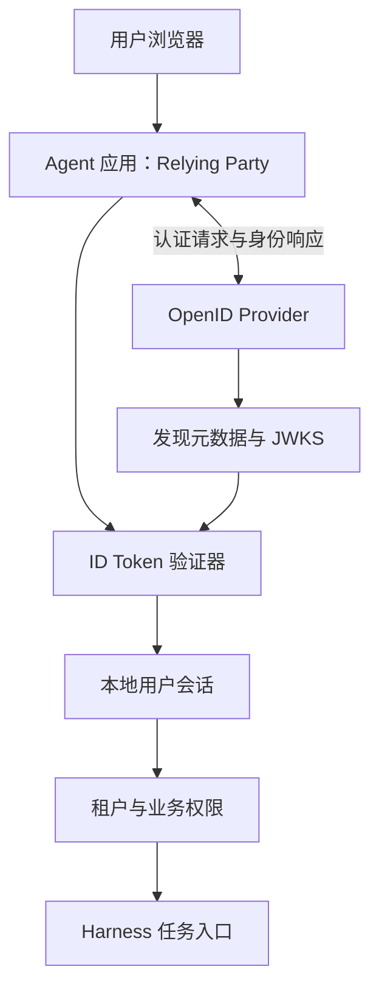
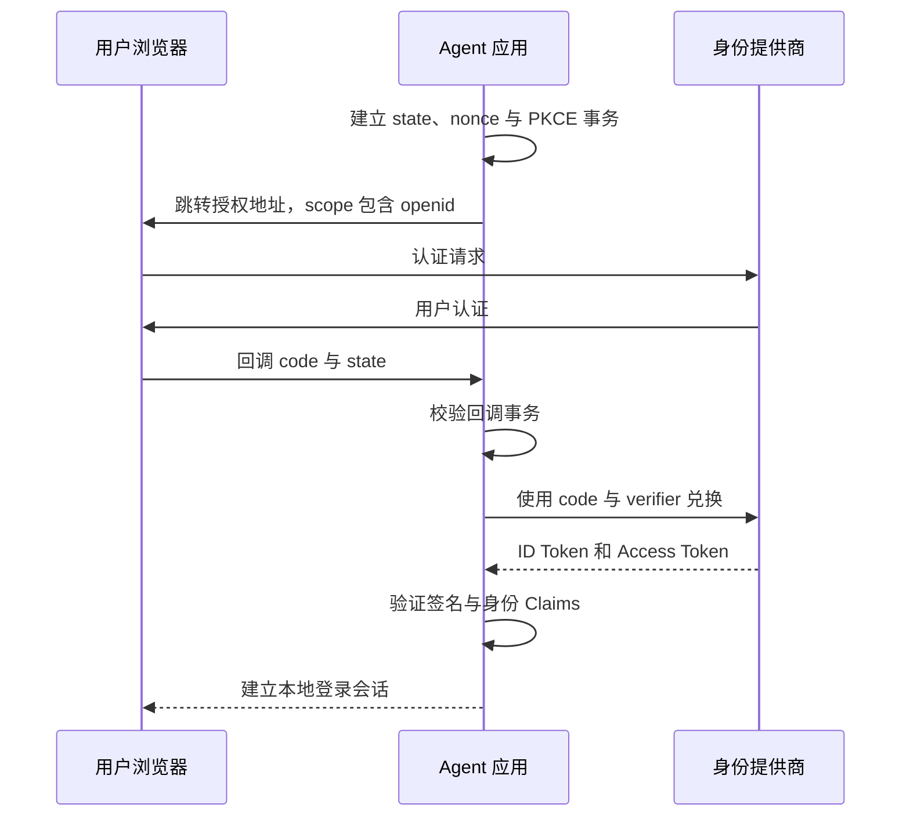
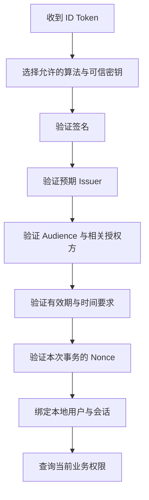
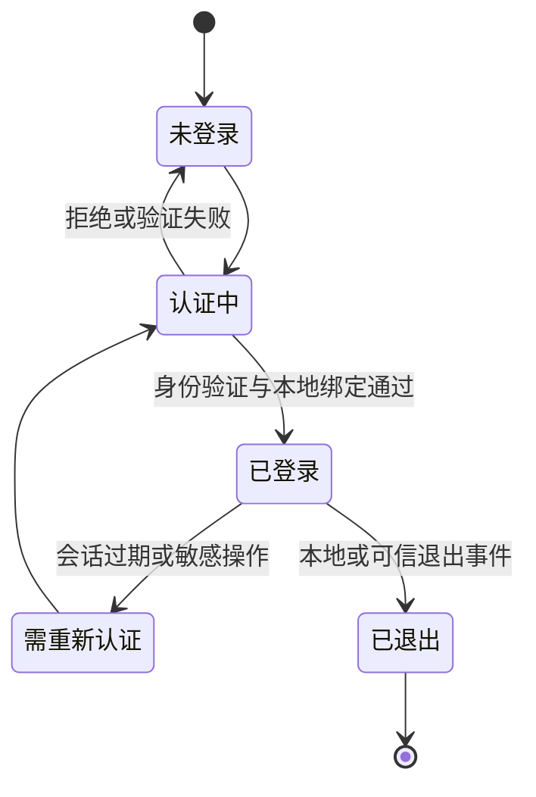

OpenID Connect（OIDC）在 OAuth 2.0 之上提供身份认证层。它让应用收到可验证的身份声明，从而知道登录者是谁。OAuth 的 Access Token 用于访问资源；OIDC 的 ID Token 用于向客户端证明一次身份认证的结果。

本文以 **OpenID Connect Core 1.0 与 Discovery 1.0（含勘误）**为基线，2026-09-07 核对，并结合 JWT 与退出规范说明接入设计。示例 Claim 是虚构数据，不是可用 Token；没有连接真实身份提供商，也没有用手写代码替代生产认证库。[OIDC Core](https://openid.net/specs/openid-connect-core-1_0.html)

## 架构：认证用户后，再执行本地授权



Relying Party 是依赖认证结果的应用，OpenID Provider 是提供认证结果的一方。登录成功应先映射成本地用户与会话，再检查租户及操作权限；不能从一个 ID Token 直接推出“允许执行任何工具”。

一个组织可以允许成员登录，却不给他们发布站点或读取财务数据的权限。身份认证回答“谁”，本地策略回答“这个人现在能做什么”。

## Discovery 建立端点和密钥的可信起点

客户端根据受信任的 Issuer 配置获取发现文档，读取授权、Token、UserInfo、JWKS 等端点及支持能力。返回元数据中的 issuer 必须与预期一致。[Discovery 规范](https://openid.net/specs/openid-connect-discovery-1_0.html)

不能从收到的未验证 Token 中取一个任意地址，然后去那里下载密钥来证明该 Token 可信。这样的流程把信任起点交给了攻击输入。动态多租户接入需要受控 Issuer 注册、出站访问限制和明确的租户映射。

JWKS 是公开验证密钥集合。`kid` 用于选择候选密钥，但不是可信证明；密钥来自哪个已认可的 Issuer、算法是否允许以及签名是否有效，都需要一并验证。[JWT 安全实践](https://www.rfc-editor.org/info/rfc8725/)

## 授权码流程中的身份响应



`openid` scope 表明请求 OIDC 身份认证。本文采用授权码加 PKCE 的方案，避免把旧式前端直接接收令牌的流程作为新接入默认。[OAuth 安全最佳实践](https://www.rfc-editor.org/info/rfc9700/)

state、nonce 和 PKCE verifier 在服务端或适当安全存储中关联到同一次事务。nonce 不是用户密码，也不是长期设备标识；发起新认证时应建立新的事务关联。

## ID Token、Access Token 与 Session Cookie

| 对象 | 面向谁 | 证明或承载什么 |
| --- | --- | --- |
| ID Token | OIDC 客户端 | 身份认证结果和相关 Claims |
| Access Token | 资源服务器 | 对资源的访问授权 |
| Refresh Token | 授权服务器 | 后续兑换能力，若被签发 |
| 应用 Session Cookie | 本地应用 | 本地登录会话句柄 |

ID Token 不应被当作通用业务 API 的 Bearer Token。应用 Cookie 也不应转发给外部 Agent。各对象的受众、生命周期和撤销路径不同。

ID Token 的载荷示例如下，数值和身份都是教学数据，省略签名部分，所以它不是完整 JWT：

```json
{
  "iss":"https://identity.example.com",
  "sub":"user-42",
  "aud":"agent-web-client",
  "iat":1788768000,
  "exp":1788768300,
  "nonce":"one-time-login-binding"
}
```

JWT 是封装 Claims 的格式，Base64URL 解码只让内容可读，不验证真实性。[JWT 定义](https://www.rfc-editor.org/rfc/rfc7519.html)

## 验证身份必须同时满足多个条件



这张图表达本文建议采用的严格验证路径。具体客户端认证方式和响应模式还会影响规范细节，实际实现应使用成熟库并配置预期值，不只写一个 `decode()`。[ID Token 验证规则](https://openid.net/specs/openid-connect-core-1_0.html#IDTokenValidation)

- **Issuer**：Token 来自预期身份系统，不能只比较域名后缀。
- **Audience**：当前 client ID 必须属于合法接收者；多受众时还要按规范检查 `azp` 等条件。
- **时间**：检查过期等约束，允许的时钟偏差应受限；`iat` 不是无限有效的授权时间。
- **Nonce**：若请求发送 nonce，响应中的值必须匹配本次认证事务。

UserInfo 返回的 `sub` 还必须与相应 ID Token 的主体匹配，防止把别人的资料拼进当前身份。应用也不应仅凭 email 字段自动合并不同 Issuer 的账号。[UserInfo 校验](https://openid.net/specs/openid-connect-core-1_0.html#UserInfoResponse)

## 用户主键与租户不能依赖显示信息

本文建议将 `(iss, sub)` 作为外部身份映射的基础，随后映射到本地用户 ID。email、姓名和头像适合显示，不适合成为唯一身份依据；这些字段可能变化，也可能受到提供商策略影响。

多租户 Agent 产品还要验证用户在目标租户的当前成员关系。一个来自正确 Issuer 的有效登录者，可能不是当前项目成员。任务 ID、前端传来的 tenantId 或 Token 中的任意自定义 Claim 都不能绕过本地授权映射。

敏感任务可以要求最近认证或特定认证强度，相关需求通过 `max_age`、`auth_time`、`acr` 等机制及提供商支持情况来表达。单看浏览器仍有 Cookie，不能证明用户刚刚完成了更强认证。

## 密钥轮换与退出是持续过程

遇到未知 `kid` 时，可以受控刷新可信 Issuer 的 JWKS，再重新验证；刷新失败不能降级为不验证签名。避免每个陌生 Token 都触发无限网络请求，密钥缓存需要限频、失效与故障策略。



这是应用会话状态机，不是 ID Token 自带的会话数据库。ID Token 过期、本地会话到期和 OAuth Access Token 被撤销不是同一事件。

RP-Initiated Logout 让应用发起身份提供商侧的退出；Back-Channel Logout 则允许提供商向应用发送可验证的退出通知。是否支持、如何匹配 Session、哪些已启动任务需要停止，都需要明确实现。[RP 发起退出](https://openid.net/specs/openid-connect-rpinitiated-1_0.html)、[后端退出通知](https://openid.net/specs/openid-connect-backchannel-1_0.html)

## 放进 Harness 后的设计选择

用户登录身份用于建立任务发起者和审计主体；连接外部工具的 OAuth 授权用于访问具体资源。长期后台任务还可能使用服务身份。三者应在记录中分开，而不是统称一个 `userToken`。

验收至少覆盖错误 Issuer、错误 Audience、过期或篡改 Token、nonce 不匹配、重复回调、密钥轮换、UserInfo 主体不一致，以及退出后的本地会话失效。这些是生产接入需执行的测试，不代表本文已经完成身份提供商互通认证。

[OAuth](/writing/oauth/)解释授权如何取得；OIDC 解释登录身份如何验证；[执行安全](/writing/harness-engineering-security/)决定每次动作是否允许。把这三个层次分清，才能避免“登录了所以可以做任何事”的错误授权模型。
