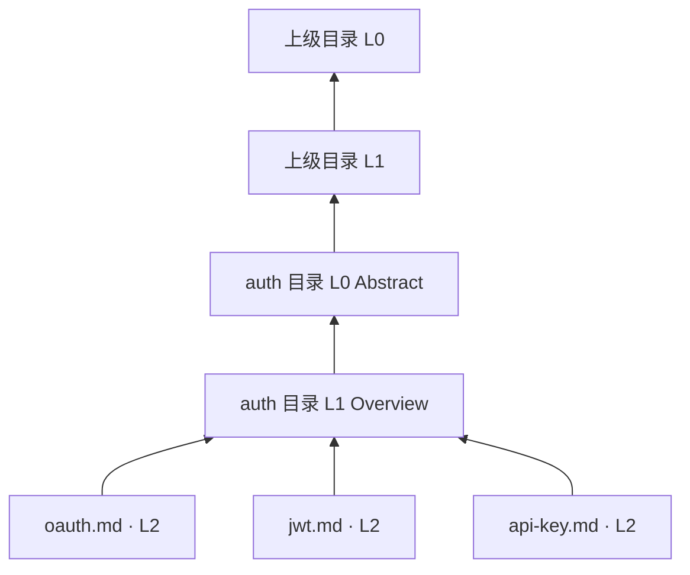

> OpenViking 源码研究系列：[1. 全景](/writing/openviking-series-overview/)｜[2. 分层目录](/writing/openviking-context-layers/)｜[3. 分层检索](/writing/openviking-hierarchical-retrieval/)｜[4. 提交与治理](/writing/openviking-session-governance/)｜[5. 整体判断](/writing/openviking-series-synthesis/)

OpenViking 的 L0、L1、L2 不是三份平铺副本，而是三种读取精度。L0 和 L1 是**目录级语义侧写**，L2 才是原始文件与子目录。普通文件并不会各自得到一套同名的 L0/L1 文件。

*图 1｜子内容先形成目录 Overview，再以 Abstract 参与上层目录聚合。*

## 三层分别回答三个问题

| 层 | 默认形态 | 回答的问题 |
|---|---|---|
| L0 Abstract | 目录下的 `.abstract.md`，正文默认不超过 256 字符 | 这个目录可能相关吗 |
| L1 Overview | 目录下的 `.overview.md`，正文默认不超过 4000 字符 | 里面有什么，下一步去哪里 |
| L2 Detail | 原始文件和子目录 | 完整证据究竟写了什么 |

这种设计让 Agent 可以先用少量 Token 认识空间，再把预算花在少数候选目录。L0/L1 采用带 metadata 的 Markdown sidecar；语义访问通常只返回正文，直接读取 sidecar 才能看到来源、生成器与 freshness 等元数据。

## URI 是定位契约

所有内容使用 `viking://{scope}/{path}`。`resources` 承载共享资源，`user` 承载用户数据与 Session，`agent` 承载共享能力；`viking://~` 由服务端根据认证身份展开为当前用户根目录。它不是 UI 上的漂亮路径，而是所有文件操作、检索与权限判断共同使用的定位边界。

内容本体写入 AGFS，向量索引只保存 URI、向量和 metadata。由此形成单一内容真相：索引可以重建，完整内容仍从文件层读取。反过来，这也要求写入、移动和删除正确维护两层状态。

## 摘要是一份需要维护的数据

SemanticProcessor 自底向上生成目录语义。内容变化后，父目录摘要需要逐级刷新；大目录还会稳定采样并记录未采样和待处理子项。当前文档也明确标注，向上冒泡的刷新频率仍有优化空间。

因此，分层摘要不是免费的 Token 优化。它引入了摘要陈旧、写放大和生成漂移。生产系统应把 freshness 暴露给召回与排障，而不能让一个过期 L0 永久挡住真实相关的 L2。

这补充了 [Agent 记忆设计：检索与装配](/writing/agent-memory-retrieval/)中的“先看地图”原则：地图本身也需要版本、覆盖率和刷新机制。

官方概念文档

- [Context Layers](https://github.com/volcengine/OpenViking/blob/0c5147cae26aec8d6d93445ec6ad86d5faff4035/docs/en/concepts/03-context-layers.md)
- [Viking URI](https://github.com/volcengine/OpenViking/blob/0c5147cae26aec8d6d93445ec6ad86d5faff4035/docs/en/concepts/04-viking-uri.md)
- [Storage Architecture](https://github.com/volcengine/OpenViking/blob/0c5147cae26aec8d6d93445ec6ad86d5faff4035/docs/en/concepts/05-storage.md)

---

上一篇：[系统全景](/writing/openviking-series-overview/)。

下一篇：[检索为什么要先走目录再读全文](/writing/openviking-hierarchical-retrieval/)。
