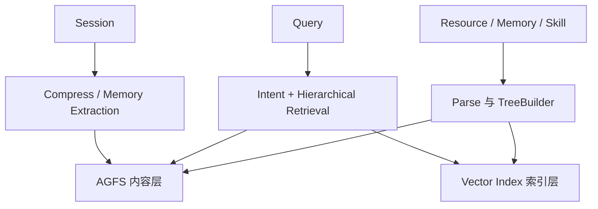

> OpenViking 源码研究系列：[1. 全景](/writing/openviking-series-overview/)｜[2. 分层目录](/writing/openviking-context-layers/)｜[3. 分层检索](/writing/openviking-hierarchical-retrieval/)｜[4. 提交与治理](/writing/openviking-session-governance/)｜[5. 整体判断](/writing/openviking-series-synthesis/)

> 版本范围：2026-09-05 核查的 `volcengine/OpenViking` 提交 [`0c5147c`](https://github.com/volcengine/OpenViking/tree/0c5147cae26aec8d6d93445ec6ad86d5faff4035)。本文只描述该快照已经公开的实现；文档中标注为规划或后续优化的能力不当作已完成特性。

OpenViking 不把自己限制为“记忆 SDK”。它把 Resource、Memory 与 Skill 统一成 Agent 可浏览的上下文文件系统：内容有 URI、目录、摘要层和原文层，既能语义检索，也能像文件一样确定性地读取。

*图 1｜OpenViking 用目录把内容存储、语义索引与会话记忆连接起来。*

## 先把三个对象分开

Resource 是用户主动加入、相对稳定的外部知识；Memory 是从交互和任务中持续提炼的长期认知；Skill 是相对稳定、可声明和调用的能力配置。三者可以统一搜索，却拥有不同来源、更新节奏与默认路径。

这个区分很重要。若文档、用户偏好和执行方法都被切成同一种向量块，系统很难解释谁能修改、何时过期，以及召回后应该“阅读”还是“执行”。

## 系统有四条主线

| 主线 | 关键模块 | 核心问题 |
|---|---|---|
| 摄取 | Parser、TreeBuilder、SemanticQueue | 原始材料如何成为目录和摘要 |
| 存储 | AGFS、Vector Index、Viking URI | 内容真相与检索索引如何分离 |
| 读取 | IntentAnalyzer、HierarchicalRetriever、Rerank | 怎样先看地图，再决定加载细节 |
| 演化 | Session、Compressor、Memory Policy | 对话何时归档，哪些内容进入长期记忆 |

第二篇研究 L0/L1/L2 和自底向上的目录语义；第三篇沿复杂查询进入递归检索；第四篇把 Session commit、事务、身份和 ACL 接起来；终篇再讨论把上下文做成文件系统之后，复杂度究竟去了哪里。

OpenViking 在 [Agent 记忆设计母系列](/writing/agent-memory-design-competitive-analysis/)中代表“结构化上下文与分层读取”路线。这里先研究它自身的对象模型，不把同名的 L0/L1/L2 与 TencentDB Agent Memory 的记忆抽象层混用。

---

下一篇：[L0、L1、L2 如何形成可导航目录](/writing/openviking-context-layers/)。

下一篇先进入摄取，因为一套分层检索能看见什么，取决于目录语义怎样被构建和维护。
