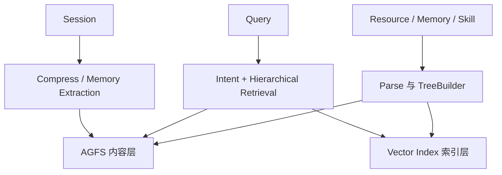
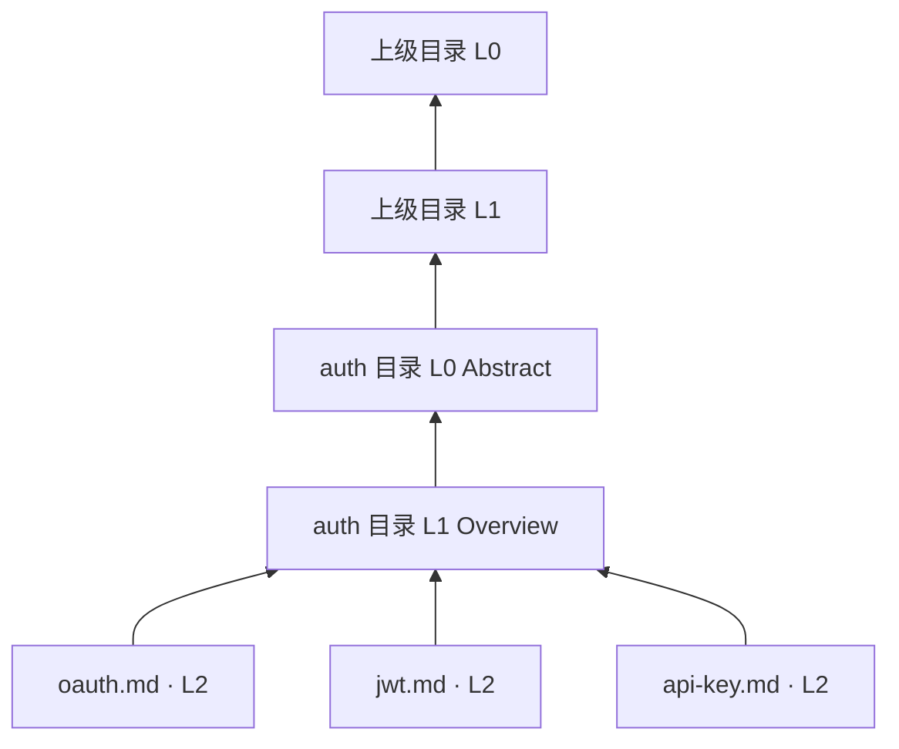

> 版本范围：2026-09-05 核查的 `volcengine/OpenViking` 提交 [`0c5147c`](https://github.com/volcengine/OpenViking/tree/0c5147cae26aec8d6d93445ec6ad86d5faff4035)。本文只描述该快照已经公开的实现；文档中标注为规划或后续优化的能力不当作已完成特性。

OpenViking 不把自己限制为“记忆 SDK”。它把 Resource、Memory 与 Skill 统一成 Agent 可浏览的上下文文件系统：内容有 URI、目录、摘要层和原文层，既能语义检索，也能像文件一样确定性地读取。

*图 1｜逻辑结构示意；三类对象的具体摄取路径不同，并非全部经过同一个 Parser。*

## 先把三个对象分开

Resource 是用户主动加入、相对稳定的外部知识；Memory 是从交互和任务中持续提炼的长期认知；Skill 是相对稳定、可声明和调用的能力配置。三者可以统一搜索，却拥有不同来源、更新节奏与默认路径。

这个区分很重要。若文档、用户偏好和执行方法都被切成同一种向量块，系统很难解释谁能修改、何时过期，以及召回后应该“阅读”还是“执行”。

例如，团队把接口手册作为 Resource，保存“上次部署使用接口 v2”为 Memory，再把发布检查方法作为 Skill。回答接口用法时读取手册，准备部署时核对历史版本与当前配置；发布权限仍由可信策略与当前授权决定，不能由检索出的 Memory 授予或覆盖。统一检索入口不能消除三者的职责差异。这是对象划分的教学例子，不是项目内置的发布流程。

## 系统有四条主线

| 主线 | 关键模块 | 核心问题 |
|---|---|---|
| 摄取 | Parser、TreeBuilder、SemanticQueue | 原始材料如何成为目录和摘要 |
| 存储 | AGFS、Vector Index、Viking URI | 内容真相与检索索引如何分离 |
| 读取 | IntentAnalyzer、HierarchicalRetriever、Rerank | 怎样先看地图，再决定加载细节 |
| 演化 | Session、Compressor、Memory Policy | 对话何时归档，哪些内容进入长期记忆 |

OpenViking 在 [记忆机制专题](/writing/agent-memory-design-competitive-analysis/)中代表“结构化上下文与分层读取”路线。这里先研究它自身的对象模型，不把同名的 L0/L1/L2 与 TencentDB Agent Memory 的记忆抽象层混用。

OpenViking 的 L0、L1、L2 不是三份平铺副本，而是三种读取精度。L0 和 L1 是**目录级语义侧写**，L2 才是原始文件与子目录。普通文件并不会各自得到一套同名的 L0/L1 文件。

*图 2｜子内容先形成目录 Overview，再以 Abstract 参与上层目录聚合。*

## 三层分别回答三个问题

| 层 | 默认形态 | 回答的问题 |
|---|---|---|
| L0 Abstract | 目录下的 `.abstract.md`，正文默认不超过 256 字符 | 这个目录可能相关吗 |
| L1 Overview | 目录下的 `.overview.md`，正文默认不超过 4000 字符 | 里面有什么，下一步去哪里 |
| L2 Detail | 原始文件和子目录 | 完整证据究竟写了什么 |

这种设计让 Agent 可以先用少量 Token 认识空间，再把预算花在少数候选目录。L0/L1 采用带 metadata 的 Markdown sidecar；语义访问通常只返回正文，直接读取 sidecar 才能看到来源、生成器与 freshness 等元数据。

## URI 是定位契约

所有内容使用 `viking://{scope}/{path}`。`resources` 承载共享资源，`user` 承载用户数据与 Session，`agent` 承载共享能力；`viking://~` 由服务端根据认证身份展开为当前用户根目录。它不是 UI 上的漂亮路径，而是所有文件操作、检索与权限判断共同使用的定位边界。

内容本体写入 AGFS，向量索引只保存 URI、向量和 metadata。由此形成单一内容真相：索引可以重建，完整内容仍从文件层读取。反过来，这也要求写入、移动和删除正确维护两层状态。

## 摘要是一份需要维护的数据

SemanticProcessor 自底向上生成目录语义。内容变化后，父目录摘要需要逐级刷新；大目录还会稳定采样并记录未采样和待处理子项。当前文档也明确标注，向上冒泡的刷新频率仍有优化空间。

因此，分层摘要不是免费的 Token 优化。它引入了摘要陈旧、写放大和生成漂移。生产系统应把 freshness 暴露给召回与排障，而不能让一个过期 L0 永久挡住真实相关的 L2。

这补充了 [Agent 记忆设计：检索与装配](/writing/agent-memory-retrieval/)中的“先看地图”原则：地图本身也需要版本、覆盖率和刷新机制。

平面向量检索把所有切片放进同一个候选池。OpenViking 则先判断要找哪类上下文、哪些目录值得进入，再读取少量具体内容。复杂查询因此更像一次有预算的文件系统导航。

*图 3｜先路由类型和目录，再进入细节，避免把整个资料库直接压入候选集。*

## Typed Query 先拆搜索意图

系统可以结合 Session 摘要、最近消息与当前问题，生成少量带目标类型和优先级的查询。某个问题可能同时需要用户 Memory、项目 Resource 和操作 Skill；拆分让它们分别在合适的命名空间搜索，再汇合为上下文。

这种路由不是为了把简单问题复杂化。对明确 URI 的读取，可以直接走确定性路径；只有跨类型、跨目录的模糊问题才值得支付意图分析与多路召回成本。

## 层级检索用目录控制搜索空间

HierarchicalRetriever 从高分目录起步，把候选放进优先队列，读取 L1 判断是否继续下钻。目录分数、类型、深度与预算共同决定下一步，最后再由 rerank 对候选排序。L0 负责便宜地发现方向，L1 负责导航，L2 在真正需要时加载。

它的优势不只是省 Token，还保留了来源结构：命中一段内容时，Agent 同时知道它属于哪个项目、目录和上下文类型。对于多文档推理，这比一堆失去父级关系的 chunk 更容易解释。

## 目录也可能制造召回盲区

如果父目录摘要漏掉一个重要子项，层级检索可能根本不会走到正确文件；目录太深会增加决策次数，太扁又退化为平面候选池。因此需要监控三类失败：目标 L2 存在但祖先未召回；L1 召回但没有继续下钻；候选正确却被 reranker 降权。

评测不能只看最终答案，还应记录 Typed Query、访问过的目录、停止原因和最终加载的 L2。这样才能区分是摄取、导航还是排序出了问题。相关的通用诊断框架可参考 [Agent 评测：把一次打分变成回归系统](/writing/agent-evaluation-engineering/)。

官方概念文档

- [Context Layers](https://github.com/volcengine/OpenViking/blob/0c5147cae26aec8d6d93445ec6ad86d5faff4035/docs/en/concepts/03-context-layers.md)
- [Viking URI](https://github.com/volcengine/OpenViking/blob/0c5147cae26aec8d6d93445ec6ad86d5faff4035/docs/en/concepts/04-viking-uri.md)
- [Storage Architecture](https://github.com/volcengine/OpenViking/blob/0c5147cae26aec8d6d93445ec6ad86d5faff4035/docs/en/concepts/05-storage.md)

实现入口

- [Retrieval Mechanism](https://github.com/volcengine/OpenViking/blob/0c5147cae26aec8d6d93445ec6ad86d5faff4035/docs/en/concepts/07-retrieval.md)
- [`HierarchicalRetriever`](https://github.com/volcengine/OpenViking/blob/0c5147cae26aec8d6d93445ec6ad86d5faff4035/openviking/retrieve/hierarchical_retriever.py)
- [`IntentAnalyzer`](https://github.com/volcengine/OpenViking/blob/0c5147cae26aec8d6d93445ec6ad86d5faff4035/openviking/retrieve/intent_analyzer.py)

