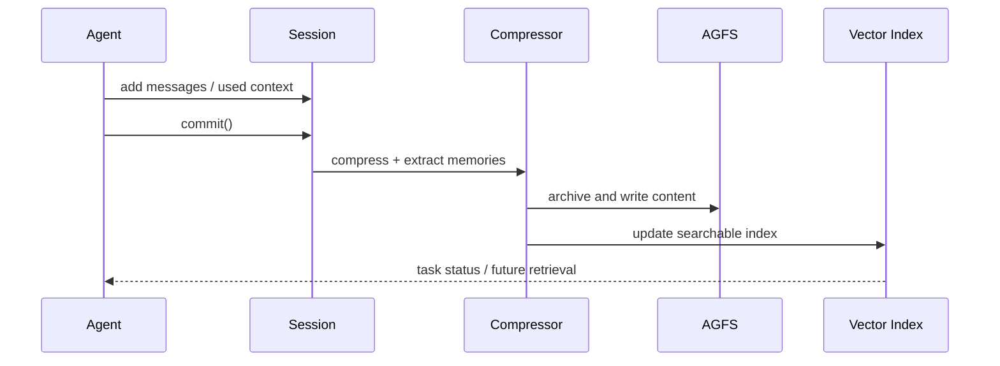

> OpenViking 源码研究系列：[1. 全景](/writing/openviking-series-overview/)｜[2. 分层目录](/writing/openviking-context-layers/)｜[3. 分层检索](/writing/openviking-hierarchical-retrieval/)｜[4. 提交与治理](/writing/openviking-session-governance/)｜[5. 整体判断](/writing/openviking-series-synthesis/)

`session.commit()` 是 OpenViking 的重要边界：此前是一次任务的消息、引用和工具记录，此后才可能成为摘要、长期 Memory 与未来检索对象。显式提交让“什么时候开始学习”可见，但不保证后台每一步天然原子。

*图 1｜commit 把交互转成后台任务，内容层与索引层仍需维护一致性。*

## 记忆不是一条自由文本

内置 Memory 类型覆盖 profile、preferences、entities、events、identity、soul、cases、trajectories 与 experiences。不同类型写入不同路径和 schema；候选记忆还会与相似内容比较，决定跳过、新建、合并或删除。

这比单一事实卡更适合长期 Agent，却扩大了错误影响：一条错误偏好影响回答，一条错误 experience 可能影响未来行动。因此，原始 Session 归档、变更差异和来源关系必须保留，便于回看“这条认识从哪里来”。

## 双层存储需要明确失败状态

内容本体与 Vector Index 分离后，失败至少有三种：内容已写、索引未完成；索引仍指向旧 URI；摘要已更新、父级仍陈旧。事务模型、后台任务状态、快照和重建能力共同决定系统能否从这些中间态恢复。

应用不应把 `commit()` 返回当作所有记忆已经可搜索。更稳妥的契约是拿到 task ID，等待明确终态，并在超时后区分“仍处理中”“已失败”和“结果未知”。

## 权限必须与检索使用同一边界

多租户模式把 account 和 user 身份注入存储路径与检索过滤；`viking://~` 只能由已认证请求展开。共享 `resources` 还可以启用目录继承 ACL，read、write、manage 权限同时约束文件操作和搜索结果。

这是关键原则：不能先全库向量召回，再在展示层隐藏无权结果。过滤必须进入候选集合，否则日志、reranker 或中间上下文仍可能接触越权数据。Skill 中的敏感配置又通过占位符与独立版本存储处理，说明“能检索内容”和“能恢复秘密”也应分开。

这与 [Agent 记忆设计：治理与验证](/writing/agent-memory-governance/)形成呼应：长期记忆需要撤权、来源与删除；OpenViking 进一步把这些约束落到 URI、任务状态和共享目录上。

官方机制说明

- [Session Management](https://github.com/volcengine/OpenViking/blob/0c5147cae26aec8d6d93445ec6ad86d5faff4035/docs/en/concepts/08-session.md)
- [Transaction Model](https://github.com/volcengine/OpenViking/blob/0c5147cae26aec8d6d93445ec6ad86d5faff4035/docs/en/concepts/09-transaction.md)
- [Multi-Tenant](https://github.com/volcengine/OpenViking/blob/0c5147cae26aec8d6d93445ec6ad86d5faff4035/docs/en/concepts/11-multi-tenant.md)
- [Resource ACL](https://github.com/volcengine/OpenViking/blob/0c5147cae26aec8d6d93445ec6ad86d5faff4035/docs/en/concepts/15-acl.md)

---

上一篇：[分层检索](/writing/openviking-hierarchical-retrieval/)。

下一篇：[上下文文件系统把复杂度放在结构维护上](/writing/openviking-series-synthesis/)。
