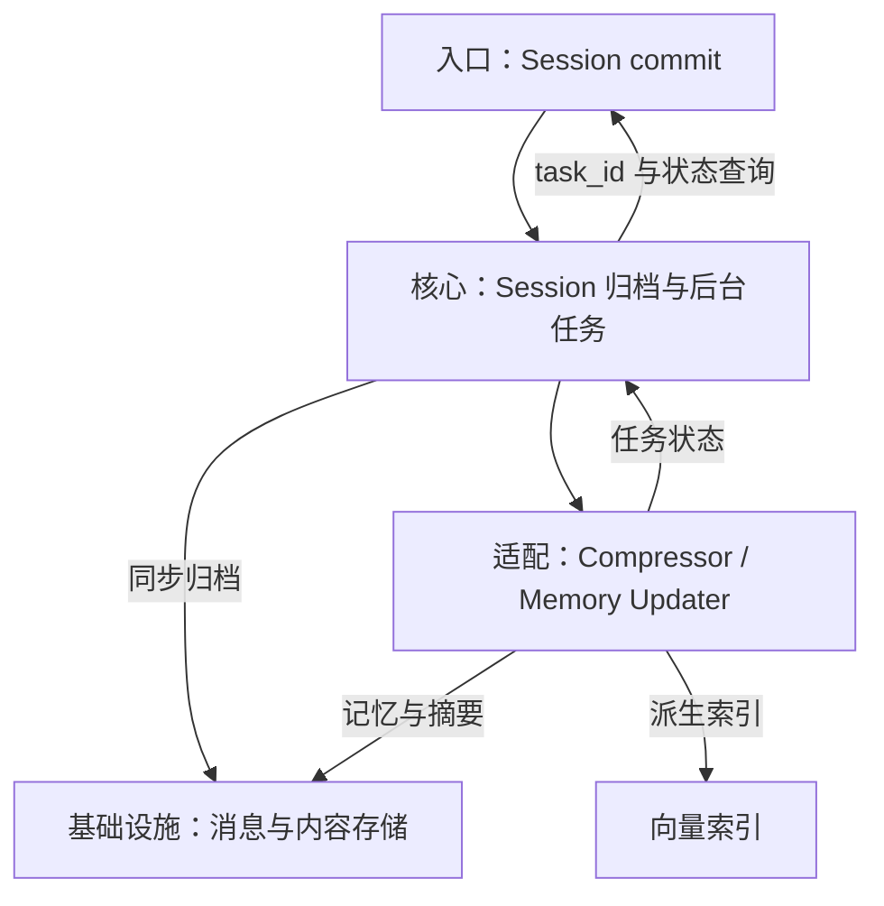
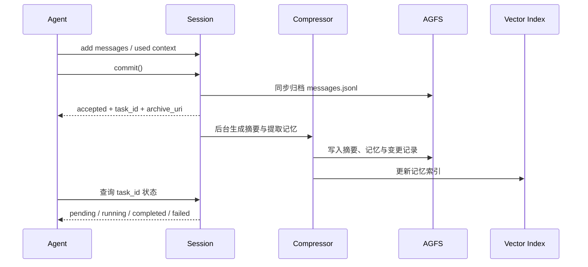

## 定位与价值

本篇追踪 session.commit() 之后的归档、后台提炼和索引更新；接收成功与记忆可检索是两个时刻。

完整定位与安装见[项目总览](/writing/openviking-series-overview/)。

研究基线：[volcengine/OpenViking @ 0c5147c](https://github.com/volcengine/OpenViking/blob/0c5147cae26aec8d6d93445ec6ad86d5faff4035/README.md)；源码与社区核对日期为 2026-09-06。

## 技术架构



*图 1｜职责与数据流；逻辑分层不要求分开部署。*

## 核心机制



*图 2｜提交 `0c5147c` 的 commit 先同步归档，再异步提炼；任务状态由任务 API 查询，索引不直接向 Agent 返回提交结果。*

### 提交怎样形成长期记忆

#### 记忆不是一条自由文本

内置 Memory 类型覆盖 profile、preferences、entities、events、identity、soul、cases、trajectories 与 experiences。不同类型写入不同路径和 schema；候选记忆还会与相似内容比较，决定跳过、新建、合并或删除。

这些类型分别保存身份、事件和经验，也扩大了错误影响：一条错误偏好影响回答，一条错误 experience 可能影响未来行动。因此，原始 Session 归档、变更差异和来源关系必须保留，便于回看“这条认识从哪里来”。

#### 双层存储需要明确失败状态

内容本体与 Vector Index 分离后，失败至少有三种：内容已写、索引未完成；索引仍指向旧 URI；摘要已更新、父级仍陈旧。事务模型、后台任务状态、快照和重建能力共同决定系统能否从这些中间态恢复。

例如会议记录已归档，但向量服务暂时不可用：原始记录仍在，搜索可能看不到新记忆。排障应检查该次 task 与索引写入，不能因搜索为空就再次把整场会议当成新输入。

应用不应把 `commit()` 返回当作所有记忆已经可搜索。更稳妥的契约是拿到 task ID，等待明确终态，并在超时后区分“仍处理中”“已失败”和“结果未知”。


### 索引与权限怎样保持一致

#### 权限必须与检索使用同一边界

多租户模式把 account 和 user 身份注入存储路径与检索过滤；`viking://~` 只能由已认证请求展开。共享 `resources` 还可以启用目录继承 ACL，read、write、manage 权限同时约束文件操作和搜索结果。

这是关键原则：不能先全库向量召回，再在展示层隐藏无权结果。过滤必须进入候选集合，否则日志、reranker 或中间上下文仍可能接触越权数据。Skill 中的敏感配置又通过占位符与独立版本存储处理，说明“能检索内容”和“能恢复秘密”也应分开。

这与 [Agent 记忆设计：治理与验证](/writing/agent-memory-governance/)形成呼应：长期记忆需要撤权、来源与删除；OpenViking 进一步把这些约束落到 URI、任务状态和共享目录上。

#### 真正的代价是持续维护结构

分层目录并不会凭空出现。Parser 要正确保留材料结构，SemanticProcessor 要刷新摘要，索引要跟随文件变化，检索要处理陈旧父级，权限要同时作用于浏览与召回。任何一环失配，都可能让 Agent 看见一张漂亮但过期的地图。

因此生产关注点应从“有没有 L0/L1/L2”转向四个可验证问题：摘要覆盖了多少子项；内容变化多久能进入父级语义；索引与 AGFS 是否一致；一次结果为何进入或离开候选集。只有这些证据存在，目录才是认知导航，而不是另一层不可见缓存。

<details>
<summary>官方机制说明</summary>

- [Session Management](https://github.com/volcengine/OpenViking/blob/0c5147cae26aec8d6d93445ec6ad86d5faff4035/docs/en/concepts/08-session.md)
- [Transaction Model](https://github.com/volcengine/OpenViking/blob/0c5147cae26aec8d6d93445ec6ad86d5faff4035/docs/en/concepts/09-transaction.md)
- [Multi-Tenant](https://github.com/volcengine/OpenViking/blob/0c5147cae26aec8d6d93445ec6ad86d5faff4035/docs/en/concepts/11-multi-tenant.md)
- [Resource ACL](https://github.com/volcengine/OpenViking/blob/0c5147cae26aec8d6d93445ec6ad86d5faff4035/docs/en/concepts/15-acl.md)

</details>

## 快速上手

先按[项目总览](/writing/openviking-series-overview/#快速上手)准备运行环境；本篇的最小实验直接执行固定快照中的测试。另需按仓库贡献指南安装开发与测试依赖。

```bash
python -m pytest tests/session/test_session_lifecycle.py -q
```

检查会话生命周期；依赖 fixture 的测试不等同真实后台任务压测。

模型、执行环境与存储等共用配置，以及安装常见问题，见[总览的三个配置项](/writing/openviking-series-overview/#快速上手)。本轮已核对测试文件与运行入口，未在本文环境执行这条上游测试命令。

## 生态与社区

许可证、官方集成、提交与 Issue 样本统一见[项目总览的生态与社区](/writing/openviking-series-overview/#生态与社区)。

## 源码阅读路径

公共安装入口见项目总览。本篇沿相关模块追踪到具体实现与测试：

| 顺序 | 目录 → 文件 | 函数、对象或验证重点 |
| --- | --- | --- |
| 1 | [openviking/session/session.py](https://github.com/volcengine/OpenViking/blob/0c5147cae26aec8d6d93445ec6ad86d5faff4035/openviking/session/session.py) | Session.commit：归档与后台提炼入口 |
| 2 | [openviking/service/session_service.py](https://github.com/volcengine/OpenViking/blob/0c5147cae26aec8d6d93445ec6ad86d5faff4035/openviking/service/session_service.py) | Session 服务层 |
| 3 | [tests/session/test_session_lifecycle.py](https://github.com/volcengine/OpenViking/blob/0c5147cae26aec8d6d93445ec6ad86d5faff4035/tests/session/test_session_lifecycle.py) | 会话生命周期测试 |
