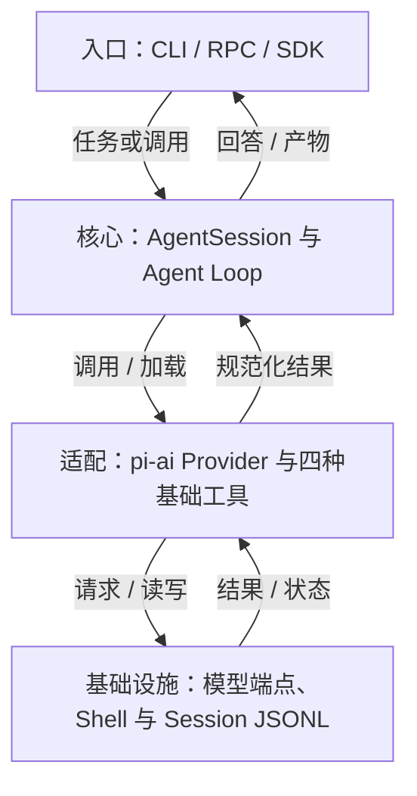
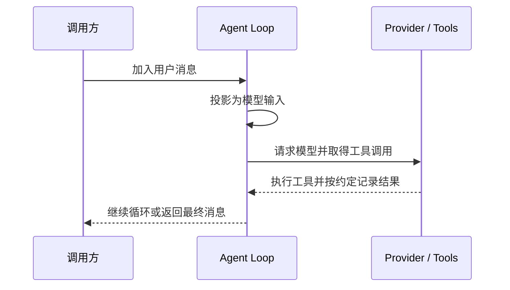
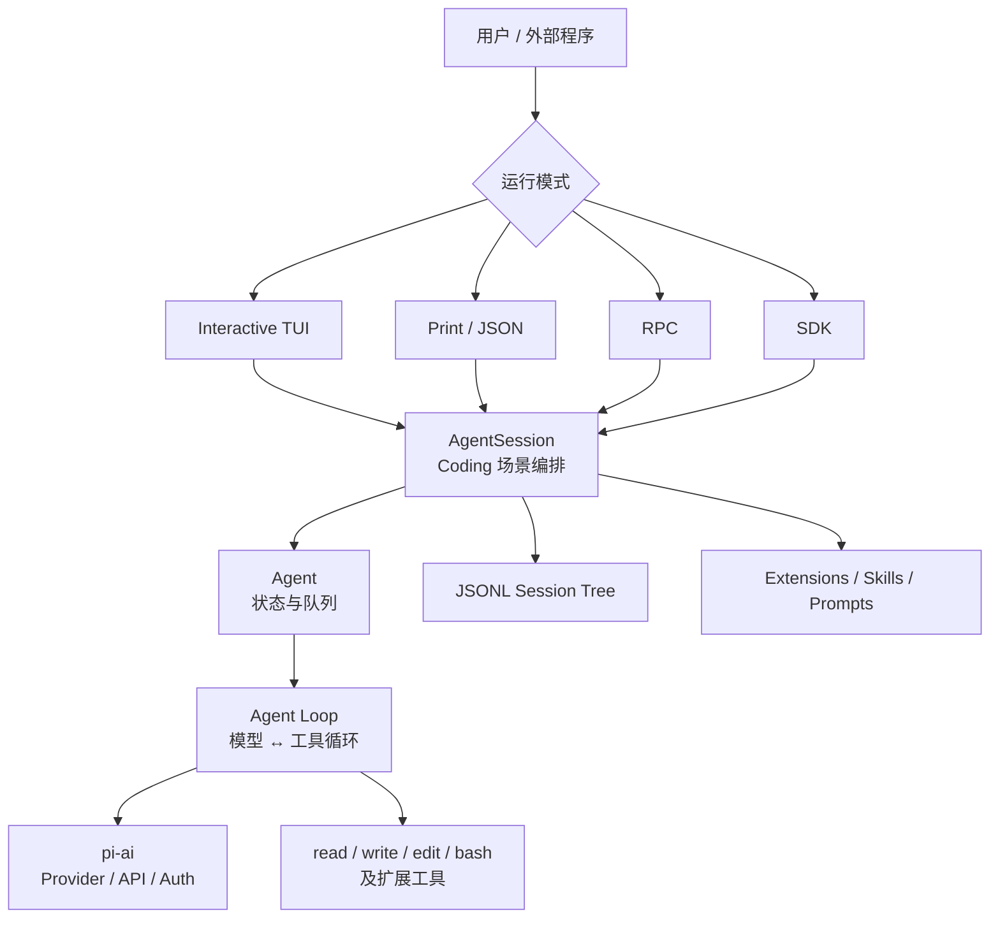
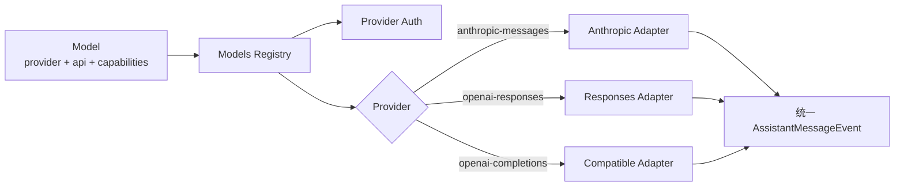

## 定位与价值

Pi 是把模型适配、通用 Agent 循环和 Coding Session 分层的可扩展编程框架；相较分叉一个完整助手，扩展可在公共事件和工具接口上加入工作流。

适合需要掌握运行策略的开发者；经典 CLI 不内置完整审批与隔离系统，experimental durable 路径也不是默认稳定实现。

研究基线：[earendil-works/pi @ e44d75c](https://github.com/earendil-works/pi/blob/e44d75c20a51142abc056c243b13c1d7bb4be687/README.md)；源码与社区核对日期为 2026-09-06。本文区分经典路径与 experimental durable 路径。

## 技术架构



*图 1｜职责与数据流；逻辑分层不要求分开部署。*

## 核心机制



*图 2｜本篇关键流程的职责示意；部署者提出的验收要求与框架内建行为需按正文区分。*

### 模型适配与消息投影

#### 先看全景：Pi 不是一个 CLI，而是一组逐层收窄的抽象

Pi 的 Monorepo 把完整系统拆成多个包。最核心的四层是：

| 层 | 包 | 负责什么 | 不负责什么 |
| --- | --- | --- | --- |
| 模型协议层 | `pi-ai` | Provider、模型目录、认证、流式事件、不同厂商协议适配 | 工具执行、Session、UI |
| Agent 运行层 | `pi-agent-core` | Agent Loop、消息状态、工具调用、队列与生命周期事件 | Coding 场景、磁盘会话、终端 |
| Coding 编排层 | `pi-coding-agent` | 系统提示词、项目上下文、Session、压缩、重试、扩展、内置工具 | 具体模型协议实现 |
| 展示与接入层 | `pi-tui` + Modes | 终端渲染、交互输入、Print/JSON、RPC、SDK | Agent 决策逻辑 |

除此之外，仓库还出现了 `chord`、`pi-protocol`、`pi-client` 与 `pi-server`。它们不是经典 CLI 主链的简单拆包，而是在为“一个持久 Session 被多个前端、进程或远端客户端同时连接”准备新的基础设施。Pi 的根 README 也已经把自己定义为完整的 [Agent Harness 项目](https://github.com/earendil-works/pi)，而不只是 coding-agent 命令行工具。



*图 3｜Pi 以模型协议、Agent 运行、Coding 编排和展示接入四层逐级收窄职责。*

这张图有一个重要含义：**Interactive TUI 不是 Pi 的“大脑”，`AgentSession` 也不是最底层循环。** UI 只是订阅事件并发送命令；Coding 语义集中在 Session 层；真正可复用的 Agent 循环则下沉到了 `pi-agent-core`。

#### 第一处关键解耦：Provider 不等于 API

多模型产品最常见的架构债，是把“模型厂商”和“HTTP 协议”绑在一起。Pi 在 `pi-ai` 中把它们拆开：

- **Provider** 是运行时所有者，负责模型目录、认证方式、可用性与请求路由；
- **API** 是线协议，例如 `anthropic-messages`、`openai-responses`、`openai-completions`；
- **Model** 是数据对象，声明自己属于哪个 Provider、使用哪种 API、上下文窗口、价格、推理能力和兼容参数；
- **Models** 是注册表，完成 Provider 查找、认证合并、动态目录刷新与请求分发。

因此，一个 Provider 可以混用多种 API；多个 Provider 也可以共享同一种 OpenAI-compatible API 实现。源码中的 [`Provider`](https://github.com/earendil-works/pi/blob/e44d75c20a51142abc056c243b13c1d7bb4be687/packages/ai/src/models.ts#L97) 接口同时拥有模型目录、认证和 `stream` 能力，而 [`createProvider`](https://github.com/earendil-works/pi/blob/e44d75c20a51142abc056c243b13c1d7bb4be687/packages/ai/src/models.ts#L757) 会根据 `model.api` 选择真正的流实现。



*图 4｜Provider 适配保留厂商差异，再投影为统一而不失真的内部事件。*

不同厂商返回的 SSE、WebSocket、thinking block、tool call delta、usage 和停止原因，最终都被压成同一组事件：`start`、`text_delta`、`thinking_delta`、`toolcall_delta`、`done`、`error`。上层不需要知道事件来自 Anthropic 还是 OpenAI，只需要消费 [`AssistantMessageEventStream`](https://github.com/earendil-works/pi/blob/e44d75c20a51142abc056c243b13c1d7bb4be687/packages/ai/src/utils/event-stream.ts#L56)。

这层设计的价值不只是“支持很多模型”。它把模型切换从一次架构变化降成一次数据与适配变化：Agent Loop 只依赖统一消息和流事件，不依赖任何厂商 SDK。

不过，统一协议并不意味着抹平差异。`Model` 仍保存 thinking level 映射、prompt caching、兼容选项和价格等能力元数据。Pi 的做法更像“统一控制面，保留数据面差异”，而不是强迫所有模型表现成最低公分母。


### 循环、工具顺序与输入队列

经典主路径的核心循环位于 [`agent-loop.ts`](https://github.com/earendil-works/pi/blob/e44d75c20a51142abc056c243b13c1d7bb4be687/packages/agent/src/agent-loop.ts)。抽象之后，它只有五步：

```text
装配上下文 → 请求模型 → 流式发布事件 → 执行工具 → 把结果放回上下文
```

只要模型继续返回 tool call，这个循环就继续；没有工具调用时结束。真正值得注意的是循环周围的语义。

#### 1. AgentMessage 与 LLM Message 分离

Pi 内部允许存在 `custom`、`bashExecution`、`compactionSummary`、`branchSummary` 等消息，但模型只理解 `user`、`assistant`、`toolResult`。因此每轮调用前会先执行可选的 `transformContext()`，再通过 `convertToLlm()` 投影成模型协议消息。

```text
AgentMessage[]
  └─ transformContext：裁剪、RAG、长期记忆、扩展注入
       └─ convertToLlm：过滤 UI/Session 专用消息
            └─ Message[]：发送给 Provider
```

这个边界非常重要。**持久化格式不应该被某个模型 API 定义，UI 消息也不应该被迫伪装成用户消息。** Pi 允许应用拥有更丰富的内部事件语言，只在最后一刻投影到模型能理解的三种角色。

#### 2. 工具默认并行，但结果顺序确定

当一个 assistant message 同时产生多个 tool call 时，Pi 默认并行执行。为了避免并发破坏可重放性，它采用了一个细致的策略：

1. 按模型给出的顺序做参数解析与 `beforeToolCall` 预检；
2. 允许的工具并行运行，完成事件按真实完成顺序发出；
3. 最终写入上下文的 `toolResult` 仍按原始 tool call 顺序排列。

实现可见 [`executeToolCallsParallel()`](https://github.com/earendil-works/pi/blob/e44d75c20a51142abc056c243b13c1d7bb4be687/packages/agent/src/agent-loop.ts#L487)。这样可以及时展示进度，并稳定模型上下文中的结果顺序；并行是否更快取决于工具依赖与资源容量，也不保证外部副作用可重放。如果某个工具声明 `executionMode: "sequential"`，整批调用会退回串行，避免对有顺序副作用的工具做危险并发。

#### 3. 把运行过程定义成事件，而不是回调拼图

Agent 会发布 `agent_start`、`turn_start`、`message_update`、`tool_execution_start`、`tool_execution_end`、`turn_end`、`agent_end` 等事件。TUI、JSON 模式、Session 持久化和扩展都消费同一条事件流。

这让 Pi 天然具备多种呈现方式。终端可以逐 token 更新，自动化程序可以读取 JSON，SDK 使用者可以订阅生命周期，而核心循环不需要为每个消费者写一套分支。

#### 4. Steering 和 Follow-up 是两个不同的队列

用户在 Agent 工作时追加一句话，可能有两种意图：

- **Steering**：当前工具批次结束后尽快注入，改变正在进行的任务；
- **Follow-up**：等 Agent 原本准备结束时再开启新一轮。

Pi 在 [`Agent`](https://github.com/earendil-works/pi/blob/e44d75c20a51142abc056c243b13c1d7bb4be687/packages/agent/src/agent.ts#L173) 内维护两条队列，并允许一次取一条或全部取出。它没有通过“中断当前 token 流”伪造实时控制，而是在稳定的 turn 边界合并新输入。这是一个小设计，却直接决定长任务能否被自然地纠偏。

## 快速上手

需要 Node/npm 与模型账号。安装固定版本后在新目录启动，使用 /login 完成认证。

```bash
npm install -g @earendil-works/pi-coding-agent@0.84.4
mkdir -p pi-demo
cd pi-demo
printf "# Demo\nNo source files yet.\n" > README.md
pi
```

三个常用配置：

| 配置或安装选项 | 作用 |
| --- | --- |
| `--provider` | 选择模型供应商 |
| `--model` | 选择该供应商的模型 |
| `--tools` | 限制本次暴露的基础工具，如 read |

其余选项见 [配置参考](https://github.com/earendil-works/pi/blob/e44d75c20a51142abc056c243b13c1d7bb4be687/packages/coding-agent/README.md)。

常见坑：在交互模式先 /login，再请求读取 README；默认工具能写文件和运行命令，隔离需由宿主落实。

验证范围：已核对固定源码的入口、参数与依赖；未以本文示例调用真实模型或部署外部服务。

## 生态与社区

截至 2026-09-06，2026-08-08 至 09-06 UTC 的抽样取得 至少 30 条默认分支提交（上限 30 条）。见 [提交记录](https://github.com/earendil-works/pi/commits/main/)。

Issue 取 08-08 至 08-30 UTC 创建的最近最多 3 条非 PR 条目，排除机器人和提问者自答；3 条中 0 条观察到维护者文字回复。 样本：[#8871](https://github.com/earendil-works/pi/issues/8871)、[#8869](https://github.com/earendil-works/pi/issues/8869)、[#8868](https://github.com/earendil-works/pi/issues/8868)。小样本不代表 SLA，“未观察到”也不代表其他渠道无人处理。

固定快照许可证：[MIT](https://github.com/earendil-works/pi/blob/e44d75c20a51142abc056c243b13c1d7bb4be687/LICENSE)。允许商业使用，但分发时仍须保留版权与许可声明。

同仓维护 pi-ai、Agent Core、Coding Agent、TUI 及 RPC/SDK；第三方 Pi Packages 中的审批或子 Agent 扩展不是核心默认保证。

## 源码阅读路径

阅读顺序：入口 → 核心抽象 → 具体实现 → 测试。

| 顺序 | 目录 → 文件 | 函数、对象或检查重点 |
| --- | --- | --- |
| 1 | [packages/coding-agent/package.json](https://github.com/earendil-works/pi/blob/e44d75c20a51142abc056c243b13c1d7bb4be687/packages/coding-agent/package.json) | bin → 打包后的 cli.js |
| 2 | [packages/coding-agent/src/cli.ts](https://github.com/earendil-works/pi/blob/e44d75c20a51142abc056c243b13c1d7bb4be687/packages/coding-agent/src/cli.ts) | CLI 入口 |
| 3 | [packages/agent/src/agent-loop.ts](https://github.com/earendil-works/pi/blob/e44d75c20a51142abc056c243b13c1d7bb4be687/packages/agent/src/agent-loop.ts) | agentLoop：通用循环 |
| 4 | [packages/coding-agent/src/core/agent-session.ts](https://github.com/earendil-works/pi/blob/e44d75c20a51142abc056c243b13c1d7bb4be687/packages/coding-agent/src/core/agent-session.ts) | AgentSession：产品会话语义 |
| 5 | [packages/agent/test/agent-loop.test.ts](https://github.com/earendil-works/pi/blob/e44d75c20a51142abc056c243b13c1d7bb4be687/packages/agent/test/agent-loop.test.ts) | 循环测试 |
